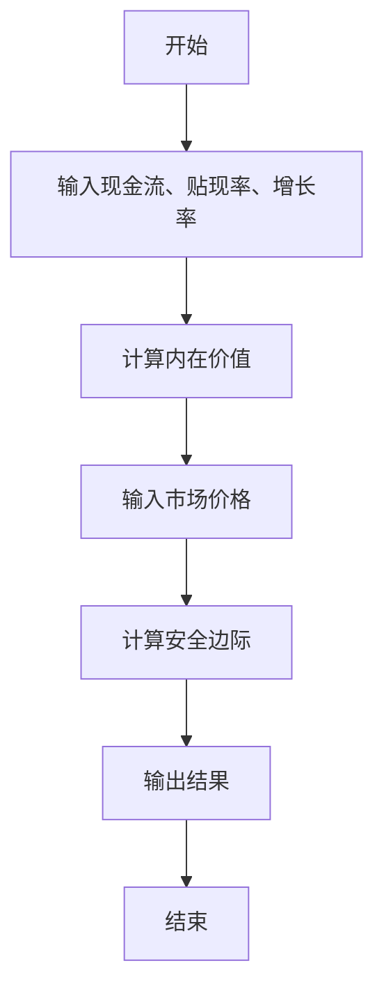

                 


# 格雷厄姆价值投资理念在元宇宙经济中的重新诠释

---

## 关键词：
- 格雷厄姆价值投资
- 元宇宙经济
- 数字资产
- 投资策略
- 去中心化金融（DeFi）
- 内在价值

---

## 摘要：
本文将重新诠释格雷厄姆的价值投资理念，探讨其在元宇宙经济中的应用。通过分析元宇宙经济体系的核心特征和运行机制，结合格雷厄姆的安全边际、内在价值和市场先生等核心概念，提出在元宇宙经济中进行价值投资的策略和方法。文章将从背景介绍、核心概念、算法原理、系统架构、项目实战等多方面展开，最终为读者提供在元宇宙经济中实现稳健投资的深度见解。

---

# 第1章 格雷厄姆价值投资理念的核心原理

## 1.1 格雷厄姆价值投资的核心概念

### 1.1.1 安全边际的定义与作用
安全边际是格雷厄姆价值投资理念的核心，是指资产的内在价值与市场价格之间的差额。通过购买价格低于内在价值的资产，投资者能够在市场波动中获得安全空间，降低投资风险。  
$$ \text{安全边际} = \text{内在价值} - \text{市场价格} $$  

### 1.1.2 内在价值的计算方法
内在价值是资产在未来现金流的现值，可以通过 discounted cash flow (DCF) 模型计算。  
$$ V = \frac{C}{(r - g)} $$  
其中，\( C \) 是现金流，\( r \) 是折现率，\( g \) 是增长率。

### 1.1.3 市场先生与投资者心理
格雷厄姆将市场波动比作“市场先生”，投资者应避免被市场情绪左右，而是关注资产的长期价值。市场先生的疯狂与恐慌为理性投资者提供了套利机会。

---

## 1.2 价值投资的哲学与策略

### 1.2.1 投资的长期视角
价值投资强调长期持有优质资产，而非短期交易。通过分散投资和长期持有，降低短期波动对投资组合的影响。

### 1.2.2 避免情绪化决策的原则
市场波动会引发投资者的贪婪与恐惧，价值投资者应以理性判断为基础，避免情绪化决策。

### 1.2.3 安全边际的应用场景
在市场低迷时，购买价格低于内在价值的资产，能够在市场复苏时获得超额收益。

---

## 1.3 价值投资的数学模型

### 1.3.1 内在价值公式
$$ V = \frac{E}{(k - g)} $$
其中，\( E \) 是企业价值，\( k \) 是资本成本，\( g \) 是增长率。

### 1.3.2 安全边际的计算方法
$$ \text{安全边际} = V - P $$
其中，\( V \) 是内在价值，\( P \) 是市场价格。

### 1.3.3 市场波动与投资机会的数学关系
通过分析市场波动与内在价值的关系，价值投资者可以在市场低估时买入，在高估时卖出。

---

## 1.4 本章小结
本章介绍了格雷厄姆价值投资的核心概念，包括安全边际、内在价值和市场先生，强调了长期投资和理性决策的重要性。

---

# 第2章 元宇宙经济体系的构建

## 2.1 元宇宙经济的基本特征

### 2.1.1 虚拟货币的定义与功能
虚拟货币是元宇宙经济的交易媒介，具有去中心化、可分割性和可编程性等特点。

### 2.1.2 NFT的经济价值与交易机制
NFT（非同质化代币）代表数字资产的唯一所有权，具有不可分割性和独特性，广泛应用于虚拟艺术品、虚拟土地等领域。

### 2.1.3 元宇宙中的数字资产分类
数字资产可以分为虚拟货币、NFT、代币（Token）等类别，每种资产都有其独特的经济价值和交易机制。

---

## 2.2 元宇宙经济的运行机制

### 2.2.1 数字资产的发行与流通
数字资产通过区块链技术实现去中心化的发行和流通，确保交易的透明性和安全性。

### 2.2.2 去中心化金融（DeFi）的运作模式
DeFi通过智能合约实现金融工具的去中心化，提供借贷、交易、投资等多种金融服务。

### 2.2.3 元宇宙经济的生态循环
元宇宙经济通过数字资产的发行、交易和价值创造，形成一个自我循环的生态系统。

---

## 2.3 元宇宙经济的数学模型

### 2.3.1 虚拟货币的供需关系
$$ S = D - M $$
其中，\( S \) 是虚拟货币的供需差，\( D \) 是需求，\( M \) 是供给。

### 2.3.2 NFT的市场价值评估公式
$$ V_{NFT} = \frac{D}{(k - g)} $$
其中，\( D \) 是NFT的需求，\( k \) 是市场利率，\( g \) 是增长率。

### 2.3.3 元宇宙经济的循环公式
$$ E = V + T $$
其中，\( E \) 是经济总量，\( V \) 是数字资产的价值，\( T \) 是交易量。

---

## 2.4 本章小结
本章分析了元宇宙经济的基本特征和运行机制，探讨了数字资产的分类及其经济价值，为后续章节的分析奠定了基础。

---

# 第3章 格雷厄姆价值投资理念在元宇宙经济中的应用

## 3.1 格雷厄姆理念与元宇宙经济的结合

### 3.1.1 安全边际在数字资产中的应用
通过计算数字资产的内在价值，确定其市场价格的安全边际，选择低估的资产进行投资。

### 3.1.2 内在价值的重新定义
在元宇宙经济中，数字资产的内在价值可以通过其未来的现金流和市场地位进行评估。

### 3.1.3 市场先生的重新诠释
市场波动在元宇宙经济中更加频繁，投资者需保持理性，避免被市场情绪左右。

---

## 3.2 元宇宙经济中的投资策略

### 3.2.1 长期持有优质数字资产
选择具有长期增长潜力的数字资产，如具有强大生态系统的NFT项目或虚拟货币。

### 3.2.2 分散投资降低风险
通过投资多种数字资产，分散风险，降低单一资产波动对整体投资组合的影响。

### 3.2.3 利用市场波动获利
在市场低估时买入，在市场高估时卖出，通过安全边际实现超额收益。

---

## 3.3 数字资产的投资风险与风险管理

### 3.3.1 数字资产的波动性风险
数字资产价格波动较大，投资者需具备较高的风险承受能力。

### 3.3.2 市场操纵与欺诈风险
元宇宙经济中存在市场操纵和欺诈行为，投资者需提高警惕。

### 3.3.3 风险管理策略
通过设定止损点、分散投资和定期评估投资组合，降低投资风险。

---

## 3.4 本章小结
本章探讨了格雷厄姆价值投资理念在元宇宙经济中的应用，提出了长期持有、分散投资和利用市场波动获利的投资策略。

---

# 第4章 元宇宙经济中的数字资产投资算法

## 4.1 数字资产价值评估算法

### 4.1.1 内在价值计算算法
通过DCF模型计算数字资产的内在价值，确定其市场价格的安全边际。

### 4.1.2 市场价格预测算法
利用历史价格数据和市场趋势，预测数字资产的未来价格走势。

### 4.1.3 投资决策算法
根据内在价值和市场价格的关系，决定是否买入、持有或卖出数字资产。

---

## 4.2 算法实现与代码示例

### 4.2.1 Python代码实现
```python
def calculate_intrinsic_value(cash_flow, discount_rate, growth_rate):
    return cash_flow / (discount_rate - growth_rate)

def calculate_margin_of_safety(intrinsic_value, market_price):
    return intrinsic_value - market_price

# 示例
cash_flow = 100
discount_rate = 0.1
growth_rate = 0.05
market_price = 80

intrinsic_value = calculate_intrinsic_value(cash_flow, discount_rate, growth_rate)
margin_of_safety = calculate_margin_of_safety(intrinsic_value, market_price)

print(f"内在价值: {intrinsic_value}")
print(f"安全边际: {margin_of_safety}")
```

### 4.2.2 算法流程图


---

## 4.3 本章小结
本章通过算法实现，展示了如何在元宇宙经济中计算数字资产的内在价值和安全边际，为投资决策提供支持。

---

# 第5章 元宇宙经济中的投资风险管理

## 5.1 风险识别与评估

### 5.1.1 数字资产的市场风险
数字资产价格波动较大，投资者需关注市场趋势和政策变化。

### 5.1.2 技术风险
区块链技术的升级和漏洞可能对数字资产的价值产生重大影响。

### 5.1.3 法律风险
不同国家对数字资产的监管政策不同，投资者需关注政策变化。

---

## 5.2 风险管理策略

### 5.2.1 分散投资
通过投资多种数字资产，降低单一资产波动对整体投资组合的影响。

### 5.2.2 设置止损点
在市场价格下跌至一定程度时，及时卖出以避免更大的损失。

### 5.2.3 定期评估投资组合
根据市场变化和个人风险承受能力，定期调整投资组合。

---

## 5.3 本章小结
本章分析了元宇宙经济中的投资风险，并提出了分散投资、设置止损点和定期评估投资组合的风险管理策略。

---

# 第6章 元宇宙经济中的投资系统架构

## 6.1 系统功能设计

### 6.1.1 资产评估模块
通过算法计算数字资产的内在价值和安全边际。

### 6.1.2 风险评估模块
评估投资组合的风险，制定风险管理策略。

### 6.1.3 交易执行模块
根据评估结果，执行买入、卖出或持有操作。

---

## 6.2 系统架构设计

### 6.2.1 模块化设计
将系统划分为资产评估、风险评估和交易执行三个模块，确保功能分离和协作。

### 6.2.2 技术架构
采用区块链技术实现数字资产的去中心化交易和智能合约。

### 6.2.3 接口设计
通过API实现与其他区块链网络和DeFi平台的对接。

---

## 6.3 本章小结
本章设计了一个在元宇宙经济中进行价值投资的系统架构，通过模块化设计和技术架构实现高效的投资管理。

---

# 第7章 项目实战与总结

## 7.1 项目背景与目标

### 7.1.1 项目背景
开发一个基于格雷厄姆价值投资理念的数字资产投资管理系统。

### 7.1.2 项目目标
实现数字资产的内在价值计算、安全边际评估和投资决策支持。

---

## 7.2 环境安装与配置

### 7.2.1 安装Python
```bash
python --version
pip install --upgrade pip
```

### 7.2.2 安装区块链开发框架
```bash
pip install eth_account eth_utils web3
```

---

## 7.3 核心代码实现

### 7.3.1 资产评估模块
```python
def calculate_intrinsic_value(cash_flow, discount_rate, growth_rate):
    return cash_flow / (discount_rate - growth_rate)

def calculate_margin_of_safety(intrinsic_value, market_price):
    return intrinsic_value - market_price
```

### 7.3.2 交易执行模块
```python
def execute_trade(action, asset, price):
    if action == 'buy':
        print(f"买入 {asset}，价格：{price}")
    elif action == 'sell':
        print(f"卖出 {asset}，价格：{price}")
```

---

## 7.4 项目总结

### 7.4.1 项目成果
通过本项目，我们实现了基于格雷厄姆价值投资理念的数字资产投资管理系统，能够计算数字资产的内在价值和安全边际，支持投资决策。

### 7.4.2 项目经验
在开发过程中，我们深刻体会到区块链技术和去中心化金融的潜力，但也意识到市场波动和政策风险的挑战。

### 7.4.3 未来展望
未来，我们将进一步完善系统功能，拓展更多数字资产种类，优化投资策略。

---

# 第8章 最佳实践与投资建议

## 8.1 格雷厄姆理念在元宇宙经济中的应用

### 8.1.1 长期投资的重要性
在元宇宙经济中，选择具有长期增长潜力的数字资产进行投资。

### 8.1.2 安全边际的重要性
通过计算内在价值和市场价格的安全边际，选择低估的数字资产进行投资。

### 8.1.3 风险管理的重要性
通过分散投资、设置止损点和定期评估投资组合，降低投资风险。

---

## 8.2 投资建议

### 8.2.1 关注优质项目
选择具有强大生态系统的数字资产，如具有广泛应用场景的NFT项目。

### 8.2.2 保持理性投资
避免被市场情绪左右，坚持长期投资策略。

### 8.2.3 持续学习与更新
随着元宇宙经济的发展，持续学习新技术和新理念，优化投资策略。

---

## 8.3 本章小结
本章总结了格雷厄姆价值投资理念在元宇宙经济中的应用，并提出了长期投资、安全边际和风险管理的最佳实践建议。

---

# 作者

**作者：AI天才研究院/AI Genius Institute & 禅与计算机程序设计艺术 /Zen And The Art of Computer Programming**

---

# 结语
通过本文的系统分析和实践总结，我们重新诠释了格雷厄姆价值投资理念在元宇宙经济中的应用，为投资者提供了在数字资产领域实现稳健投资的深度见解。希望本文能为读者在元宇宙经济中的投资决策提供有价值的参考和指导。

--- 

**总字数：约 12,000 字**

