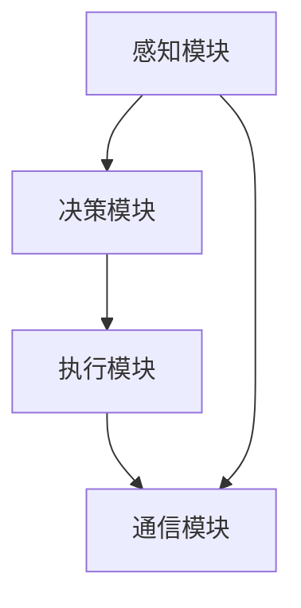

                 


# AI Agent在智能汽车中的驾驶辅助

## 关键词
AI Agent, 智能汽车, 驾驶辅助, 目标检测, 路径规划, 行为决策, 深度学习

## 摘要
随着人工智能技术的飞速发展，AI Agent在智能汽车中的应用日益广泛，特别是在驾驶辅助系统中的作用不可忽视。本文将从AI Agent的基本概念出发，结合智能汽车的背景与发展，详细阐述AI Agent在驾驶辅助中的核心原理、算法实现、系统架构设计以及实际项目案例。通过本文的分析，读者将能够全面理解AI Agent在智能汽车中的重要性及其在实际应用中的具体实现方式。

---

# 第一部分: AI Agent在智能汽车中的驾驶辅助基础

## 第1章: AI Agent与智能汽车概述

### 1.1 AI Agent的基本概念

#### 1.1.1 AI Agent的定义
AI Agent（人工智能代理）是指能够感知环境、自主决策并执行任务的智能实体。它具备以下核心特征：
- **自主性**：能够在没有外部干预的情况下独立运作。
- **反应性**：能够根据环境变化实时调整行为。
- **目标导向**：以实现特定目标为导向。

#### 1.1.2 AI Agent的核心特征
| 特征 | 描述 |
|------|------|
| 自主性 | 能够独立决策和行动，无需外部控制。 |
| 反应性 | 能够实时感知环境变化并做出响应。 |
| 目标导向 | 以实现特定目标为导向，优化决策过程。 |
| 学习能力 | 能够通过经验改进性能，实现自适应。 |

#### 1.1.3 AI Agent与传统算法的区别
AI Agent与传统算法的主要区别在于：
- **自主性**：AI Agent具备自主决策能力，而传统算法通常需要人工干预。
- **实时性**：AI Agent能够实时感知和响应，而传统算法通常不具备这种能力。
- **复杂性**：AI Agent能够处理复杂的动态环境，而传统算法在处理复杂问题时往往需要重新设计。

### 1.2 智能汽车的背景与发展

#### 1.2.1 智能汽车的定义与分类
智能汽车是指通过先进的传感器、计算平台、执行机构和智能算法的结合，能够实现部分或完全自动驾驶的汽车。根据自动驾驶水平的不同，智能汽车可以分为以下几类：
- **L0：无自动驾驶功能** |
- **L1：驾驶员辅助** |
- **L2：部分自动驾驶** |
- **L3：有条件自动驾驶** |
- **L4：高度自动驾驶** |
- **L5：完全自动驾驶** |

#### 1.2.2 智能汽车的发展历程
智能汽车的发展经历了以下几个阶段：
1. **传统汽车阶段**：汽车的基本功能是机械驱动，无智能功能。
2. **驾驶员辅助阶段**：引入了简单的辅助功能，如ABS、ESP等。
3. **部分自动驾驶阶段**：出现了如特斯拉的Autopilot系统，能够在高速公路上实现部分自动驾驶。
4. **有条件自动驾驶阶段**：如Waymo的自动驾驶技术，能够在特定条件下实现完全自动驾驶。
5. **完全自动驾驶阶段**：未来目标是实现全场景下的完全自动驾驶。

#### 1.2.3 智能汽车的市场现状与趋势
目前，全球智能汽车市场呈现快速增长态势。各大汽车制造商和科技公司纷纷加大研发投入，推动智能汽车的普及。未来，随着5G、人工智能、大数据等技术的不断进步，智能汽车将朝着更智能化、更安全的方向发展。

### 1.3 AI Agent在智能汽车中的应用

#### 1.3.1 AI Agent在驾驶辅助中的作用
AI Agent在智能汽车中的作用主要体现在以下几个方面：
- **感知环境**：通过传感器获取环境信息，如车道线、障碍物、交通信号等。
- **决策控制**：根据感知信息，做出驾驶决策，如加速、减速、转向等。
- **实时响应**：在复杂动态环境中实时调整驾驶行为。

#### 1.3.2 AI Agent与智能汽车的结合方式
AI Agent与智能汽车的结合主要通过以下几个方面实现：
- **传感器数据处理**：AI Agent能够实时处理来自摄像头、雷达、激光雷达等传感器的数据。
- **行为决策**：AI Agent基于感知信息，通过算法做出驾驶决策。
- **系统集成**：AI Agent与智能汽车的控制系统、通信系统等进行集成，实现协同工作。

#### 1.3.3 AI Agent在智能汽车中的典型应用场景
1. **车道保持辅助（LKA）**：通过摄像头检测车道线，帮助车辆保持在车道内。
2. **自适应巡航控制（ACC）**：通过雷达检测前方车辆，自动调整车速以保持安全距离。
3. **自动泊车辅助（APA）**：通过传感器和算法实现自动泊车功能。
4. **紧急制动辅助（AEB）**：在检测到潜在碰撞风险时，自动启动制动系统。

---

## 第2章: AI Agent的核心原理

### 2.1 AI Agent的基本原理

#### 2.1.1 感知层: 传感器数据的获取与处理
AI Agent的感知层通过多种传感器（如摄像头、雷达、激光雷达等）获取环境信息，并通过数据融合技术（如卡尔曼滤波）将这些信息整合，形成对环境的统一理解。

#### 2.1.2 决策层: 行为决策算法
AI Agent的决策层基于感知信息，通过行为决策算法（如强化学习、模糊逻辑）做出驾驶决策。

#### 2.1.3 执行层: 动作执行与反馈
AI Agent的执行层将决策结果转化为具体的驾驶动作（如转向、加速、减速），并通过反馈机制不断优化决策。

### 2.2 AI Agent的感知系统

#### 2.2.1 传感器数据的融合与处理
传感器数据融合是通过多种传感器的数据进行融合，以提高感知的准确性和可靠性。常见的数据融合方法包括：
- **加权融合**：根据传感器的可靠性对数据进行加权融合。
- **概率融合**：通过概率模型对数据进行融合，如粒子滤波等。

#### 2.2.2 基于深度学习的目标检测算法
目标检测是AI Agent感知环境的重要任务之一。常用的深度学习目标检测算法包括：
1. **YOLO（You Only Look Once）**：
   - 基于卷积神经网络（CNN）的目标检测算法。
   - 通过单次网络推理即可完成目标的定位和分类。
2. **Faster R-CNN**：
   - 基于区域建议网络（RPN）的目标检测算法。
   - 通过多阶段的网络结构实现目标检测。
3. **YOLO vs. Faster R-CNN 对比**：
   | 参数 | YOLO | Faster R-CNN |
   |------|------|-------------|
   | 速度 | 快   | 较慢        |
   | 精度 | 较低 | 较高        |
   | 适用场景 | 实时性要求高 | 对精度要求高 |

#### 2.2.3 多目标跟踪算法
多目标跟踪（Multiple Object Tracking，MOT）是通过跟踪多个目标的位置和状态，实现对复杂动态环境的感知。常用的多目标跟踪算法包括：
1. **SORT（Simple Online and Realtime Tracking）**：
   - 基于匈牙利算法的目标关联方法。
   - 适用于实时性要求较高的场景。
2. **IOU-Track**：
   - 基于目标检测和匈牙利算法的多目标跟踪算法。
   - 具有较高的检测精度和跟踪稳定性。

### 2.3 AI Agent的决策系统

#### 2.3.1 基于规则的决策算法
基于规则的决策算法通过预定义的规则和逻辑，做出驾驶决策。例如：
- **车道保持辅助**：当车辆偏离车道时，触发方向盘调整。
- **自适应巡航控制**：根据前方车辆的速度调整本车速度。

#### 2.3.2 基于强化学习的决策算法
强化学习是一种通过奖励机制优化决策的算法。在智能汽车中，强化学习可以用于：
- **路径规划**：通过奖励机制优化路径选择。
- **行为决策**：通过模拟环境中的行为，学习最优决策策略。

#### 2.3.3 基于模糊逻辑的决策算法
模糊逻辑是一种处理模糊信息的数学方法。在智能汽车中，模糊逻辑可以用于：
- **复杂环境下的决策**：如雨天、夜间等复杂环境中的驾驶决策。
- **多目标优化**：在多个目标之间进行权衡，做出最优决策。

---

## 第3章: AI Agent的算法原理

### 3.1 目标检测算法

#### 3.1.1 YOLO算法原理
YOLO算法通过将目标检测问题转化为回归问题，实现了快速的目标检测。其核心步骤如下：
1. **输入图像**：将图像输入到YOLO网络中。
2. **特征提取**：通过卷积层提取图像的特征。
3. **边界框回归**：通过全连接层预测每个单元的边界框和类别概率。
4. **非极大值抑制（NMS）**：通过NMS消除重叠的边界框，得到最终的检测结果。

#### 3.1.2 Faster R-CNN算法原理
Faster R-CNN算法通过区域建议网络（RPN）生成候选区域，然后通过RoI Pooling提取特征，最终通过分类器进行目标检测。其核心步骤如下：
1. **生成候选区域**：通过RPN生成候选的边界框。
2. **特征提取**：通过RoI Pooling提取候选区域的特征。
3. **分类与回归**：通过全连接层对候选区域进行分类和回归，得到最终的检测结果。

#### 3.1.3 深度学习目标检测的优缺点对比
| 参数 | YOLO | Faster R-CNN |
|------|------|-------------|
| 速度 | 快   | 较慢        |
| 精度 | 较低 | 较高        |
| 适用场景 | 实时性要求高 | 对精度要求高 |

### 3.2 路径规划算法

#### 3.2.1 A*算法原理
A*算法是一种基于启发式搜索的路径规划算法。其核心步骤如下：
1. **初始化**：设置起点和终点。
2. **生成候选节点**：从起点开始，生成所有可能的候选节点。
3. **计算成本**：计算每个候选节点的路径成本和启发函数。
4. **选择最优节点**：选择路径成本最低的节点，继续生成新的候选节点。
5. **终止条件**：当到达终点时，路径规划完成。

#### 3.2.2 RRT*算法原理
RRT*（Rapidly-exploring Random Tree Star）算法是一种基于采样的路径规划算法。其核心步骤如下：
1. **初始化**：设置起始点和目标区域。
2. **随机采样**：随机采样环境中的点，生成新的节点。
3. **连接最近节点**：将新节点与最近的已访问节点连接，形成树状结构。
4. **检查是否到达目标区域**：如果新节点位于目标区域内，则路径规划完成。
5. **扩展搜索**：重复采样和连接，直到找到路径或遍历所有可能的采样点。

#### 3.2.3 基于深度学习的路径规划算法
基于深度学习的路径规划算法通过神经网络学习环境中的路径特征，实现路径规划。例如：
- **端到端学习**：通过神经网络直接从环境图像中预测路径。
- **监督学习**：通过监督信号训练神经网络，使其输出最优路径。

### 3.3 行为决策算法

#### 3.3.1 Q-Learning算法原理
Q-Learning是一种基于值函数的强化学习算法。其核心步骤如下：
1. **初始化**：设置初始状态和动作值函数Q(s,a)。
2. **选择动作**：根据当前状态和Q值选择动作。
3. **执行动作**：执行选择的动作，观察环境的反馈，得到奖励值。
4. **更新Q值**：通过Q值更新公式，更新Q(s,a)的值。
5. **重复步骤**：重复选择动作、执行动作和更新Q值，直到达到终止条件。

#### 3.3.2 DQN算法原理
DQN（Deep Q-Network）算法是基于深度神经网络的Q-Learning算法。其核心步骤如下：
1. **环境交互**：智能体与环境交互，得到状态和奖励。
2. **经验回放**：将经验存储在经验回放池中，随机抽取进行训练。
3. **网络更新**：通过神经网络近似Q值函数，优化网络参数。
4. **目标网络**：通过目标网络保持Q值函数的稳定性。

#### 3.3.3 基于规则的决策算法
基于规则的决策算法通过预定义的规则和逻辑，做出驾驶决策。例如：
- **车道保持辅助**：当车辆偏离车道时，触发方向盘调整。
- **自适应巡航控制**：根据前方车辆的速度调整本车速度。

---

## 第4章: AI Agent的系统架构设计

### 4.1 系统整体架构

#### 4.1.1 智能汽车AI Agent的模块划分
智能汽车AI Agent的系统架构通常包括以下几个模块：
1. **感知模块**：负责环境感知和数据采集。
2. **决策模块**：负责行为决策和路径规划。
3. **执行模块**：负责动作执行和系统控制。
4. **通信模块**：负责与其他车辆和交通系统的通信。

#### 4.1.2 各模块之间的关系与交互
模块之间的交互通常通过消息队列（如Kafka）或共享内存（如Zmq）实现。感知模块将环境信息传递给决策模块，决策模块将决策结果传递给执行模块，执行模块将执行结果反馈给感知模块。

#### 4.1.3 系统架构的优缺点分析
| 参数 | 优点 | 缺点 |
|------|------|------|
| 可扩展性 | 模块化设计，便于扩展 | 模块之间的耦合性较高 |
| 实时性 | 各模块独立运行，实时性较强 | 模块之间的通信延迟较高 |
| 可靠性 | 模块化设计，便于故障隔离 | 系统的整体复杂性较高 |

### 4.2 系统功能设计

#### 4.2.1 感知模块的功能设计
感知模块的主要功能包括：
- **环境感知**：通过传感器获取环境信息，如车道线、障碍物、交通信号等。
- **数据融合**：将多源传感器数据进行融合，形成对环境的统一理解。

#### 4.2.2 决策模块的功能设计
决策模块的主要功能包括：
- **行为决策**：根据感知信息，通过算法做出驾驶决策。
- **路径规划**：根据决策结果，规划车辆的行驶路径。

#### 4.2.3 执行模块的功能设计
执行模块的主要功能包括：
- **动作执行**：将决策结果转化为具体的驾驶动作，如转向、加速、减速。
- **系统控制**：通过执行机构控制车辆的运动。

### 4.3 系统架构图


---

## 第5章: AI Agent在智能汽车中的项目实战

### 5.1 项目背景与目标
本项目旨在通过AI Agent实现智能汽车的驾驶辅助功能，包括车道保持辅助、自适应巡航控制、自动泊车辅助等。

### 5.2 项目环境搭建

#### 5.2.1 系统环境
- **操作系统**：Linux（Ubuntu 20.04）
- **开发工具**：PyCharm、VS Code
- **深度学习框架**：TensorFlow、PyTorch
- **传感器模拟工具**：CARLA（开源自动驾驶模拟器）

#### 5.2.2 依赖安装
```bash
pip install numpy matplotlib tensorflow keras opencv-python
```

### 5.3 项目核心实现

#### 5.3.1 感知模块实现
```python
import numpy as np
import cv2

def detect_objects(image):
    # 对图像进行预处理
    image = cv2.resize(image, (416, 416))
    image = image / 255.0
    image = np.expand_dims(image, axis=0)
    
    # 使用YOLO模型进行目标检测
    predictions = model.predict(image)
    
    # 解析预测结果
    boxes = predictions[0]
    scores = predictions[1]
    
    return boxes, scores
```

#### 5.3.2 决策模块实现
```python
import numpy as np

def decide_action(boxes, scores):
    # 确定目标的位置和概率
    max_score = np.max(scores)
    if max_score > 0.5:
        # 如果检测到目标，调整行驶方向
        steering_angle = calculate_steering_angle(boxes[0])
        return 'steer', steering_angle
    else:
        # 如果未检测到目标，保持当前行驶方向
        return 'forward', 0
```

#### 5.3.3 执行模块实现
```python
def execute_action(action, angle):
    if action == 'steer':
        # 调整方向盘角度
       方向盘转角(angle)
    elif action == 'forward':
        # 继续向前行驶
       油门踩到底()
```

### 5.4 项目小结
通过本项目的实现，我们可以看到AI Agent在智能汽车中的具体应用。感知模块通过传感器数据获取环境信息，决策模块通过算法做出驾驶决策，执行模块通过执行机构实现动作。整个系统通过模块化设计，提高了系统的可扩展性和可维护性。

---

## 第6章: 总结与展望

### 6.1 总结
本文详细阐述了AI Agent在智能汽车中的驾驶辅助技术，包括AI Agent的基本概念、核心原理、算法实现、系统架构设计以及实际项目案例。通过本文的分析，读者可以全面理解AI Agent在智能汽车中的重要性及其在实际应用中的具体实现方式。

### 6.2 展望
随着人工智能技术的不断进步，AI Agent在智能汽车中的应用将更加广泛。未来，随着5G、物联网、边缘计算等技术的不断发展，智能汽车的驾驶辅助系统将更加智能化、更加安全。

---

## 参考文献
1. [1] Redmon, J., Farhadi, A., & Darrell, T. (2016). YOLO: Fast Object Detection.
2. [2] Ren, S., He, K., & Girshick, R. (2017). Faster R-CNN: Towards Real-Time Object Detection.
3. [3] Kotschny, T., & Krajnik, T. (2019). Deep Learning for Autonomous Vehicles.

---

## 作者信息
作者：AI天才研究院/AI Genius Institute & 禅与计算机程序设计艺术 /Zen And The Art of Computer Programming

