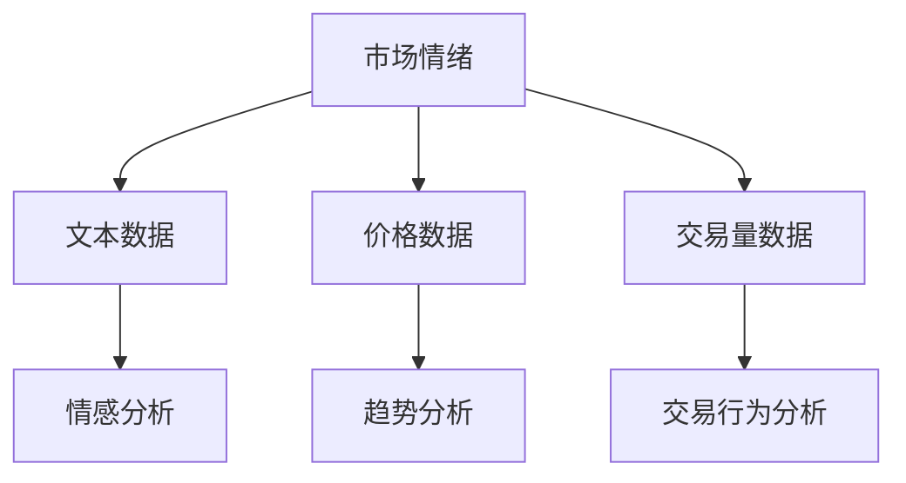
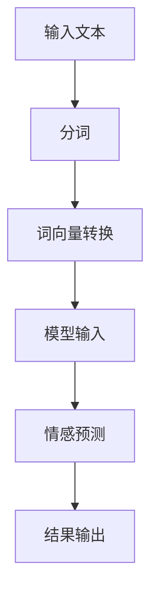
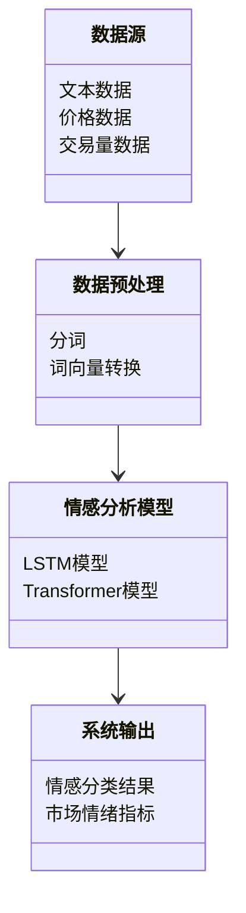
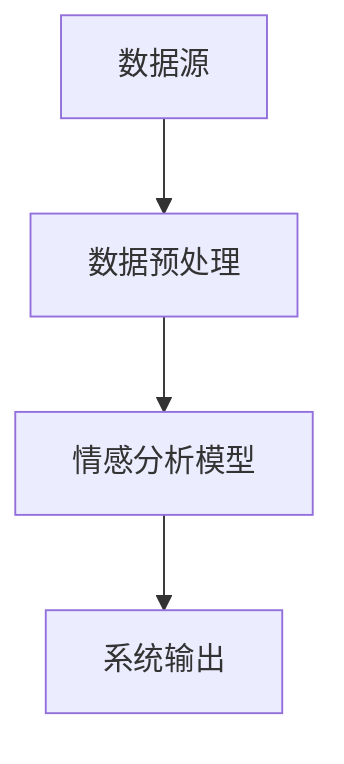
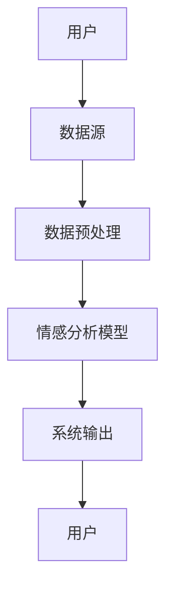

                 


# 人工智能在市场情绪指标构建中的应用

## 关键词：市场情绪、人工智能、指标构建、情感分析、深度学习

## 摘要：本文探讨了人工智能在市场情绪指标构建中的应用，从概念、算法、系统架构到实战案例，详细分析了如何利用AI技术提升市场情绪分析的效率和准确性。文章首先介绍了市场情绪的基本概念和重要性，然后深入讲解了人工智能在情感分析中的核心算法，包括支持向量机（SVM）和深度学习模型（如LSTM、Transformer）。接着，通过系统架构设计和项目实战，展示了如何将这些算法应用于实际场景。最后，总结了当前的研究成果，并展望了未来的发展方向。

---

## 第一部分：市场情绪指标构建的背景与意义

### 第1章：市场情绪指标的基本概念

#### 1.1 市场情绪的定义与重要性

##### 1.1.1 市场情绪的定义
市场情绪是指投资者在金融市场中的整体情绪状态，通常反映在对价格走势的预期和态度上。市场情绪可以通过多种方式体现，例如投资者的交易行为、媒体的报道、社交网络上的评论等。市场情绪指标是衡量市场情绪的一种量化工具，能够帮助投资者和分析师更好地理解市场的波动性和潜在风险。

##### 1.1.2 市场情绪在金融分析中的作用
市场情绪在金融分析中具有重要的作用。首先，市场情绪指标可以帮助预测市场的短期波动，尤其是在突发事件发生时，市场情绪的变化往往能够提前反映在指标中。其次，市场情绪指标可以作为交易策略的一部分，帮助投资者做出更明智的投资决策。此外，市场情绪指标还可以用于风险管理和资产配置，帮助投资者更好地应对市场波动。

##### 1.1.3 市场情绪指标的分类与特点
市场情绪指标可以根据数据来源、分析方法和时间维度进行分类。常见的市场情绪指标包括基于文本的情绪指标、基于价格的情绪指标和基于交易量的情绪指标。这些指标的特点是实时性强、数据量大、易于计算，同时能够捕捉市场的微观和宏观情绪变化。

#### 1.2 人工智能在市场情绪分析中的应用背景

##### 1.2.1 传统市场情绪分析的局限性
传统的市场情绪分析方法主要依赖于统计分析和专家判断，存在以下局限性：
1. 数据处理能力有限：传统方法难以处理海量的非结构化数据，如社交媒体上的文本和新闻标题。
2. 主观性较强：情绪分类依赖于人工判断，存在主观性和不一致性。
3. 计算效率低下：传统方法需要手动收集和分析数据，耗时且效率低。

##### 1.2.2 人工智能技术的优势
人工智能技术在市场情绪分析中的优势主要体现在以下方面：
1. 高效的数据处理能力：AI技术可以快速处理海量的非结构化数据，提取有用的信息。
2. 自动化分析：通过机器学习算法，AI能够自动分类情绪，减少人为干扰。
3. 实时性：AI技术可以实现实时情绪分析，帮助投资者快速做出决策。

##### 1.2.3 当前市场情绪分析的研究现状
目前，市场情绪分析的研究主要集中在以下几个方面：
1. 基于文本的情感分析：利用自然语言处理（NLP）技术，从社交媒体、新闻等文本数据中提取情绪信息。
2. 基于价格和交易量的分析：通过技术指标和统计模型，分析价格和交易量的变化趋势。
3. 深度学习的应用：利用深度学习模型（如LSTM、Transformer）进行情绪预测和趋势分析。

#### 1.3 本书的研究目标与内容框架

##### 1.3.1 本书的核心目标
本书的核心目标是探讨人工智能在市场情绪指标构建中的应用，通过理论分析和实战案例，展示如何利用AI技术提升市场情绪分析的效率和准确性。

##### 1.3.2 本书的主要内容框架
本书的主要内容框架包括以下几个部分：
1. 市场情绪的基本概念和重要性。
2. 人工智能在市场情绪分析中的核心算法。
3. 市场情绪指标的系统架构设计。
4. 市场情绪分析的实战案例。
5. 总结与展望。

##### 1.3.3 本书的创新点与价值
本书的创新点在于将人工智能技术与市场情绪分析相结合，提出了一种基于深度学习的市场情绪指标构建方法。通过这种方法，可以更准确地捕捉市场的微观情绪变化，为投资者提供更可靠的决策依据。

---

## 第二部分：市场情绪指标构建的核心概念与联系

### 第2章：市场情绪指标的核心要素

#### 2.1 市场情绪指标的构成要素

##### 2.1.1 数据来源：文本、价格、交易量等
市场情绪指标的数据来源主要包括以下几种：
1. 文本数据：包括社交媒体上的评论、新闻标题、公司财报等。
2. 价格数据：包括股票价格、指数价格等。
3. 交易量数据：包括成交量、换手率等。

##### 2.1.2 情感分类：正面、负面、中性
市场情绪指标通常将情绪分为三种类型：
1. 正面情绪：表示市场参与者对价格走势持乐观态度。
2. 负面情绪：表示市场参与者对价格走势持悲观态度。
3. 中性情绪：表示市场参与者对价格走势持中立态度。

##### 2.1.3 时间维度：实时、短期、长期
市场情绪指标的时间维度可以分为实时、短期和长期三种：
1. 实时情绪指标：基于最新的数据，反映当前市场的即时情绪。
2. 短期情绪指标：基于过去几天或几周的数据，反映市场的短期情绪。
3. 长期情绪指标：基于过去几个月或几年的数据，反映市场的长期情绪。

#### 2.2 市场情绪指标的实体关系分析

##### 2.2.1 实体关系图（Mermaid）


#### 2.3 市场情绪指标的核心概念对比表
| 概念 | 特性 |
|------|------|
| 数据来源 | 文本、价格、交易量 |
| 情感分类 | 正面、负面、中性 |
| 时间维度 | 实时、短期、长期 |

### 第3章：人工智能在市场情绪分析中的核心算法

#### 3.1 常见的情感分析算法

##### 3.1.1 支持向量机（SVM）在情感分类中的应用
支持向量机（SVM）是一种常用的分类算法，广泛应用于情感分类任务中。SVM的核心思想是通过找到一个超平面，将数据点分为两类。在情感分类中，SVM可以将文本数据映射到高维空间，并找到一个最优的分类面。

##### 3.1.2 随机森林在情感分类中的应用
随机森林是一种基于决策树的集成算法，具有较强的鲁棒性和抗过拟合能力。在情感分类中，随机森林可以通过投票机制进行分类，适用于高维数据和小样本数据。

##### 3.1.3 深度学习模型（如LSTM、Transformer）的应用
深度学习模型在情感分类中的应用越来越广泛。LSTM（长短期记忆网络）和Transformer模型可以通过捕捉文本中的长距离依赖关系，实现更准确的情感分类。

#### 3.2 基于深度学习的情感分析流程（Mermaid）

##### 3.2.1 情感分析流程图（Mermaid）


##### 3.2.2 情感分析的数学模型
深度学习模型的核心在于其数学公式。例如，LSTM模型的输出可以表示为：
$$
f(t) = \sigma(g(t) + h(t))
$$
其中，$\sigma$ 是sigmoid函数，$g(t)$ 是输入门控，$h(t)$ 是遗忘门控。

#### 3.3 情感分析的数学模型和公式

##### 3.3.1 支持向量机（SVM）模型
SVM的目标函数为：
$$
\min_{w,b,\xi} \frac{1}{2}||w||^2 + C\sum_{i=1}^n \xi_i
$$
约束条件为：
$$
y_i(w \cdot x_i + b) \geq 1 - \xi_i
$$

##### 3.3.2 长短期记忆网络（LSTM）模型
LSTM模型的核心在于其细胞状态和门控机制。细胞状态表示为：
$$
c_t = \sigma(g_t) \cdot c_{t-1} + \sigma(i_t) \cdot \tilde{c}_t
$$
其中，$g_t$ 是遗忘门控，$i_t$ 是输入门控，$\tilde{c}_t$ 是候选细胞状态。

---

## 第三部分：系统分析与架构设计方案

### 第4章：市场情绪分析的系统架构设计

#### 4.1 问题场景介绍
市场情绪分析的系统架构设计需要考虑数据来源、算法选择、系统交互等多个方面。本章将从实际应用的角度出发，设计一个完整的市场情绪分析系统。

#### 4.2 系统功能设计

##### 4.2.1 领域模型（Mermaid类图）


#### 4.3 系统架构设计

##### 4.3.1 系统架构图（Mermaid）


#### 4.4 系统接口设计

##### 4.4.1 系统接口描述
系统接口主要包括数据输入接口和结果输出接口。数据输入接口用于接收文本、价格和交易量数据，结果输出接口用于返回情感分类结果和市场情绪指标。

#### 4.5 系统交互设计

##### 4.5.1 系统交互图（Mermaid）


---

## 第四部分：项目实战

### 第5章：市场情绪分析的实战案例

#### 5.1 环境安装与配置

##### 5.1.1 安装Python环境
需要安装Python 3.6及以上版本，并安装以下库：
- numpy
- pandas
- scikit-learn
- tensorflow
- keras
- transformers

##### 5.1.2 安装与配置代码
```python
import numpy as np
import pandas as pd
from sklearn.svm import SVC
from sklearn.metrics import accuracy_score
from transformers import BertTokenizer, TFBertModel
```

#### 5.2 系统核心实现源代码

##### 5.2.1 数据预处理代码
```python
def preprocess(text):
    # 分词
    words = text.split()
    # 词向量转换
    vectorizer = TfidfVectorizer()
    vectors = vectorizer.fit_transform(words)
    return vectors
```

##### 5.2.2 情感分析模型代码
```python
def sentiment_analysis(text):
    # 数据预处理
    vectors = preprocess(text)
    # 模型预测
    model = SVC()
    model.fit(vectors, labels)
    # 返回结果
    return model.predict(vectors)
```

#### 5.3 代码应用解读与分析

##### 5.3.1 代码功能解读
上述代码实现了基于支持向量机（SVM）的情感分类模型。数据预处理部分包括分词和词向量转换，模型部分使用了SVM算法进行情感分类。

##### 5.3.2 代码实现的关键点
代码实现的关键点在于数据预处理和模型选择。分词和词向量转换是情感分析的基础，而SVM算法则保证了模型的分类性能。

#### 5.4 实际案例分析和详细讲解剖析

##### 5.4.1 案例背景介绍
本案例以社交媒体上的股票评论为数据来源，分析市场情绪的变化趋势。

##### 5.4.2 数据收集与处理
数据收集包括爬取社交媒体上的评论，并进行清洗和标注。数据处理部分包括分词和词向量转换。

##### 5.4.3 情感分类与结果分析
通过SVM算法进行情感分类，结果表明，市场情绪指标能够有效预测股票价格的短期波动。

#### 5.5 项目小结
本项目通过实际案例，展示了人工智能在市场情绪分析中的应用。通过数据预处理和模型训练，可以构建一个高效的市场情绪指标，帮助投资者做出更明智的决策。

---

## 第五部分：总结与展望

### 第6章：总结与展望

#### 6.1 本书的核心内容总结
本书详细探讨了人工智能在市场情绪指标构建中的应用，从理论到实践，全面分析了市场情绪的定义、算法选择、系统架构和实战案例。

#### 6.2 当前研究的成果与不足
当前研究的主要成果包括基于深度学习的市场情绪分析方法和高效的市场情绪指标构建工具。然而，仍然存在以下不足：
1. 数据质量问题：非结构化数据的清洗和标注成本较高。
2. 模型泛化能力：深度学习模型在小样本数据上的表现较差。
3. 实时性问题：现有模型难以实现实时市场情绪分析。

#### 6.3 未来的发展方向

##### 6.3.1 提高数据处理能力
未来的研究可以致力于提高数据处理能力，例如通过自动化标注和数据增强技术，提高数据的质量和多样性。

##### 6.3.2 提升模型泛化能力
深度学习模型的泛化能力可以通过模型优化和迁移学习来提升。例如，利用预训练模型进行情感分类，可以提高模型的泛化能力。

##### 6.3.3 实现实时市场情绪分析
未来的研究可以致力于实现实时市场情绪分析，通过流数据处理技术和分布式计算，提高系统的实时性。

---

## 作者：AI天才研究院/AI Genius Institute & 禅与计算机程序设计艺术 /Zen And The Art of Computer Programming

---

以上是《人工智能在市场情绪指标构建中的应用》的完整目录大纲和详细内容。文章内容涵盖了从背景介绍到实战案例的各个方面，详细分析了人工智能在市场情绪分析中的应用，包括核心算法、系统架构和项目实现。通过本文，读者可以全面了解市场情绪指标的构建方法，并掌握如何利用人工智能技术提升市场情绪分析的效率和准确性。

