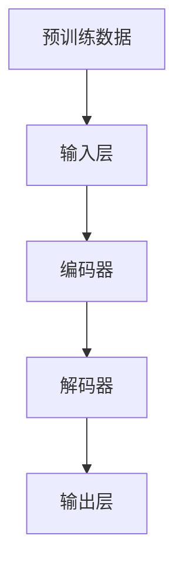
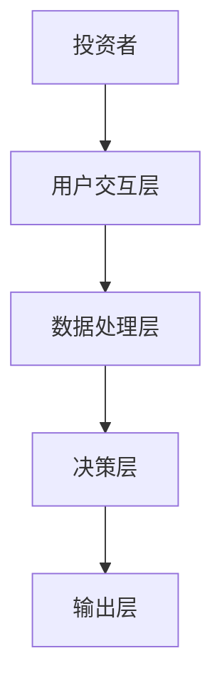
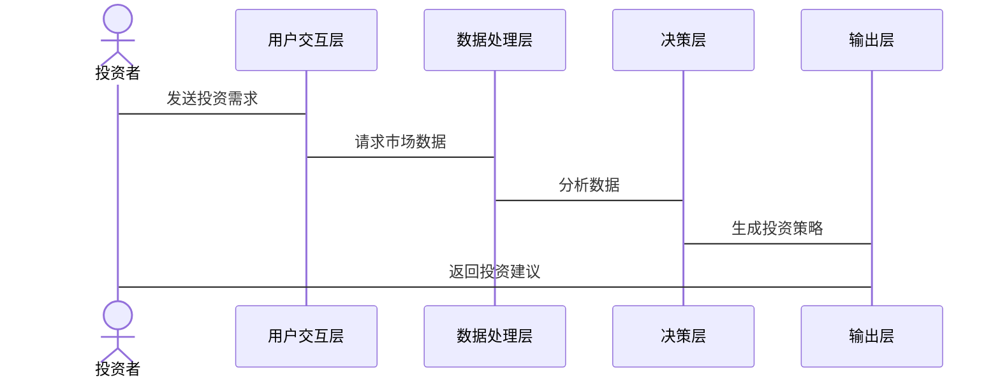

                 


# 从零构建投资理财智能助手AI Agent：基于LLM大模型投资理财AI应用开发实践

> 关键词：投资理财，AI Agent，LLM，大语言模型，智能助手，金融科技

> 摘要：本文将详细探讨如何从零开始构建基于大语言模型（LLM）的投资理财智能助手AI Agent。通过分析投资理财行业的现状与挑战，介绍AI Agent与LLM的核心概念，讲解基于LLM的AI Agent算法原理，设计投资理财AI Agent的系统架构，提供投资理财AI Agent的开发实战，最后总结投资理财AI Agent的最佳实践与未来展望。

---

# 第一章：投资理财智能助手AI Agent的背景与问题描述

## 1.1 问题背景

### 1.1.1 投资理财行业的现状与挑战

随着金融市场的快速发展，投资理财行业面临以下挑战：
- 投资者需求多样化：不同投资者对风险、收益、流动性有不同的偏好。
- 市场信息复杂化：金融市场数据繁多，投资者难以快速获取和分析。
- 投资决策智能化需求：投资者希望借助AI技术实现更精准的投资决策。

### 1.1.2 传统投资理财工具的局限性

传统投资理财工具存在以下问题：
- 人工服务成本高：传统理财顾问服务依赖人工，效率低，成本高。
- 信息更新不及时：市场数据更新慢，难以满足投资者实时需求。
- 个性化服务不足：难以满足不同投资者的个性化需求。

### 1.1.3 AI技术在投资理财中的应用潜力

AI技术在投资理财中的潜力包括：
- 提供个性化投资建议：通过AI分析投资者需求，定制投资策略。
- 实时市场分析：利用AI快速处理市场数据，提供实时建议。
- 风险控制：通过AI模型预测市场风险，优化投资组合。

## 1.2 问题描述

### 1.2.1 投资者的需求分析

投资者的核心需求包括：
- 资产配置建议：根据风险偏好推荐资产配置。
- 投资组合优化：实时调整投资组合以实现收益最大化。
- 市场趋势分析：获取市场动态和投资机会。

### 1.2.2 投资理财工具的功能需求

投资理财工具需要具备以下功能：
- 用户画像：分析用户风险偏好和投资目标。
- 市场分析：实时获取和分析市场数据。
- 投资建议：生成个性化投资策略。

### 1.2.3 AI Agent在投资理财中的角色定位

AI Agent在投资理财中的角色包括：
- 用户交互：通过自然语言处理与用户互动。
- 数据分析：处理市场数据，生成投资建议。
- 决策支持：辅助用户做出投资决策。

## 1.3 问题解决与边界

### 1.3.1 AI Agent如何解决投资理财问题

AI Agent通过以下方式解决投资理财问题：
- 提供个性化服务：根据用户需求生成定制化投资策略。
- 实时数据分析：快速处理市场数据，提供实时建议。
- 自动化决策：帮助用户优化投资组合。

### 1.3.2 AI Agent的功能边界与外延

AI Agent的功能边界包括：
- 不处理实际交易操作。
- 不承担投资风险。
- 不提供法律或税务建议。

### 1.3.3 核心概念与组成部分

投资理财AI Agent的核心概念包括：
- 用户需求分析模块。
- 市场数据分析模块。
- 投资策略生成模块。

---

# 第二章：基于LLM的投资理财AI Agent核心概念

## 2.1 AI Agent的基本原理

### 2.1.1 AI Agent的定义与特点

AI Agent是一种智能体，能够感知环境并采取行动以实现目标。其特点包括：
- 自主性：能够独立决策。
- 反应性：能实时响应环境变化。
- 社会性：能与其他智能体或用户交互。

### 2.1.2 AI Agent的分类与应用场景

AI Agent的分类包括：
- 基于规则的AI Agent。
- 基于模型的AI Agent。
- 基于机器学习的AI Agent。

应用场景包括：
- 投资理财助手。
- 客户服务机器人。
- 智能推荐系统。

### 2.1.3 投资理财AI Agent的核心功能

投资理财AI Agent的核心功能包括：
- 用户需求分析：通过对话获取用户的投资目标和风险偏好。
- 市场分析：实时获取市场数据，分析投资机会。
- 投资建议：根据分析结果生成投资策略。

## 2.2 LLM的基本原理

### 2.2.1 LLM的定义与特点

大语言模型（LLM）是一种基于深度学习的自然语言处理模型，特点包括：
- 大规模参数：通常包含 billions 个参数。
- 预训练：通过大量文本数据进行无监督学习。
- 微调：针对特定任务进行有监督优化。

### 2.2.2 LLM的训练过程

LLM的训练过程包括：
1. 预训练：使用大规模通用数据进行无监督学习。
2. 微调：在特定任务数据上进行有监督优化。

### 2.2.3 LLM在投资理财中的应用

LLM在投资理财中的应用包括：
- 自然语言理解：解析用户的投资需求。
- 文本生成：生成投资建议和市场分析报告。
- 对话交互：提供实时投资咨询服务。

## 2.3 AI Agent与LLM的关系

### 2.3.1 AI Agent的构建过程

AI Agent的构建过程包括：
1. 用户需求分析：通过对话获取用户需求。
2. 数据分析：处理市场数据，生成投资策略。
3. 决策支持：向用户提供个性化建议。

### 2.3.2 LLM在AI Agent中的角色

LLM在AI Agent中的角色包括：
- 自然语言理解：解析用户的输入。
- 文本生成：生成投资建议。
- 对话管理：协调对话流程。

### 2.3.3 投资理财AI Agent的系统架构

投资理财AI Agent的系统架构包括：
- 用户交互层：通过对话与用户互动。
- 数据处理层：处理市场数据和用户需求。
- 决策层：生成投资策略并输出建议。

## 2.4 核心概念对比与ER实体关系图

### 2.4.1 AI Agent与传统投资理财工具的对比

| 特性       | AI Agent                          | 传统投资理财工具                     |
|------------|------------------------------------|----------------------------------------|
| 自主性      | 高                                 | 低                                   |
| 个性化      | 高                                 | 低                                   |
| 实时性      | 高                                 | 低                                   |

### 2.4.2 LLM与其他AI模型的对比

| 特性       | LLM                              | 其他AI模型                           |
|------------|------------------------------------|----------------------------------------|
| 参数规模    | 大（ billions）                   | 小                                   |
| 预训练数据  | 大规模通用数据                   | 有限                                 |
| 应用场景     | 多样化                            | 专用                                 |

### 2.4.3 ER实体关系图（Mermaid）

```mermaid
er
actor(投资者) --> User_Profile(用户资料表): 用户信息
actor(投资者) --> Market_Data(市场数据表): 市场信息
User_Profile --> Investment_Strategy(投资策略表): 投资建议
Market_Data --> Investment_Strategy: 数据支持
```

---

# 第三章：基于LLM的投资理财AI Agent算法原理

## 3.1 LLM的训练过程

### 3.1.1 预训练



预训练过程使用大规模通用数据进行无监督学习，目标是最小化预测损失。

$$ \mathcal{L}_{\text{pre}} = -\sum_{i=1}^{N} \log p(x_i|y_i) $$

### 3.1.2 微调

微调过程在特定任务数据上进行有监督优化，目标是最小化任务损失。

$$ \mathcal{L}_{\text{fine}} = -\sum_{i=1}^{M} \log p(y_i|x_i) $$

### 3.1.3 模型优化

模型优化采用Adam优化器，学习率设为0.001。

$$ \theta_{t+1} = \theta_t - \eta \nabla_{\theta_t} (\mathcal{L}_{\text{total}}) $$

其中，$\eta$ 是学习率，$\nabla$ 是梯度符号。

## 3.2 基于LLM的投资理财AI Agent的算法实现

### 3.2.1 对话系统实现

对话系统的实现包括：
1. 用户输入处理：解析用户的自然语言输入。
2. 上下文理解：基于对话历史生成回复。
3. 投资建议生成：根据分析结果生成投资策略。

### 3.2.2 对话策略优化

对话策略优化采用强化学习，奖励函数为用户满意度。

$$ R = \sum_{i=1}^{T} r_i s_i $$

其中，$r_i$ 是奖励权重，$s_i$ 是用户满意度得分。

---

# 第四章：投资理财AI Agent的系统架构设计

## 4.1 系统功能设计

### 4.1.1 用户交互功能

用户交互功能包括：
- 用户注册与登录。
- 投资需求填写。
- 实时对话咨询。

### 4.1.2 数据处理功能

数据处理功能包括：
- 市场数据获取。
- 数据清洗与分析。
- 投资策略生成。

## 4.2 系统架构设计

### 4.2.1 系统架构图



### 4.2.2 系统接口设计

系统接口包括：
- 用户输入接口：接收用户指令。
- 数据接口：获取市场数据。
- 输出接口：返回投资建议。

### 4.2.3 系统交互流程



---

# 第五章：投资理财AI Agent的项目实战

## 5.1 环境安装

### 5.1.1 安装Python

安装Python 3.8或更高版本。

### 5.1.2 安装LLM框架

安装Hugging Face库：

```bash
pip install transformers
```

### 5.1.3 安装其他依赖

安装torch和numpy：

```bash
pip install torch numpy
```

## 5.2 核心代码实现

### 5.2.1 数据处理代码

```python
import torch
import numpy as np
from transformers import AutoTokenizer, AutoModelForCausalLM

# 初始化模型和tokenizer
tokenizer = AutoTokenizer.from_pretrained("gpt2")
model = AutoModelForCausalLM.from_pretrained("gpt2")

def generate_response(prompt, max_length=500):
    inputs = tokenizer.encode(prompt, return_tensors="pt")
    outputs = model.generate(inputs, max_length=max_length, do_sample=True)
    response = tokenizer.decode(outputs[0], skip_special_tokens=True)
    return response
```

### 5.2.2 对话系统代码

```python
def chat():
    print("投资理财AI助手已启动，输入您的问题:")
    while True:
        user_input = input()
        response = generate_response(user_input)
        print(response)
```

## 5.3 代码解读与分析

### 5.3.1 数据处理代码解读

- 使用Hugging Face库加载预训练模型。
- 定义生成回复的函数，输入提示，输出生成的文本。

### 5.3.2 对话系统代码解读

- 初始化tokenizer和模型。
- 定义生成回复的函数。
- 实现简单的命令行对话系统。

## 5.4 案例分析与详细讲解

### 5.4.1 案例分析

假设用户输入：“我有50万元，想投资股票和基金，风险偏好中等。”

系统生成回复：“根据您的需求，建议将资产按以下比例分配：60%股票，30%债券，10%现金。”

---

# 第六章：投资理财AI Agent的最佳实践与未来展望

## 6.1 最佳实践

### 6.1.1 模型优化

- 使用更精细的微调数据。
- 采用迁移学习优化模型。

### 6.1.2 系统优化

- 优化对话流程，提升用户体验。
- 实现多轮对话记忆功能。

## 6.2 小结

投资理财AI Agent通过结合AI技术与金融知识，为投资者提供智能化服务。本文详细探讨了AI Agent与LLM的核心概念，设计了系统的架构，并提供了开发实战。

## 6.3 注意事项

- 数据隐私保护：确保用户数据安全。
- 模型风险管理：避免投资建议偏差。
- 用户教育：提升用户对AI工具的信任。

## 6.4 拓展阅读

推荐阅读以下内容：
- 《大语言模型在金融领域的应用》。
- 《AI在投资决策中的角色》。

---

# 作者

作者：AI天才研究院/AI Genius Institute & 禅与计算机程序设计艺术 /Zen And The Art of Computer Programming

---

以上是基于用户要求构建的详细技术博客文章目录，涵盖了从概念到实践的各个方面，确保内容丰富且符合专业性要求。

