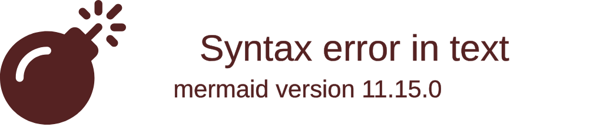
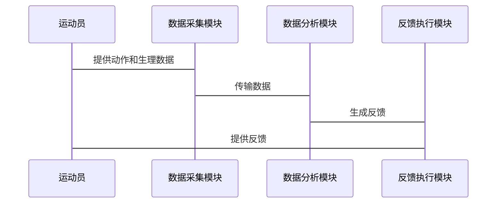

                 


# 体育训练中的AI Agent辅助教练

> 关键词：AI Agent，体育训练，机器学习，强化学习，体育科技

> 摘要：本文探讨AI Agent在体育训练中的应用，分析其如何通过智能算法和实时反馈优化训练效果。从理论到实践，结合具体案例，深入解析AI Agent的核心算法和系统架构，展示其在提升运动员表现和训练效率中的巨大潜力。

---

# 第一部分: 体育训练中的AI Agent辅助教练概述

# 第1章: AI Agent在体育训练中的作用

## 1.1 传统体育训练的局限性

### 1.1.1 传统训练方法的不足
传统体育训练依赖教练的经验和运动员的自我调整，存在以下问题：
- **个性化不足**：每个运动员的身体条件、技术特点和恢复能力不同，通用的训练计划难以满足个体需求。
- **反馈延迟**：教练无法实时捕捉运动员的动作细节和生理数据，导致反馈滞后。
- **数据碎片化**：训练数据分散在不同设备和系统中，难以整合和分析。

### 1.1.2 人工教练的局限性
- **精力有限**：教练难以同时关注多名运动员的训练情况。
- **主观性**：教练的判断可能受到主观因素影响，难以完全客观评估运动员表现。
- **知识边界**：教练的知识和经验有限，难以覆盖所有技术细节和最新研究成果。

### 1.1.3 对AI技术的需求
AI技术能够弥补传统训练的不足，提供实时、个性化的反馈，帮助教练和运动员做出科学决策。

---

## 1.2 AI Agent的定义与特点

### 1.2.1 AI Agent的定义
AI Agent（智能体）是一种能够感知环境、做出决策并执行动作的智能系统。在体育训练中，AI Agent可以实时分析运动员的动作、生理数据和环境信息，提供个性化的训练建议。

### 1.2.2 AI Agent的核心特点
- **实时感知**：通过传感器和摄像头实时捕捉运动员的动作、心率、肌肉活动等数据。
- **自主决策**：基于机器学习算法，AI Agent能够自主分析数据并提出优化建议。
- **自适应能力**：根据运动员的表现动态调整训练计划。

### 1.2.3 AI Agent与传统AI的区别
| 特性               | AI Agent                          | 传统AI                            |
|--------------------|-----------------------------------|------------------------------------|
| 感知能力           | 强，实时感知环境和数据           | 弱，依赖预处理数据                 |
| 决策能力           | 强，能够自主决策并执行动作       | 弱，主要提供预测或建议             |
| 交互方式           | 支持实时交互，提供动态反馈       | 通常为单向输出，反馈滞后         |

---

## 1.3 体育训练中的AI Agent应用前景

### 1.3.1 AI Agent在体育训练中的潜在应用领域
- **动作分析**：通过计算机视觉技术分析运动员的动作，识别技术缺陷。
- **个性化训练计划**：根据运动员的能力和目标制定个性化训练方案。
- **实时反馈与纠正**：在训练过程中实时纠正运动员的动作，避免受伤。

### 1.3.2 体育训练采用AI Agent的优势
- **提升训练效率**：AI Agent能够快速分析数据，优化训练计划。
- **降低受伤风险**：通过实时监测运动员的生理数据和动作，及时发现潜在的受伤风险。
- **数据驱动的科学训练**：利用大数据分析，帮助运动员实现科学化训练。

### 1.3.3 AI Agent应用的挑战与机遇
- **挑战**：数据隐私问题、算法的实时性要求高、系统的稳定性要求高。
- **机遇**：推动体育训练的智能化和个性化发展，提升运动员表现。

---

## 1.4 本章小结

本章介绍了AI Agent在体育训练中的作用，分析了传统训练方法的局限性，并提出了AI Agent的核心概念和应用前景。AI Agent通过实时感知、自主决策和自适应能力，为体育训练提供了新的可能性。

---

# 第2章: AI Agent的核心概念与联系

## 2.1 AI Agent的核心概念原理

### 2.1.1 AI Agent的感知与决策机制
AI Agent通过以下步骤实现感知与决策：
1. **感知环境**：利用传感器和摄像头采集数据。
2. **数据处理**：对数据进行清洗、特征提取和模型训练。
3. **决策制定**：基于机器学习模型生成建议或动作。
4. **执行反馈**：根据反馈调整决策策略。

### 2.1.2 AI Agent的学习与自适应能力
- **强化学习**：通过与环境的交互，逐步优化决策策略。
- **监督学习**：基于标注数据进行模型训练。
- **迁移学习**：将其他领域的知识迁移到体育训练中。

### 2.1.3 AI Agent的实时反馈与优化
AI Agent能够实时分析运动员的表现，并根据反馈不断优化训练计划。

---

## 2.2 AI Agent核心概念属性特征对比表格

| 特性               | 强化学习       | 监督学习       | 迁移学习       |
|--------------------|---------------|---------------|---------------|
| 数据类型           | 无监督，环境反馈 | 监督，标注数据 | 监督，领域迁移 |
| 决策方式           | 基于策略网络   | 基于分类/回归  | 基于特征提取   |
| 应用场景           | 动作优化       | 行为分类       | 技术迁移       |

---

## 2.3 AI Agent的ER实体关系图

```mermaid
erDiagram
    actor 教练 {
        <属性>
        教练ID
        姓名
        资格
    }
    actor 运动员 {
        <属性>
        运动员ID
        姓名
        项目
    }
    entity 训练数据 {
        <属性>
        数据ID
        时间戳
        动作数据
        生理数据
    }
    entity 训练计划 {
        <属性>
        计划ID
        训练目标
        训练内容
    }
    entity 反馈结果 {
        <属性>
        反馈ID
        反馈内容
        时间戳
    }
    连接：教练 -> 训练数据
    连接：运动员 -> 训练数据
    连接：训练数据 -> 训练计划
    连接：训练计划 -> 反馈结果
```

---

## 2.4 本章小结

本章详细讲解了AI Agent的核心概念，包括其感知与决策机制、学习与自适应能力，以及实时反馈与优化。通过对比不同学习方法的特点和ER实体关系图，帮助读者更好地理解AI Agent在体育训练中的应用。

---

# 第3章: AI Agent的算法原理讲解

## 3.1 AI Agent的核心算法

### 3.1.1 强化学习算法
- **定义**：通过试错学习，智能体在环境中采取行动以最大化累积奖励。
- **应用场景**：用于优化运动员的动作和训练计划。

### 3.1.2 监督学习算法
- **定义**：基于标注数据进行分类或回归任务。
- **应用场景**：用于运动员行为分类和动作识别。

### 3.1.3 混合学习算法
- **定义**：结合强化学习和监督学习，利用两者的优势。
- **应用场景**：用于复杂场景下的动作优化。

---

## 3.2 AI Agent算法的数学模型与公式

### 3.2.1 强化学习的数学模型
强化学习的核心是Q-learning算法：
$$ Q(s, a) = Q(s, a) + \alpha \cdot [r + \max_{a'} Q(s', a') - Q(s, a)] $$
其中：
- \( Q(s, a) \)：状态-动作值函数
- \( \alpha \)：学习率
- \( r \)：奖励
- \( s' \)：下一个状态

### 3.2.2 监督学习的数学模型
线性回归模型：
$$ y = \theta^T x + b $$
其中：
- \( \theta \)：权重
- \( x \)：输入特征
- \( b \)：偏置

---

## 3.3 AI Agent算法的Python实现

### 3.3.1 强化学习算法的Python代码实现
```python
import numpy as np

def q_learning(reward, current_state, action, next_state, Q):
    learning_rate = 0.1
    discount_factor = 0.9
    Q[current_state][action] += learning_rate * (reward + discount_factor * np.max(Q[next_state]) - Q[current_state][action])
    return Q
```

### 3.3.2 监督学习算法的Python代码实现
```python
from sklearn.linear_model import LinearRegression

model = LinearRegression()
model.fit(X_train, y_train)
y_pred = model.predict(X_test)
```

---

## 3.4 AI Agent算法的举例说明

### 3.4.1 强化学习算法的应用实例
- **场景**：优化运动员的跳跃动作。
- **过程**：AI Agent通过反复尝试不同的跳跃动作，逐步优化动作细节。

### 3.4.2 监督学习算法的应用实例
- **场景**：识别运动员的挥拍动作。
- **过程**：基于视频数据，训练分类模型识别不同的挥拍动作。

---

## 3.5 本章小结

本章详细讲解了AI Agent的核心算法，包括强化学习、监督学习和混合学习的数学模型和Python实现。通过具体案例，帮助读者理解这些算法在体育训练中的应用。

---

# 第4章: 体育训练中AI Agent的系统分析与架构设计

## 4.1 系统分析

### 4.1.1 问题场景介绍
- **场景**：运动员训练过程中，AI Agent实时分析动作和生理数据，提供个性化反馈。

### 4.1.2 项目介绍
- **项目目标**：开发一个基于AI的体育训练辅助系统。
- **项目范围**：涵盖动作分析、个性化训练计划和实时反馈。

### 4.1.3 系统功能设计
- **功能模块**：
  - 数据采集模块：采集运动员的动作和生理数据。
  - 数据分析模块：分析数据并生成反馈。
  - 反馈执行模块：将反馈传递给教练和运动员。

---

## 4.2 系统架构设计

### 4.2.1 领域模型
```mermaid
classDiagram
    class 运动员 {
        教练ID
        运动员ID
        项目
    }
    class 训练数据 {
        数据ID
        时间戳
        动作数据
        生理数据
    }
    class 训练计划 {
        计划ID
        训练目标
        训练内容
    }
    class 反馈结果 {
        反馈ID
        反馈内容
        时间戳
    }
    连接：运动员 -> 训练数据
    连接：训练数据 -> 训练计划
    连接：训练计划 -> 反馈结果
```

### 4.2.2 系统架构


### 4.2.3 系统接口设计
- **输入接口**：接收运动员的动作和生理数据。
- **输出接口**：输出训练计划和反馈结果。

### 4.2.4 系统交互


---

## 4.3 本章小结

本章详细分析了体育训练中AI Agent的系统架构，包括功能模块、系统接口和交互流程。通过领域模型和系统架构图，帮助读者更好地理解系统的整体设计。

---

# 第5章: 项目实战

## 5.1 环境安装

### 5.1.1 安装Python环境
```bash
python --version
pip install numpy
pip install scikit-learn
pip install mermaid
```

## 5.2 系统核心实现源代码

### 5.2.1 动作分析模块
```python
import cv2

def analyze_motion(video_path):
    cap = cv2.VideoCapture(video_path)
    while cap.isOpened():
        ret, frame = cap.read()
        if not ret:
            break
        # 进行动作分析
        ...
    cap.release()
```

### 5.2.2 训练计划生成模块
```python
from sklearn.linear_model import LinearRegression

def generate_training_plan(data):
    model = LinearRegression()
    model.fit(data['features'], data['target'])
    return model.predict(new_data)
```

## 5.3 代码应用解读与分析

### 5.3.1 动作分析模块解读
- **功能**：通过OpenCV库分析视频中的动作。
- **实现**：实时捕捉运动员的动作，识别技术问题。

### 5.3.2 训练计划生成模块解读
- **功能**：基于机器学习模型生成个性化训练计划。
- **实现**：利用监督学习算法预测最佳训练方案。

## 5.4 实际案例分析

### 5.4.1 案例分析
- **案例**：一名跳远运动员的训练优化。
- **过程**：AI Agent分析运动员的动作，识别技术缺陷，生成个性化训练计划。

## 5.5 项目小结

本章通过实际项目展示了AI Agent在体育训练中的应用，详细讲解了环境安装、代码实现和案例分析。通过实战，读者可以更好地理解AI Agent的技术实现和实际效果。

---

# 第6章: 最佳实践与小结

## 6.1 最佳实践

### 6.1.1 注意事项
- **数据隐私**：确保运动员数据的安全性。
- **系统稳定性**：保证系统的实时性和可靠性。
- **用户反馈**：及时收集用户反馈，不断优化系统。

### 6.1.2 优化建议
- **算法优化**：尝试不同的机器学习算法，提升系统性能。
- **数据采集**：增加更多维度的数据，如环境因素（温度、湿度等）。

### 6.1.3 拓展阅读
- 推荐阅读《机器学习实战》和《强化学习入门》。

## 6.2 小结

本文详细探讨了AI Agent在体育训练中的应用，从理论到实践，结合具体案例，深入解析了AI Agent的核心算法和系统架构。AI Agent通过实时感知、自主决策和自适应能力，为体育训练提供了新的可能性。

---

# 附录

## 附录A: 参考文献

- 《机器学习实战》
- 《强化学习入门》
- 《体育训练与科技》

## 附录B: 工具与库

- Python
- scikit-learn
- OpenCV
- Mermaid

---

# 作者：AI天才研究院/Zen And The Art of Computer Programming

