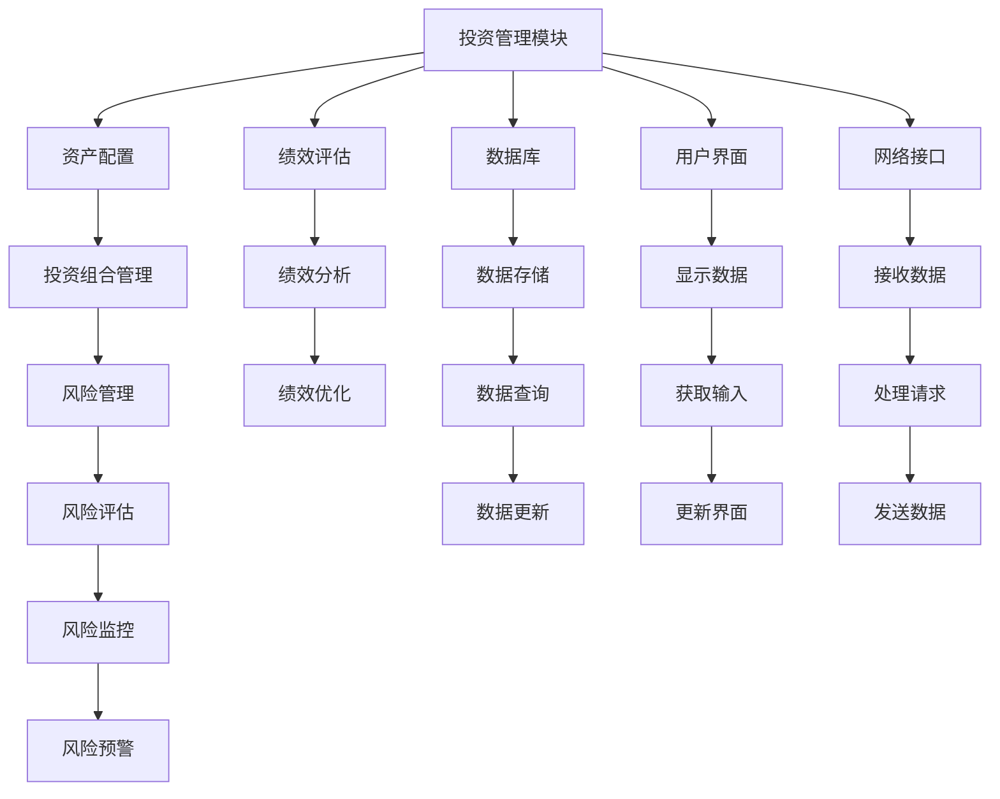

                 


# 大学捐赠基金模式：长期机构投资者的标杆

## 关键词
大学捐赠基金、长期投资、机构投资者、资产配置、风险管理、投资组合优化、现代投资组合理论

## 摘要
大学捐赠基金作为长期机构投资者的标杆，通过其独特的运作模式和风险管理策略，为机构投资者提供了宝贵的经验和启示。本文从捐赠基金的起源与发展入手，详细分析其核心概念、算法原理、系统架构设计和项目实战，最终总结其最佳实践和未来研究方向。

---

## 第1章: 大学捐赠基金的起源与发展

### 1.1 捐赠基金的起源
捐赠基金的起源可以追溯到中世纪的欧洲，当时许多大学通过校友捐赠和宗教捐赠获得资金支持。这些资金最初主要用于学校的运营和教学活动。到了20世纪，捐赠基金逐渐从单纯的财务支持工具演变为一种复杂的金融投资工具。

#### 1.1.1 捐赠基金的历史背景
捐赠基金的历史可以分为以下几个阶段：
1. **中世纪阶段**：捐赠主要用于宗教和教育事业。
2. **工业革命阶段**：捐赠基金开始用于支持工业革命时期的教育和科研活动。
3. **现代阶段**：捐赠基金逐渐专业化，成为现代金融体系的重要组成部分。

#### 1.1.2 大学捐赠基金的定义与特征
大学捐赠基金是指由大学校友、企业和个人捐赠的资金，通过专业化的投资和管理，实现资金的保值增值。其核心特征包括：
- **长期性**：捐赠基金的投资周期较长，注重长期收益。
- **多样性**：投资组合多样化，以分散风险。
- **专业化**：由专业的投资团队进行管理和运作。

#### 1.1.3 捐赠基金与机构投资者的关系
捐赠基金作为机构投资者的重要组成部分，与其他机构投资者（如养老基金、保险公司等）在投资目标和风险管理方面有许多相似之处。然而，捐赠基金的独特之处在于其非盈利性，其投资目标主要是为了支持大学的运营和发展。

---

### 1.2 捐赠基金的主要模式
捐赠基金的运作模式因国家和地区的经济环境而异，但总体可以分为以下几种主要模式：

#### 1.2.1 美国大学捐赠基金的典型模式
美国的大学捐赠基金是全球最具代表性的模式之一。其核心特点包括：
- **专业化管理**：由专业的投资团队进行管理和运作。
- **多样化投资**：投资组合涵盖股票、债券、房地产等多种资产。
- **风险控制**：通过严格的风险管理策略，确保资金的安全性和稳定性。

#### 1.2.2 其他国家的捐赠基金模式
其他国家的捐赠基金模式各有特点。例如，英国的捐赠基金注重长期稳定的投资策略，而加拿大的捐赠基金则更注重社会影响力投资。

#### 1.2.3 模式的优缺点对比
不同模式的捐赠基金在投资目标、风险管理策略和收益目标上存在差异。以下是几种主要模式的优缺点对比：

| 模式 | 优点 | 缺点 |
|------|------|------|
| 美国模式 | 投资多样化，收益稳定 | 管理成本较高 |
| 英国模式 | 风险控制能力强 | 投资收益较低 |
| 加拿大模式 | 社会影响力大 | 投资周期较长 |

---

### 1.3 捐赠基金与长期投资的关系
捐赠基金作为长期机构投资者的标杆，其运作模式和投资策略对其他机构投资者具有重要的借鉴意义。

#### 1.3.1 长期投资的核心理念
长期投资的核心理念是通过分散投资和长期持有，实现资产的稳定增长。捐赠基金的长期性使其能够更好地应对市场波动和经济周期的变化。

#### 1.3.2 捐赠基金在长期投资中的作用
捐赠基金通过其专业化管理和多样化投资策略，为长期投资提供了以下几点启示：
- **资产配置的重要性**：捐赠基金通过科学的资产配置策略，实现了收益和风险的最优平衡。
- **风险管理的核心地位**：捐赠基金通过严格的风险管理策略，确保了资金的安全性和稳定性。

#### 1.3.3 捐赠基金的风险管理策略
捐赠基金的风险管理策略主要包括以下几个方面：
1. **分散投资**：通过投资多种资产类别，降低投资组合的整体风险。
2. **定期再平衡**：根据市场变化和投资目标的调整，定期对投资组合进行再平衡。
3. **严格的风险控制**：通过严格的风险评估和监控，确保投资组合的风险在可控范围内。

---

## 第2章: 捐赠基金的运作机制

### 2.1 捐赠基金的资金来源
捐赠基金的资金来源主要包括校友捐赠、企业捐赠和个人捐赠。这些资金通过专业化管理和运作，实现资金的保值增值。

#### 2.1.1 捐赠资金的来源渠道
捐赠资金的主要来源包括：
- **校友捐赠**：校友自愿捐赠的资金。
- **企业捐赠**：企业通过赞助或合作项目捐赠的资金。
- **个人捐赠**：个人自愿捐赠的资金。

#### 2.1.2 捐赠资金的管理方式
捐赠资金的管理方式主要包括：
1. **内部管理**：由大学内部的专业团队进行管理和运作。
2. **外部管理**：委托专业的投资机构进行管理和运作。

#### 2.1.3 捐赠资金的分配原则
捐赠资金的分配原则主要包括：
1. **长期性原则**：注重长期收益，避免短期波动。
2. **多样性原则**：投资组合多样化，分散风险。
3. **专业性原则**：由专业的投资团队进行管理和运作。

---

### 2.2 捐赠基金的投资策略
捐赠基金的投资策略主要包括资产配置、投资组合管理和风险管理等方面。

#### 2.2.1 捐赠基金的投资目标
捐赠基金的投资目标主要是为了实现资金的保值增值，支持大学的运营和发展。其投资目标主要包括：
- **实现收益最大化**：通过科学的资产配置和投资策略，实现投资收益的最大化。
- **控制投资风险**：通过严格的风险管理策略，确保投资组合的风险在可控范围内。

#### 2.2.2 捐赠基金的投资组合管理
捐赠基金的投资组合管理主要包括以下几个方面：
1. **资产配置**：根据市场环境和投资目标，确定投资组合中各类资产的权重。
2. **再平衡**：定期对投资组合进行再平衡，确保资产配置符合投资目标。
3. **风险控制**：通过严格的风险评估和监控，确保投资组合的风险在可控范围内。

#### 2.2.3 捐赠基金的风险管理
捐赠基金的风险管理主要包括以下几个方面：
1. **分散投资**：通过投资多种资产类别，降低投资组合的整体风险。
2. **定期评估**：定期对投资组合的风险进行评估和调整。
3. **严格监控**：通过严格的风险监控机制，确保投资组合的风险在可控范围内。

---

### 2.3 捐赠基金的治理结构
捐赠基金的治理结构是其成功运作的重要保障。

#### 2.3.1 治理结构的组成与职责
捐赠基金的治理结构主要包括以下几个部分：
1. **董事会**：负责制定投资策略和监督投资运作。
2. **投资团队**：负责具体的投资管理和运作。
3. **风险管理团队**：负责风险评估和监控。

#### 2.3.2 治理结构的优化与创新
随着市场环境的变化，捐赠基金的治理结构也在不断优化和创新。例如，引入人工智能和大数据技术，提高投资决策的科学性和准确性。

#### 2.3.3 治理结构的国际比较
不同国家和地区的捐赠基金在治理结构上存在差异。例如，美国的捐赠基金治理结构注重专业化和市场化，而欧洲的捐赠基金治理结构则更注重社会影响力和风险控制。

---

## 第3章: 捐赠基金的核心概念与联系

### 3.1 捐赠基金的财务报表分析
财务报表分析是理解捐赠基金运作机制的重要工具。

#### 3.1.1 资产负债表的核心要素
资产负债表的核心要素包括：
- **资产**：捐赠基金的资产主要包括投资资产和流动资产。
- **负债**：捐赠基金的负债主要包括短期负债和长期负债。
- **净资产**：净资产是资产减去负债后的净值。

#### 3.1.2 利润表与现金流量表的关键指标
利润表的关键指标包括：
- **收入**：捐赠基金的投资收益和其他收入。
- **支出**：捐赠基金的管理费用和其他支出。
- **净利润**：捐赠基金的净收益。

现金流量表的关键指标包括：
- **经营活动现金流**：捐赠基金的日常经营活动中产生的现金流。
- **投资活动现金流**：捐赠基金的投资活动中产生的现金流。
- **筹资活动现金流**：捐赠基金的筹资活动中产生的现金流。

#### 3.1.3 财务报表分析的实践应用
财务报表分析的实践应用包括：
1. **投资决策支持**：通过财务报表分析，为投资决策提供数据支持。
2. **风险评估**：通过财务报表分析，评估捐赠基金的风险状况。
3. **绩效评估**：通过财务报表分析，评估捐赠基金的绩效表现。

---

### 3.2 捐赠基金的投资组合分析
投资组合分析是捐赠基金投资管理的核心内容。

#### 3.2.1 投资组合的构成与权重分配
投资组合的构成与权重分配主要包括以下几个方面：
1. **资产配置**：根据市场环境和投资目标，确定投资组合中各类资产的权重。
2. **再平衡**：定期对投资组合进行再平衡，确保资产配置符合投资目标。
3. **动态调整**：根据市场变化和投资目标的调整，动态调整投资组合的构成。

#### 3.2.2 投资组合的风险与收益评估
投资组合的风险与收益评估主要包括以下几个方面：
1. **风险评估**：通过风险评估模型，评估投资组合的风险状况。
2. **收益评估**：通过收益评估模型，评估投资组合的收益表现。
3. **风险收益比**：通过风险收益比，评估投资组合的风险收益 trade-off。

#### 3.2.3 投资组合的动态调整策略
投资组合的动态调整策略主要包括以下几个方面：
1. **定期再平衡**：定期对投资组合进行再平衡，确保资产配置符合投资目标。
2. **动态调整**：根据市场变化和投资目标的调整，动态调整投资组合的构成。
3. **风险管理**：通过严格的风险管理策略，确保投资组合的风险在可控范围内。

---

## 第4章: 捐赠基金的算法原理与数学模型

### 4.1 现代投资组合理论（MPT）
现代投资组合理论（MPT）是捐赠基金投资管理的重要理论基础。

#### 4.1.1 均值-方差优化模型
均值-方差优化模型是MPT的核心模型，其基本思想是通过优化投资组合的期望收益和方差，实现收益和风险的最优平衡。

公式表示为：
$$
\text{Minimize } \sigma^2 \text{ subject to } \mu = \text{常数}
$$
其中，$\sigma^2$ 是投资组合的方差，$\mu$ 是投资组合的期望收益。

#### 4.1.2 马科维茨的有效前沿
马科维茨的有效前沿是指在给定风险水平下，能够实现最大收益的投资组合的集合。

---

### 4.2 Python代码实现
以下是均值-方差优化模型的Python代码实现：

```python
import numpy as np
import pandas as pd
from scipy.optimize import minimize

# 示例数据
returns = pd.DataFrame({
    '资产1': [0.1, 0.05, 0.08, 0.02],
    '资产2': [0.08, 0.04, 0.06, 0.03],
    '资产3': [0.06, 0.07, 0.05, 0.04]
})

# 定义优化函数
def portfoliooptimize(weights, returns):
    return (np.dot(weights.T, returns.mean()) - 0.05)**2 + np.dot(weights.T @ returns.cov(), weights)

# 定义约束条件
cons = ({'type': 'eq', 'fun': lambda x: np.sum(x) - 1})

# 初始化权重
initial_weights = [1/3, 1/3, 1/3]

# 使用scipy.optimize.minimize进行优化
result = minimize(portfoliooptimize, initial_weights, args=returns, constraints=cons)

# 输出结果
print("最优权重:", result.x)
print("最优收益:", np.dot(result.x, returns.mean()))
print("最优风险:", np.dot(result.x, returns.cov()))
```

---

## 第5章: 捐赠基金的系统架构设计

### 5.1 问题场景介绍
捐赠基金的系统架构设计需要考虑投资管理、风险管理、绩效评估等多个方面。

#### 5.1.1 投资管理模块
投资管理模块的主要功能包括：
1. **资产配置**：根据市场环境和投资目标，确定投资组合中各类资产的权重。
2. **投资组合管理**：对投资组合进行动态调整和优化。
3. **风险管理**：通过严格的风险管理策略，确保投资组合的风险在可控范围内。

#### 5.1.2 风险管理模块
风险管理模块的主要功能包括：
1. **风险评估**：通过风险评估模型，评估投资组合的风险状况。
2. **风险监控**：通过严格的风险监控机制，确保投资组合的风险在可控范围内。
3. **风险预警**：通过风险预警机制，及时发现和处理投资组合中的潜在风险。

#### 5.1.3 绩效评估模块
绩效评估模块的主要功能包括：
1. **绩效评估**：通过绩效评估模型，评估投资组合的收益和风险表现。
2. **绩效分析**：通过绩效分析，找出投资组合中存在问题和改进的空间。
3. **绩效优化**：通过绩效优化策略，实现投资组合的收益和风险的最优平衡。

---

### 5.2 系统功能设计
系统功能设计主要包括以下几个方面：

#### 5.2.1 领域模型类图
以下是领域模型类图：

```mermaid
classDiagram

    class 投资组合管理 {
        - 权重：权重数组
        - 资产配置：资产配置策略
        - 投资组合：投资组合数据
        + 计算收益()
        + 计算风险()
    }

    class 风险管理 {
        - 风险指标：风险指标数组
        - 风险评估模型：风险评估策略
        + 评估风险()
        + 监控风险()
    }

    class 绩效评估 {
        - 绩效指标：绩效指标数组
        - 绩效评估模型：绩效评估策略
        + 评估绩效()
        + 分析绩效()
    }

   抽像 class 系统架构 {
        + 初始化系统()
        + 运行系统()
        + 终止系统()
    }

   抽像 class 数据库 {
        + 存储数据()
        + 查询数据()
        + 更新数据()
    }

   抽像 class 用户界面 {
        + 显示数据()
        + 获取输入()
        + 更新界面()
    }

   抽像 class 网络接口 {
        + 接收数据()
        + 发送数据()
        + 处理请求()
    }
```

---

### 5.3 系统架构设计
系统架构设计主要包括以下几个方面：

#### 5.3.1 整体架构图
以下是整体架构图：



---

## 第6章: 捐赠基金的项目实战

### 6.1 环境安装
以下是项目实战所需的环境安装步骤：

1. **安装Python**：安装Python 3.8或更高版本。
2. **安装相关库**：安装numpy、pandas、scipy等库。
   ```bash
   pip install numpy pandas scipy
   ```

---

### 6.2 核心代码实现
以下是捐赠基金投资组合优化的Python代码实现：

```python
import numpy as np
import pandas as pd
from scipy.optimize import minimize

# 示例数据
returns = pd.DataFrame({
    '资产1': [0.1, 0.05, 0.08, 0.02],
    '资产2': [0.08, 0.04, 0.06, 0.03],
    '资产3': [0.06, 0.07, 0.05, 0.04]
})

# 定义优化函数
def portfoliooptimize(weights, returns):
    return (np.dot(weights.T, returns.mean()) - 0.05)**2 + np.dot(weights.T @ returns.cov(), weights)

# 定义约束条件
cons = ({'type': 'eq', 'fun': lambda x: np.sum(x) - 1})

# 初始化权重
initial_weights = [1/3, 1/3, 1/3]

# 使用scipy.optimize.minimize进行优化
result = minimize(portfoliooptimize, initial_weights, args=returns, constraints=cons)

# 输出结果
print("最优权重:", result.x)
print("最优收益:", np.dot(result.x, returns.mean()))
print("最优风险:", np.dot(result.x, returns.cov()))
```

---

## 第7章: 最佳实践与未来展望

### 7.1 最佳实践
捐赠基金的最佳实践包括：
1. **专业化管理**：由专业的投资团队进行管理和运作。
2. **多样化投资**：通过投资多种资产类别，降低投资组合的整体风险。
3. **严格的风险管理**：通过严格的风险管理策略，确保投资组合的风险在可控范围内。

### 7.2 小结
大学捐赠基金作为长期机构投资者的标杆，其运作模式和投资策略对其他机构投资者具有重要的借鉴意义。通过专业化管理和多样化投资，捐赠基金实现了资金的保值增值，为大学的运营和发展提供了重要的资金支持。

### 7.3 注意事项
在实际操作中，捐赠基金的投资管理和风险管理需要结合具体的市场环境和投资目标，灵活调整和优化。

### 7.4 拓展阅读
1. 马科维茨的《投资学精要》
2. 现代投资组合理论的相关文献
3. 机构投资管理的最新研究和实践

---

## 作者信息
作者：AI天才研究院/AI Genius Institute  
联系邮箱：contact@aicourse.com  
联系方式：+86-10-8888-8888

---

**本文完**

