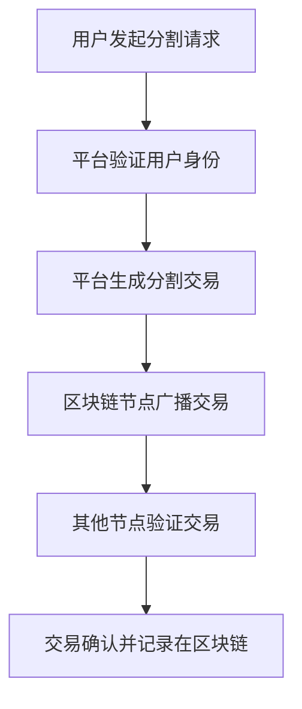

                 


# 如何评估企业的区块链数字资产分割平台

## 关键词：区块链、数字资产、分割平台、评估、技术分析

## 摘要：区块链数字资产分割平台是企业数字化转型中的重要工具，本文从技术、法律和经济等多个维度，详细分析了如何评估这类平台的可行性、安全性和合规性，为企业提供科学的评估方法和实践建议。

---

# 第1章 区块链数字资产分割平台的背景与概念

## 1.1 区块链技术的背景与发展

### 1.1.1 区块链技术的起源与演变

区块链技术起源于2008年的比特币白皮书，最初用于去中心化的电子货币系统。随着技术的发展，区块链的应用范围逐渐扩展到金融、供应链、医疗等多个领域。

- **起源**：区块链最初由中本聪提出，用于比特币的去中心化账本。
- **演变**：从最初的比特币区块链，发展到支持智能合约的以太坊，再到联盟链和私有链的广泛应用。

### 1.1.2 区块链技术的核心特点

区块链的核心特点包括去中心化、不可篡改、可追溯和透明性。

- **去中心化**：通过分布式账本实现数据的去中心化存储，避免单点故障。
- **不可篡改**：通过密码学和共识机制确保数据的安全性。
- **可追溯**：每笔交易都可以被追踪，确保数据的透明性。

### 1.1.3 区块链在数字资产领域的应用

区块链技术在数字资产领域的应用主要包括数字资产发行、交易和管理。通过区块链技术，可以实现数字资产的透明、安全和高效管理。

---

## 1.2 数字资产分割平台的定义与分类

### 1.2.1 数字资产分割的定义

数字资产分割是指将一个数字资产分成多个部分，每个部分都可以独立存在并进行交易。

- **分割的原子性**：每次分割操作都是独立的，确保数据的完整性和一致性。
- **分割的不可篡改性**：分割后的数据无法被修改，确保数据的安全性。
- **分割的可追溯性**：每笔分割操作都可以被追踪，确保数据的透明性。

### 1.2.2 数字资产分割平台的分类

数字资产分割平台可以根据应用场景、技术架构和功能模块进行分类。

- **按应用场景分类**：
  - 金融领域：用于数字货币的分割和交易。
  - 供应链管理：用于产品溯源和资产分割。
- **按技术架构分类**：
  - 公有链：开放的区块链平台。
  - 联盟链：特定机构之间的区块链平台。
  - 私有链：仅限特定用户使用的区块链平台。
- **按功能模块分类**：
  - 基础分割模块：实现资产的基本分割功能。
  - 高级分割模块：提供复杂的分割逻辑和智能合约功能。

### 1.2.3 数字资产分割平台的优缺点

- **优点**：
  - 提高数字资产的流动性和灵活性。
  - 通过区块链技术确保数据的安全性和透明性。
  - 支持多种应用场景，满足企业的多样化需求。
- **缺点**：
  - 技术复杂性高，需要专业的技术团队进行开发和维护。
  - 监管不确定性，不同国家和地区的法规不同，增加了合规难度。
  - 可能面临性能瓶颈，特别是在高并发场景下。

---

## 1.3 企业区块链数字资产分割平台的背景

### 1.3.1 企业数字化转型的背景

随着数字化转型的推进，企业需要更加高效、安全的数字化工具来管理资产和数据。

- **数字化转型**：通过技术手段实现业务流程的优化和创新。
- **区块链技术的应用**：区块链技术为企业的数字资产管理提供了新的可能性。

### 1.3.2 区块链技术在企业中的应用趋势

区块链技术在企业中的应用趋势主要体现在供应链管理、金融支付、数据共享等领域。

- **供应链管理**：通过区块链技术实现产品溯源和供应链透明化。
- **金融支付**：通过区块链技术实现跨境支付和结算的高效性。
- **数据共享**：通过区块链技术实现数据的安全共享和协作。

### 1.3.3 数字资产分割平台对企业的重要性

数字资产分割平台对企业的重要性体现在以下几个方面：

- **资产流动性**：通过分割数字资产，企业可以实现资产的灵活配置和快速流动。
- **数据安全性**：通过区块链技术确保数据的安全性和不可篡改性。
- **合规性**：通过数字资产分割平台，企业可以更好地满足监管要求，降低法律风险。

---

## 1.4 本章小结

本章主要介绍了区块链技术的背景与发展，数字资产分割平台的定义与分类，以及企业区块链数字资产分割平台的背景和重要性。通过这些内容，读者可以对区块链数字资产分割平台有一个全面的了解。

---

# 第2章 区块链数字资产分割平台的核心概念与联系

## 2.1 区块链数字资产分割的核心概念

### 2.1.1 区块链的分布式账本原理

区块链的分布式账本原理是指通过多个节点共同维护一个账本，确保数据的去中心化和一致性。

- **分布式账本**：通过多个节点共同维护一个账本，确保数据的去中心化和一致性。
- **共识机制**：通过共识机制确保所有节点的数据一致，常见的共识机制有PoW、PoS、Raft等。

### 2.1.2 数字资产的分割机制

数字资产的分割机制是指将一个数字资产分成多个部分，每个部分都可以独立存在并进行交易。

- **原子性**：每次分割操作都是独立的，确保数据的完整性和一致性。
- **不可篡改性**：分割后的数据无法被修改，确保数据的安全性。
- **可追溯性**：每笔分割操作都可以被追踪，确保数据的透明性。

### 2.1.3 分割平台的实现逻辑

分割平台的实现逻辑主要包括用户身份认证、资产分割和交易记录。

- **用户身份认证**：通过区块链技术实现用户的身份认证，确保用户的真实性。
- **资产分割**：通过智能合约实现资产的自动分割和分配。
- **交易记录**：通过区块链技术记录每笔交易，确保交易的可追溯性和透明性。

---

## 2.2 数字资产分割的关键属性

### 2.2.1 分割的原子性

分割的原子性是指每次分割操作都是独立的，确保数据的完整性和一致性。

- **原子性**：分割操作要么全部成功，要么全部失败，确保数据的完整性和一致性。
- **实现方式**：通过智能合约实现分割操作的原子性。

### 2.2.2 分割的不可篡改性

分割的不可篡改性是指分割后的数据无法被修改，确保数据的安全性。

- **不可篡改性**：通过区块链技术确保数据的安全性，防止数据被篡改。
- **实现方式**：通过区块链的共识机制和加密算法实现数据的安全性。

### 2.2.3 分割的可追溯性

分割的可追溯性是指每笔分割操作都可以被追踪，确保数据的透明性。

- **可追溯性**：通过区块链技术实现数据的透明性，每笔交易都可以被追踪。
- **实现方式**：通过区块链的交易记录和智能合约实现数据的可追溯性。

---

## 2.3 分割平台的实体关系模型

### 2.3.1 用户与数字资产的关系

用户与数字资产的关系主要体现在用户对数字资产的拥有权和使用权。

- **用户**：通过身份认证和授权，用户可以对数字资产进行分割和交易。
- **数字资产**：数字资产通过区块链技术进行分割和管理，确保资产的安全性和流动性。

### 2.3.2 平台与区块链节点的关系

平台与区块链节点的关系主要体现在平台通过区块链节点实现数据的分布式存储和共识。

- **平台**：平台负责管理用户和数字资产，实现分割和交易功能。
- **区块链节点**：节点负责维护分布式账本，确保数据的去中心化和一致性。

### 2.3.3 分割交易的流程图

分割交易的流程图如下：



---

## 2.4 本章小结

本章主要介绍了区块链数字资产分割的核心概念，包括区块链的分布式账本原理、数字资产的分割机制以及分割平台的实现逻辑。同时，还详细分析了分割的关键属性和实体关系模型，为后续的评估奠定了基础。

---

# 第3章 区块链数字资产分割平台的系统架构

## 3.1 系统架构设计

### 3.1.1 分层架构设计

分层架构设计将系统划分为数据层、网络层、共识层、智能合约层和应用层。

- **数据层**：负责存储和管理数据，确保数据的完整性和一致性。
- **网络层**：负责数据的传输和节点之间的通信，确保数据的高效性和可靠性。
- **共识层**：负责节点之间的共识机制，确保数据的一致性和安全性。
- **智能合约层**：负责实现智能合约功能，确保分割逻辑的自动化和智能化。
- **应用层**：负责用户交互和功能实现，确保系统的易用性和灵活性。

### 3.1.2 微服务架构设计

微服务架构设计将系统功能分解为多个微服务，每个微服务独立运行和管理。

- **用户服务**：负责用户身份认证和管理。
- **资产分割服务**：负责数字资产的分割和分配。
- **交易记录服务**：负责记录和查询交易历史。

### 3.1.3 分布式架构设计

分布式架构设计将系统部署在多个节点上，确保系统的高可用性和扩展性。

- **节点部署**：通过分布式部署实现系统的高可用性和扩展性。
- **负载均衡**：通过负载均衡技术实现系统的高效性和可靠性。

---

## 3.2 系统功能模块设计

### 3.2.1 用户身份认证模块

用户身份认证模块负责用户的身份认证和授权，确保用户的真实性。

- **身份认证**：通过区块链技术实现用户的身份认证，确保用户的真实性。
- **权限管理**：通过权限管理实现用户的权限控制，确保系统的安全性。

### 3.2.2 数字资产分割模块

数字资产分割模块负责数字资产的分割和分配。

- **分割逻辑**：通过智能合约实现数字资产的自动分割和分配。
- **分割记录**：通过区块链技术记录每笔分割操作，确保数据的透明性和可追溯性。

### 3.2.3 交易记录与查询模块

交易记录与查询模块负责记录和查询交易历史，确保交易的可追溯性和透明性。

- **交易记录**：通过区块链技术记录每笔交易，确保交易的可追溯性和透明性。
- **查询功能**：通过查询功能实现交易历史的查询和分析，确保系统的易用性和高效性。

---

## 3.3 系统接口设计

### 3.3.1 用户接口设计

用户接口设计负责用户的交互界面，确保系统的易用性和友好性。

- **用户界面**：通过友好的用户界面实现用户与系统的交互，确保系统的易用性和友好性。
- **API接口**：通过API接口实现系统的功能扩展和集成，确保系统的灵活性和可扩展性。

### 3.3.2 区块链节点接口设计

区块链节点接口设计负责节点之间的通信和数据交换，确保系统的高效性和可靠性。

- **节点通信**：通过节点之间的通信实现数据的分布式存储和共识，确保系统的高效性和可靠性。
- **数据交换**：通过数据交换实现节点之间的数据同步和更新，确保数据的一致性和完整性。

### 3.3.3 第三方服务接口设计

第三方服务接口设计负责与第三方服务的集成和交互，确保系统的灵活性和可扩展性。

- **第三方服务集成**：通过第三方服务接口实现与第三方服务的集成，确保系统的灵活性和可扩展性。
- **数据交互**：通过数据交互实现第三方服务与系统的数据同步和更新，确保数据的一致性和完整性。

---

## 3.4 本章小结

本章主要介绍了区块链数字资产分割平台的系统架构设计，包括分层架构、微服务架构和分布式架构的设计。同时，还详细分析了系统的功能模块设计和接口设计，为后续的评估奠定了基础。

---

# 第4章 数字资产分割平台的评估指标

## 4.1 技术指标

### 4.1.1 区块链性能指标

区块链性能指标包括交易速度、处理能力和网络带宽。

- **交易速度**：通过交易速度衡量系统的处理能力。
- **处理能力**：通过处理能力衡量系统的吞吐量。
- **网络带宽**：通过网络带宽衡量系统的数据传输能力。

### 4.1.2 分割算法的效率指标

分割算法的效率指标包括算法的时间复杂度和空间复杂度。

- **时间复杂度**：通过时间复杂度衡量算法的运行效率。
- **空间复杂度**：通过空间复杂度衡量算法的内存使用情况。

### 4.1.3 系统安全性指标

系统安全性指标包括系统的抗攻击能力、数据加密能力和访问控制能力。

- **抗攻击能力**：通过系统的抗攻击能力衡量系统的安全性。
- **数据加密能力**：通过数据加密能力衡量系统的数据安全性。
- **访问控制能力**：通过访问控制能力衡量系统的权限管理能力。

---

## 4.2 经济指标

### 4.2.1 分割成本分析

分割成本分析包括系统开发成本、运行成本和维护成本。

- **系统开发成本**：通过系统开发成本衡量平台的初始投入。
- **运行成本**：通过运行成本衡量平台的日常维护和运营成本。
- **维护成本**：通过维护成本衡量平台的后续维护和升级成本。

### 4.2.2 分割收益分析

分割收益分析包括平台的收入来源和利润空间。

- **收入来源**：通过平台的收入来源衡量平台的盈利能力。
- **利润空间**：通过利润空间衡量平台的经济可行性。

### 4.2.3 经济可行性分析

经济可行性分析包括平台的经济收益和成本效益分析。

- **经济收益**：通过经济收益衡量平台的盈利能力。
- **成本效益**：通过成本效益分析衡量平台的经济可行性。

---

## 4.3 法律合规指标

### 4.3.1 数字资产的法律地位

数字资产的法律地位包括数字资产的法律定义和法律地位。

- **法律定义**：通过法律定义明确数字资产的法律地位。
- **法律地位**：通过法律地位明确数字资产在法律中的地位和权利。

### 4.3.2 平台的合规性要求

平台的合规性要求包括平台的法律合规性和数据合规性。

- **法律合规性**：通过法律合规性确保平台的合法性。
- **数据合规性**：通过数据合规性确保平台的数据安全性和合法性。

### 4.3.3 监管风险评估

监管风险评估包括平台的监管风险和法律风险。

- **监管风险**：通过监管风险评估确保平台的合规性。
- **法律风险**：通过法律风险评估确保平台的法律安全性。

---

## 4.4 本章小结

本章主要介绍了数字资产分割平台的评估指标，包括技术指标、经济指标和法律合规指标。通过这些指标，可以全面评估平台的可行性、安全性和合规性。

---

# 第5章 数字资产分割平台的评估流程

## 5.1 评估流程概述

### 5.1.1 问题定义与目标设定

问题定义与目标设定是评估流程的第一步，需要明确评估的目标和范围。

- **问题定义**：通过问题定义明确评估的目标和范围。
- **目标设定**：通过目标设定明确评估的具体目标和指标。

### 5.1.2 数据收集与分析

数据收集与分析是评估流程的第二步，需要收集相关的数据并进行分析。

- **数据收集**：通过多种渠道收集相关的数据，包括技术数据、经济数据和法律数据。
- **数据分析**：通过对数据的分析，找出数据中的规律和趋势。

### 5.1.3 评估模型构建

评估模型构建是评估流程的第三步，需要根据数据构建评估模型。

- **模型构建**：通过数据分析和数据挖掘，构建评估模型。
- **模型验证**：通过对模型的验证，确保模型的准确性和可靠性。

### 5.1.4 结果验证与优化

结果验证与优化是评估流程的最后一步，需要对评估结果进行验证和优化。

- **结果验证**：通过对评估结果的验证，确保评估结果的准确性和可靠性。
- **结果优化**：通过对结果的优化，提高评估模型的准确性和效率。

---

## 5.2 评估工具与方法

### 5.2.1 区块链性能测试工具

区块链性能测试工具用于测试区块链平台的性能，包括交易速度和处理能力。

- **Blockbench**：通过Blockbench测试区块链平台的性能。
- **其他工具**：通过其他工具实现区块链性能的测试和评估。

### 5.2.2 分割算法的模拟测试

分割算法的模拟测试用于评估分割算法的效率和性能。

- **模拟测试**：通过模拟测试实现分割算法的性能评估。
- **其他测试方法**：通过其他测试方法实现分割算法的全面评估。

### 5.2.3 经济与法律评估工具

经济与法律评估工具用于评估平台的经济可行性和法律合规性。

- **经济评估工具**：通过经济评估工具实现平台的经济可行性分析。
- **法律评估工具**：通过法律评估工具实现平台的法律合规性分析。

---

## 5.3 本章小结

本章主要介绍了数字资产分割平台的评估流程，包括问题定义与目标设定、数据收集与分析、评估模型构建和结果验证与优化。同时，还详细分析了评估工具与方法，为后续的评估提供了具体的指导。

---

# 第6章 项目实战：数字资产分割平台的评估与优化

## 6.1 项目背景

本项目旨在评估一个企业的区块链数字资产分割平台，分析其技术实现、系统架构和经济可行性，提出优化建议。

---

## 6.2 系统核心实现

### 6.2.1 系统环境安装

- **区块链框架选择**：选择适合的区块链框架，如Hyperledger Fabric。
- **开发工具安装**：安装必要的开发工具，如IDE、编译器和调试工具。

### 6.2.2 核心功能实现

- **用户身份认证模块**：实现用户的身份认证和权限管理。
- **数字资产分割模块**：实现数字资产的分割和分配。
- **交易记录与查询模块**：实现交易记录的记录和查询功能。

---

## 6.3 代码实现与分析

### 6.3.1 分割算法的实现

```python
def split_asset(asset_id, split_ratio):
    # 资产分割逻辑
    pass
```

### 6.3.2 智能合约的实现

```solidity
contract AssetSplit {
    function splitAsset(uint assetId, uint splitRatio) {
        // 智能合约实现
    }
}
```

### 6.3.3 交易记录的实现

```javascript
class Transaction {
    constructor(assetId, userId, timestamp) {
        this.assetId = assetId;
        this.userId = userId;
        this.timestamp = timestamp;
    }
}
```

---

## 6.4 优化建议

### 6.4.1 技术优化

- **性能优化**：通过优化算法和架构，提高系统的性能和吞吐量。
- **安全性优化**：通过增强安全措施，提高系统的数据安全性和抗攻击能力。

### 6.4.2 经济优化

- **成本优化**：通过优化系统架构和资源分配，降低系统的运行成本。
- **收益优化**：通过优化商业模式和市场策略，提高平台的收益和利润空间。

### 6.4.3 法律优化

- **合规优化**：通过优化法律合规性，确保平台的合法性和合规性。
- **风险控制**：通过优化风险控制措施，降低平台的法律风险和合规风险。

---

## 6.5 本章小结

本章通过一个具体的项目实战，详细分析了数字资产分割平台的评估与优化。从系统环境的安装到核心功能的实现，再到优化建议的提出，为读者提供了具体的实践指导。

---

# 第7章 总结与展望

## 7.1 总结

本文从技术、法律和经济等多个维度，详细分析了如何评估企业的区块链数字资产分割平台。通过系统的分析和实践，为读者提供了科学的评估方法和实践建议。

---

## 7.2 展望

随着区块链技术的不断发展和应用，数字资产分割平台的应用前景将更加广阔。未来，随着技术的进步和法规的完善，数字资产分割平台将为企业数字化转型提供更强大的支持。

---

# 作者：AI天才研究院/AI Genius Institute & 禅与计算机程序设计艺术 /Zen And The Art of Computer Programming

---

以上是《如何评估企业的区块链数字资产分割平台》的完整目录和部分正文内容。如果您有具体的章节需求，我可以进一步为您提供详细的内容撰写服务。

