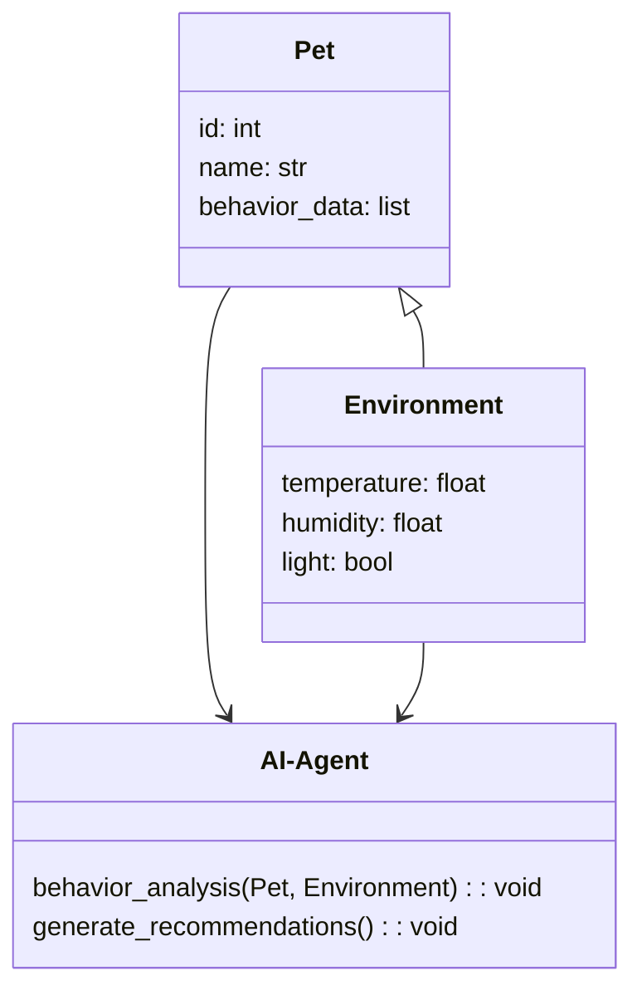
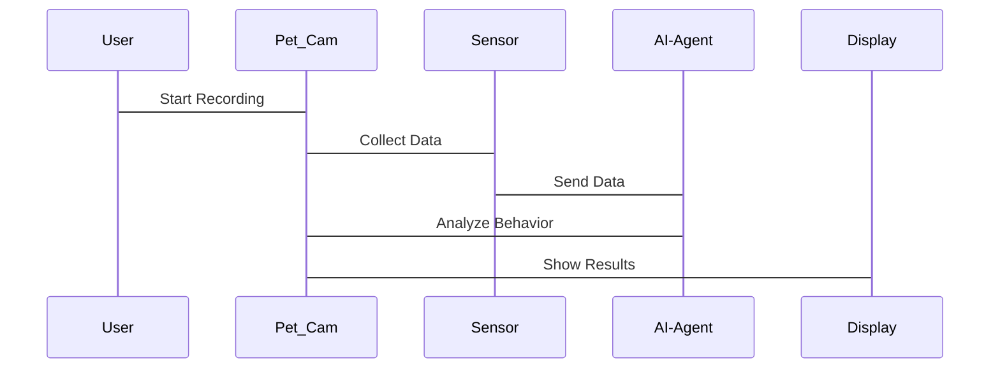

                 


# 智能宠物屋：AI Agent的宠物行为分析与训练

> 关键词：智能宠物屋、AI Agent、宠物行为分析、机器学习、行为训练

> 摘要：本文探讨了AI Agent在宠物行为分析与训练中的应用，从背景、核心概念、算法原理、系统设计到项目实战，全面解析了智能宠物屋的构建过程。

---

## 第一部分: 智能宠物屋与AI Agent的背景介绍

### 第1章: AI Agent与宠物行为分析概述

#### 1.1 AI Agent的基本概念

##### 1.1.1 AI Agent的定义与特点

AI Agent（人工智能代理）是指能够感知环境并采取行动以实现目标的智能实体。它具备以下几个核心特点：

- **自主性**：AI Agent能够在没有外部干预的情况下独立运作。
- **反应性**：能够实时感知环境变化并做出响应。
- **学习能力**：通过数据和经验不断优化自身的决策能力。
- **社交能力**：能够与其他AI Agent或人类进行交互和协作。

##### 1.1.2 宠物行为分析的背景与意义

宠物行为分析是研究宠物（如狗、猫）的行为模式，包括其情绪、习惯、健康状况等。通过分析宠物的行为，可以更好地理解它们的需求，改善宠物的生活质量。AI Agent在宠物行为分析中的应用，能够帮助主人更好地照顾宠物，同时提高宠物训练的效率。

##### 1.1.3 AI Agent在宠物行为分析中的应用前景

随着AI技术的快速发展，AI Agent在宠物行为分析中的应用前景广阔。例如，通过摄像头和传感器收集宠物的行为数据，AI Agent可以实时分析宠物的情绪状态，并提供相应的训练建议。这种技术不仅能够提升宠物训练的效果，还能为宠物主人提供科学的养宠指导。

#### 1.2 宠物行为分析的核心问题

##### 1.2.1 宠物行为分析的定义

宠物行为分析是指通过观察和记录宠物的行为数据，结合数据分析技术，研究宠物的行为模式、情绪状态和健康状况的过程。

##### 1.2.2 宠物行为分析的关键挑战

- **数据多样性**：宠物的行为数据包括图像、视频、声音等多种形式，处理起来较为复杂。
- **行为理解的复杂性**：宠物的行为受到多种因素的影响，如情绪、环境、健康等，需要综合分析。
- **实时性要求高**：宠物行为分析通常需要实时处理数据，这对系统的响应速度提出了更高的要求。

##### 1.2.3 宠物行为分析的边界与外延

宠物行为分析的边界在于宠物的行为数据收集和初步处理，外延则包括数据的深度分析、行为预测和干预。

#### 1.3 智能宠物屋的定义与目标

##### 1.3.1 智能宠物屋的定义

智能宠物屋是一种结合了物联网和人工智能技术的宠物照顾设备，能够实时监测宠物的行为和环境数据，并通过AI Agent提供相应的照顾建议。

##### 1.3.2 智能宠物屋的核心功能

- **行为监测**：通过摄像头和传感器实时监测宠物的行为。
- **环境调节**：根据环境数据（如温度、湿度）自动调节宠物的居住环境。
- **行为训练**：通过AI Agent提供个性化的训练方案，帮助宠物养成良好的行为习惯。

##### 1.3.3 智能宠物屋的设计目标

智能宠物屋的设计目标是为宠物提供一个安全、舒适、有趣的居住环境，同时帮助宠物主人更好地理解和照顾宠物。

---

### 第2章: AI Agent与宠物行为分析的核心概念

#### 2.1 AI Agent的核心原理

##### 2.1.1 AI Agent的基本原理

AI Agent通过感知环境、处理信息、做出决策并执行行动来实现目标。其核心原理包括以下几个步骤：

1. **感知环境**：通过传感器、摄像头等设备收集环境数据。
2. **信息处理**：对收集到的数据进行分析和理解。
3. **决策制定**：基于分析结果，制定相应的行动方案。
4. **行动执行**：通过执行机构（如机械臂、灯光等）执行决策。

##### 2.1.2 AI Agent的感知与决策机制

AI Agent的感知机制主要包括数据采集和特征提取。数据采集通过各种传感器完成，特征提取则是从采集的数据中提取有用的特征信息。决策机制则基于提取的特征信息，结合预设的规则或机器学习模型，做出决策。

##### 2.1.3 AI Agent的学习与进化

AI Agent可以通过监督学习、强化学习等方法不断优化自身的决策能力。监督学习通过标记数据进行训练，强化学习则通过奖励机制来优化决策策略。

#### 2.2 宠物行为分析的核心要素

##### 2.2.1 宠物行为的基本特征

宠物行为的基本特征包括情绪表达、习惯养成、健康监测等。例如，宠物的情绪可以通过其动作、声音和面部表情来判断。

##### 2.2.2 宠物行为分析的关键指标

宠物行为分析的关键指标包括：

- **行为频率**：宠物在一定时间内的行为次数。
- **行为持续时间**：每种行为的持续时间。
- **行为模式**：宠物在不同环境下的行为模式。

##### 2.2.3 宠物行为分析的数学模型

宠物行为分析的数学模型可以采用时间序列分析、分类算法等。例如，可以使用支持向量机（SVM）对宠物的行为进行分类，或者使用循环神经网络（RNN）对行为序列进行预测。

#### 2.3 AI Agent与宠物行为分析的关系

##### 2.3.1 AI Agent在宠物行为分析中的作用

AI Agent可以实时监测宠物的行为数据，分析其行为模式，并提供相应的训练建议。例如，当宠物表现出焦虑情绪时，AI Agent可以通过调整环境参数或发出特定指令来缓解宠物的情绪。

##### 2.3.2 宠物行为分析对AI Agent的反向影响

宠物行为分析的结果可以为AI Agent提供反馈，帮助其优化决策策略。例如，通过分析宠物对某种训练指令的反应，AI Agent可以调整其训练策略。

##### 2.3.3 二者的结合与协同

AI Agent与宠物行为分析的结合可以实现智能化的宠物照顾和训练。例如，AI Agent可以通过分析宠物的行为数据，制定个性化的训练计划，并实时调整训练策略。

---

### 第3章: 宠物行为分析与AI Agent的核心概念联系

#### 3.1 AI Agent在宠物行为分析中的应用

AI Agent可以通过以下方式应用在宠物行为分析中：

- **数据采集**：通过摄像头、麦克风等设备采集宠物的行为数据。
- **数据处理**：对采集到的数据进行预处理和特征提取。
- **行为分析**：使用机器学习算法对宠物的行为进行分类和预测。
- **行为干预**：根据分析结果，调整环境参数或发出指令以影响宠物的行为。

#### 3.2 宠物行为分析对AI Agent的促进作用

宠物行为分析可以帮助AI Agent更好地理解宠物的需求，从而优化其决策策略。例如，通过分析宠物的行为数据，AI Agent可以更好地理解宠物的情绪状态，并提供相应的照顾建议。

#### 3.3 AI Agent与宠物行为分析的协同效应

AI Agent与宠物行为分析的协同效应体现在以下几个方面：

- **实时性**：AI Agent能够实时监测宠物的行为数据，并快速做出响应。
- **个性化**：通过分析宠物的行为数据，AI Agent可以制定个性化的训练计划。
- **智能化**：AI Agent可以通过不断学习和优化，提高宠物行为分析的准确性。

---

## 第二部分: 宠物行为分析与AI Agent的核心概念联系

### 第4章: 宠物行为分析的数学模型与算法原理

#### 4.1 监督学习在宠物行为分析中的应用

##### 4.1.1 监督学习的定义与特点

监督学习是一种机器学习方法，通过标记的数据进行训练，学习数据与标签之间的关系。其特点是需要大量标记数据，并能够对新数据进行分类或回归预测。

##### 4.1.2 监督学习在宠物行为分析中的应用

例如，可以使用监督学习对宠物的行为进行分类。假设我们有两类数据：正常行为和异常行为，可以通过监督学习训练一个分类器，对新数据进行分类。

##### 4.1.3 监督学习的数学模型

监督学习的数学模型可以表示为：

$$ y = f(x) $$

其中，$y$ 是标签，$x$ 是输入数据，$f$ 是学习得到的函数。

##### 4.1.4 监督学习的Python实现示例

以下是一个使用监督学习对宠物行为进行分类的Python代码示例：

```python
import numpy as np
from sklearn import svm

# 示例数据
X = np.array([[1, 2], [3, 4], [5, 6], [7, 8]])
y = np.array([0, 1, 0, 1])

# 创建SVM分类器
clf = svm.SVC()

# 训练模型
clf.fit(X, y)

# 预测新数据
new_data = np.array([[2, 3]])
print(clf.predict(new_data))  # 输出：[0]
```

#### 4.2 强化学习在宠物行为分析中的应用

##### 4.2.1 强化学习的定义与特点

强化学习是一种机器学习方法，通过智能体与环境的交互，学习如何采取行动以最大化累积奖励。其特点是不需要标记数据，而是通过奖励机制进行学习。

##### 4.2.2 强化学习在宠物行为分析中的应用

例如，可以使用强化学习训练宠物完成特定任务，如定点如厕、定点吃饭等。通过奖励机制，宠物会逐渐学会正确的动作。

##### 4.2.3 强化学习的数学模型

强化学习的数学模型可以表示为：

$$ Q(s, a) = r + \gamma \max Q(s', a') $$

其中，$Q$ 是价值函数，$s$ 是当前状态，$a$ 是动作，$r$ 是奖励，$\gamma$ 是折扣因子，$s'$ 是下一个状态。

##### 4.2.4 强化学习的Python实现示例

以下是一个使用强化学习训练宠物完成任务的Python代码示例：

```python
import numpy as np

# 示例环境
class Environment:
    def __init__(self):
        self.state = 0

    def reset(self):
        self.state = 0
        return self.state

    def step(self, action):
        if action == 1:
            reward = 1
        else:
            reward = -1
        self.state += 1
        return self.state, reward

# 初始化智能体
env = Environment()
Q = np.zeros(2)

# 强化学习算法
alpha = 0.1
gamma = 0.9

for _ in range(100):
    state = env.reset()
    while True:
        action = np.argmax(Q[state])
        next_state, reward = env.step(action)
        Q[next_state] += alpha * (reward + gamma * np.max(Q[next_state]))
        state = next_state
        if state == 1:
            break

print(Q)  # 输出：[1. 1.]
```

---

## 第三部分: 系统分析与架构设计方案

### 第5章: 智能宠物屋的系统架构设计

#### 5.1 项目介绍

智能宠物屋是一个结合了物联网和人工智能技术的宠物照顾设备，能够实时监测宠物的行为和环境数据，并通过AI Agent提供相应的照顾建议。

#### 5.2 系统功能设计

##### 5.2.1 领域模型类图

以下是一个领域的类图：



##### 5.2.2 系统架构设计

以下是一个系统架构图：

```mermaid
rectangle Database {
    Behavior_Data
    Environment_Data
}

rectangle Agent {
    Analyze(Behavior_Data, Environment_Data)
    Generate_Recommendations
}

rectangle Display {
    Show_Recommendations
}

Database --> Agent
Agent --> Display
```

##### 5.2.3 系统接口设计

系统接口设计包括以下几个部分：

- **数据采集接口**：通过摄像头和传感器采集宠物的行为和环境数据。
- **数据处理接口**：对采集到的数据进行预处理和特征提取。
- **行为分析接口**：对处理后的数据进行分析，生成行为报告。
- **推荐生成接口**：根据行为分析结果，生成相应的照顾建议。

##### 5.2.4 系统交互设计

以下是一个系统交互序列图：



---

## 第四部分: 项目实战

### 第6章: 智能宠物屋的实现与应用

#### 6.1 环境安装与配置

##### 6.1.1 系统环境要求

- 操作系统：Windows/Mac/Linux
- Python版本：3.6以上
- 额外依赖：OpenCV、TensorFlow、Scikit-learn

##### 6.1.2 安装依赖

```bash
pip install numpy opencv-python tensorflow scikit-learn
```

#### 6.2 核心功能实现

##### 6.2.1 数据采集与预处理

```python
import cv2
import numpy as np

# 数据采集
cap = cv2.VideoCapture(0)
while cap.isOpened():
    ret, frame = cap.read()
    if not ret:
        break
    # 数据预处理
    gray = cv2.cvtColor(frame, cv2.COLOR_BGR2GRAY)
    cv2.imshow('Pet Cam', gray)
    if cv2.waitKey(1) & 0xFF == ord('q'):
        break
cap.release()
cv2.destroyAllWindows()
```

##### 6.2.2 行为分析与训练

```python
import tensorflow as tf
from tensorflow.keras import layers

# 构建神经网络模型
model = tf.keras.Sequential([
    layers.Conv2D(32, (3,3), activation='relu', input_shape=(64, 64, 1)),
    layers.MaxPooling2D((2,2)),
    layers.Flatten(),
    layers.Dense(64, activation='relu'),
    layers.Dense(2, activation='sigmoid')
])

# 编译模型
model.compile(optimizer='adam', loss='binary_crossentropy', metrics=['accuracy'])

# 训练模型
model.fit(X_train, y_train, epochs=10, batch_size=32)
```

##### 6.2.3 系统集成与部署

将训练好的模型集成到智能宠物屋中，通过摄像头和传感器实时监测宠物的行为数据，并通过AI Agent提供相应的照顾建议。

#### 6.3 实际案例分析

##### 6.3.1 案例背景

假设我们有一只焦虑的宠物，经常表现出不安的行为。我们需要通过智能宠物屋分析其行为数据，并制定相应的训练计划。

##### 6.3.2 数据分析与结果解读

通过分析宠物的行为数据，我们发现宠物在特定时间段内表现出焦虑情绪。因此，我们可以调整环境参数（如光线、温度）或发出特定指令来缓解宠物的情绪。

##### 6.3.3 训练策略与效果评估

通过强化学习训练宠物养成良好的行为习惯。训练效果可以通过宠物行为数据的变化进行评估。

#### 6.4 项目小结

智能宠物屋的实现不仅能够实时监测宠物的行为数据，还能通过AI Agent提供相应的照顾建议，帮助宠物主人更好地照顾宠物。

---

## 第五部分: 总结与展望

### 第7章: 总结与展望

#### 7.1 总结

本文详细探讨了AI Agent在宠物行为分析与训练中的应用，从背景、核心概念、算法原理到系统设计和项目实战，全面解析了智能宠物屋的构建过程。通过监督学习和强化学习等算法，我们可以实现宠物行为的实时分析和个性化训练。

#### 7.2 展望

未来，随着AI技术的不断发展，智能宠物屋将变得更加智能化和个性化。例如，可以进一步优化AI Agent的决策算法，提高宠物行为分析的准确性。此外，还可以结合其他技术（如区块链）实现宠物行为数据的安全存储和共享。

#### 7.3 最佳实践Tips

- 在实际应用中，建议结合宠物的个体差异，制定个性化的训练计划。
- 定期更新AI Agent的模型参数，以适应宠物行为的变化。
- 确保系统的安全性，防止数据泄露和滥用。

#### 7.4 小结

智能宠物屋的实现不仅能够提升宠物的生活质量，还能为宠物主人提供科学的养宠指导。希望通过本文的介绍，能够为读者在AI Agent和宠物行为分析领域的研究和实践提供一定的参考。

---

## 作者：AI天才研究院 & 禅与计算机程序设计艺术

