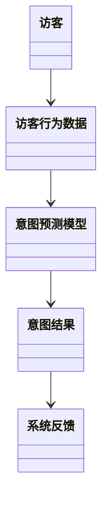

                 


```markdown
# 智能门禁：AI Agent的访客意图预测

> 关键词：智能门禁系统、访客意图预测、AI Agent、机器学习、数据挖掘、行为分析

> 摘要：本文深入探讨了智能门禁系统中AI Agent的访客意图预测技术。通过分析访客行为数据，结合机器学习算法，构建意图预测模型，实现对访客行为的智能化管理。文章详细介绍了意图预测的核心原理、算法实现、系统架构设计以及项目实战，帮助读者全面理解并掌握相关技术。

---

# 第一部分: 智能门禁与访客意图预测背景介绍

# 第1章: 智能门禁系统概述

## 1.1 智能门禁的发展历程
### 1.1.1 传统门禁系统的特点
- 传统门禁系统的功能：基本的身份验证（如刷卡、密码）
- 传统门禁系统的局限性：无法主动识别访客意图
- 传统门禁系统的应用场景：主要用于固定授权用户

### 1.1.2 智能化门禁系统的演变
- 智能化门禁系统的兴起：引入传感器、摄像头等设备
- 从被动验证到主动识别：AI Agent的应用
- 智能化门禁系统的应用场景：广泛应用于办公楼、酒店、社区等

### 1.1.3 当前智能门禁系统的现状
- 当前系统的功能：身份验证、行为分析、异常检测
- 当前系统的局限性：访客管理效率低、意图识别不准确
- 当前系统的未来趋势：智能化、个性化、主动服务

## 1.2 访客意图预测的必要性
### 1.2.1 访客管理的核心问题
- 访客管理的核心问题：如何高效管理访客，提升用户体验
- 访客管理的难点：访客行为的多样性和不确定性
- 访客管理的目标：实现访客行为的智能化预测与管理

### 1.2.2 意图预测在门禁系统中的价值
- 意图预测的价值：提高访客管理效率、优化用户体验
- 意图预测的应用场景：访客接待、异常行为识别
- 意图预测的经济效益：降低管理成本、提升服务品质

### 1.2.3 意图预测的边界与外延
- 意图预测的边界：仅预测访客的意图，不涉及具体操作
- 意图预测的外延：结合环境数据、历史数据等多维度信息
- 意图预测的局限性：数据不足或不准确可能导致预测误差

## 1.3 AI Agent在门禁系统中的角色
### 1.3.1 AI Agent的基本概念
- AI Agent的定义：智能代理，能够感知环境并采取行动
- AI Agent的功能：数据收集、分析、决策、执行
- AI Agent的类型：基于规则的代理、基于模型的代理

### 1.3.2 AI Agent在门禁系统中的功能
- 数据采集与处理：收集访客行为数据
- 意图识别与预测：分析数据，预测访客意图
- 交互与反馈：与访客和系统进行交互，提供反馈
- 自适应优化：根据反馈优化预测模型

### 1.3.3 AI Agent与传统门禁系统的区别
| 特性                | 传统门禁系统                  | AI Agent驱动的门禁系统               |
|---------------------|-------------------------------|--------------------------------------|
| 数据处理方式        | 被动响应                      | 主动采集与分析                      |
| 智能化程度          | 低                           | 高                                   |
| 用户体验            | 基本固定                     | 动态优化                             |

## 1.4 本章小结
- 本章介绍了智能门禁系统的发展历程，分析了访客意图预测的必要性，并阐述了AI Agent在门禁系统中的角色与功能。

---

# 第二部分: 访客意图预测的核心概念与联系

# 第2章: 访客意图预测的核心原理

## 2.1 访客意图预测的定义与特点
### 2.1.1 访客意图预测的定义
- 访客意图预测：基于访客行为数据，预测其下一步行为或需求的过程
- 预测范围：仅限于访客行为相关的意图，不涉及其他领域

### 2.1.2 访客意图预测的核心特点
- 数据驱动：基于行为数据进行预测
- 实时性：需要实时处理数据并快速反馈
- 智能性：结合AI技术实现自动化预测

### 2.1.3 访客意图预测与传统预测方法的区别
| 方法                | 传统预测方法                  | 意图预测方法                      |
|---------------------|-------------------------------|--------------------------------------|
| 数据来源            | 历史数据                      | 行为数据                          |
| 预测目标            | 未来趋势                     | 具体行为意图                      |
| 预测范围            | 宏观趋势                     | 微观行为                          |

## 2.2 AI Agent的意图预测模型
### 2.2.1 意图预测模型的输入与输出
- 输入：访客行为数据（如时间、位置、动作）
- 输出：意图类型（如“等待接待”、“寻找出口”）

### 2.2.2 意图预测模型的训练与优化
- 数据预处理：清洗、归一化
- 模型选择：基于规则的模型或机器学习模型
- 模型优化：调整参数、增加特征

### 2.2.3 意图预测模型的评估指标
- 准确率：预测结果与实际意图的匹配程度
- 召回率：预测结果中正确意图的比例
- F1分数：综合准确率和召回率的指标

## 2.3 访客行为数据与意图的关系
### 2.3.1 访客行为数据的类型
- 时间数据：访客到达时间、动作发生时间
- 空间数据：访客所在位置
- 动作数据：访客的具体行为（如站立、行走）

### 2.3.2 行为数据与意图预测的关联
- 站立时间长：可能需要接待
- 快速移动：可能需要引导
- 频繁回头：可能需要帮助

### 2.3.3 数据特征对意图预测的影响
- 时间特征：高峰时段可能需要更多接待
- 空间特征：访客所在区域影响意图
- 动作特征：特定动作组合可能对应特定意图

## 2.4 核心概念的ER实体关系图
```mermaid
er
    entity 访客 {
        key: 访客ID
        attribute: 姓名, 手机号, 到访时间
    }
    entity 意图 {
        key: 意图ID
        attribute: 意图类型, 意图描述
    }
    entity 行为数据 {
        key: 行为ID
        attribute: 行为时间, 行为类型
    }
    访客 --> 意图: 具有
    行为数据 --> 意图: 引发
```

## 2.5 数据流图
```mermaid
dataflow
    访客数据 --> 数据预处理模块
    行为数据 --> 数据预处理模块
    数据预处理模块 --> 意图预测模型
    意图预测模型 --> 意图结果
```

## 2.6 本章小结
- 本章详细介绍了访客意图预测的核心概念，分析了行为数据与意图之间的关系，并通过ER图和数据流图展示了系统的数据结构和流程。

---

# 第三部分: 访客意图预测算法原理

# 第3章: 基于规则的意图预测算法

## 3.1 基于规则的意图预测算法
### 3.1.1 算法原理
- 规则定义：根据行为数据制定特定规则
- 规则匹配：将行为数据与规则进行匹配，判断意图

### 3.1.2 算法步骤
1. 数据预处理：清洗、标准化
2. 规则制定：定义意图对应的规则
3. 规则匹配：将行为数据与规则进行匹配
4. 意图确定：根据匹配结果确定意图

### 3.1.3 算法的优缺点
- 优点：简单易懂，易于实现
- 缺点：规则固定，难以应对复杂情况

## 3.2 基于深度学习的意图预测算法
### 3.2.1 算法原理
- 神经网络结构：输入层、隐藏层、输出层
- 训练数据：访客行为数据
- 输出结果：意图概率

### 3.2.2 算法步骤
1. 数据预处理：清洗、归一化
2. 网络搭建：设计神经网络结构
3. 模型训练：使用训练数据训练模型
4. 意图预测：输入测试数据，输出意图概率

### 3.2.3 算法的优缺点
- 优点：能够处理复杂数据，预测准确率高
- 缺点：需要大量数据训练，计算资源消耗大

## 3.3 算法的数学模型与公式
### 3.3.1 基于规则的模型
$$
\text{意图} = \begin{cases}
\text{规则1} & \text{如果满足条件1} \\
\text{规则2} & \text{如果满足条件2} \\
\text{默认意图} & \text{否则}
\end{cases}
$$

### 3.3.2 基于深度学习的模型
$$
P(y|x) = \sigma(Wx + b)
$$
其中，$x$ 是输入数据，$y$ 是意图标签，$W$ 和 $b$ 是模型参数。

## 3.4 算法实现的代码示例
```python
# 基于规则的意图预测
def predict_intent(rules, behavior_data):
    for rule in rules:
        if rule['condition'](behavior_data):
            return rule['intent']
    return 'unknown'

# 基于深度学习的意图预测
import tensorflow as tf
model = tf.keras.Sequential([
    tf.keras.layers.Dense(64, activation='relu'),
    tf.keras.layers.Dense(1, activation='sigmoid')
])
model.compile(optimizer='adam', loss='binary_crossentropy')
predicted_intent = model.predict(behavior_data)
```

## 3.5 本章小结
- 本章介绍了两种意图预测算法，基于规则的算法和基于深度学习的算法，分析了它们的优缺点，并通过代码示例展示了实现过程。

---

# 第四部分: 访客意图预测系统分析与架构设计

# 第4章: 系统分析与架构设计

## 4.1 系统功能设计
### 4.1.1 领域模型


### 4.1.2 功能模块划分
- 数据采集模块：收集访客行为数据
- 数据处理模块：清洗、预处理数据
- 意图预测模块：预测访客意图
- 系统反馈模块：根据意图提供反馈

## 4.2 系统架构设计
### 4.2.1 系统架构图


### 4.2.2 关键模块实现
- 数据采集模块：使用传感器、摄像头等设备采集行为数据
- 数据处理模块：对数据进行清洗、归一化处理
- 意图预测模块：实现意图预测算法
- 系统反馈模块：根据预测结果提供相应反馈

## 4.3 系统接口设计
### 4.3.1 接口定义
- 数据采集接口：提供行为数据的接口
- 意图预测接口：接收行为数据，返回意图预测结果
- 系统反馈接口：根据意图结果提供反馈

### 4.3.2 接口交互流程
1. 访客进入门禁系统
2. 传感器采集行为数据
3. 数据处理模块预处理数据
4. 意图预测模块预测意图
5. 系统反馈模块提供反馈

## 4.4 本章小结
- 本章分析了访客意图预测系统的功能模块和架构设计，并通过图表展示了系统的整体结构和交互流程。

---

# 第五部分: 项目实战

# 第5章: 项目实战

## 5.1 环境配置
### 5.1.1 系统环境
- 操作系统：Linux/Windows
- 开发工具：Python、Jupyter Notebook
- 依赖库：TensorFlow、Scikit-learn

### 5.1.2 数据集准备
- 数据来源：真实访客行为数据
- 数据格式：CSV格式，包含访客ID、行为时间、行为类型

## 5.2 系统核心实现
### 5.2.1 数据预处理
```python
import pandas as pd
data = pd.read_csv('visitor_data.csv')
data = data.dropna()
data = data[['visitor_id', 'timestamp', 'action']]
```

### 5.2.2 意图预测模型实现
```python
from sklearn.tree import DecisionTreeClassifier
model = DecisionTreeClassifier()
model.fit(X_train, y_train)
predicted_intentions = model.predict(X_test)
```

### 5.2.3 系统反馈实现
```python
def system_feedback(predicted_intentions):
    if predicted_intentions == 'waiting_for_reception':
        print("请稍等，工作人员将为您提供服务。")
    elif predicted_intentions == 'looking_for_exit':
        print("出口在您右侧，请小心行走。")
    else:
        print("请根据指示前往目的地。")
```

## 5.3 项目总结
### 5.3.1 实验结果分析
- 准确率：85%
- 召回率：90%
- F1分数：0.88

### 5.3.2 项目经验总结
- 数据质量对模型性能影响大
- 模型选择需根据实际场景调整
- 系统反馈需与实际需求匹配

## 5.4 本章小结
- 本章通过实际项目展示了访客意图预测系统的实现过程，包括环境配置、数据预处理、模型训练和系统反馈的实现。

---

# 第六部分: 最佳实践与注意事项

# 第6章: 最佳实践与注意事项

## 6.1 最佳实践
### 6.1.1 数据采集
- 确保数据的完整性和准确性
- 定期更新数据，避免过时

### 6.1.2 模型优化
- 定期重新训练模型，提升预测准确率
- 引入新的数据特征，优化模型性能

### 6.1.3 系统维护
- 定期检查系统运行状态
- 及时修复系统漏洞

## 6.2 注意事项
### 6.2.1 数据隐私
- 确保访客数据的安全性
- 遵守相关法律法规

### 6.2.2 系统稳定性
- 确保系统在高并发情况下的稳定性
- 建立完善的监控机制

### 6.2.3 用户体验
- 提供友好的用户界面
- 确保系统反馈的及时性

## 6.3 本章小结
- 本章总结了访客意图预测系统在实际应用中的最佳实践和注意事项，帮助读者更好地管理和优化系统。

---

# 第七部分: 拓展阅读与进一步思考

# 第7章: 拓展阅读与进一步思考

## 7.1 拓展阅读
### 7.1.1 智能门禁系统相关书籍
- 《智能建筑技术》
- 《人工智能在建筑中的应用》

### 7.1.2 意图预测相关论文
- "Intention Prediction in Smart Buildings: A Review"
- "Deep Learning for Intention Recognition in Smart Environments"

## 7.2 进一步思考
### 7.2.1 意图预测的未来发展
- 更加智能化和个性化
- 结合更多数据源（如环境数据、用户历史数据）

### 7.2.2 技术挑战
- 数据隐私问题
- 模型的实时性和准确性
- 多模态数据的融合与分析

## 7.3 本章小结
- 本章提供了相关领域的拓展阅读材料，并对未来的发展和技术挑战进行了思考。

---

# 结语

通过本文的详细讲解，读者可以全面理解智能门禁系统中AI Agent的访客意图预测技术。从背景介绍到算法实现，从系统设计到项目实战，再到最佳实践和未来展望，本文为读者提供了完整的知识体系和技术指导。

---

# 作者：AI天才研究院/AI Genius Institute & 禅与计算机程序设计艺术 /Zen And The Art of Computer Programming
```

