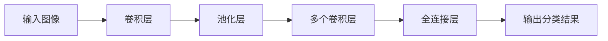
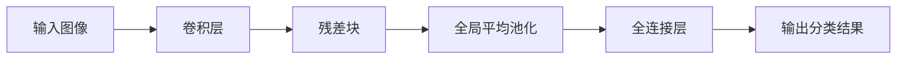
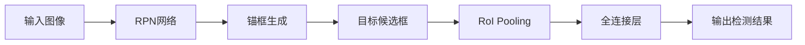
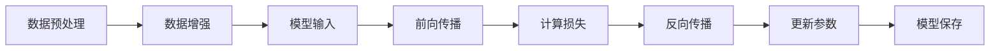
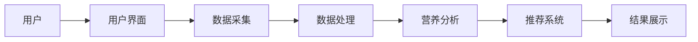

                 


# 智能餐盘：AI Agent的食物识别与营养分析

## 关键词：AI Agent，食物识别，营养分析，图像识别，深度学习，个性化推荐，智能健康

## 摘要：智能餐盘通过AI Agent技术实现食物的自动识别和营养分析，结合图像识别、自然语言处理和机器学习算法，为用户提供个性化的饮食建议。本文详细探讨了AI Agent在智能餐盘中的应用，分析了食物识别的核心技术，营养分析的方法，以及系统架构设计，并通过实际案例展示了项目的实现过程。

---

# 第1章：AI Agent与智能餐盘的背景介绍

## 1.1 AI Agent的基本概念

### 1.1.1 AI Agent的定义与特点

AI Agent（人工智能代理）是一种能够感知环境、自主决策并执行任务的智能实体。它通过传感器获取信息，利用算法进行分析和推理，并通过执行器与环境交互。AI Agent的特点包括自主性、反应性、目标导向和学习能力。

### 1.1.2 AI Agent的核心要素与组成

AI Agent的核心要素包括：
1. **感知模块**：负责从环境中获取信息，如图像、文本或传感器数据。
2. **推理模块**：对感知到的信息进行分析和推理，生成决策。
3. **行动模块**：根据推理结果执行具体操作，如发送指令或触发设备。
4. **知识库**：存储任务相关的知识和经验，用于辅助推理。

### 1.1.3 AI Agent在智能餐盘中的应用场景

在智能餐盘中，AI Agent主要用于食物识别和营养分析。它通过摄像头或传感器获取食物信息，利用图像识别和自然语言处理技术分析食物种类和营养成分，为用户提供个性化的饮食建议。

---

## 1.2 智能餐盘的定义与功能

### 1.2.1 智能餐盘的定义

智能餐盘是一种结合了AI技术的智能设备，能够通过图像识别和传感器数据分析，识别餐盘中的食物种类和数量，并提供营养分析和饮食建议。

### 1.2.2 智能餐盘的核心功能

1. **食物识别**：通过图像识别技术，自动识别餐盘中的食物种类和数量。
2. **营养分析**：根据食物的营养成分，评估用户的饮食是否均衡。
3. **个性化推荐**：根据用户的饮食习惯和健康目标，推荐合理的饮食方案。

### 1.2.3 智能餐盘的用户群体与市场前景

智能餐盘的主要用户群体包括注重健康的个人用户、健身爱好者、慢性病患者等。随着人们对健康的关注增加，智能餐盘市场潜力巨大，尤其是在家庭和个人健康管理领域。

---

## 1.3 本章小结

本章介绍了AI Agent的基本概念及其在智能餐盘中的应用，详细阐述了智能餐盘的核心功能和目标用户群体。通过这些内容，读者可以理解AI Agent如何为智能餐盘提供技术支持，并为用户提供智能化的饮食管理服务。

---

# 第2章：食物识别的核心技术

## 2.1 图像识别技术

### 2.1.1 图像采集与预处理

图像识别的第一步是图像采集，通常使用摄像头获取餐盘中的食物图像。预处理步骤包括图像 resize、归一化和增强，以提高模型的识别精度。

### 2.1.2 基于CNN的食物图像分类

卷积神经网络（CNN）是图像识别的核心算法。通过多层卷积和池化操作，CNN能够提取图像的高层次特征，并通过全连接层进行分类。

### 2.1.3 常见食物识别模型的优缺点对比

| 模型名称    | 优点                              | 缺点                              |
|-------------|-----------------------------------|-----------------------------------|
| ResNet      | 网络深度大，性能稳定              | 参数量大，计算复杂                |
| Faster R-CNN | 支持目标检测，精度高             | 训练时间长，资源消耗大            |
| YOLO        | 实时性好，适合移动设备            | 精度较低，不适合复杂场景          |

### 2.1.4 图像识别的数学模型

以下是ResNet的简化模型结构：



---

## 2.2 自然语言处理在食物识别中的应用

### 2.2.1 食物名称的文本匹配

自然语言处理（NLP）技术可以用于匹配食物名称。通过预训练语言模型（如BERT）进行文本匹配，识别用户输入的食物名称。

### 2.2.2 基于NLP的上下文理解

NLP技术可以分析食物描述的上下文，理解食物的种类和属性。例如，通过情感分析技术，判断用户对某种食物的偏好。

### 2.2.3 NLP与图像识别的结合

结合图像识别和NLP技术，可以实现基于图像和文本的双重识别。例如，用户可以通过输入食物名称或上传食物图片，进行多模态识别。

---

## 2.3 食物识别的算法实现

### 2.3.1 基于ResNet的图像分类模型

ResNet是一种深度残差网络，适用于图像分类任务。以下是ResNet的简化结构：



### 2.3.2 基于Faster R-CNN的目标检测模型

Faster R-CNN是一种目标检测算法，适用于检测餐盘中的多种食物。以下是其流程图：



### 2.3.3 模型训练与优化

模型训练需要大量标注数据，可以通过迁移学习和数据增强技术提高模型的泛化能力。以下是训练流程图：



---

## 2.4 本章小结

本章详细介绍了食物识别的核心技术，包括图像识别和自然语言处理。通过分析常见模型的优缺点，结合实际应用场景，为后续的系统实现提供了技术基础。

---

# 第3章：营养分析与个性化推荐

## 3.1 营养分析的基础知识

### 3.1.1 食物营养成分分析

食物的营养成分包括蛋白质、碳水化合物、脂肪、维生素等。通过分析这些成分，可以评估饮食的均衡性。

### 3.1.2 营养成分的分类与计算方法

将营养成分分为宏量营养素和微量营养素，分别计算其摄入量是否符合推荐值。

### 3.1.3 营养均衡的基本原则

根据《中国居民膳食指南》，合理搭配各类食物，确保蛋白质、碳水化合物和脂肪的比例合理。

---

## 3.2 基于AI的营养分析模型

### 3.2.1 营养成分的特征提取

通过图像识别和文本挖掘，提取食物的营养成分特征。

### 3.2.2 基于机器学习的营养评估

使用支持向量机（SVM）或随机森林（RF）模型，对营养成分进行分类和回归分析。

### 3.2.3 营养分析模型的训练与优化

通过交叉验证和超参数调优，提高模型的预测精度。

---

## 3.3 个性化饮食推荐系统

### 3.3.1 用户饮食习惯的采集与分析

通过问卷调查和传感器数据，采集用户的饮食习惯和健康目标。

### 3.3.2 基于协同过滤的推荐算法

通过用户行为数据，计算用户的相似性，推荐相似用户的饮食方案。

### 3.3.3 基于深度学习的推荐模型

使用神经网络模型（如DNN）进行推荐，考虑用户的多维特征和偏好。

---

## 3.4 本章小结

本章详细介绍了营养分析的方法和个性化推荐系统的设计。通过结合AI技术，为用户提供个性化的饮食建议，帮助用户实现健康饮食目标。

---

# 第4章：系统架构与实现

## 4.1 系统功能模块划分

智能餐盘系统主要包含以下几个模块：
1. **用户界面模块**：用户输入指令和查看结果。
2. **数据采集模块**：通过摄像头或传感器获取数据。
3. **数据处理模块**：对数据进行预处理和特征提取。
4. **营养分析模块**：计算营养成分并评估饮食均衡性。
5. **推荐系统模块**：根据用户需求推荐饮食方案。

---

## 4.2 系统架构图

以下是系统的整体架构图：



---

## 4.3 接口设计与交互流程

### 4.3.1 API接口定义

以下是系统的主要API接口：

- `postImage(image_path)`：上传图像并返回识别结果。
- `calculateNutrition(food_items)`：根据食物列表计算营养成分。
- `generateRecommendation(user_id)`：根据用户信息生成饮食推荐。

### 4.3.2 系统交互流程图

```mermaid
sequenceDi

用户 -> 用户界面: 上传食物图像
用户界面 -> 数据采集: 调用摄像头获取图像
数据采集 -> 数据处理: 进行图像预处理
数据处理 -> 营养分析: 调用API进行分析
营养分析 -> 推荐系统: 根据分析结果生成推荐
推荐系统 -> 用户界面: 显示推荐结果
用户 -> 用户界面: 选择推荐方案
用户界面 -> 数据采集: 获取用户反馈
数据采集 -> 营养分析: 更新分析模型
```

---

## 4.4 本章小结

本章详细描述了智能餐盘系统的架构设计和交互流程，为后续的项目实现提供了理论基础。

---

# 第5章：项目实战

## 5.1 环境搭建

### 5.1.1 开发工具安装

安装Python、TensorFlow、Keras、OpenCV等开发工具。

### 5.1.2 数据集准备

收集并标注食物图像数据，确保数据的多样性和均衡性。

---

## 5.2 核心代码实现

### 5.2.1 数据预处理

```python
import cv2
import numpy as np

def preprocess_image(image_path):
    image = cv2.imread(image_path)
    image = cv2.resize(image, (224, 224))
    image = image / 255.0
    return image
```

### 5.2.2 模型训练

```python
from tensorflow.keras import layers, Model

def build_model():
    inputs = layers.Input(shape=(224, 224, 3))
    x = layers.Conv2D(32, (3, 3), activation='relu')(inputs)
    x = layers.MaxPooling2D((2, 2))(x)
    x = layers.Conv2D(64, (3, 3), activation='relu')(x)
    x = layers.MaxPooling2D((2, 2))(x)
    x = layers.Flatten()(x)
    x = layers.Dense(128, activation='relu')(x)
    outputs = layers.Dense(10, activation='softmax')(x)
    return Model(inputs=inputs, outputs=outputs)
```

### 5.2.3 接口实现

```python
from flask import Flask, request, jsonify

app = Flask(__name__)

@app.route('/api/identify', methods=['POST'])
def identify_image():
    image_path = request.json['image_path']
    result = model.predict(preprocess_image(image_path))
    return jsonify({'result': result})

if __name__ == '__main__':
    app.run()
```

---

## 5.3 实际案例分析

通过实际案例分析，验证系统的识别准确率和推荐效果。例如，输入一张煎饼的照片，系统识别出主要成分是碳水化合物，推荐搭配蛋白质和维生素丰富的食物。

---

## 5.4 本章小结

本章通过实际案例展示了智能餐盘系统的实现过程，从环境搭建到代码编写，详细讲解了系统的核心实现部分。

---

# 第6章：系统优化与扩展

## 6.1 模型优化

### 6.1.1 模型调优

通过增加数据量、调整学习率和批量大小，优化模型的性能。

### 6.1.2 模型压缩与轻量化

使用模型剪枝和知识蒸馏技术，降低模型的计算复杂度，适合移动设备部署。

---

## 6.2 功能扩展

### 6.2.1 健康监测功能

集成健康传感器，监测用户的体重、血压等指标，提供更全面的健康建议。

### 6.2.2 饮食计划定制

根据用户的健康目标和饮食偏好，定制个性化的饮食计划。

---

## 6.3 本章小结

本章讨论了系统的优化方法和功能扩展方向，为系统的进一步发展提供了思路。

---

# 第7章：最佳实践与未来展望

## 7.1 最佳实践

### 7.1.1 数据质量的重要性

确保数据的多样性和标注的准确性，提高模型的泛化能力。

### 7.1.2 模型的可解释性

通过可视化技术，提高模型决策的透明度，便于用户理解和信任。

---

## 7.2 小结与注意事项

智能餐盘系统的设计和实现需要综合考虑技术、用户需求和实际应用场景。在开发过程中，应注重系统的可扩展性和用户体验。

---

## 7.3 未来展望

随着AI技术的不断发展，智能餐盘将更加智能化和个性化。未来，可以通过引入区块链技术确保数据的安全性，或者结合物联网技术实现更智能化的健康管理。

---

# 附录：数据集与工具参考

## 附录A：食物图像数据集

推荐使用ImageNet和COCO数据集，或自行收集标注数据。

## 附录B：开发工具推荐

推荐使用TensorFlow、PyTorch等深度学习框架，以及Flask或Django进行Web开发。

---

# 作者：AI天才研究院/AI Genius Institute & 禅与计算机程序设计艺术 /Zen And The Art of Computer Programming

---

希望这篇文章能够帮助读者深入了解智能餐盘的技术实现和应用场景。

