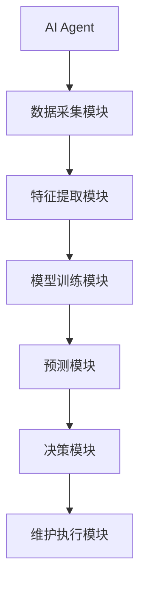
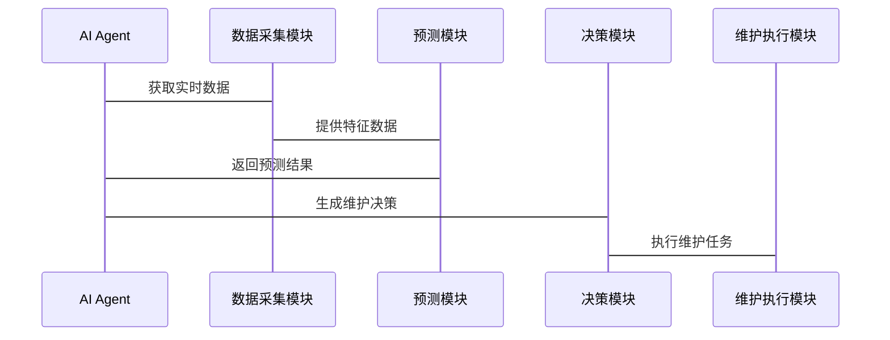

                 


# 构建具有预测维护能力的AI Agent

---

## 关键词
AI Agent, 预测维护, 机器学习, 时间序列分析, LSTM, 系统架构设计

---

## 摘要
本文详细探讨了构建具有预测维护能力的AI Agent的全过程，从背景介绍到系统架构设计，再到项目实战，全面解析了预测维护的核心概念、算法原理和实现方案。文章首先介绍了预测维护的基本概念及其在AI Agent中的应用，接着深入分析了AI Agent的核心概念与联系，详细讲解了时间序列分析和机器学习模型（如ARIMA和LSTM）的算法原理。随后，文章从系统分析与架构设计的角度，展示了如何构建一个完整的预测维护AI Agent系统，包括系统功能设计、架构图和交互流程图。最后，通过项目实战部分，详细指导了环境安装、核心代码实现和案例分析，帮助读者更好地理解和应用这些技术。本文还总结了最佳实践，提供了注意事项和扩展阅读的方向。

---

## 第一部分: 预测维护与AI Agent背景介绍

---

### 第1章: 预测维护与AI Agent概述

#### 1.1 预测维护的基本概念
预测维护是一种基于数据分析和机器学习技术的设备维护策略，旨在通过预测设备的故障时间，提前进行维护，从而减少设备停机时间、降低维护成本并提高生产效率。

- **预测维护的定义**：预测维护是通过对设备运行数据的分析，利用机器学习模型预测设备的健康状态和故障时间，从而实现预防性维护的一种方法。
- **AI Agent的核心概念**：AI Agent（人工智能代理）是一种能够感知环境、自主决策并执行任务的智能系统。它能够通过传感器数据、历史记录和其他信息源，实时分析设备状态，并做出维护决策。

#### 1.2 问题背景与描述
传统的设备维护模式通常是基于时间的维护（Time-based Maintenance，TBM）或基于状态的维护（Condition-based Maintenance，CBM）。然而，这两种方法都存在一定的局限性：
- **TBM**：基于固定的维护周期进行维护，可能导致设备过早维护（维护成本高）或设备故障（维护周期过长）。
- **CBM**：依赖设备的实时状态数据，但缺乏对设备未来状态的预测能力，难以实现预防性维护。

AI Agent通过整合历史数据、实时数据和环境信息，能够实现设备状态的实时监控和故障预测，从而优化维护策略。

#### 1.3 预测维护的必要性
预测维护在现代工业中具有重要意义，尤其是在高可用性要求的场景中，如制造业、能源行业和交通系统等。预测维护能够显著降低设备故障率，减少维护成本，并提高生产效率。

---

### 第2章: AI Agent的核心概念与联系

#### 2.1 预测维护的核心原理
预测维护的核心原理是通过分析设备的运行数据，利用机器学习模型预测设备的健康状态和故障时间。AI Agent在这一过程中起到了关键作用：
- **数据采集**：AI Agent通过传感器、日志文件和其他数据源采集设备的实时数据。
- **模型训练**：利用历史数据训练机器学习模型，学习设备故障的模式和特征。
- **预测与决策**：基于实时数据和训练好的模型，预测设备的健康状态，并根据预测结果做出维护决策。

#### 2.2 AI Agent与预测维护的关系
AI Agent在预测维护中的作用可以总结为以下几点：
- **感知环境**：AI Agent能够实时感知设备的运行状态，采集相关数据。
- **分析与预测**：通过机器学习模型对数据进行分析和预测，识别潜在的故障风险。
- **决策与执行**：根据预测结果，生成维护任务并执行维护操作。

#### 2.3 预测维护的核心要素
预测维护的核心要素包括：
- **数据采集**：设备运行数据的实时采集和存储。
- **特征提取**：从原始数据中提取有用的特征，用于模型训练。
- **模型训练**：利用机器学习算法训练预测模型。
- **预测与决策**：基于模型预测结果，制定维护策略。

---

## 第二部分: AI Agent预测维护的系统架构设计

---

### 第3章: 预测维护AI Agent的系统架构

#### 3.1 系统功能设计
预测维护AI Agent的系统功能设计包括以下几个方面：
- **数据采集模块**：负责采集设备的实时数据，包括传感器数据、日志文件等。
- **特征提取模块**：从原始数据中提取有用的特征，用于模型训练。
- **模型训练模块**：利用历史数据训练机器学习模型。
- **预测模块**：基于实时数据和训练好的模型，预测设备的健康状态。
- **决策模块**：根据预测结果，制定维护策略并执行维护任务。

#### 3.2 系统架构图
以下是预测维护AI Agent的系统架构图：



---

### 第4章: 系统接口与交互流程

#### 4.1 系统接口设计
预测维护AI Agent的系统接口设计包括以下几个部分：
- **数据采集接口**：与传感器和数据源对接，获取实时数据。
- **模型训练接口**：与机器学习框架（如TensorFlow、PyTorch）对接，训练预测模型。
- **预测接口**：与预测模块对接，获取设备健康状态预测结果。
- **决策接口**：与维护执行模块对接，执行维护任务。

#### 4.2 交互流程图
以下是系统交互流程图：



---

## 第三部分: 预测维护AI Agent的算法实现

---

### 第5章: 算法原理与实现

#### 5.1 时间序列分析
时间序列分析是预测维护中的重要技术，常用的模型包括ARIMA（自回归积分滑动平均模型）和LSTM（长短期记忆网络）。

##### 5.1.1 ARIMA模型
ARIMA模型是一种广泛应用于时间序列预测的统计模型。其基本思想是通过自回归和滑动平均的组合，预测未来的趋势和季节性变化。

- **模型公式**：
  $$ ARIMA(p, d, q) $$
  其中，p为自回归阶数，d为差分阶数，q为滑动平均阶数。

- **实现步骤**：
  1. 数据预处理：对时间序列数据进行差分，使其平稳。
  2. 模型参数选择：通过网格搜索等方法选择最佳的p、d、q参数。
  3. 模型训练：利用训练数据训练ARIMA模型。
  4. 模型预测：基于训练好的模型，预测未来的设备健康状态。

##### 5.1.2 LSTM模型
LSTM（长短期记忆网络）是一种基于深度学习的时间序列预测模型。与传统的RNN（循环神经网络）相比，LSTM能够更好地捕捉长期依赖关系。

- **模型结构**：
  - **输入门（Input Gate）**：控制输入信息的通过。
  - **遗忘门（Forget Gate）**：决定遗忘哪些信息。
  - **输出门（Output Gate）**：决定输出哪些信息。

- **模型公式**：
  $$ f_t = \sigma(W_f \cdot [h_{t-1}, x_t] + b_f) $$
  $$ i_t = \sigma(W_i \cdot [h_{t-1}, x_t] + b_i) $$
  $$ o_t = \sigma(W_o \cdot [h_{t-1}, x_t] + b_o) $$
  $$ c_t = f_t \cdot c_{t-1} + i_t \cdot tanh(W_c \cdot [h_{t-1}, x_t] + b_c) $$
  $$ h_t = o_t \cdot tanh(c_t) $$

- **实现步骤**：
  1. 数据预处理：将时间序列数据归一化，构建训练数据集。
  2. 模型构建：定义LSTM模型的网络结构。
  3. 模型训练：利用训练数据训练LSTM模型。
  4. 模型预测：基于训练好的模型，预测未来的设备健康状态。

---

## 第四部分: 项目实战与案例分析

---

### 第6章: 项目实战

#### 6.1 环境安装与数据准备
要构建预测维护AI Agent，首先需要安装以下环境和工具：
- **Python**：建议使用Python 3.6及以上版本。
- **深度学习框架**：如TensorFlow或PyTorch。
- **数据预处理工具**：如Pandas、NumPy等。

数据准备包括以下步骤：
1. 数据采集：获取设备运行数据，包括传感器数据、日志文件等。
2. 数据清洗：处理缺失值、异常值等。
3. 数据转换：将数据转换为模型训练所需的格式。

#### 6.2 核心代码实现
以下是预测维护AI Agent的核心代码实现示例：

##### 使用LSTM模型实现设备健康状态预测
```python
import numpy as np
import pandas as pd
from tensorflow.keras.models import Sequential
from tensorflow.keras.layers import LSTM, Dense, Dropout

# 数据预处理
data = pd.read_csv('equipment_data.csv')
features = data[['sensor1', 'sensor2', 'sensor3']]
labels = data['health_status']

# 划分训练集和测试集
train_features = features[:-100]
train_labels = labels[:-100]
test_features = features[-100:]
test_labels = labels[-100:]

# 构建LSTM模型
model = Sequential()
model.add(LSTM(units=50, return_sequences=True, input_shape=(None, 3)))
model.add(Dropout(0.2))
model.add(LSTM(units=50, return_sequences=False))
model.add(Dense(1, activation='sigmoid'))

model.compile(optimizer='adam', loss='binary_crossentropy', metrics=['accuracy'])

# 训练模型
model.fit(train_features, train_labels, epochs=10, batch_size=32, validation_data=(test_features, test_labels))

# 预测结果
predicted_labels = model.predict(test_features)
```

##### 使用ARIMA模型实现设备故障时间预测
```python
from statsmodels.tsa.arima_model import ARIMA

# 数据预处理
data = pd.read_csv('equipment_data.csv')
series = data['sensor_value']

# 差分
diff = series.diff().dropna()

# 确定ARIMA参数
from statsmodels.tsa.arima_model import auto_arima
model = auto_arima(diff, start_p=1, start_q=1, test='adf', max_order=5, start_d=1)

# 训练模型
model.fit(diff)

# 预测
future_forecast = model.predict(n_periods=10)
```

---

### 第7章: 案例分析与解读

#### 7.1 案例背景
假设我们有一个制造工厂，设备A的传感器数据如下：

| 时间（分钟） | 传感器1 | 传感器2 | 传感器3 |
|--------------|---------|---------|---------|
| 0            | 100     | 200     | 300     |
| 1            | 105     | 205     | 305     |
| 2            | 110     | 210     | 310     |
| ...          | ...     | ...     | ...     |

#### 7.2 模型训练与预测
使用上述代码实现的LSTM模型和ARIMA模型对设备A的健康状态和故障时间进行预测。通过对比预测结果与实际结果，验证模型的准确性和可靠性。

---

## 第五部分: 最佳实践与总结

---

### 第8章: 最佳实践

#### 8.1 小结
本文详细介绍了构建具有预测维护能力的AI Agent的全过程，包括背景介绍、核心概念、算法原理、系统架构设计和项目实战。通过理论与实践的结合，帮助读者全面理解预测维护AI Agent的实现方法。

#### 8.2 注意事项
- **数据质量**：数据的准确性和完整性对模型的预测结果至关重要。
- **模型选择**：根据具体场景和数据特点选择合适的模型。
- **系统优化**：通过优化算法和架构设计，提高系统的性能和稳定性。

#### 8.3 拓展阅读
- 《时间序列分析》：深入理解ARIMA和LSTM模型的原理和应用。
- 《深度学习与预测维护》：探索深度学习在预测维护中的更多应用。

---

## 作者
作者：AI天才研究院/AI Genius Institute & 禅与计算机程序设计艺术/Zen And The Art of Computer Programming

---

**说明**：以上内容是一个详细的技术博客文章的目录大纲和部分正文内容，完整文章需要按照上述结构和内容进行扩展，确保每个章节和小节都详细展开，并包含必要的数学公式、代码示例和图表。

