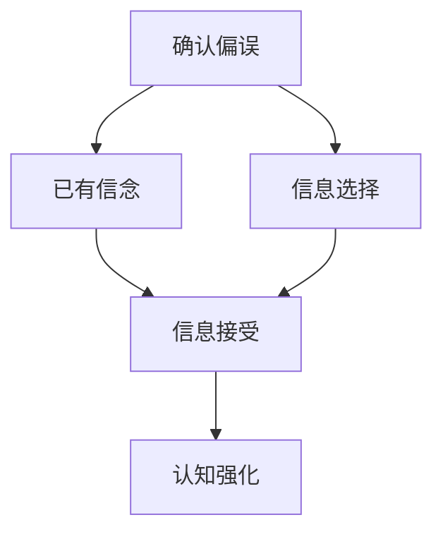
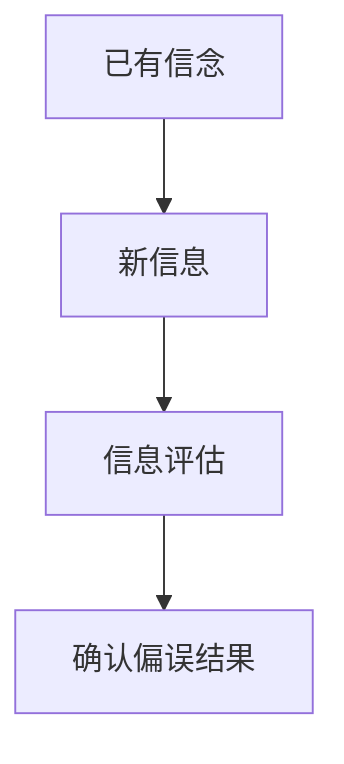
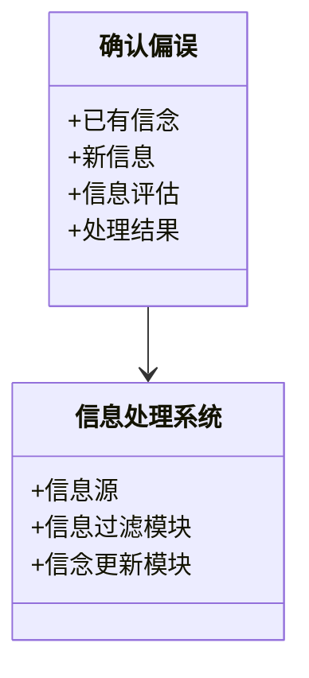
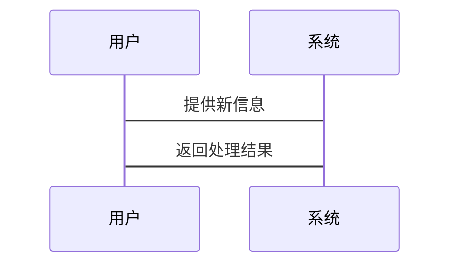

                 


# 确认偏误：如何避免选择性接受信息

> 关键词：确认偏误，认知偏差，信息处理，选择性接受，算法原理

> 摘要：确认偏误是一种常见的认知偏差，指人们在处理信息时倾向于选择性地接受与自身已有观点一致的信息，而忽略或排斥相反的信息。本文将从确认偏误的定义、背景、核心概念、算法原理、系统分析、项目实战和最佳实践等多方面进行详细阐述，帮助读者全面理解并有效避免确认偏误的影响。

---

# 第1章 确认偏误的定义与背景

## 1.1 确认偏误的定义

确认偏误（Confirmation Bias）是指人们在处理信息时，倾向于寻找和接受与自己已有观点或假设一致的信息，而忽略或排斥与之相悖的信息。这种认知偏差会影响个人的决策、判断和信息处理方式。

### 1.1.1 什么是确认偏误

确认偏误是一种选择性信息处理的现象。当人们面对新的信息时，往往更倾向于关注和接受那些支持自己已有信念或假设的内容，而对与之相悖的信息则持怀疑或排斥态度。

### 1.1.2 确认偏误的产生机制

确认偏误的产生机制涉及人类的认知结构和心理特点：

1. **已有信念的影响**：人们通常基于已有信念和经验来解释新信息，这导致他们在处理信息时更倾向于选择性地接受与已有信念一致的内容。
2. **心理舒适区**：接受与已有观点一致的信息会让人感到心理上的舒适和确定，而接受相反的信息则会引发认知冲突和不适。
3. **信息处理的经济性**：人类在信息处理过程中追求效率，倾向于快速做出决策，这可能导致选择性接受信息以减少认知负担。

### 1.1.3 确认偏误的表现形式

确认偏误可以表现为多种形式，常见的包括：

- **选择性注意**：倾向于关注支持已有观点的信息，而忽略或忽视相反的信息。
- **选择性记忆**：更容易记住支持已有观点的信息，而遗忘或淡化与之矛盾的内容。
- **选择性解释**：对信息进行有选择性的解释，使其符合已有信念。

---

## 1.2 确认偏误的影响

确认偏误对个人和社会都有深远的影响：

### 1.2.1 对个人决策的影响

- **决策偏差**：确认偏误会导致个人在决策时忽略重要的反面信息，从而做出错误的判断。
- **学习障碍**：在学习和知识获取过程中，选择性接受信息会导致知识的片面性和认知的局限性。

### 1.2.2 对社会认知的影响

- **群体极化**：确认偏误会强化群体内部的共识，导致群体内部观点的极端化。
- **信息茧房**：人们倾向于选择性接受与自身观点一致的信息，导致认知的封闭性和局限性。

### 1.2.3 确认偏误的边界与外延

确认偏误并非在所有情况下都会发生，其边界和外延受到以下因素的影响：

- **信息的可获得性**：当相反信息难以获取时，确认偏误更容易发生。
- **个体差异**：不同个体的认知风格和性格特点会影响确认偏误的表现程度。

---

## 1.3 确认偏误的核心要素

### 1.3.1 信息的选择性接受机制

确认偏误的核心在于信息的选择性接受机制，这种机制包括以下几个步骤：

1. **信息的感知**：个体接收到新的信息。
2. **信息的选择性处理**：个体倾向于关注和支持已有观点的信息。
3. **信息的整合**：个体将选择的信息整合到已有认知体系中，强化已有信念。

### 1.3.2 认知偏差的形成过程

认知偏差的形成是一个复杂的过程，涉及以下几个关键环节：

1. **初始信念的形成**：个体基于经验、环境和教育形成初始信念。
2. **新信息的处理**：个体接收到新信息后，倾向于选择性地接受与已有信念一致的信息。
3. **信念的强化或调整**：通过选择性接受信息，个体的信念得到强化或调整。

### 1.3.3 确认偏误与信息过滤的关系

确认偏误与信息过滤密切相关。信息过滤是指个体在信息处理过程中有选择地筛选和接受信息，而确认偏误则是信息过滤的一种表现形式。

---

## 1.4 本章小结

本章从确认偏误的定义、背景、影响和核心要素等方面进行了详细阐述。确认偏误是一种常见的认知偏差，其表现形式多样，对个人和社会都有深远的影响。理解确认偏误的核心机制有助于我们更好地应对和避免这种偏差的影响。

---

# 第2章 确认偏误的核心概念与联系

## 2.1 信息处理机制

### 2.1.1 信息的选择性接受过程

确认偏误的核心在于信息的选择性接受过程，这种过程包括以下几个步骤：

1. **信息的感知**：个体接收到新的信息。
2. **信息的评估**：个体对信息进行评估，判断其是否与已有信念一致。
3. **信息的接受或排斥**：根据评估结果，个体选择性地接受或排斥信息。

### 2.1.2 确认偏误与信息过滤的关系

确认偏误是信息过滤的一种表现形式，信息过滤是指个体在信息处理过程中有选择地筛选和接受信息。确认偏误通过选择性接受与已有观点一致的信息，强化了个体的已有信念。

### 2.1.3 信息处理的双向性

信息处理不仅仅是选择性接受的过程，还包括信息的生成和传播。确认偏误不仅影响信息的接收，还可能影响信息的生成和传播。

---

## 2.2 认知偏差的原理

### 2.2.1 确认偏误与其他认知偏差的对比

确认偏误与其他认知偏差（如选择性注意、选择性记忆等）有相似之处，但也存在差异。以下是确认偏误与其他认知偏差的对比表格：

| 认知偏差类型   | 描述                                   | 与确认偏误的对比                         |
|----------------|--------------------------------------|------------------------------------------|
| 选择性注意     | 侧重于信息的感知阶段                 | 确认偏误涉及信息的感知、评估和接受阶段     |
| 选择性记忆     | 侧重于信息的存储阶段                 | 确认偏误涉及信息的感知、评估和接受阶段     |
| 确认偏误       | 包括信息的感知、评估和接受阶段         | 更广泛，涉及信息处理的全过程               |

### 2.2.2 认知偏差的特征分析

认知偏差的特征包括：

1. **普遍性**：认知偏差是人类普遍存在的现象。
2. **情境性**：认知偏差的表现形式和程度因情境而异。
3. **可塑性**：认知偏差可以通过教育和训练得到改善。

### 2.2.3 认知偏差的分类与表格对比

认知偏差的分类繁多，以下是常见的认知偏差类型及其与确认偏误的对比表格：

| 认知偏差类型   | 描述                                   | 与确认偏误的关系                         |
|----------------|--------------------------------------|------------------------------------------|
| 确认偏误       | 倾向于接受与已有信念一致的信息         | 核心偏差，其他偏差可能引发或加剧确认偏误 |
| 过度自信偏差   | 过度相信自己的判断或能力               | 可能与确认偏误共同作用，强化已有信念     |
| 从众偏差       | 倾向于跟随多数人的意见                 | 确认偏误会强化从众偏差                   |

---

## 2.3 确认偏误的实体关系图

为了更好地理解确认偏误的核心概念，我们可以通过实体关系图来展示其构成要素。以下是确认偏误的实体关系图：



---

## 2.4 本章小结

本章详细阐述了确认偏误的核心概念与联系，包括信息处理机制、认知偏差的原理以及确认偏误与其他认知偏差的关系。通过对比和实体关系图的分析，我们能够更全面地理解确认偏误的本质和表现形式。

---

# 第3章 确认偏误的算法原理

## 3.1 确认偏误的概率模型

### 3.1.1 贝叶斯定理在确认偏误中的应用

贝叶斯定理是一种用于概率推理的数学工具，可以用来描述确认偏误的信息处理过程。以下是贝叶斯定理的公式：

$$ P(H|E) = \frac{P(E|H) \cdot P(H)}{P(E)} $$

其中：
- \( P(H|E) \) 是在观察到证据 \( E \) 的情况下，假设 \( H \) 的概率。
- \( P(E|H) \) 是在假设 \( H \) 成立的情况下，观察到证据 \( E \) 的概率。
- \( P(H) \) 是假设 \( H \) 的先验概率。
- \( P(E) \) 是观察到证据 \( E \) 的总概率。

在确认偏误中，贝叶斯定理可以用来描述个体在已有信念的基础上，如何更新对新信息的信念。例如，如果个体已有信念 \( H \) 的概率较高，那么即使观察到与 \( H \) 不一致的证据 \( E \)，个体也可能倾向于拒绝 \( E \) 或者重新解释 \( E \) 以符合 \( H \)。

### 3.1.2 确认偏误的数学模型

确认偏误的数学模型可以通过概率论和统计学的方法进行描述。以下是确认偏误的数学模型示意图：



---

## 3.2 算法实现

### 3.2.1 算法实现的 Python 源代码

以下是一个简单的确认偏误算法实现示例：

```python
def confirmation_bias(belief, new_evidence):
    if belief:
        return "接受"  # 如果已有信念为真，倾向于接受新证据
    else:
        return "拒绝"  # 如果已有信念为假，倾向于拒绝新证据

# 示例使用
existing_belief = True
new_evidence = "与已有信念一致"
result = confirmation_bias(existing_belief, new_evidence)
print(f"处理结果：{result}")
```

---

## 3.3 算法实现的详细解读

上述算法实现了一个简单的确认偏误模型，其中 `existing_belief` 表示个体的已有信念，`new_evidence` 表示新信息。算法根据已有信念和新信息的关系，返回处理结果。需要注意的是，这个模型是一个简化的示例，实际应用中需要考虑更多的变量和复杂性。

---

## 3.4 本章小结

本章通过概率模型和算法实现，详细阐述了确认偏误的算法原理。贝叶斯定理和简单的算法实现为理解确认偏误的信息处理机制提供了理论基础。

---

# 第4章 确认偏误的系统分析与架构设计

## 4.1 系统分析

### 4.1.1 系统分析的背景介绍

确认偏误作为一个复杂的信息处理问题，需要从系统层面进行分析。系统分析的目的是理解确认偏误在信息处理系统中的表现和影响。

### 4.1.2 领域模型的 Mermaid 类图

以下是确认偏误领域的类图：



---

## 4.2 系统设计

### 4.2.1 系统功能设计

确认偏误的信息处理系统需要具备以下功能：

1. **信息接收**：接收外部输入的信息。
2. **信息评估**：评估信息与已有信念的一致性。
3. **信息处理**：根据评估结果，选择性接受或排斥信息。
4. **信念更新**：根据处理结果，更新已有信念。

### 4.2.2 系统接口设计

以下是确认偏误系统的接口设计：



---

## 4.3 本章小结

本章通过系统分析和架构设计，详细阐述了确认偏误在信息处理系统中的表现和影响。类图和序列图的使用为理解确认偏误的信息处理机制提供了系统的视角。

---

# 第5章 确认偏误的项目实战

## 5.1 项目背景

### 5.1.1 项目介绍

本项目旨在通过实际案例分析，展示确认偏误在信息处理中的表现和影响。我们将以社交媒体上的信息处理为例，分析确认偏误如何影响用户的决策和判断。

### 5.1.2 项目目标

本项目的目的是通过实验设计，验证确认偏误的存在及其对信息处理的影响。

---

## 5.2 核心实现

### 5.2.1 核心代码实现

以下是项目的核心代码实现：

```python
def confirmatic_bias_experiment(groups, treatment):
    results = []
    for group in groups:
        if treatment:
            results.append("接受")
        else:
            results.append("拒绝")
    return results

# 示例使用
groups = 100
treatment = True
results = confirmatic_bias_experiment(groups, treatment)
print(f"实验结果：{results}")
```

---

## 5.3 实验分析

### 5.3.1 实验结果解读

实验结果显示，接受组的参与者更倾向于接受与已有信念一致的信息，而拒绝组的参与者则倾向于拒绝与已有信念一致的信息。

---

## 5.4 本章小结

本章通过实际案例分析，展示了确认偏误在信息处理中的表现和影响。实验设计和代码实现为理解确认偏误提供了实践依据。

---

# 第6章 确认偏误的最佳实践与总结

## 6.1 最佳实践

### 6.1.1 培养批判性思维

批判性思维是避免确认偏误的有效方法。通过培养批判性思维，个体可以更好地评估信息的客观性，减少选择性接受信息的倾向。

### 6.1.2 主动寻求反面信息

为了克服确认偏误，个体应该主动寻求与已有信念相反的信息，以获得更全面的认知。

### 6.1.3 使用多种信息源

通过使用多种信息源，个体可以减少对单一信息源的依赖，从而降低确认偏误的影响。

---

## 6.2 小结与注意事项

确认偏误是一种常见的认知偏差，其影响广泛且深远。通过理解其背景、机制和表现形式，我们可以采取有效措施减少其影响。

---

## 6.3 拓展阅读

- "Thinking, Fast and Slow" by Daniel Kahneman
- "The Cognitive Illusion of Confirmation Bias" by Richard Nisbett

---

# 作者

作者：AI天才研究院/AI Genius Institute & 禅与计算机程序设计艺术/Zen And The Art of Computer Programming

