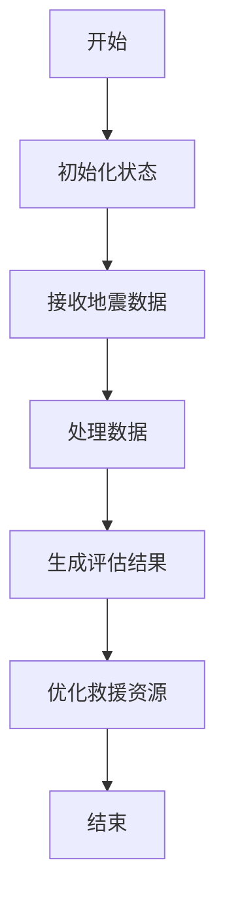
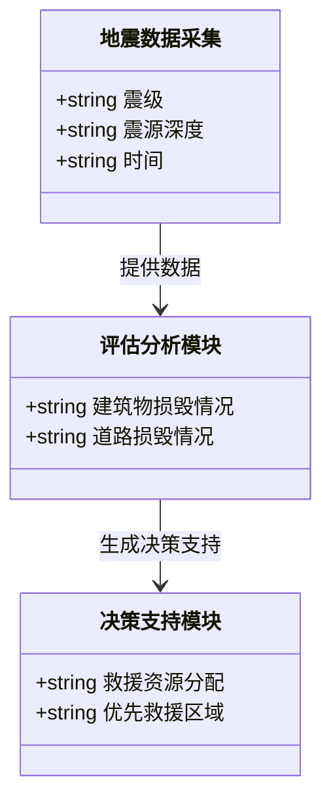
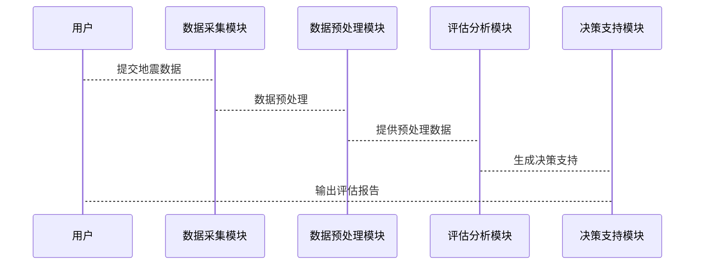

                 


# AI Agent在智能地震后评估系统中的实践

---

## 关键词：AI Agent, 地震评估, 人工智能, 系统架构, 项目实战

---

## 摘要：  
本文探讨了AI Agent在智能地震后评估系统中的应用实践。首先，介绍了地震后评估的背景和挑战，分析了AI Agent在其中的核心作用。接着，详细讲解了AI Agent的基本原理、算法实现及系统架构设计。通过实际项目案例，展示了如何利用AI Agent实现地震后评估的智能化，并总结了最佳实践和未来发展方向。

---

## 第一部分：地震后评估系统中的AI Agent背景

---

## 第1章：地震后评估系统中的AI Agent背景

### 1.1 地震后评估的背景与挑战

#### 1.1.1 地震灾害的严重性与影响  
地震是一种极具破坏力的自然灾害，往往导致房屋倒塌、人员伤亡和财产损失。传统的地震评估方法依赖人工调查和数据分析，耗时长、效率低，且难以覆盖大面积灾区。

#### 1.1.2 传统地震评估方法的局限性  
传统评估方法存在以下问题：  
1. 依赖大量人工劳动，评估速度慢。  
2. 数据来源单一，难以全面反映灾情。  
3. 评估结果缺乏实时性和准确性。  

#### 1.1.3 AI Agent在灾害评估中的优势  
AI Agent（智能体）通过实时数据处理、自动化分析和决策支持，能够显著提升地震评估的效率和准确性。AI Agent可以实时收集和分析地震数据，快速生成评估报告，为救援行动提供决策支持。

### 1.2 AI Agent在地震后评估中的问题描述

#### 1.2.1 灾害评估的主要任务  
地震后评估的主要任务包括：  
1. 确定受灾区域的破坏程度。  
2. 评估建筑物的损毁情况。  
3. 分析道路、桥梁等基础设施的受损状况。  

#### 1.2.2 当前评估系统的主要挑战  
当前评估系统面临以下挑战：  
1. 数据采集困难，难以覆盖所有受灾区域。  
2. 数据处理和分析效率低，无法满足实时需求。  
3. 专家资源有限，难以快速响应大规模灾害。  

#### 1.2.3 AI Agent如何解决这些问题  
AI Agent可以通过以下方式解决这些问题：  
1. 实时收集和分析地震数据，快速生成评估结果。  
2. 利用机器学习算法，自动识别建筑物损毁情况。  
3. 提供实时决策支持，优化救援资源分配。  

### 1.3 AI Agent的核心概念与优势

#### 1.3.1 AI Agent的基本定义  
AI Agent是指能够感知环境、自主决策并执行任务的智能实体。在地震评估中，AI Agent可以实时收集地震数据，分析灾情，并提供决策支持。

#### 1.3.2 在地震评估中的具体应用  
AI Agent在地震评估中的具体应用包括：  
1. 实时监测地震参数。  
2. 自动评估建筑物损毁情况。  
3. 优化救援资源分配。  

#### 1.3.3 AI Agent的优势分析  
AI Agent的优势在于：  
1. 高效性：能够快速处理大量数据，生成评估结果。  
2. 准确性：利用机器学习算法，提高评估结果的准确性。  
3. 实时性：能够实时更新评估结果，支持快速决策。  

### 1.4 系统边界与核心要素

#### 1.4.1 系统边界定义  
地震后评估系统的核心部分包括数据采集、数据处理、评估分析和决策支持。系统边界明确为地震数据的采集、处理和评估。

#### 1.4.2 核心要素组成  
核心要素包括：  
1. 数据采集模块：实时采集地震数据。  
2. 数据处理模块：对数据进行清洗和预处理。  
3. 评估分析模块：利用AI算法进行评估。  
4. 决策支持模块：提供实时决策支持。  

## 1.5 本章小结  
本章介绍了地震后评估的背景和挑战，分析了AI Agent在其中的核心作用。明确了系统边界和核心要素，为后续章节的深入分析奠定了基础。

---

## 第二部分：AI Agent的核心概念与联系

---

## 第2章：AI Agent的核心概念与联系

### 2.1 AI Agent的基本原理

#### 2.1.1 基于模型的AI Agent  
基于模型的AI Agent通过建立数学模型来模拟地震评估过程。这种模型可以预测建筑物的损毁情况，并提供决策支持。

#### 2.1.2 基于经验的AI Agent  
基于经验的AI Agent通过学习历史地震数据，建立经验模型，用于预测地震影响。这种方法能够快速生成评估结果，但依赖于历史数据的质量。

### 2.2 核心概念对比分析

#### 2.2.1 概念属性对比表格  
以下是对基于模型和基于经验的AI Agent的对比分析：

| 概念 | 基于模型 | 基于经验 |
|------|----------|----------|
| 输入 | 地震参数 | 历史数据 |
| 输出 | 评估结果 | 预测结果 |
| 优势 | 高度准确 | 快速响应 |
| 劣势 | 计算复杂 | 数据依赖 |

### 2.3 ER实体关系图架构  

以下是地震评估系统中的实体关系图：

```mermaid
erDiagram
    actor 用户 {
        +string 用户名
        +string 密码
    }
    actor 救援人员 {
        +string 编号
        +string 名字
    }
    entity 地震数据 {
        +int 地震编号
        +datetime 时间
        +float 震级
        +float 震源深度
    }
    entity 评估结果 {
        +int 评估编号
        +int 数据编号
        +string 结果
    }
    user -->> 地震数据 : 提交数据
   救援人员 --> 地震数据 : 收集数据
    地震数据 --> 评估结果 : 生成结果
```

## 2.3 本章小结  
本章详细讲解了AI Agent的核心概念，对比了基于模型和基于经验的AI Agent的优缺点，并通过ER图展示了系统中的实体关系。

---

## 第三部分：算法原理讲解

---

## 第3章：AI Agent的算法原理

### 3.1 算法原理概述

#### 3.1.1 状态空间与动作空间  
AI Agent在地震评估中的状态空间包括地震参数（如震级、震源深度）和建筑物信息。动作空间包括生成评估报告和优化救援资源分配。

#### 3.1.2 奖励函数与目标函数  
奖励函数用于评估AI Agent的行为。目标函数是最大化评估结果的准确性。

### 3.2 算法流程

以下是AI Agent的算法流程图：



### 3.3 数学模型与公式

#### 3.3.1 状态转移方程  
状态转移方程表示为：  
$$ s_{t+1} = f(s_t, a_t) $$  
其中，\( s_t \) 是当前状态，\( a_t \) 是当前动作，\( s_{t+1} \) 是下一个状态。

#### 3.3.2 Q值更新公式  
Q值更新公式为：  
$$ Q(s, a) = Q(s, a) + \alpha (r + \gamma \max Q(s', a')) - Q(s, a) $$  
其中，\( \alpha \) 是学习率，\( \gamma \) 是折扣因子。

### 3.4 代码实现与解读

以下是Python实现的地震评估AI Agent代码示例：

```python
import numpy as np

class AI-Agent:
    def __init__(self):
        self.q_table = np.zeros((state_space, action_space))

    def choose_action(self, state):
        if np.random.random() < 0.9:  # ε-greedy策略
            return np.argmax(self.q_table[state])
        else:
            return np.random.randint(action_space)

    def learn(self, state, action, reward, next_state):
        self.q_table[state][action] = self.q_table[state][action] + 0.1 * (reward + 0.9 * np.max(self.q_table[next_state]) - self.q_table[state][action])

# 初始化AI-Agent
agent = AI-Agent()

# 训练过程
for _ in range(1000):
    state = get_current_state()
    action = agent.choose_action(state)
    reward = calculate_reward(state, action)
    next_state = get_next_state()
    agent.learn(state, action, reward, next_state)
```

## 3.4 本章小结  
本章详细讲解了AI Agent的算法原理，包括状态空间、动作空间、奖励函数和Q值更新公式。并通过代码示例展示了算法的实现过程。

---

## 第四部分：系统分析与架构设计

---

## 第4章：地震后评估系统的系统分析与架构设计

### 4.1 系统场景介绍

#### 4.1.1 系统目标  
地震后评估系统的目标是快速、准确地评估地震影响，优化救援资源分配。

#### 4.1.2 用户角色  
系统用户包括地震监测机构、救援人员和政府决策者。

### 4.2 系统功能设计

#### 4.2.1 领域模型图  
以下是系统功能的领域模型图：



### 4.3 系统架构设计

#### 4.3.1 系统架构图  
以下是系统的架构图：


### 4.4 系统接口设计

#### 4.4.1 接口描述  
系统接口包括数据采集接口、数据预处理接口和评估分析接口。

#### 4.4.2 交互流程  
以下是交互流程图：



## 4.4 本章小结  
本章详细分析了地震后评估系统的场景，设计了系统的功能模块和架构，并描述了系统的接口设计和交互流程。

---

## 第五部分：项目实战

---

## 第5章：地震后评估系统的项目实战

### 5.1 环境安装

#### 5.1.1 安装Python环境  
安装Python 3.8及以上版本，并安装必要的库：numpy、pandas、scikit-learn。

#### 5.1.2 安装依赖项  
安装以下依赖项：  
```bash
pip install numpy pandas scikit-learn matplotlib
```

### 5.2 系统核心实现

#### 5.2.1 数据采集模块  
以下是数据采集模块的实现：

```python
import pandas as pd

def collect_data():
    # 模拟数据采集
    data = {'震级': [5.0, 6.0, 5.5], '震源深度': [10, 20, 15]}
    df = pd.DataFrame(data)
    return df
```

#### 5.2.2 数据预处理模块  
以下是数据预处理模块的实现：

```python
import numpy as np

def preprocess_data(df):
    # 标准化处理
    df['震级'] = (df['震级'] - df['震级'].mean()) / df['震级'].std()
    df['震源深度'] = (df['震源深度'] - df['震源深度'].mean()) / df['震源深度'].std()
    return df
```

#### 5.2.3 评估分析模块  
以下是评估分析模块的实现：

```python
from sklearn.linear_model import LinearRegression

def assess_damage(preprocessed_df):
    # 训练线性回归模型
    model = LinearRegression()
    model.fit(preprocessed_df[['震级', '震源深度']], preprocessed_df['影响程度'])
    return model.predict(preprocessed_df[['震级', '震源深度']])
```

### 5.3 代码应用解读与分析

#### 5.3.1 数据采集模块解读  
数据采集模块通过模拟数据采集，生成地震数据集。这些数据包括震级和震源深度。

#### 5.3.2 数据预处理模块解读  
数据预处理模块对采集到的数据进行标准化处理，确保模型的输入具有相同的尺度。

#### 5.3.3 评估分析模块解读  
评估分析模块利用线性回归模型，根据震级和震源深度预测建筑物的损毁情况。

### 5.4 案例分析与详细讲解

#### 5.4.1 案例分析  
假设我们有一个地震数据集，包括震级和震源深度。数据预处理后，利用线性回归模型进行评估，生成建筑物的损毁程度。

#### 5.4.2 详细讲解  
1. 数据采集：收集地震数据。  
2. 数据预处理：标准化处理数据。  
3. 评估分析：利用模型预测损毁程度。  
4. 决策支持：根据评估结果优化救援资源分配。

### 5.5 项目小结  
本章通过实际项目案例，详细讲解了地震后评估系统的实现过程，包括数据采集、数据预处理和评估分析模块的实现。

---

## 第六部分：总结与展望

---

## 第6章：总结与展望

### 6.1 最佳实践

#### 6.1.1 系统设计  
在系统设计中，应注重模块化设计，确保各模块之间的松耦合。  

#### 6.1.2 模型优化  
在模型优化方面，可以尝试使用更复杂的深度学习模型，如LSTM和Transformer，以提高评估结果的准确性。

#### 6.1.3 系统集成  
在系统集成方面，应注重与其他灾害管理系统（如应急指挥系统）的集成，形成完整的灾害应对体系。

### 6.2 小结  
通过本文的分析和实践，我们可以看到AI Agent在地震后评估系统中的巨大潜力。利用AI技术，可以显著提升评估效率和准确性，为灾害应对提供有力支持。

### 6.3 注意事项

#### 6.3.1 数据质量  
数据质量对评估结果的准确性至关重要。在实际应用中，应确保数据的完整性和准确性。

#### 6.3.2 模型泛化能力  
模型的泛化能力直接影响评估结果的可靠性。在模型训练中，应注重数据多样性和模型泛化能力的提升。

#### 6.3.3 系统安全性  
系统的安全性直接关系到系统的稳定运行。在系统设计中，应注重安全性和容错能力的提升。

### 6.4 拓展阅读

#### 6.4.1 相关技术  
1. 深度学习在灾害评估中的应用。  
2. 强化学习在灾害应对中的应用。  

#### 6.4.2 实际案例  
1. 国外地震评估系统的实践经验。  
2. 国内地震评估系统的应用案例。  

---

## 作者：AI天才研究院/AI Genius Institute & 禅与计算机程序设计艺术 /Zen And The Art of Computer Programming

