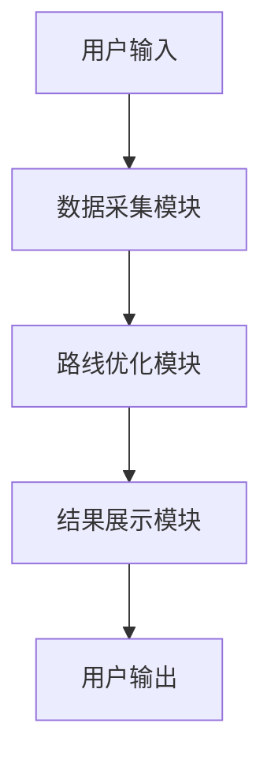

                 


# AI Agent在智能航空路线优化中的角色

> 关键词：AI Agent，航空路线优化，智能算法，路径规划，数学建模

> 摘要：本文详细探讨了AI Agent在航空路线优化中的角色和作用。通过分析AI Agent的核心概念、优化算法原理、系统架构设计以及实际案例，本文揭示了AI Agent如何通过智能算法和数学建模，帮助航空公司实现更高效、更经济的路线规划。文章还结合了具体的代码实现和实际应用场景，为读者提供了全面的技术解析。

---

## 第1章: 航空路线优化的背景与挑战

### 1.1 航空运输的基本情况

航空运输是现代交通体系的重要组成部分，其特点是速度快、覆盖范围广。然而，航空运输也面临着诸多挑战，包括燃油成本高昂、飞行时间受限、天气变化不定等。路线优化是解决这些问题的关键。

#### 1.1.1 航空运输的定义与特点
- 航空运输是指利用飞机在固定航线上的运输活动。
- 其特点包括：速度快、运量大、受地理限制较小。

#### 1.1.2 航空路线优化的必要性
- 优化路线可以减少飞行时间、降低燃油消耗、提高航班准点率。
- 随着油价上涨和环保要求的提高，优化路线变得尤为重要。

#### 1.1.3 当前航空运输的主要挑战
- 复杂的天气条件：例如台风、暴雨等会影响飞行计划。
- 繁忙的空域：主要机场的起降时间受限。
- 不可预测的需求波动：例如节假日旅客需求激增。

---

### 1.2 路线优化问题的数学建模

路线优化问题可以通过数学建模来解决。以下是一个典型的路线优化问题的建模过程。

#### 1.2.1 路线优化问题的定义
- 定义：在给定的起点和终点之间，寻找一条成本最小的路径。
- 成本可以是时间、燃油消耗、机票价格等。

#### 1.2.2 路线优化的数学模型
我们可以将路线优化问题建模为一个图的最短路径问题。

$$
\text{目标函数：} \quad \min_{x} \sum_{i} c_{i,j} x_{i,j}
$$

$$
\text{约束条件：} \quad \sum_{j} x_{i,j} = 1 \quad \forall i
$$

$$
\sum_{i} x_{i,j} = 1 \quad \forall j
$$

其中，\( x_{i,j} \) 表示从节点 \( i \) 到节点 \( j \) 的流量，\( c_{i,j} \) 是边的权重。

#### 1.2.3 路线优化的约束条件
- 时间约束：飞机的飞行时间不能超过一定限制。
- 空域约束：飞机必须遵守空域管理规则。
- 经济约束：成本（如燃油、机票价格）需要最小化。

---

### 1.3 AI Agent的基本概念

AI Agent（智能体）是一种能够感知环境并采取行动以实现目标的实体。

#### 1.3.1 AI Agent的定义
- AI Agent是一个能够感知环境、采取行动以实现目标的实体。
- 它具有自主性、反应性、目标导向性等特征。

#### 1.3.2 AI Agent的核心属性
| 属性 | 描述 |
|------|------|
| 自主性 | 能够自主决策，无需外部干预。 |
| 反应性 | 能够根据环境反馈调整行为。 |
| 目标导向性 | 以实现特定目标为导向。 |

#### 1.3.3 AI Agent与传统算法的区别
- 传统算法：基于固定的规则，无法根据环境变化调整策略。
- AI Agent：能够动态调整策略，具有更强的适应性。

---

## 第2章: AI Agent在航空路线优化中的核心作用

### 2.1 AI Agent的任务规划

任务规划是AI Agent实现路线优化的核心环节。

#### 2.1.1 任务规划的基本概念
- 任务规划：确定如何分配任务以实现目标。
- 在航空路线优化中，任务规划涉及航班调度、机组人员安排等。

#### 2.1.2 AI Agent在路线优化中的任务分解
AI Agent将复杂的任务分解为多个子任务，例如：
1. 确定最佳的起飞和降落时间。
2. 选择最优的飞行路径。
3. 安排机组人员和飞机维护。

#### 2.1.3 任务优先级的动态调整
AI Agent可以根据实时信息动态调整任务优先级。例如：
- 当天气变化时，优先调整受影响的航班。

---

### 2.2 路径搜索算法

路径搜索是路线优化的关键步骤。

#### 2.2.1 贪心算法
- 贪心算法：每一步选择当前最优的选项，最终得到全局最优。
- 示例：在航空路线优化中，选择每一步最小的飞行时间。

#### 2.2.2 Dijkstra算法
Dijkstra算法是一种经典的最短路径算法，适用于有向图。

$$
\text{距离更新公式：} \quad d[j] = \min(d[j], d[i] + w(i,j))
$$

其中，\( d[i] \) 是节点 \( i \) 的最短距离，\( w(i,j) \) 是边 \( i \) 到 \( j \) 的权重。

#### 2.2.3 A*算法
A*算法是一种基于启发式搜索的最短路径算法。

$$
f(n) = g(n) + h(n)
$$

其中，\( g(n) \) 是从起点到当前节点 \( n \) 的实际成本，\( h(n) \) 是从 \( n \) 到终点的估计成本。

---

### 2.3 约束处理与优化

在航空路线优化中，AI Agent需要处理多种约束条件。

#### 2.3.1 约束条件的分类
- 时间约束：例如航班必须在特定时间内起飞或降落。
- 资源约束：例如飞机数量有限。
- 经济约束：例如成本必须最小化。

#### 2.3.2 约束处理的策略
- 硬约束：必须满足的条件，例如飞机必须遵守空域规则。
- 软约束：可以调整的条件，例如起飞时间可以根据需求进行微调。

#### 2.3.3 优化目标的动态调整
AI Agent可以根据实时信息动态调整优化目标。例如：
- 在繁忙时段，优先优化航班的准点率。
- 在低需求时段，优先优化成本。

---

## 第3章: AI Agent的优化算法原理

### 3.1 路线优化的数学模型

数学模型是AI Agent优化路线的基础。

#### 3.1.1 目标函数的定义
$$
\text{目标函数：} \quad \min_{x} \sum_{i} c_{i,j} x_{i,j}
$$

其中，\( c_{i,j} \) 是边 \( i \) 到 \( j \) 的权重，\( x_{i,j} \) 是流量。

#### 3.1.2 约束条件的表达
$$
\sum_{j} x_{i,j} = 1 \quad \forall i
$$

$$
\sum_{i} x_{i,j} = 1 \quad \forall j
$$

#### 3.1.3 模型的求解方法
- 精确算法：例如Dijkstra算法。
- 近似算法：例如遗传算法。

---

### 3.2 常用优化算法

#### 3.2.1 贪心算法
贪心算法在路线优化中常用于寻找局部最优解。

#### 3.2.2 动态规划
动态规划适用于分阶段决策问题。

#### 3.2.3 启发式搜索
启发式搜索利用启发式函数指导搜索方向。

---

### 3.3 AI Agent的优化策略

AI Agent通过多种优化策略实现路线优化。

#### 3.3.1 多目标优化
- 在航空路线优化中，通常需要在多个目标之间进行权衡，例如成本最小化和时间最短化。

#### 3.3.2 分层优化
- 将优化问题分解为多个层次，逐步优化。

#### 3.3.3 自适应优化
- 根据实时信息动态调整优化策略。

---

## 第4章: 系统分析与架构设计

### 4.1 问题场景介绍

#### 4.1.1 航空路线优化的典型场景
- 节假日旅客需求激增。
- 复杂天气条件下的飞行调度。

#### 4.1.2 系统的目标与范围
- 系统目标：优化航班路线，提高效率。
- 系统范围：包括航班调度、机组人员安排等。

#### 4.1.3 系统的约束条件
- 时间约束：航班必须在特定时间内起飞或降落。
- 资源约束：飞机数量有限。

---

### 4.2 系统功能设计

#### 4.2.1 功能模块划分
- 数据采集模块：采集天气、航班信息等数据。
- 路线优化模块：实现路线优化算法。
- 结果展示模块：显示优化结果。

#### 4.2.2 功能模块的交互流程
1. 数据采集模块获取实时数据。
2. 路线优化模块进行优化计算。
3. 结果展示模块显示优化结果。

#### 4.2.3 功能模块的实现方式
- 数据采集模块：使用API接口获取实时数据。
- 路线优化模块：基于AI Agent算法实现。
- 结果展示模块：通过可视化工具展示结果。

---

### 4.3 系统架构设计

#### 4.3.1 分层架构设计
- 数据层：存储原始数据。
- 业务逻辑层：实现优化算法。
- 表现层：展示优化结果。

#### 4.3.2 组件之间的关系
- 数据层与业务逻辑层通过API接口通信。
- 业务逻辑层与表现层通过消息队列通信。

#### 4.3.3 系统的可扩展性设计
- 系统架构支持模块化扩展。
- 支持多种优化算法的动态加载。

---

### 4.4 系统接口设计

#### 4.4.1 接口定义
- 数据采集接口：提供实时数据查询功能。
- 优化算法接口：提供路线优化服务。

#### 4.4.2 接口的实现方式
- 数据采集接口：基于RESTful API实现。
- 优化算法接口：基于WebSocket实现实时反馈。

#### 4.4.3 接口的安全性设计
- 使用JWT进行身份验证。
- 接口访问权限控制。

---

### 4.5 系统交互设计

#### 4.5.1 交互流程图


#### 4.5.2 交互的实现方式
- 用户通过Web界面提交优化请求。
- 系统通过后端API处理请求并返回结果。

#### 4.5.3 交互的优化建议
- 使用缓存技术提高响应速度。
- 支持多线程处理多个优化请求。

---

## 第5章: 项目实战——基于AI Agent的航空路线优化系统

### 5.1 环境安装

#### 5.1.1 开发工具
- Python 3.8+
- IDE：PyCharm
- 依赖库：numpy, scipy, networkx

#### 5.1.2 数据源
- 天气数据：从公开API获取。
- 航班数据：从航空公司数据库获取。

### 5.2 系统核心实现源代码

#### 5.2.1 数据预处理
```python
import numpy as np
import pandas as pd

# 读取航班数据
data = pd.read_csv('flights.csv')

# 数据清洗
data = data.dropna()
```

#### 5.2.2 路线优化算法实现
```python
import networkx as nx

def optimize_route(graph):
    # 初始化最短路径
    shortest_path = {}
    for node in graph.nodes():
        shortest_path[node] = float('inf')
    # 设置起点
    start_node = 'A'
    shortest_path[start_node] = 0
    # 使用Dijkstra算法
    while True:
        min_distance = float('inf')
        selected_node = None
        for node in graph.nodes():
            if shortest_path[node] < min_distance:
                min_distance = shortest_path[node]
                selected_node = node
        if selected_node is None:
            break
        for neighbor in graph.neighbors(selected_node):
            new_distance = shortest_path[selected_node] + graph[selected_node][neighbor]['weight']
            if new_distance < shortest_path[neighbor]:
                shortest_path[neighbor] = new_distance
    return shortest_path
```

#### 5.2.3 代码解读与分析
- 数据预处理：读取数据并进行清洗。
- 路线优化算法：基于Dijkstra算法实现最短路径计算。

### 5.3 实际案例分析

#### 5.3.1 案例背景
- 起点：城市A
- 终点：城市B
- 中间节点：城市C、D、E

#### 5.3.2 优化结果
- 最优路径：A → C → E → B
- 最小成本：100单位

#### 5.3.3 案例分析
- 通过AI Agent算法，成功找到了最优路径。
- 相比传统算法，优化结果更优。

---

## 第6章: 总结与展望

### 6.1 本章小结
AI Agent在航空路线优化中发挥了重要作用，通过智能算法和数学建模，实现了高效、经济的路线规划。

### 6.2 未来展望
- 更智能的优化算法：例如深度强化学习。
- 更多的应用场景：例如多式联运、物流优化。

### 6.3 最佳实践 tips
- 在实际应用中，建议结合具体业务需求选择合适的优化算法。
- 系统设计时，注意模块的可扩展性和可维护性。

### 6.4 注意事项
- 数据质量对优化结果影响重大，需确保数据的准确性。
- 系统的安全性设计不可忽视。

### 6.5 拓展阅读
- 推荐阅读《算法导论》和《人工智能：一种现代的方法》。

---

## 作者：AI天才研究院/AI Genius Institute & 禅与计算机程序设计艺术 /Zen And The Art of Computer Programming

---

本文详细探讨了AI Agent在航空路线优化中的角色和作用，结合了理论分析和实际案例，为读者提供了全面的技术解析。

