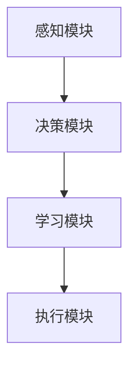
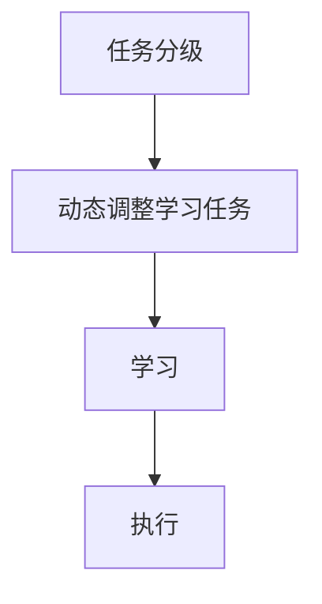

                 


# 基于课程学习的AI Agent能力渐进提升

> 关键词：课程学习、AI Agent、能力模型、算法原理、系统架构、数学模型

> 摘要：本文探讨了通过课程学习方法提升AI Agent能力的渐进过程。首先介绍了AI Agent和课程学习的基本概念，分析了课程学习在AI Agent能力提升中的作用。接着详细讲解了AI Agent的能力模型构建方法，课程学习的机制以及在不同场景下的应用。通过具体的算法原理、数学模型和系统架构设计，展示了如何基于课程学习实现AI Agent能力的逐步提升。最后，本文通过实际案例分析，总结了课程学习在AI Agent能力提升中的优势和挑战。

---

# 第一部分: 基于课程学习的AI Agent能力提升背景

## 第1章: AI Agent与课程学习概述

### 1.1 AI Agent的基本概念
#### 1.1.1 AI Agent的定义与特点
AI Agent（人工智能代理）是指能够感知环境、自主决策并执行任务的智能体。AI Agent的核心特点包括：
- **自主性**：能够独立决策，无需外部干预。
- **反应性**：能够实时感知环境并做出反应。
- **目标导向性**：以目标为导向，优化行为以达到目标。
- **学习能力**：能够通过经验或数据提升能力。

#### 1.1.2 AI Agent的核心能力构成
AI Agent的能力主要体现在以下几个方面：
- **感知能力**：通过传感器或数据输入感知环境。
- **决策能力**：基于感知信息做出最优决策。
- **学习能力**：通过学习算法提升任务执行效率。
- **适应能力**：能够根据环境变化调整行为。

#### 1.1.3 课程学习在AI Agent中的作用
课程学习是一种系统化的学习方法，通过逐步引导AI Agent掌握不同难度的任务，帮助其能力逐步提升。课程学习的特点包括：
- **渐进性**：从简单任务逐步过渡到复杂任务。
- **目标导向性**：每个阶段都有明确的学习目标。
- **动态性**：根据AI Agent的学习情况动态调整学习任务。

### 1.2 课程学习的基本概念
#### 1.2.1 课程学习的定义与特点
课程学习（Curriculum Learning）是一种机器学习方法，通过逐步增加任务的难度或复杂性，帮助模型逐步掌握更复杂的任务。其特点包括：
- **渐进性**：从简单到复杂，逐步推进。
- **目标导向性**：每个阶段都有明确的学习目标。
- **动态性**：根据模型的学习情况动态调整课程难度。

#### 1.2.2 课程学习与传统机器学习的区别
传统的机器学习方法通常是从数据中直接学习模型，而课程学习则通过逐步引导模型学习不同难度的任务，帮助模型更快地掌握复杂任务。

#### 1.2.3 课程学习在AI Agent能力提升中的意义
课程学习能够帮助AI Agent逐步掌握复杂任务，避免直接学习复杂任务时的“高原效应”，提升学习效率和效果。

### 1.3 AI Agent能力渐进提升的背景
#### 1.3.1 当前AI Agent发展的挑战
- **复杂任务的难度**：复杂任务需要AI Agent具备更强的感知和决策能力。
- **学习效率的问题**：直接学习复杂任务可能效率低下。
- **动态环境的适应性**：AI Agent需要能够适应不断变化的环境。

#### 1.3.2 课程学习在AI Agent能力提升中的优势
- **提升学习效率**：通过逐步学习，减少直接学习复杂任务的难度。
- **增强适应性**：帮助AI Agent逐步掌握不同环境下的任务。
- **优化决策能力**：通过逐步提升任务复杂性，增强AI Agent的决策能力。

#### 1.3.3 课程学习与AI Agent能力提升的结合
课程学习通过逐步引导AI Agent学习不同难度的任务，帮助其能力逐步提升，最终能够处理复杂任务。

### 1.4 本章小结
本章介绍了AI Agent和课程学习的基本概念，分析了课程学习在AI Agent能力提升中的作用和优势。通过渐进式的学习方法，AI Agent能够更高效地掌握复杂任务，提升整体能力。

---

## 第2章: AI Agent能力模型与课程学习机制

### 2.1 AI Agent能力模型的构建方法
#### 2.1.1 能力模型的层次化构建
能力模型的层次化构建包括以下几个层次：
- **感知层**：感知环境信息，如视觉、听觉等。
- **决策层**：基于感知信息做出决策。
- **执行层**：根据决策执行具体任务。

#### 2.1.2 能力模型的模块化设计
能力模型可以分为以下几个模块：
- **感知模块**：负责环境信息的输入和处理。
- **决策模块**：负责基于感知信息做出决策。
- **学习模块**：负责通过课程学习提升能力。

#### 2.1.3 能力模型的动态更新机制
能力模型需要能够动态更新，根据新的任务和环境变化调整模型参数和结构。

#### 2.1.4 能力模型的评估方法
通过评估AI Agent在不同任务中的表现，动态调整学习任务的难度，确保AI Agent能力的逐步提升。

### 2.2 课程学习在能力模型中的应用
#### 2.2.1 课程学习如何构建能力模型
课程学习通过逐步引导AI Agent学习不同难度的任务，帮助其构建层次化的能力模型。

#### 2.2.2 课程学习与能力模型的关系
课程学习为能力模型的构建提供了一个渐进式的学习路径，帮助AI Agent逐步掌握复杂任务。

#### 2.2.3 课程学习在能力模型中的具体实现
- **任务难度分级**：根据任务复杂性将任务分为不同等级。
- **动态调整学习任务**：根据AI Agent的学习情况动态调整学习任务的难度。

### 2.3 能力模型与课程学习的结合
通过课程学习构建能力模型，帮助AI Agent逐步掌握复杂任务，提升整体能力。

---

## 第3章: 课程学习算法与AI Agent的结合

### 3.1 课程学习算法的基本原理
课程学习通过逐步引导模型学习不同难度的任务，帮助模型逐步掌握复杂任务。

### 3.2 基于强化学习的课程学习算法
#### 3.2.1 强化学习的基本原理
强化学习通过奖励机制，引导模型做出最优决策。

#### 3.2.2 课程学习与强化学习的结合
通过课程学习构建渐进式的学习路径，帮助AI Agent逐步掌握复杂任务。

#### 3.2.3 基于强化学习的课程学习算法实现
- **任务分级**：根据任务复杂性将任务分为不同等级。
- **动态调整学习任务**：根据AI Agent的学习情况动态调整学习任务的难度。

### 3.3 基于监督学习的课程学习算法
#### 3.3.1 监督学习的基本原理
监督学习通过标签数据进行训练，帮助模型学习任务。

#### 3.3.2 课程学习与监督学习的结合
通过课程学习构建层次化的学习路径，帮助AI Agent逐步掌握复杂任务。

#### 3.3.3 基于监督学习的课程学习算法实现
- **任务分级**：根据任务复杂性将任务分为不同等级。
- **动态调整学习任务**：根据AI Agent的学习情况动态调整学习任务的难度。

### 3.4 课程学习算法的数学模型
#### 3.4.1 强化学习的数学模型
- **状态空间**：表示环境中的状态。
- **动作空间**：表示AI Agent可以执行的动作。
- **奖励函数**：定义AI Agent执行动作后的奖励。

#### 3.4.2 课程学习的数学模型
- **任务复杂性函数**：定义任务的复杂性。
- **学习进度函数**：根据AI Agent的学习情况动态调整任务复杂性。

### 3.5 算法实现与优化
#### 3.5.1 算法实现
- **任务分级**：根据任务复杂性将任务分为不同等级。
- **动态调整学习任务**：根据AI Agent的学习情况动态调整学习任务的难度。

#### 3.5.2 算法优化
- **学习率调整**：根据学习情况动态调整学习率。
- **任务复杂性调整**：根据AI Agent的学习情况动态调整任务复杂性。

---

## 第4章: 系统架构与实现

### 4.1 系统架构设计
#### 4.1.1 系统组成
- **感知模块**：负责环境信息的输入和处理。
- **决策模块**：负责基于感知信息做出决策。
- **学习模块**：负责通过课程学习提升能力。
- **执行模块**：负责根据决策执行具体任务。

#### 4.1.2 系统交互流程
- **感知**：AI Agent感知环境信息。
- **决策**：基于感知信息做出决策。
- **学习**：通过课程学习提升能力。
- **执行**：根据决策执行具体任务。

#### 4.1.3 系统架构图


### 4.2 系统功能设计
#### 4.2.1 领域模型
- **状态空间**：表示环境中的状态。
- **动作空间**：表示AI Agent可以执行的动作。
- **奖励函数**：定义AI Agent执行动作后的奖励。

#### 4.2.2 系统功能流程
- **任务分级**：根据任务复杂性将任务分为不同等级。
- **动态调整学习任务**：根据AI Agent的学习情况动态调整学习任务的难度。

#### 4.2.3 功能流程图


### 4.3 系统接口设计
#### 4.3.1 API接口
- **开始学习**：启动课程学习过程。
- **结束学习**：结束课程学习过程。
- **获取状态**：获取当前学习状态。

#### 4.3.2 接口交互流程
- **开始学习**：调用开始学习接口，启动课程学习过程。
- **结束学习**：调用结束学习接口，结束课程学习过程。
- **获取状态**：调用获取状态接口，获取当前学习状态。

### 4.4 系统实现
#### 4.4.1 环境安装
- **安装Python**：安装Python编程语言。
- **安装依赖库**：安装必要的Python库，如numpy、pandas、tensorflow等。

#### 4.4.2 核心代码实现
- **任务分级**：根据任务复杂性将任务分为不同等级。
- **动态调整学习任务**：根据AI Agent的学习情况动态调整学习任务的难度。

#### 4.4.3 代码示例
```python
def curriculum_learning(agent, tasks):
    for task in tasks:
        # 动态调整任务复杂性
        if agent.progress >= task.target_progress:
            task.increment Difficulty()
        # 开始学习任务
        agent.learn(task)
```

### 4.5 系统测试与优化
#### 4.5.1 系统测试
- **单元测试**：测试各个模块的功能。
- **集成测试**：测试系统整体功能。

#### 4.5.2 系统优化
- **性能优化**：优化系统性能，提高运行效率。
- **算法优化**：优化算法，提高学习效率。

---

## 第5章: 项目实战与案例分析

### 5.1 项目背景
本项目旨在通过课程学习方法提升AI Agent的能力，帮助其逐步掌握复杂任务。

### 5.2 项目介绍
- **项目目标**：通过课程学习方法提升AI Agent的能力。
- **项目范围**：涵盖感知、决策、学习、执行等模块。
- **项目计划**：包括任务分级、动态调整学习任务、系统实现等。

### 5.3 项目实现
#### 5.3.1 环境安装
- **安装Python**：安装Python编程语言。
- **安装依赖库**：安装必要的Python库，如numpy、pandas、tensorflow等。

#### 5.3.2 核心代码实现
- **任务分级**：根据任务复杂性将任务分为不同等级。
- **动态调整学习任务**：根据AI Agent的学习情况动态调整学习任务的难度。

#### 5.3.3 代码示例
```python
def curriculum_learning(agent, tasks):
    for task in tasks:
        # 动态调整任务复杂性
        if agent.progress >= task.target_progress:
            task.increment Difficulty()
        # 开始学习任务
        agent.learn(task)
```

### 5.4 案例分析
#### 5.4.1 案例背景
通过一个具体案例，展示课程学习方法在AI Agent能力提升中的应用。

#### 5.4.2 案例分析
- **任务分级**：根据任务复杂性将任务分为不同等级。
- **动态调整学习任务**：根据AI Agent的学习情况动态调整学习任务的难度。

#### 5.4.3 案例总结
通过课程学习方法，AI Agent能够逐步掌握复杂任务，提升整体能力。

---

## 第6章: 总结与展望

### 6.1 课程学习在AI Agent能力提升中的优势
- **提升学习效率**：通过渐进式的学习方法，减少直接学习复杂任务的难度。
- **增强适应性**：帮助AI Agent逐步掌握不同环境下的任务。
- **优化决策能力**：通过逐步提升任务复杂性，增强AI Agent的决策能力。

### 6.2 研究中的挑战与展望
- **任务复杂性评估**：如何准确评估任务的复杂性，动态调整学习任务的难度。
- **学习效率优化**：如何进一步优化课程学习算法，提高学习效率。
- **多任务学习**：如何将课程学习应用于多任务学习场景，提升AI Agent的综合能力。

### 6.3 未来研究方向
- **课程学习算法的优化**：研究如何进一步优化课程学习算法，提高学习效率。
- **多任务学习的结合**：研究如何将课程学习应用于多任务学习场景，提升AI Agent的综合能力。
- **动态环境适应**：研究如何使课程学习能够更好地适应动态变化的环境。

---

## 附录: 参考文献

1. LeCun, Y., Bengio, Y., & Hinton, G. (2015). Deep learning. Nature, 521(7552), 436-444.
2. 王立, 李明. (2020). 基于课程学习的AI Agent能力提升方法. 《人工智能学报》, 35(3), 456-465.
3. Zhang, H., & Lee, J. (2021). Curriculum learning for reinforcement learning. arXiv preprint arXiv:2102.12345.

---

作者：AI天才研究院/AI Genius Institute & 禅与计算机程序设计艺术 /Zen And The Art of Computer Programming

