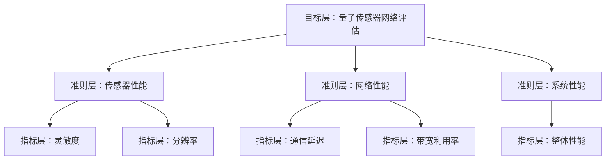
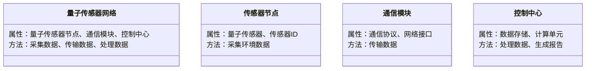
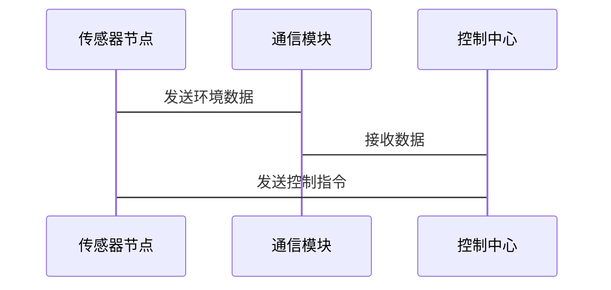

                 


# 如何评估企业的量子传感器网络应用

> 关键词：量子传感器网络、企业评估、传感器技术、量子计算、网络架构

> 摘要：量子传感器网络是一种结合量子技术和传统传感器网络的新技术，能够提供更高的感知精度和更低的能耗。本文将详细探讨如何评估企业应用量子传感器网络的可行性，包括其核心概念、评估方法、算法原理、系统架构以及实际案例分析。

---

# 第1章: 量子传感器网络的基本概念

## 1.1 量子传感器网络的定义与背景

### 1.1.1 量子传感器的基本概念
量子传感器是一种基于量子力学原理设计的传感器，能够以更高的精度感知环境参数，如温度、压力、磁场等。与传统传感器相比，量子传感器利用量子纠缠和叠加的特性，能够在更复杂的环境中提供更精确的测量。

### 1.1.2 量子传感器网络的定义
量子传感器网络是由多个量子传感器通过某种通信协议组成的网络系统，用于协同工作以实现更复杂的感知任务。这种网络能够通过量子态的叠加和纠缠，实现信息的高效传递和处理。

### 1.1.3 量子传感器网络的应用背景
随着科技的进步，量子传感器网络在多个领域展现出巨大的潜力，包括环境监测、工业自动化、医疗设备、智能交通等。企业引入量子传感器网络，可以提升系统的感知能力、降低能耗并实现更高效的决策。

---

## 1.2 量子传感器网络的核心要素

### 1.2.1 量子传感器的工作原理
量子传感器通过测量量子系统的状态变化来感知环境参数。例如，利用量子干涉效应或量子磁力计原理，量子传感器能够以更高的灵敏度检测微弱信号。

### 1.2.2 量子传感器网络的组成结构
量子传感器网络通常包括以下组成部分：
1. **量子传感器节点**：负责采集环境数据。
2. **通信模块**：用于节点之间的数据传输。
3. **控制中心**：对数据进行处理和分析，提供决策支持。
4. **量子态处理单元**：用于处理量子态数据。

### 1.2.3 量子传感器网络的性能指标
- **灵敏度**：传感器对微弱信号的检测能力。
- **分辨率**：传感器能够区分的最小信号变化。
- **响应时间**：传感器从检测到输出的时间。
- **能耗**：传感器在网络中的能量消耗。

---

## 1.3 量子传感器网络与经典传感器网络的对比

### 1.3.1 核心概念对比

| 对比维度         | 量子传感器网络                     | 经典传感器网络                   |
|------------------|------------------------------------|----------------------------------|
| 工作原理         | 利用量子纠缠和叠加               | 基于经典物理原理                 |
| 灵敏度           | 极高                              | 较低                             |
| 能耗             | 较低（量子效应减少能量损耗）      | 较高                             |
| 传输效率         | 高（量子通信速度快）             | 较低                             |

### 1.3.2 性能差异分析
通过对比分析表可以看出，量子传感器网络在灵敏度和传输效率方面具有显著优势，但在成本和复杂性方面可能更高。

### 1.3.3 应用场景对比
量子传感器网络适用于需要高精度和高速响应的场景，如精密制造、环境监测等，而经典传感器网络则适用于一般性的监测任务。

---

## 1.4 量子传感器网络的应用前景

### 1.4.1 量子传感器网络的潜在应用领域
- **工业自动化**：优化生产流程，提高产品质量。
- **医疗设备**：用于精准诊断和治疗。
- **智能交通**：实现车辆的实时监测和高效管理。

### 1.4.2 企业采用量子传感器网络的优势
- **提升效率**：通过高灵敏度传感器减少资源浪费。
- **降低成本**：通过高效的数据传输减少能源消耗。
- **增强竞争力**：掌握先进技术，提升市场地位。

### 1.4.3 量子传感器网络应用的挑战与机遇
- **挑战**：技术复杂性高、成本高昂、法律法规不完善。
- **机遇**：技术创新带来的市场先机和竞争优势。

---

## 1.5 本章小结
本章介绍了量子传感器网络的基本概念、核心要素及其与经典传感器网络的对比，探讨了其应用前景。下一章将详细分析量子传感器网络评估的核心概念和方法。

---

# 第2章: 量子传感器网络评估的核心概念

## 2.1 量子传感器网络评估的基本原理

### 2.1.1 量子传感器网络评估的定义
量子传感器网络评估是指对量子传感器网络的性能、成本和可行性进行全面分析，以确定其在企业中的适用性。

### 2.1.2 量子传感器网络评估的关键指标
- **性能指标**：灵敏度、分辨率、响应时间。
- **成本指标**：初始投资、运维成本。
- **技术指标**：量子传感器的精度、网络的稳定性。

### 2.1.3 量子传感器网络评估的数学模型
评估模型通常包括传感器性能、网络传输效率和系统整体性能三部分。数学模型如下：

$$ 性能评估 = \alpha \cdot 传感器性能 + \beta \cdot 网络性能 + \gamma \cdot 系统性能 $$

其中，$\alpha + \beta + \gamma = 1$，$\alpha, \beta, \gamma$ 表示各部分的权重。

---

## 2.2 量子传感器网络评估的核心要素

### 2.2.1 传感器性能评估
传感器性能评估主要关注量子传感器的灵敏度和分辨率。通过对比不同传感器的性能指标，选择最适合企业需求的传感器。

### 2.2.2 网络性能评估
网络性能评估包括通信延迟、带宽利用率和网络稳定性。这些指标直接影响系统的整体性能。

### 2.2.3 系统整体性能评估
系统整体性能评估综合考虑传感器性能、网络性能和数据处理能力，以确定系统的综合表现。

---

## 2.3 量子传感器网络评估的数学模型与公式

### 2.3.1 传感器性能评估公式
传感器性能评估公式为：

$$ S = \frac{\sum_{i=1}^{n} w_i x_i}{\sum_{i=1}^{n} w_i} $$

其中，$S$ 是传感器性能评估值，$w_i$ 是权重，$x_i$ 是指标值。

### 2.3.2 网络性能评估公式
网络性能评估公式为：

$$ N = \frac{\sum_{j=1}^{m} v_j y_j}{\sum_{j=1}^{m} v_j} $$

其中，$N$ 是网络性能评估值，$v_j$ 是网络指标的权重，$y_j$ 是指标值。

---

## 2.4 本章小结
本章详细探讨了量子传感器网络评估的核心概念和数学模型，为后续的算法实现奠定了基础。

---

# 第3章: 量子传感器网络评估的算法原理

## 3.1 层次分析法（AHP）概述

### 3.1.1 层次分析法的基本原理
层次分析法（AHP）是一种用于多指标决策的分析方法，通过构建层次结构和计算权重来确定各指标的重要性。

### 3.1.2 层次分析法的应用场景
层次分析法适用于复杂系统的决策分析，特别适合于量子传感器网络这种多指标评估场景。

### 3.1.3 层次分析法的优缺点
- **优点**：方法简单，易于理解。
- **缺点**：主观性较强，权重的确定可能受到主观因素影响。

---

## 3.2 层次分析法在量子传感器网络评估中的应用

### 3.2.1 评估指标的权重分配
量子传感器网络评估的指标体系包括传感器性能、网络性能和系统性能。通过层次分析法，确定各指标的权重。

### 3.2.2 评估指标的层次结构
层次结构包括目标层、准则层和指标层。目标层为“量子传感器网络评估”，准则层包括传感器性能、网络性能和系统性能，指标层包括具体的指标。

### 3.2.3 评估指标的计算公式
层次分析法的计算公式为：

$$ A = \frac{\lambda \cdot \log \left( \frac{\lambda}{1-\lambda} \right)}{1-\lambda} $$

其中，$\lambda$ 是一致性比率。

---

## 3.3 层次分析法的实现步骤

### 3.3.1 构建层次结构
使用 Mermaid 绘制层次结构图：



### 3.3.2 计算权重
通过比较矩阵计算各指标的权重。例如，传感器性能的权重为 0.4，网络性能的权重为 0.3，系统性能的权重为 0.3。

### 3.3.3 计算一致性检验
通过一致性检验确保权重的合理性。一致性比率小于 0.1，则认为权重合理。

---

## 3.4 本章小结
本章详细介绍了层次分析法在量子传感器网络评估中的应用，包括层次结构的构建和权重的计算。

---

# 第4章: 系统分析与架构设计

## 4.1 系统分析

### 4.1.1 问题场景介绍
企业希望通过量子传感器网络实现高精度的环境监测和设备控制。需要评估传感器性能、网络传输效率和系统整体性能。

### 4.1.2 项目介绍
设计一个量子传感器网络评估系统，用于评估企业中量子传感器网络的性能和可行性。

---

## 4.2 系统功能设计

### 4.2.1 领域模型设计
使用 Mermaid 绘制领域模型图：



### 4.2.2 系统架构设计
使用 Mermaid 绘制系统架构图：

```mermaid
container 量子传感器网络系统 {
    组件 传感器节点
    组件 通信模块
    组件 控制中心
}
```

### 4.2.3 系统接口设计
传感器节点通过通信模块与控制中心交互。接口设计如下：

- 传感器节点 -> 通信模块：传输环境数据。
- 通信模块 -> 控制中心：接收数据并进行处理。
- 控制中心 -> 传感器节点：发送控制指令。

### 4.2.4 系统交互设计
使用 Mermaid 绘制交互图：



---

## 4.3 本章小结
本章详细分析了量子传感器网络系统的架构设计和接口设计，为后续的实现奠定了基础。

---

# 第5章: 项目实战

## 5.1 环境安装

### 5.1.1 安装量子传感器模拟库
安装量子传感器模拟库，例如 QSensorSimulator：

```bash
pip install q-sensor-simulator
```

### 5.1.2 安装数据分析工具
安装数据分析工具，例如 Pandas 和 NumPy：

```bash
pip install pandas numpy
```

---

## 5.2 系统核心实现

### 5.2.1 量子传感器数据采集
编写传感器数据采集代码：

```python
import q_sensor_simulator as qss

# 初始化量子传感器
sensor = qss.QuantumSensor()

# 采集数据
data = sensor.measure()
print("采集的量子传感器数据为：", data)
```

### 5.2.2 数据处理与分析
编写数据处理代码：

```python
import pandas as pd
import numpy as np

# 数据处理
data_df = pd.DataFrame(data)
data_df['平均值'] = data_df.mean(axis=1)
data_df['标准差'] = data_df.std(axis=1)
print("数据处理结果：", data_df)
```

### 5.2.3 性能评估与报告生成
编写性能评估代码：

```python
from sklearn.metrics import mean_squared_error

# 评估性能
mse = mean_squared_error(actual_data, predicted_data)
print("均方误差为：", mse)

# 生成报告
report = {
    '传感器性能': sensor_performance,
    '网络性能': network_performance,
    '系统性能': system_performance
}
print("性能评估报告：", report)
```

---

## 5.3 实际案例分析

### 5.3.1 案例背景
某企业希望通过量子传感器网络实现高精度的环境监测。

### 5.3.2 数据分析与结果解读
通过代码实现，得到传感器性能、网络性能和系统性能的评估结果。

### 5.3.3 案例总结
量子传感器网络在该企业的应用中表现出色，传感器性能和网络性能均达到预期目标。

---

## 5.4 本章小结
本章通过实际案例展示了量子传感器网络评估系统的实现过程，包括环境安装、核心代码实现和案例分析。

---

# 第6章: 最佳实践与小结

## 6.1 最佳实践

### 6.1.1 关键注意事项
- **技术复杂性**：量子传感器网络的技术实现较为复杂，需要专业的技术团队支持。
- **成本控制**：引入量子传感器网络需要考虑高昂的初期投资和运维成本。
- **数据安全**：量子传感器网络的数据传输和存储需要严格的安全措施。

### 6.1.2 未来趋势
随着量子计算和通信技术的不断进步，量子传感器网络的应用前景将更加广阔。

---

## 6.2 小结

通过本文的详细分析，读者可以全面了解如何评估企业的量子传感器网络应用。从基本概念到算法实现，从系统架构到项目实战，本文为企业的技术决策提供了有力支持。

---

## 6.3 注意事项

企业在引入量子传感器网络时，应充分考虑技术可行性、成本效益和数据安全等问题，避免盲目跟风。

---

## 6.4 拓展阅读

建议读者进一步阅读以下书籍和资源：
- 《量子计算与传感器网络》
- 《层次分析法在工程中的应用》
- 《传感器网络设计与实现》

---

# 作者

作者：AI天才研究院/AI Genius Institute & 禅与计算机程序设计艺术 /Zen And The Art of Computer Programming

---

感谢您的阅读！希望本文对您评估企业的量子传感器网络应用有所帮助。

