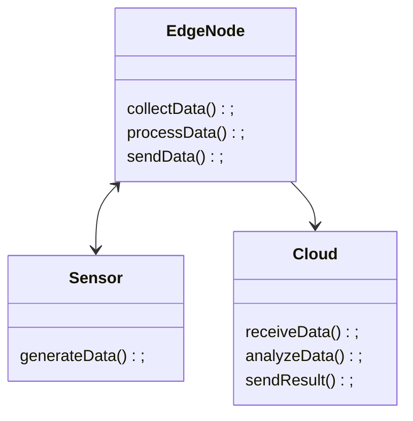
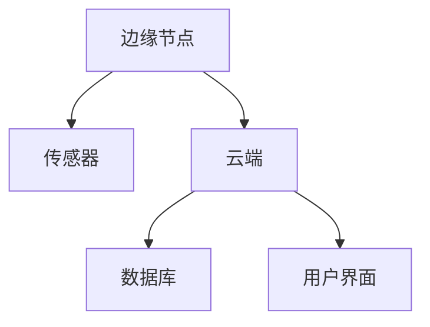
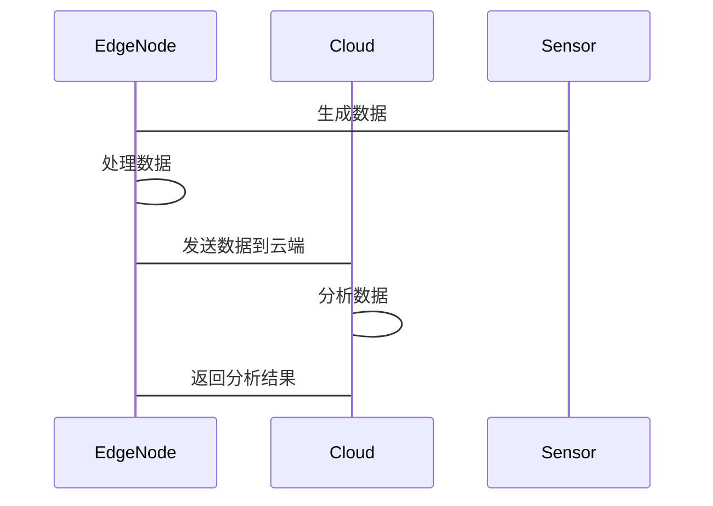

                 


# 如何识别企业的边缘计算实时数据分析优势

## 关键词：边缘计算，实时数据分析，企业优势，数据流处理，系统架构

## 摘要：本文深入探讨了边缘计算与实时数据分析的结合，分析了其对企业竞争优势的重要性。通过详细的技术分析、算法实现和系统设计，展示了如何识别和利用这些优势，为企业创造价值。

---

## 第1章：边缘计算与实时数据分析的背景介绍

### 1.1 什么是边缘计算
#### 1.1.1 边缘计算的定义
边缘计算是一种分布式计算范式，将数据处理从云端转移到数据源附近，减少延迟并提高响应速度。

#### 1.1.2 边缘计算的核心特点
- **低延迟**：数据在边缘节点实时处理，减少传输到云端的时间。
- **高带宽**：边缘节点能够处理大量数据，减轻云端负担。
- **本地化**：数据在生成地进行处理，节省网络带宽。

#### 1.1.3 边缘计算与云计算的区别
| 特性 | 边缘计算 | 云计算 |
|------|----------|--------|
| 数据处理位置 | 边缘节点 | 云端    |
| 延迟 | 低       | 较高    |
| 带宽使用 | 低     | 高      |

### 1.2 什么是实时数据分析
#### 1.2.1 实时数据分析的定义
实时数据分析是指对数据流进行持续处理，以快速获取洞察和行动建议。

#### 1.2.2 实时数据分析的关键特征
- **实时性**：数据生成后立即处理。
- **连续性**：持续处理数据流。
- **快速响应**：及时提供分析结果。

#### 1.2.3 实时数据分析的重要性
实时数据分析能够帮助企业快速做出决策，提升效率，优化业务流程。

### 1.3 边缘计算与实时数据分析的结合
#### 1.3.1 边缘计算在实时数据分析中的作用
边缘计算通过在数据源附近处理数据，减少延迟，提高实时分析的效率。

#### 1.3.2 边缘计算与实时数据分析的优势
- **低延迟**：边缘计算使实时数据分析更快响应。
- **带宽优化**：仅传输关键数据，减少网络负载。
- **可靠性**：边缘节点能够在断开连接时继续处理数据。

#### 1.3.3 边缘计算与实时数据分析的应用场景
- **制造业**：实时监控生产线，快速检测异常。
- **物联网**：实时分析传感器数据，优化设备运行。
- **金融行业**：实时交易监控，防范欺诈行为。

---

## 第2章：边缘计算与实时数据分析的核心概念与联系

### 2.1 边缘计算的核心原理
#### 2.1.1 边缘计算的体系结构
```mermaid
graph TD
    Edge Node[边缘节点] --> Data Source[数据源]
    Edge Node --> Cloud[云端]
    Edge Node --> Local Storage[本地存储]
```

#### 2.1.2 边缘计算的关键技术
- **数据采集**：通过传感器或其他设备收集数据。
- **数据预处理**：在边缘节点进行数据清洗和转换。
- **分布式计算**：边缘节点和云端协同处理数据。

#### 2.1.3 边缘计算的优缺点
| 优点 | 缺点 |
|------|------|
| 低延迟 | 边缘节点资源有限 |
| 高带宽效率 | 部署和维护复杂 |
| 可靠性 | 安全性挑战 |

### 2.2 实时数据分析的核心原理
#### 2.2.1 实时数据分析的流程
```mermaid
graph TD
    Data In[数据输入] --> Buffer[缓冲区]
    Buffer --> Processing[处理]
    Processing --> Result[结果]
    Result --> Output[输出]
```

#### 2.2.2 实时数据分析的技术特点
- **流数据处理**：实时处理数据流，而不是批量处理。
- **窗口机制**：处理特定时间段内的数据。
- **分布式计算框架**：如 Apache Flink。

#### 2.2.3 实时数据分析的挑战
- **数据一致性**：如何保证实时数据的一致性。
- **处理速度**：如何在有限时间内完成处理。
- **资源分配**：如何优化计算资源的使用。

### 2.3 边缘计算与实时数据分析的关系
#### 2.3.1 边缘计算如何支持实时数据分析
边缘计算通过在数据源附近处理数据，减少了实时数据分析的延迟，提高了处理效率。

#### 2.3.2 实时数据分析如何推动边缘计算的发展
实时数据分析的需求推动了边缘计算技术的进步，如更高效的边缘节点和更智能的数据处理算法。

#### 2.3.3 边缘计算与实时数据分析的协同效应
边缘计算为实时数据分析提供了低延迟、高带宽的环境，而实时数据分析则充分利用了边缘计算的能力，实现了快速响应和高效决策。

---

## 第3章：边缘计算与实时数据分析的算法原理

### 3.1 边缘计算中的数据采集与处理
#### 3.1.1 数据采集的原理
- **传感器数据采集**：通过传感器获取实时数据。
- **数据预处理**：去除噪声，标准化数据。

#### 3.1.2 数据预处理的方法
- **数据清洗**：去除无效数据，填充缺失值。
- **数据转换**：将数据转换为适合分析的形式。

#### 3.1.3 数据处理的优化策略
- **并行处理**：利用多核处理器提高处理速度。
- **缓存优化**：减少数据访问延迟。

### 3.2 实时数据分析的算法实现
#### 3.2.1 流数据处理算法
- **Flink 窗口处理**：处理时间窗口内的数据。
- **Kafka 数据流处理**：实时消费数据流进行分析。

#### 3.2.2 窗口处理机制
- **固定窗口**：固定时间窗口，如每5分钟一个窗口。
- **滑动窗口**：窗口不断滑动，实时更新数据。

#### 3.2.3 实时计算框架的选择
- **Flink**：适合流数据处理，支持事件时间窗口。
- **Storm**：实时处理流数据，容错能力强。

### 3.3 边缘计算与实时数据分析的协同算法
#### 3.3.1 边缘节点的本地计算
- **本地数据处理**：在边缘节点进行初步分析，仅将关键数据发送到云端。
- **分布式计算**：边缘节点和云端协同处理数据，提高计算效率。

#### 3.3.2 云端协同计算的原理
- **边缘节点预处理**：边缘节点处理部分数据，云端处理复杂任务。
- **协同计算**：边缘和云端协同，优化计算资源使用。

#### 3.3.3 算法的分布式实现
- **分布式流处理**：利用分布式计算框架处理大规模数据流。
- **负载均衡**：动态分配任务，避免节点过载。

---

## 第4章：边缘计算与实时数据分析的数学模型与公式

### 4.1 边缘计算中的数据流模型
#### 4.1.1 数据流的定义与表示
数据流可以看作是一个无限的序列，其中每个元素表示一个数据点。

#### 4.1.2 数据流的数学表达式
$$ D = \{d_1, d_2, d_3, \ldots\} $$

#### 4.1.3 数据流的实时处理公式
$$ f(D) = \{f(d_1), f(d_2), f(d_3), \ldots\} $$

### 4.2 实时数据分析的数学模型
#### 4.2.1 数据处理的数学公式
$$ y = f(x) $$

#### 4.2.2 数据分析的统计模型
$$ \mu = \frac{1}{n}\sum_{i=1}^{n} x_i $$

#### 4.2.3 数据预测的数学方法
$$ \hat{y} = a x + b $$

### 4.3 边缘计算与实时数据分析的协同模型
#### 4.3.1 边缘节点的计算模型
$$ E = \{e_1, e_2, e_3, \ldots\} $$

#### 4.3.2 云端协同计算的数学模型
$$ C = \{c_1, c_2, c_3, \ldots\} $$

#### 4.3.3 协同计算的数学表达式
$$ D = E \cup C $$

---

## 第5章：边缘计算与实时数据分析的系统分析与架构设计

### 5.1 问题场景介绍
#### 5.1.1 制造业实时监控
- **场景描述**：工厂生产线实时监控设备状态，及时发现异常。
- **关键需求**：实时数据分析，快速响应设备故障。

### 5.2 系统功能设计
#### 5.2.1 领域模型类图


#### 5.2.2 系统架构图


### 5.3 系统接口设计
#### 5.3.1 边缘节点接口
- **数据采集接口**：从传感器获取数据。
- **数据处理接口**：处理数据并发送到云端。

#### 5.3.2 云端接口
- **数据接收接口**：接收边缘节点发送的数据。
- **分析接口**：对数据进行分析并返回结果。

### 5.4 系统交互序列图


---

## 第6章：边缘计算与实时数据分析的项目实战

### 6.1 环境安装
#### 6.1.1 安装 Flink
```bash
# 安装 Flink
wget https://downloads.apache.org/flink/flink-1.12/flink-1.12-bin-scala_2.12-87633c9.tar.gz
tar -xzf flink-1.12-bin-scala_2.12-87633c9.tar.gz
```

#### 6.1.2 安装 Kafka
```bash
# 安装 Kafka
wget https://dlcdn.apache.org/kafka/3.0.0/kafka_2.13-3.0.0.tgz
tar -xzf kafka_2.13-3.0.0.tgz
```

### 6.2 核心代码实现
#### 6.2.1 数据采集代码
```python
import time

def collect_data():
    while True:
        # 模拟传感器数据
        data = {
            'timestamp': time.time(),
            'value': random.uniform(0, 100)
        }
        yield data
        time.sleep(1)
```

#### 6.2.2 数据处理代码
```python
from kafka import KafkaProducer

def send_data():
    producer = KafkaProducer(bootstrap_servers='localhost:9092')
    for data in collect_data():
        producer.send('realtime_data', str(data))
    producer.close()
```

#### 6.2.3 数据分析代码
```python
from flink import StreamExecutionEnvironment
from flink.api.common.functions import ReduceFunction

def main():
    env = StreamExecutionEnvironment.get_execution_environment()
    stream = env.add_source(...)
    stream.reduce(ReduceFunction())
    env.execute("Realtime Analysis")
```

### 6.3 项目小结
通过项目实战，我们展示了如何在边缘节点进行数据采集和处理，利用 Kafka 和 Flink 进行实时数据分析，并通过云端进行结果展示和应用。这种方法有效地降低了延迟，提高了数据处理效率。

---

## 第7章：总结与最佳实践

### 7.1 本章小结
本文详细探讨了边缘计算与实时数据分析的结合，分析了其在企业中的优势，通过算法实现和系统设计展示了如何识别这些优势，并通过项目实战验证了其可行性。

### 7.2 最佳实践 tips
- **选择合适的工具**：根据需求选择适合的流处理框架，如 Flink 或 Kafka。
- **优化数据处理**：通过边缘计算减少数据传输量，提高处理效率。
- **安全性考虑**：确保边缘节点的安全，防止数据泄露。

### 7.3 注意事项
- **数据一致性**：确保边缘节点和云端数据的一致性。
- **资源管理**：合理分配计算资源，避免节点过载。
- **错误处理**：设计良好的错误处理机制，确保系统可靠性。

### 7.4 拓展阅读
- **《Stream Processing with Apache Flink》**
- **《Edge Computing: Fundamentals and Applications》**

---

## 作者：AI天才研究院 & 禅与计算机程序设计艺术

---

本文通过详细的技术分析和实际案例，展示了如何识别和利用边缘计算与实时数据分析的优势，帮助企业提升效率，优化决策。希望本文能够为读者提供有价值的见解和实用的指导。

