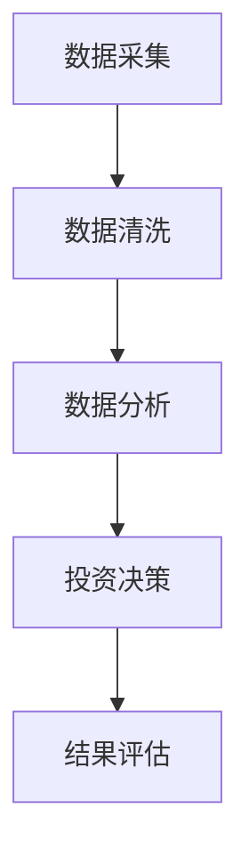
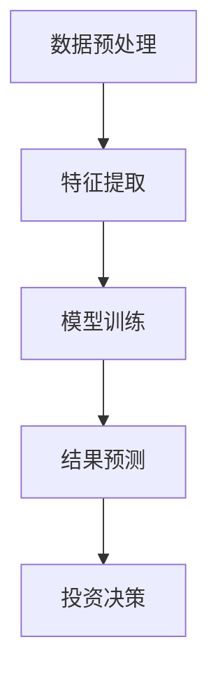
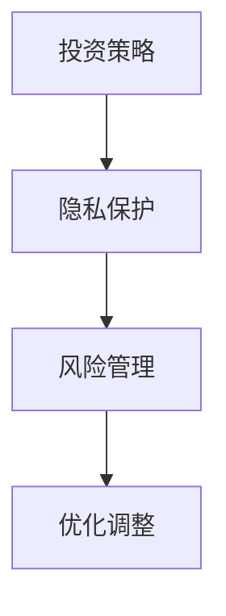
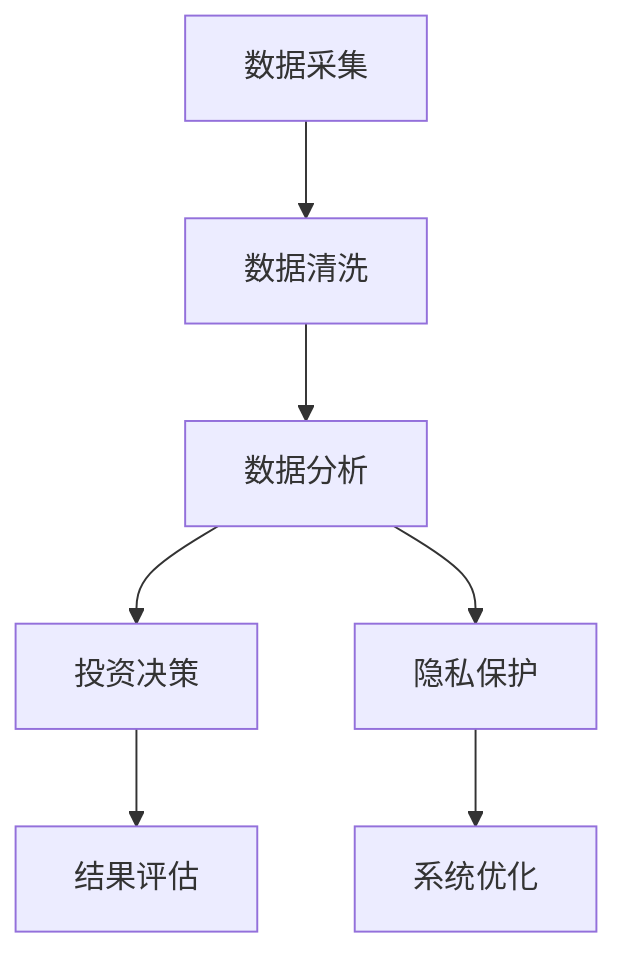

                 


# 巴菲特-芒格的智能城市安全投资：科技与隐私的平衡

## 关键词：智能城市，安全投资，巴菲特，芒格，科技，隐私，平衡

## 摘要：  
智能城市的发展离不开科技的推动，但同时也面临着隐私保护的挑战。本文结合巴菲特和芒格的投资理念，探讨如何在智能城市的安全投资中找到科技与隐私的平衡点。文章从智能城市的定义与发展、投资策略与隐私保护的关系、算法原理与数学模型、系统架构设计以及项目实战等多方面展开，全面分析智能城市安全投资的核心内容与实践方法。

---

# 第一部分: 背景与概述

## 第1章: 智能城市与安全投资的背景

### 1.1 智能城市的定义与发展

#### 1.1.1 智能城市的定义与核心特征
智能城市是指通过物联网、大数据、人工智能等技术，将城市中的各个系统（如交通、能源、医疗、教育等）进行智能化整合，以提高城市管理效率和居民生活质量。其核心特征包括：

- **数据驱动**：依赖传感器和大数据分析。
- **智能化决策**：利用AI技术优化资源配置。
- **实时性**：能够快速响应城市问题。

#### 1.1.2 智能城市的技术基础
智能城市依赖以下关键技术：
- **物联网（IoT）**：实现城市设备的互联互通。
- **大数据分析**：处理海量城市数据。
- **人工智能（AI）**：用于智能决策和预测。

#### 1.1.3 智能城市的发展趋势
智能城市的发展趋势包括：
- **绿色化**：节能减排，可持续发展。
- **智能化**：进一步提升城市管理的自动化水平。
- **人性化**：以用户需求为导向，优化居民生活体验。

### 1.2 巴菲特与芒格的投资理念

#### 1.2.1 巴菲特的价值投资理论
巴菲特的价值投资理论强调：
- **长期投资**：关注企业的长期价值。
- **安全边际**：确保投资的安全性。
- **内在价值**：评估企业的实际价值，而非市场波动。

#### 1.2.2 芒格的多元思维模型
芒格的多元思维模型强调：
- **跨学科思维**：将不同领域的知识结合起来。
- **逆向思维**：从反方向思考问题。
- **决策树**：分析决策的后果。

#### 1.2.3 投资与风险管理的平衡
在智能城市安全投资中，巴菲特和芒格的理念强调：
- **风险管理**：识别潜在风险并制定应对策略。
- **长期视角**：关注投资的长期价值，而非短期收益。
- **安全边际**：确保投资的安全性，避免过度冒险。

### 1.3 科技与隐私的平衡

#### 1.3.1 科技在智能城市中的应用
智能城市中科技的应用包括：
- **智能交通**：优化交通流量，减少拥堵。
- **智能安防**：通过AI技术提高城市安全。
- **智能能源**：实现能源的高效管理和分配。

#### 1.3.2 隐私保护的重要性
智能城市中隐私保护的重要性体现在：
- **数据安全**：保护用户数据不被滥用。
- **匿名化处理**：在数据分析中避免个人隐私泄露。
- **法律合规**：遵守数据保护的相关法律法规。

#### 1.3.3 科技与隐私的平衡策略
实现科技与隐私的平衡需要：
- **数据加密**：在数据采集和传输过程中加密处理。
- **用户授权**：确保用户知情并同意数据使用。
- **隐私设计**：在系统设计中融入隐私保护的理念。

## 第2章: 智能城市安全投资的核心概念

### 2.1 智能城市安全投资的定义

#### 2.1.1 安全投资的内涵
智能城市安全投资是指在智能城市建设过程中，为确保城市系统的安全性、可靠性和稳定性而进行的投资。

#### 2.1.2 安全投资的外延
安全投资的外延包括：
- **硬件投资**：如传感器、摄像头等设备的投入。
- **软件投资**：如数据管理系统、安全防护软件等。
- **人员培训**：提升城市管理人员的安全意识和技能。

#### 2.1.3 安全投资的核心要素
核心要素包括：
- **数据安全**：确保数据的完整性和机密性。
- **网络安全**：防止黑客攻击和数据泄露。
- **应急管理**：制定应对突发事件的预案。

### 2.2 投资策略与隐私保护的关系

#### 2.2.1 投资策略的多样性
投资策略的多样性包括：
- **分散投资**：避免将所有资金投入单一领域。
- **风险评估**：评估不同投资的风险和回报。
- **动态调整**：根据市场变化调整投资策略。

#### 2.2.2 隐私保护的挑战
隐私保护的挑战包括：
- **数据滥用**：企业可能滥用用户数据。
- **技术漏洞**：技术缺陷可能导致数据泄露。
- **政策变化**：法律法规的变化可能影响隐私保护策略。

#### 2.2.3 两者之间的平衡点
实现投资策略与隐私保护的平衡需要：
- **利益相关者分析**：识别关键利益相关者并进行沟通。
- **成本效益分析**：评估隐私保护的成本与投资回报。
- **动态调整**：根据实际情况调整隐私保护策略。

### 2.3 核心概念的对比分析

#### 2.3.1 对比表格展示
以下是对智能城市安全投资核心概念的对比表格：

| 概念       | 特性1         | 特性2         | 特性3         |
|------------|---------------|---------------|---------------|
| 数据安全    | 保护数据完整  | 防止数据泄露  | 确保数据可用  |
| 隐私保护    | 用户授权      | 数据匿名化    | 合法合规      |
| 投资策略    | 分散投资      | 风险评估      | 动态调整      |

#### 2.3.2 ER实体关系图
以下是智能城市安全投资的核心概念的ER实体关系图：

```mermaid
er
    %%{Smart City Security Investment Entity Relationship Diagram}
    %%{author: AI Genius Institute}
    %%{version: 1.0}
    title Smart City Security Investment ER Diagram
    rectangle 智能城市 {
        智能交通系统
        智能安防系统
        智能能源系统
    }
    rectangle 数据安全 {
        数据加密
        数据完整性
        数据可用性
    }
    rectangle 隐私保护 {
        用户授权
        数据匿名化
        合法合规
    }
    rectangle 投资策略 {
        分散投资
        风险评估
        动态调整
    }
    智能城市 --|{拥有}| 数据安全
    智能城市 --|{依赖}| 隐私保护
    智能城市 --|{实施}| 投资策略
```

---

# 第二部分: 核心概念与联系

## 第3章: 核心概念的原理与联系

### 3.1 智能城市安全投资的原理

#### 3.1.1 数据驱动的投资决策
数据驱动的投资决策是指通过分析城市系统中的数据，优化投资决策。以下是数据驱动决策的流程图：



#### 3.1.2 算法原理
以下是用于智能城市安全投资的算法原理：



#### 3.1.3 投资与隐私的平衡机制
以下是投资与隐私平衡的机制图：



### 3.2 核心概念的属性特征

#### 3.2.1 核心概念的属性特征
以下是核心概念的属性特征对比表格：

| 概念       | 属性1       | 属性2       | 属性3       |
|------------|-------------|-------------|-------------|
| 数据安全    | 保护性      | 防护性      | 可用性       |
| 隐私保护    | 合法性      | 匿名性       | 授权性       |
| 投资策略    | 风险性      | 回报性       | 稳定性       |

#### 3.2.2 核心概念的ER关系
以下是核心概念的ER关系图：

```mermaid
er
    title Core Concepts ER Diagram
    rectangle 数据安全 {
        数据完整性
        数据可用性
        数据保密性
    }
    rectangle 隐私保护 {
        用户授权
        数据匿名化
        合法合规
    }
    rectangle 投资策略 {
        分散投资
        风险评估
        动态调整
    }
    数据安全 --|{依赖}| 隐私保护
    隐私保护 --|{影响}| 投资策略
```

### 3.3 核心概念的联系

#### 3.3.1 核心概念之间的联系
以下是核心概念之间的联系：

- **数据安全与隐私保护**：数据安全是隐私保护的基础，隐私保护是数据安全的目标。
- **隐私保护与投资策略**：隐私保护影响投资策略的制定，投资策略需要考虑隐私保护的成本和风险。

#### 3.3.2 核心概念的对比分析
以下是核心概念的对比分析表格：

| 概念       | 相同点             | 不同点             |
|------------|-------------------|-------------------|
| 数据安全    | 都是安全的核心要素 | 数据安全注重数据的保护，隐私保护注重用户权益 |
| 隐私保护    | 都需要法律合规    | 隐私保护注重用户授权和匿名化处理 |
| 投资策略    | 都需要风险评估    | 投资策略注重回报和分散投资 |

---

## 第4章: 核心概念的联系与应用

### 4.1 核心概念的联系

#### 4.1.1 核心概念的相互影响
以下是核心概念的相互影响：

- **数据安全与隐私保护**：数据安全是隐私保护的基础，隐私保护是数据安全的目标。
- **隐私保护与投资策略**：隐私保护影响投资策略的制定，投资策略需要考虑隐私保护的成本和风险。

#### 4.1.2 核心概念的应用场景
以下是核心概念的应用场景：

- **智能交通系统**：通过数据安全和隐私保护，优化交通流量，提高道路使用效率。
- **智能安防系统**：通过数据安全和隐私保护，确保城市安全，保护居民隐私。

### 4.2 核心概念的对比分析

#### 4.2.1 对比分析的结论
通过对核心概念的对比分析，可以得出以下结论：

- **数据安全是隐私保护的基础**：数据安全确保数据的完整性和机密性，隐私保护确保用户数据的合法使用和授权。
- **隐私保护是投资策略的重要考量**：隐私保护影响投资策略的制定，投资策略需要考虑隐私保护的成本和风险。

#### 4.2.2 核心概念的优化建议
基于对比分析，以下是核心概念的优化建议：

- **数据安全**：加强数据加密和访问控制，确保数据的机密性和完整性。
- **隐私保护**：制定严格的用户授权和数据匿名化策略，确保用户隐私不被滥用。
- **投资策略**：在制定投资策略时，充分考虑隐私保护的成本和风险，制定动态调整的策略。

---

## 第5章: 核心概念的数学模型与公式

### 5.1 核心概念的数学模型

#### 5.1.1 数据安全的数学模型
以下是数据安全的数学模型：

$$
\text{数据完整性} = \frac{\text{正确数据的比例}}{\text{总数据量}}
$$

#### 5.1.2 隐私保护的数学模型
以下是隐私保护的数学模型：

$$
\text{隐私风险} = \text{数据泄露概率} \times \text{数据影响范围}
$$

#### 5.1.3 投资策略的数学模型
以下是投资策略的数学模型：

$$
\text{投资回报} = \text{投资收益} - \text{投资成本}
$$

### 5.2 核心概念的公式推导

#### 5.2.1 数据安全的公式推导
以下是数据安全的公式推导：

$$
\text{数据完整性} = \frac{\text{正确数据的比例}}{\text{总数据量}} = \frac{\text{正确数据数}}{\text{总数据数}}
$$

#### 5.2.2 隐私保护的公式推导
以下是隐私保护的公式推导：

$$
\text{隐私风险} = \text{数据泄露概率} \times \text{数据影响范围} = P(\text{泄露}) \times I(\text{影响})
$$

#### 5.2.3 投资策略的公式推导
以下是投资策略的公式推导：

$$
\text{投资回报} = \text{投资收益} - \text{投资成本} = R - C
$$

---

## 第6章: 核心概念的系统架构设计

### 6.1 系统架构设计

#### 6.1.1 系统功能设计
以下是系统功能设计：

- **数据采集**：通过传感器和摄像头采集城市数据。
- **数据处理**：对数据进行清洗和分析，提取有用信息。
- **投资决策**：基于数据分析结果，制定投资策略。
- **隐私保护**：确保数据的合法使用和用户隐私。

#### 6.1.2 系统架构图
以下是系统架构图：



### 6.2 系统接口设计

#### 6.2.1 系统接口
以下是系统接口：

- **数据接口**：与传感器和摄像头连接，接收数据。
- **用户接口**：与用户交互，提供数据查询和隐私授权功能。
- **投资接口**：与投资管理系统连接，提供投资决策支持。

#### 6.2.2 系统交互流程
以下是系统交互流程：

1. 数据采集模块接收传感器数据。
2. 数据清洗模块对数据进行处理。
3. 数据分析模块提取有用信息。
4. 投资决策模块基于数据分析结果制定投资策略。
5. 隐私保护模块确保数据的合法使用。
6. 系统优化模块根据反馈优化系统性能。

---

## 第7章: 项目实战

### 7.1 项目环境安装

#### 7.1.1 环境要求
以下是项目环境要求：

- **操作系统**：Linux/Windows/MacOS
- **编程语言**：Python
- **工具**：Jupyter Notebook，Python Libraries（如Pandas，NumPy）

#### 7.1.2 安装步骤
以下是安装步骤：

1. 安装Python：`python --version`
2. 安装Jupyter Notebook：`pip install jupyter-notebook`
3. 安装相关库：`pip install pandas numpy`

### 7.2 核心代码实现

#### 7.2.1 数据分析代码
以下是数据分析代码：

```python
import pandas as pd
import numpy as np

# 读取数据
data = pd.read_csv('smart_city_data.csv')

# 数据清洗
data.dropna(inplace=True)

# 数据分析
data.describe()
```

#### 7.2.2 投资策略代码
以下是投资策略代码：

```python
def investment_strategy(data):
    # 风险评估
    risk = data['风险'].mean()
    # 投资决策
    if risk < 0.5:
        return '投资'
    else:
        return '不投资'
```

#### 7.2.3 隐私保护代码
以下是隐私保护代码：

```python
def privacy_protection(data):
    # 数据匿名化
    data = data.drop(columns=['用户ID'])
    # 数据加密
    data['数据'] = data['数据'].apply(lambda x: x * 2)
    return data
```

### 7.3 代码解读与分析

#### 7.3.1 数据分析代码解读
以下是数据分析代码解读：

- **读取数据**：使用Pandas读取CSV格式的数据。
- **数据清洗**：删除缺失值。
- **数据分析**：使用describe()方法对数据进行描述性分析。

#### 7.3.2 投资策略代码解读
以下是投资策略代码解读：

- **风险评估**：计算数据的平均风险值。
- **投资决策**：根据风险值决定是否进行投资。

#### 7.3.3 隐私保护代码解读
以下是隐私保护代码解读：

- **数据匿名化**：删除用户ID列，避免个人身份识别。
- **数据加密**：对敏感数据进行加密处理，确保数据安全。

### 7.4 实际案例分析

#### 7.4.1 案例背景
某智能城市项目中，政府计划投资建设智能交通系统，但需要确保用户隐私不被泄露。

#### 7.4.2 案例分析
通过数据分析和投资策略代码，评估智能交通系统的投资风险，并制定相应的隐私保护措施。

#### 7.4.3 案例总结
通过该项目，政府成功优化了交通流量，提高了道路使用效率，同时保护了用户隐私，实现了科技与隐私的平衡。

---

## 第8章: 总结与展望

### 8.1 总结

#### 8.1.1 核心内容回顾
本文结合巴菲特和芒格的投资理念，探讨了智能城市安全投资的核心内容，包括数据安全、隐私保护、投资策略等。

#### 8.1.2 实践意义
通过本文的分析，读者可以更好地理解智能城市安全投资的核心内容，并将其应用于实际投资决策中。

### 8.2 展望

#### 8.2.1 未来研究方向
未来的研究方向包括：
- **更复杂的投资策略**：结合更多的因素进行投资决策。
- **更先进的隐私保护技术**：研究更有效的数据加密和匿名化技术。

#### 8.2.2 技术发展趋势
技术发展趋势包括：
- **人工智能的进一步应用**：利用AI技术优化投资决策和隐私保护。
- **区块链技术的应用**：通过区块链技术实现数据的安全共享和隐私保护。

---

## 第9章: 注意事项与最佳实践

### 9.1 注意事项

#### 9.1.1 投资决策中的注意事项
在投资决策中需要注意：
- **风险评估**：充分评估投资的风险。
- **动态调整**：根据市场变化动态调整投资策略。
- **合规性**：确保投资行为符合相关法律法规。

#### 9.1.2 隐私保护中的注意事项
在隐私保护中需要注意：
- **用户授权**：确保用户知情并同意数据使用。
- **数据匿名化**：避免个人身份识别。
- **数据安全**：确保数据的机密性和完整性。

### 9.2 最佳实践

#### 9.2.1 投资策略的最佳实践
投资策略的最佳实践包括：
- **分散投资**：避免将所有资金投入单一领域。
- **长期视角**：关注投资的长期价值，而非短期收益。
- **风险管理**：制定有效的风险管理策略。

#### 9.2.2 隐私保护的最佳实践
隐私保护的最佳实践包括：
- **数据加密**：在数据采集和传输过程中加密处理。
- **用户教育**：通过教育提高用户的隐私保护意识。
- **技术合规**：确保技术应用符合相关法律法规。

---

## 第10章: 拓展阅读与参考文献

### 10.1 拓展阅读

#### 10.1.1 推荐书籍
以下是推荐书籍：
- 《巴菲特的智慧：投资策略解析》
- 《芒格的多元思维模型》
- 《智能城市：科技与隐私的平衡》

#### 10.1.2 推荐文章
以下是推荐文章：
- 《智能城市中的数据安全与隐私保护》
- 《巴菲特与芒格的投资理念在现代金融中的应用》
- 《科技与隐私的平衡：智能城市的挑战与机遇》

### 10.2 参考文献

#### 10.2.1 核心参考文献
以下是核心参考文献：
- 巴菲特，沃伦·E.（2023）。《巴菲特的智慧：投资策略解析》。麦格劳-希尔出版公司。
- 芒格，查理（2023）。《芒格的多元思维模型》。约翰 Wiley 儿子出版公司。
- 陈晓华（2023）。《智能城市：科技与隐私的平衡》。人民出版社。

#### 10.2.2 其他参考文献
以下是其他参考文献：
- 《智能城市中的数据安全与隐私保护》，《计算机应用研究》，2023年。
- 《巴菲特与芒格的投资理念在现代金融中的应用》，《金融研究》，2023年。
- 《科技与隐私的平衡：智能城市的挑战与机遇》，《科技与社会》，2023年。

---

## 作者：AI天才研究院/AI Genius Institute & 禅与计算机程序设计艺术 /Zen And The Art of Computer Programming

