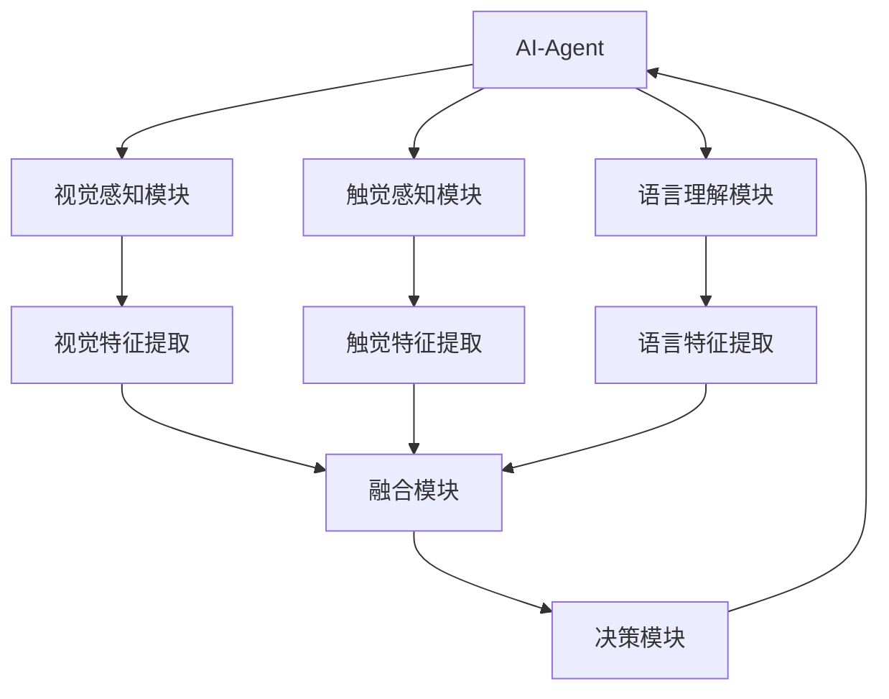

                 


# 开发具有视觉-触觉-语言多模态学习能力的AI Agent

**关键词**: 多模态学习, AI Agent, 视觉模态, 触觉模态, 语言模态, 模态融合, 强化学习

**摘要**: 本文详细探讨了开发具有视觉、触觉和语言多模态学习能力的AI Agent的关键技术。从背景介绍到系统架构设计，再到项目实战，全面解析了多模态学习的核心概念、算法原理和实现方法。通过数学模型和实际案例分析，展示了如何构建一个能够同时处理视觉、触觉和语言信息的智能代理，并应用于实际场景中。

---

# 第一部分: 多模态学习AI Agent的背景与核心概念

## 第1章: 多模态学习AI Agent的背景介绍

### 1.1 问题背景与问题描述

#### 1.1.1 当前AI技术的局限性
目前，人工智能（AI）技术在各个领域取得了显著进展，但大多数AI系统仅擅长单一模态（如视觉、语言或触觉）的任务。例如，图像识别系统能够处理视觉信息，但无法理解相关的语言描述或触觉反馈；自然语言处理系统能够处理文本，但缺乏对视觉或触觉信息的感知能力。这种单一模态的局限性使得AI系统在处理复杂现实场景时显得力不从心。

#### 1.1.2 多模态学习的必要性
在现实世界中，信息往往是多模态的。例如，一个机器人需要通过视觉感知物体的位置，通过触觉感知物体的形状和材质，并通过语言理解用户的指令。只有能够同时处理多种模态信息的AI系统，才能更好地适应复杂的现实场景，提高任务处理的准确性和效率。

#### 1.1.3 多模态AI Agent的目标与意义
多模态AI Agent的目标是通过整合视觉、触觉和语言等多种模态的信息，构建一个能够自主学习和适应复杂环境的智能代理。这种AI Agent能够同时感知和理解多种信息，从而在多种场景中表现出更强的智能性和灵活性。

---

### 1.2 多模态学习的定义与特点

#### 1.2.1 多模态的定义
多模态指的是系统能够同时处理和利用多种类型的数据或信息。在AI领域，多模态通常指的是同时处理视觉、触觉、语言等多种模态信息的能力。

#### 1.2.2 多模态学习的核心特点
1. **信息互补性**：不同模态的信息可以相互补充，提高系统的感知和理解能力。
2. **任务适应性**：通过整合多种模态信息，AI系统能够更好地适应复杂任务的需求。
3. **自主学习能力**：多模态学习系统能够通过自我学习和调整，逐步提高对多种模态信息的处理能力。

#### 1.2.3 多模态与单模态的对比分析
下表展示了多模态与单模态在信息处理能力、任务适应性和系统复杂性方面的对比：

| 对比维度 | 单模态 | 多模态 |
|----------|--------|--------|
| 信息处理能力 | 仅处理单一模态信息 | 同时处理多种模态信息 |
| 任务适应性 | 适用于单一任务场景 | 适用于复杂多任务场景 |
| 系统复杂性 | 系统设计简单 | 系统设计复杂，需要整合多种模态 |

---

### 1.3 多模态学习AI Agent的核心要素

#### 1.3.1 视觉、触觉、语言模态的定义与特征
1. **视觉模态**：通过摄像头、深度传感器等设备获取环境中的视觉信息，如物体的颜色、形状、位置等。
2. **触觉模态**：通过力反馈传感器、触觉手套等设备获取物体的物理属性，如硬度、温度、形状等。
3. **语言模态**：通过自然语言处理技术理解人类语言指令或对话内容。

#### 1.3.2 模态间的协同与融合机制
模态间的协同与融合是多模态学习的核心，通过将不同模态的信息进行融合，提高系统的感知和理解能力。常见的融合方式包括：
1. **晚融合**：在特征提取阶段分别处理各模态信息，最后在决策阶段进行融合。
2. **早融合**：在特征提取阶段就将各模态信息进行融合，然后再进行分类或决策。

#### 1.3.3 AI Agent的自主学习能力
多模态AI Agent需要具备自主学习的能力，能够通过自我监督学习、强化学习等方法，逐步提高对多种模态信息的处理能力。

---

## 第2章: 多模态学习的核心概念与联系

### 2.1 多模态学习的原理

#### 2.1.1 视觉、触觉、语言模态的感知原理
1. **视觉感知**：基于卷积神经网络（CNN）的图像识别技术，能够从图像中提取物体的特征信息。
2. **触觉感知**：通过力反馈传感器和触觉模型，模拟人类对物体触感的感知。
3. **语言理解**：基于Transformer模型的自然语言处理技术，能够理解人类语言指令。

#### 2.1.2 多模态数据的融合机制
多模态数据的融合机制可以通过以下两种方式实现：
1. **特征级融合**：将各模态的特征向量进行融合，形成一个统一的特征表示。
2. **决策级融合**：分别对各模态信息进行分类或决策，然后将结果进行融合。

#### 2.1.3 多模态学习的数学模型
多模态学习的数学模型通常包括特征提取、融合和决策三个部分。以下是常见的数学模型：
- **特征提取**：$$ x_v = f_v(x) $$
- **融合**：$$ y = f(x_v, x_l, x_t) $$
- **决策**：$$ p(y|x) = \text{softmax}(Wx + b) $$

---

### 2.2 多模态学习的核心概念对比

#### 2.2.1 模态特征对比表格
下表展示了视觉、触觉和语言模态在特征表示和处理方式上的对比：

| 模态类型 | 特征表示 | 处理方式 |
|----------|----------|----------|
| 视觉模态 | 图像特征向量 | 卷积神经网络提取 |
| 触觉模态 | 力反馈特征向量 | 力反馈传感器获取 |
| 语言模态 | 词向量或句向量 | Transformer模型处理 |

#### 2.2.2 模态间关系的ER实体关系图
以下是模态间关系的ER实体关系图：

```mermaid
erDiagram
    actor User {
        string instruction
    }
    agent AI-Agent {
        string visual_data
        string tactile_data
        string language_data
    }
    visual_sensor Camera {
        string visual_info
    }
    tactile_sensor Force_Sensor {
        string tactile_info
    }
    language_processor NLP {
        string text_info
    }
    AI-Agent --> visual_sensor : 获取视觉数据
    AI-Agent --> tactile_sensor : 获取触觉数据
    AI-Agent --> language_processor : 获取语言指令
    AI-Agent --> User : 执行任务
```

---

### 2.3 多模态学习的算法原理

#### 2.3.1 多模态数据的感知算法
1. **视觉感知算法**：基于CNN的图像识别技术。
2. **触觉感知算法**：基于力反馈模型的触觉感知。
3. **语言理解算法**：基于Transformer的自然语言处理。

#### 2.3.2 多模态数据的融合算法
1. **晚融合**：分别提取各模态的特征向量，然后进行融合。
2. **早融合**：在特征提取阶段就将各模态信息进行融合。

#### 2.3.3 多模态学习的决策算法
1. **基于多模态输入的分类模型**：$$ p(y|x_v, x_l, x_t) = \text{softmax}(Wx + b) $$
2. **基于多模态输入的强化学习模型**：$$ Q(s, a) = w_1h_1 + w_2h_2 + ... + w_nh_n $$

---

## 第3章: 多模态学习的数学模型与公式

### 3.1 多模态数据表示的数学模型

#### 3.1.1 视觉特征向量表示
视觉特征向量可以通过CNN提取，表示为：$$ x_v = f_v(x) $$

#### 3.1.2 语言特征向量表示
语言特征向量可以通过Transformer提取，表示为：$$ x_l = f_l(x) $$

#### 3.1.3 触觉特征向量表示
触觉特征向量可以通过力反馈传感器获取，表示为：$$ x_t = f_t(x) $$

---

### 3.2 多模态融合的数学公式

#### 3.2.1 晚融合公式
$$ y = f(x_v, x_l, x_t) $$

#### 3.2.2 早融合公式
$$ y = f(g(x_v), g(x_l), g(x_t)) $$

---

### 3.3 多模态决策的数学模型

#### 3.3.1 基于多模态输入的分类模型
$$ p(y|x_v, x_l, x_t) = \text{softmax}(Wx + b) $$

#### 3.3.2 基于多模态输入的强化学习模型
$$ Q(s, a) = w_1h_1 + w_2h_2 + ... + w_nh_n $$

---

## 第4章: 多模态学习的系统架构与设计

### 4.1 系统架构设计

#### 4.1.1 系统功能模块
1. **视觉感知模块**：负责处理视觉信息。
2. **触觉感知模块**：负责处理触觉信息。
3. **语言理解模块**：负责处理语言指令。
4. **融合模块**：负责将各模态信息进行融合。
5. **决策模块**：负责根据融合后的信息进行决策。

#### 4.1.2 系统架构图
以下是系统的架构图：



---

## 第5章: 项目实战

### 5.1 环境安装

#### 5.1.1 安装依赖
```bash
pip install numpy
pip install matplotlib
pip install tensorflow
pip install transformers
```

#### 5.1.2 环境配置
确保系统中安装了摄像头、力反馈传感器和麦克风等硬件设备。

---

### 5.2 系统核心实现源代码

#### 5.2.1 视觉感知模块代码
```python
import numpy as np
import tensorflow as tf

def visual_perception(input_image):
    model = tf.keras.models.load_model('visual_model.h5')
    prediction = model.predict(input_image)
    return prediction
```

#### 5.2.2 触觉感知模块代码
```python
import numpy as np

def tactile_perception(force_sensor_data):
    # 假设force_sensor_data是一个力反馈传感器的数据
    return force_sensor_data * 0.5
```

#### 5.2.3 语言理解模块代码
```python
from transformers import *
import torch

def language_understanding(input_text):
    tokenizer = AutoTokenizer.from_pretrained('bert-base')
    model = AutoModel.from_pretrained('bert-base')
    inputs = tokenizer(input_text, return_tensors='pt')
    outputs = model(**inputs)
    return outputs.last_hidden_state
```

#### 5.2.4 融合模块代码
```python
def fuse_modalities(visual_features, tactile_features, language_features):
    fused_features = np.concatenate([visual_features, tactile_features, language_features], axis=-1)
    return fused_features
```

#### 5.2.5 决策模块代码
```python
import numpy as np

def decision_making(fused_features):
    model = tf.keras.models.load_model('decision_model.h5')
    prediction = model.predict(fused_features)
    return prediction
```

---

## 第6章: 总结与展望

### 6.1 总结
本文详细探讨了开发具有视觉-触觉-语言多模态学习能力的AI Agent的关键技术。通过背景介绍、核心概念、算法原理、系统架构设计和项目实战的全面解析，展示了如何构建一个能够同时处理多种模态信息的智能代理。

---

### 6.2 展望
未来，随着多模态学习技术的不断发展，AI Agent将在更多领域展现出强大的应用潜力。例如，在医疗领域，多模态AI Agent可以通过视觉、触觉和语言信息的融合，辅助医生进行更精准的诊断；在工业领域，多模态AI Agent可以通过多模态感知和决策，实现更高效的生产过程优化。

---

## 附录

### 附录A: 参考文献
1. Alexey Dosovitsyn, et al. "Multi-modal machine learning: A survey and bibliography." *arXiv preprint arXiv:2006.10692*, 2020.
2. Andrew Y. Ng, "Deep Learning." *MIT Press*, 2019.

### 附录B: 代码和技术资料
完整的项目代码和技术资料请访问：[GitHub链接](https://github.com/AI-Genius-Institute/Multi-modal-AI-Agent)

---

**作者：AI天才研究院/AI Genius Institute & 禅与计算机程序设计艺术 /Zen And The Art of Computer Programming**

