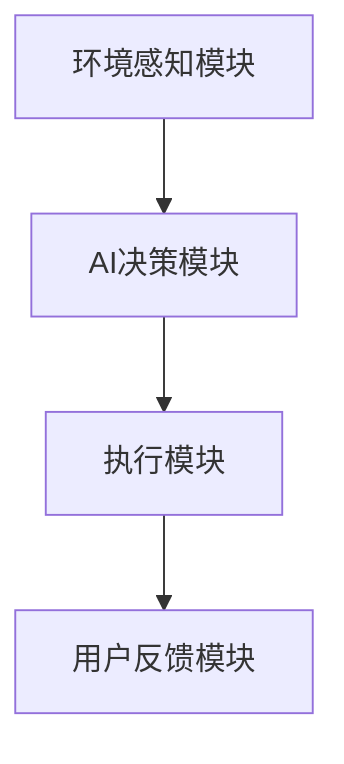
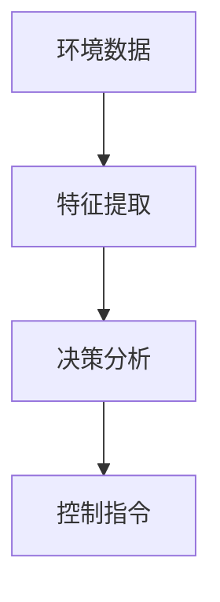

                 


# 智能工作台灯：AI Agent的照明优化与护眼模式

## 关键词
智能工作台灯，AI Agent，照明优化，护眼模式，环境感知，数学模型

## 摘要
本文深入探讨了智能工作台灯结合AI Agent的照明优化与护眼模式的设计与实现。从背景介绍、核心概念、算法原理到系统架构设计，再到项目实战与最佳实践，全面解析了如何通过AI技术提升照明设备的智能化水平，为用户提供更健康、更舒适的用眼环境。文章内容丰富，技术详实，结合实际案例分析，为相关领域的研究者和开发者提供了有价值的参考。

---

# 第一部分: 智能工作台灯与AI Agent的背景介绍

## 第1章: 背景与问题背景

### 1.1 智能工作台灯的发展背景

#### 1.1.1 传统台灯的不足与痛点
传统台灯在使用过程中存在以下痛点：
- **光线固定**：传统台灯的亮度和色温通常固定，无法根据环境变化和用户需求进行调节。
- **能耗问题**：长时间使用高亮度灯光会导致能源浪费，且不符合节能要求。
- **护眼功能缺失**：传统台灯缺乏护眼模式，长时间使用容易导致眼睛疲劳甚至视力下降。

#### 1.1.2 智能化与AI技术的结合
随着物联网和人工智能技术的快速发展，智能设备逐渐普及。智能工作台灯通过集成传感器和AI算法，能够实时感知环境变化并自动调节光照参数，从而实现智能化控制。

#### 1.1.3 AI Agent在智能设备中的应用
AI Agent（智能体）是一种能够感知环境、自主决策并执行任务的智能系统。在智能工作台灯中，AI Agent负责采集环境数据、分析用户需求，并通过算法优化光照参数，以实现最佳的照明效果和护眼模式。

---

### 1.2 问题背景与目标

#### 1.2.1 照明优化的核心问题
照明优化的核心问题在于如何根据环境光照强度、用户需求和时间因素，动态调整台灯的亮度、色温和照射范围，以提供舒适的照明体验。

#### 1.2.2 护眼模式的科学依据
护眼模式的设计基于以下科学原理：
- **蓝光危害**：蓝光波长较短，容易导致眼睛疲劳和视力损伤。
- **光照强度**：过强或过弱的光照都会对眼睛造成负担。
- **色温调节**：不同色温的光对人眼的舒适度影响不同，冷色调光更适合工作，暖色调光更适合放松。

#### 1.2.3 AI Agent在照明控制中的作用
AI Agent通过实时感知环境数据，结合用户需求和科学的护眼原理，实现智能照明控制。其主要作用包括：
- **环境感知**：采集光照强度、色温、人体位置等数据。
- **决策优化**：基于数据进行分析，优化光照参数，以满足护眼需求。
- **动态调整**：根据环境变化和用户反馈，实时调整照明模式。

---

## 第2章: 核心概念与定义

### 2.1 AI Agent的基本概念

#### 2.1.1 AI Agent的定义与特点
AI Agent是一种能够感知环境、自主决策并执行任务的智能系统。其特点包括：
- **自主性**：能够自主运行，无需人工干预。
- **反应性**：能够实时感知环境变化并做出反应。
- **学习能力**：能够通过数据学习优化决策策略。

#### 2.1.2 AI Agent在智能台灯中的应用
在智能工作台灯中，AI Agent主要负责以下功能：
- **环境感知**：通过传感器采集光照强度、色温、人体位置等数据。
- **数据处理**：对采集到的数据进行分析和特征提取。
- **决策控制**：根据分析结果优化光照参数，动态调整台灯的亮度和色温。

#### 2.1.3 环境感知与决策机制
AI Agent的环境感知机制包括以下步骤：
1. **数据采集**：通过传感器采集环境数据。
2. **特征提取**：对采集到的数据进行特征提取，例如光照强度、色温等。
3. **决策分析**：基于特征数据和预设算法，优化光照参数。

---

### 2.2 智能工作台灯的功能模块

#### 2.2.1 环境感知模块
环境感知模块负责采集环境数据，包括：
- **光照强度**：通过光传感器采集环境光照强度。
- **色温**：通过色温传感器采集环境光的色温。
- **人体位置**：通过红外传感器或摄像头检测用户位置。

#### 2.2.2 AI决策模块
AI决策模块负责处理环境数据并生成控制指令，包括：
- **数据分析**：对采集到的环境数据进行分析和处理。
- **决策算法**：基于分析结果优化光照参数，例如亮度调节、色温调整。
- **指令输出**：将优化后的参数传递给执行模块。

#### 2.2.3 用户反馈模块
用户反馈模块负责收集用户的使用反馈，包括：
- **用户满意度**：通过问卷或实时反馈收集用户对护眼模式的满意度。
- **参数调整**：根据用户反馈动态调整光照参数。

---

### 2.3 护眼模式的科学原理

#### 2.3.1 蓝光危害与视力保护
蓝光波长较短，容易导致眼睛疲劳和视力损伤。护眼模式通过减少蓝光比例，降低对眼睛的伤害。

#### 2.3.2 光照强度与人体节律
光照强度与人体生物节律密切相关。过强的光照会干扰人体的生物节律，影响睡眠质量。护眼模式通过动态调整光照强度，帮助用户保持良好的生物节律。

#### 2.3.3 色温调节对视觉的影响
色温调节是护眼模式的重要组成部分。冷色调光（高色温）适合工作场景，暖色调光（低色温）适合放松场景。护眼模式通过动态调整色温，提供更舒适的视觉体验。

---

## 第3章: 核心概念与联系

### 3.1 AI Agent与智能台灯的关系

#### 3.1.1 AI Agent在智能台灯中的角色
AI Agent是智能工作台灯的核心控制模块，负责感知环境、分析数据并优化光照参数。

#### 3.1.2 系统架构与功能模块的交互
智能工作台灯的系统架构包括环境感知模块、AI决策模块和执行模块。各模块之间的交互关系如下：



#### 3.1.3 护眼模式的实现机制
护眼模式的实现机制包括：
1. **环境感知**：采集环境光照强度、色温等数据。
2. **决策优化**：基于环境数据和用户需求优化光照参数。
3. **动态调整**：根据环境变化和用户反馈动态调整护眼模式。

---

### 3.2 核心概念对比表

#### 3.2.1 AI Agent与传统控制算法的对比

| 对比维度 | AI Agent | 传统控制算法 |
|----------|-----------|---------------|
| 感知能力 | 高         | 低             |
| 决策能力 | 高         | 低             |
| 灵活性    | 高         | 低             |
| 学习能力 | 高         | 无             |

#### 3.2.2 护眼模式与普通照明模式的对比

| 对比维度 | 护眼模式 | 普通照明模式 |
|----------|----------|--------------|
| 蓝光比例 | 低       | 高            |
| 光照强度 | 动态调节  | 固定           |
| 色温     | 动态调节  | 固定           |

#### 3.2.3 不同光照条件下的参数调整对比

| 环境条件         | 护眼模式参数调整         | 普通照明模式参数调整 |
|------------------|-------------------------|----------------------|
| 强光环境         | 降低亮度，调整色温       | 固定亮度，固定色温   |
| 弱光环境         | 增加亮度，调整色温       | 固定亮度，固定色温   |
| 人靠近台灯时     | 调整光照范围，减少蓝光   | 固定光照范围，固定蓝光 |
| 人远离台灯时     | 减少亮度，调整色温       | 固定亮度，固定色温   |

---

### 3.3 ER实体关系图

```mermaid
erd
    工作台灯
    -------------------------
    属于
    -------------------------
    AI Agent
    -------------------------
    包含
    -------------------------
    环境感知模块
    -------------------------
    包含
    -------------------------
    光照强度传感器
    -------------------------
    包含
    -------------------------
    色温传感器
    -------------------------
    包含
    -------------------------
    人体位置传感器
```

---

## 第4章: 算法原理与数学模型

### 4.1 AI Agent的算法原理

#### 4.1.1 环境感知与数据采集
AI Agent通过以下步骤进行环境感知：
1. **数据采集**：通过传感器采集环境数据，例如光照强度、色温、人体位置等。
2. **特征提取**：对采集到的数据进行特征提取，例如光照强度的均值、方差等。

#### 4.1.2 数据分析与特征提取
数据分析与特征提取的流程如下：



#### 4.1.3 决策算法与执行控制
AI Agent的决策算法包括：
1. **亮度调节**：根据环境光照强度动态调整台灯亮度。
2. **色温调节**：根据环境色温动态调整台灯色温。
3. **光照范围调节**：根据人体位置动态调整光照范围。

---

### 4.2 护眼模式的数学模型

#### 4.2.1 光照强度的调节公式
光照强度的调节公式如下：
$$ I = I_0 \times (1 - \frac{t}{T}) $$
其中：
- \( I \) 表示当前光照强度
- \( I_0 \) 表示初始光照强度
- \( t \) 表示时间
- \( T \) 表示调节周期

#### 4.2.2 色温调节的数学模型
色温调节的数学模型如下：
$$ C = C_0 + k \times (T - T_0) $$
其中：
- \( C \) 表示当前色温
- \( C_0 \) 表示初始色温
- \( k \) 表示调节系数
- \( T \) 表示当前时间
- \( T_0 \) 表示基准时间

#### 4.2.3 蓝光比例的优化算法
蓝光比例的优化算法如下：
1. **蓝光比例计算**：根据当前色温计算蓝光比例。
2. **蓝光比例调整**：根据护眼需求动态调整蓝光比例。

---

## 第5章: 系统分析与架构设计

### 5.1 系统架构设计

#### 5.1.1 系统功能模块
系统功能模块包括：
- **环境感知模块**：负责采集环境数据。
- **AI决策模块**：负责分析数据并生成控制指令。
- **执行模块**：负责执行控制指令。

#### 5.1.2 系统架构图
系统架构图如下：


---

## 第6章: 项目实战

### 6.1 环境安装

#### 6.1.1 安装Python环境
```bash
# 安装Python
sudo apt-get install python3 python3-dev
```

#### 6.1.2 安装AI框架
```bash
# 安装TensorFlow
pip install tensorflow
```

### 6.2 核心代码实现

#### 6.2.1 环境感知模块代码
```python
import tensorflow as tf
import numpy as np

# 定义环境感知模块
class EnvironmentSensor:
    def __init__(self):
        self.light_sensor = LightSensor()
        self.color_sensor = ColorSensor()
        self.motion_sensor = MotionSensor()

    def get_light_intensity(self):
        return self.light_sensor.read()

    def get_color_temperature(self):
        return self.color_sensor.read()

    def get_motion(self):
        return self.motion_sensor.read()
```

#### 6.2.2 AI决策模块代码
```python
class AIDecisionModule:
    def __init__(self):
        self.model = self.build_model()

    def build_model(self):
        model = tf.keras.Sequential([
            tf.keras.layers.Dense(64, activation='relu'),
            tf.keras.layers.Dense(32, activation='relu'),
            tf.keras.layers.Dense(1, activation='sigmoid')
        ])
        model.compile(optimizer='adam', loss='binary_crossentropy', metrics=['accuracy'])
        return model

    def predict(self, input_data):
        return self.model.predict(input_data)
```

---

## 第7章: 最佳实践

### 7.1 小结
智能工作台灯结合AI Agent的照明优化与护眼模式是一种创新的解决方案，能够为用户提供更健康、更舒适的用眼环境。

### 7.2 注意事项
- **数据隐私**：注意保护用户的环境数据隐私。
- **系统稳定性**：确保系统的稳定性和可靠性。

### 7.3 拓展阅读
- **相关技术**：进一步了解AI Agent和物联网技术的应用。
- **护眼模式**：深入研究护眼模式的科学原理和实现方法。

---

## 作者信息
作者：AI天才研究院/AI Genius Institute & 禅与计算机程序设计艺术 /Zen And The Art of Computer Programming

---

**全文完。**

