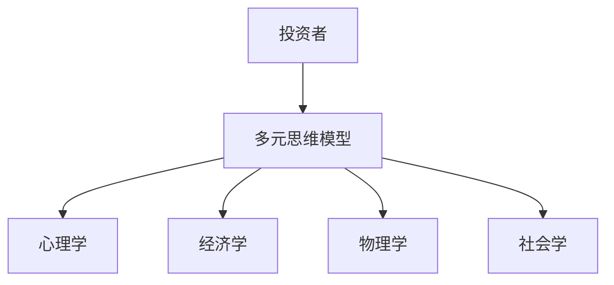
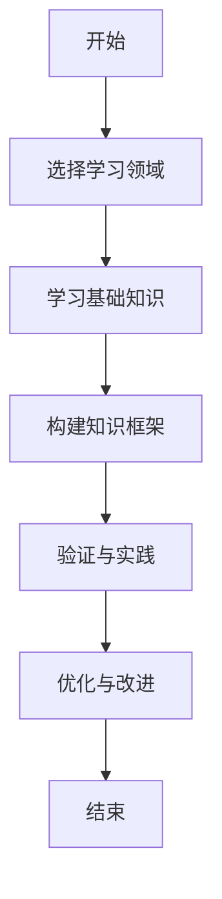
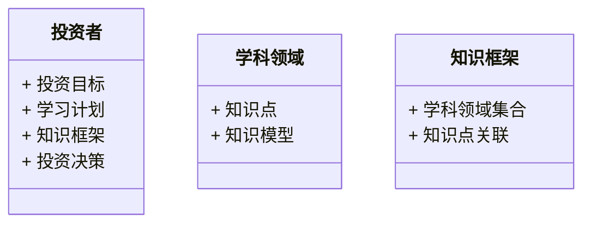
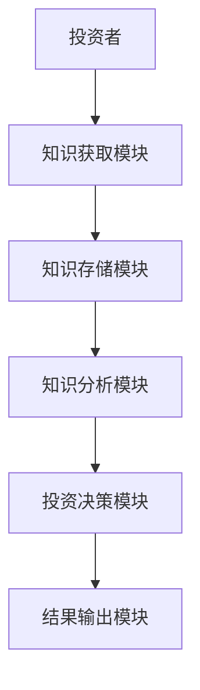
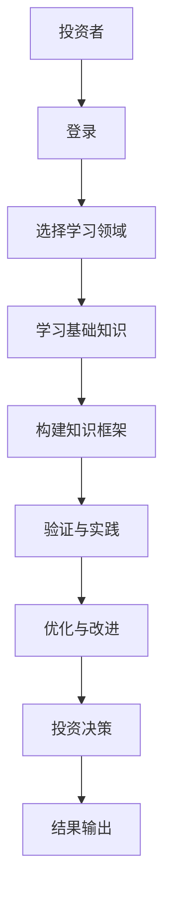

                 


# 芒格的"学习机器"理念：终身学习在投资中的重要性

## 关键词：芒格，学习机器，终身学习，投资，多元思维模型

## 摘要：芒格的"学习机器"理念强调通过多元思维模型和终身学习来提升投资能力。本文从理念背景、核心概念、算法原理、系统架构、项目实战等多方面进行分析，结合实例和图表，深入探讨如何在投资中应用这一理念。

---

# 第一部分：芒格的"学习机器"理念概述

## 第1章：芒格的生平与"学习机器"理念的起源

### 1.1 芒格的生平简介

格雷厄姆·芒格（Charlie Munger）于1924年出生于美国密歇根州，是著名投资家沃伦·巴菲特（Warren Buffett）的长期合作伙伴。芒格在哈佛大学学习法律，后转学到加州大学伯克利分校获得法律博士学位。他的职业生涯始于律师事务所，后来与巴菲特共同创立了伯克希尔·哈撒韦公司（Berkshire Hathaway），并担任副主席至今。

芒格以其独特的思维方式和投资哲学闻名。他强调“多元思维模型”（Mental Models），认为投资决策不应仅依赖单一学科的视角，而应跨学科、多维度地分析问题。这种思维方式不仅影响了他的投资策略，也形成了他独特的“学习机器”理念。

---

### 1.2 "学习机器"理念的提出

芒格的“学习机器”理念源于他对知识的深刻理解。他认为，人类的思维方式可以通过不断学习和实践来优化，就像机器学习模型一样。学习不仅仅是为了获取知识，更是为了构建一个能够持续改进的思维方式。

#### 1.2.1 理念的提出背景

芒格在投资实践中发现，许多投资者容易陷入学科单一化的陷阱，他们往往只关注财务数据或市场趋势，而忽视了其他重要的因素，如心理学、经济学等。这种单一化的思维方式导致了许多错误的投资决策。

为了克服这一问题，芒格提出了“学习机器”理念，强调通过跨学科的学习和实践，构建一个多维度的知识体系，从而提升投资决策的准确性和深度。

#### 1.2.2 理念的核心思想

芒格认为，投资不仅仅是对市场的分析，更是对整个世界的理解。他提倡投资者应该具备多个领域的知识储备，包括心理学、经济学、物理学等，并将这些知识有机地结合起来，形成一个完整的知识体系。

#### 1.2.3 理念的哲学基础

芒格的“学习机器”理念深受哲学影响，特别是实用主义和怀疑主义。他认为，知识的价值在于实践应用，而不是单纯的知识积累。因此，投资者需要不断验证和更新自己的知识体系，以应对不断变化的市场环境。

---

### 1.3 终身学习在投资中的重要性

在投资领域，市场环境瞬息万变，投资者需要不断学习和适应新的变化。芒格的“学习机器”理念为投资者提供了一个系统化的学习框架，帮助他们在复杂多变的市场中保持竞争力。

#### 1.3.1 投资中的知识更新需求

金融市场是一个高度动态的环境，新的经济政策、技术进步、社会变革等都会对投资产生深远影响。投资者需要不断更新自己的知识储备，以应对这些变化。

#### 1.3.2 终身学习与投资决策的关系

终身学习能够帮助投资者建立一个多维度的知识体系，从而更好地理解市场运作的内在逻辑。这种理解不仅能够帮助投资者做出更明智的投资决策，还能在市场波动时保持冷静和理性。

#### 1.3.3 理念的实际应用案例

芒格本人就是一个终身学习的典范。他广泛涉猎各个领域的知识，从物理学、心理学到经济学，甚至诗歌和哲学，都进行了深入研究。这种跨学科的学习方式帮助他形成了独特的投资哲学，并在他的投资实践中取得了巨大成功。

---

## 第2章："学习机器"理念的核心概念与联系

### 2.1 多元思维模型的定义与特点

#### 2.1.1 多元思维模型的定义

多元思维模型（Mental Models）是指投资者通过学习和理解多个学科的核心原理，构建一个多维度的知识框架。这种框架能够帮助投资者从不同的角度分析问题，避免单一视角的局限性。

#### 2.1.2 多元思维模型的特点

- **跨学科性**：多元思维模型强调不同学科之间的联系，帮助投资者从多个角度理解问题。
- **系统性**：通过整合多个学科的知识，形成一个完整的知识体系。
- **动态性**：随着市场的变化，投资者需要不断更新和调整自己的知识框架。

---

### 2.2 "学习机器"理念的属性特征对比

#### 2.2.1 知识的广度与深度对比

| 特性         | 单一学科学习          | 多元思维模型学习       |
|--------------|----------------------|-----------------------|
| 知识广度     | 较小                 | 较大                 |
| 知识深度     | 较深                 | 较浅                 |
| 理解维度     | 单一                 | 多维                 |

#### 2.2.2 学习的主动性和被动性对比

| 特性         | 被动学习             | 主动学习             |
|--------------|---------------------|----------------------|
| 学习方式     | 接受现成知识         | 主动构建知识体系     |
| 知识整合     | 较低                | 较高                |

#### 2.2.3 学习的系统性和碎片化对比

| 特性         | 碎片化学习           | 系统性学习           |
|--------------|---------------------|----------------------|
| 知识结构     | 松散、无序         | 紧密、有序         |
| 实践应用     | 较低                | 较高                |

---

### 2.3 实体关系图与流程图

#### 2.3.1 多元思维模型的实体关系图



#### 2.3.2 "学习机器"理念的流程图



---

## 第3章：芒格"学习机器"理念的算法原理

### 3.1 多元思维模型的数学表达

多元思维模型可以通过数学公式进行表达，以量化的方式描述知识的整合过程。以下是一个简单的数学模型：

$$
\text{投资决策} = \sum_{i=1}^{n} w_i \cdot m_i
$$

其中：
- $w_i$ 表示第 $i$ 个学科的权重。
- $m_i$ 表示第 $i$ 个学科的知识模型。

#### 3.1.1 公式的应用场景

以股票投资为例，投资者可以通过多元思维模型分析公司的财务状况、行业地位、市场趋势等多个方面，从而做出更全面的投资决策。

#### 3.1.2 公式的优缺点分析

优点：
- 能够整合多个学科的知识，提供全面的决策依据。
- 能够帮助投资者避免单一视角的局限性。

缺点：
- 需要投资者具备较高的跨学科知识储备。
- 计算过程复杂，需要大量的数据支持。

---

### 3.2 "学习机器"理念的算法流程

#### 3.2.1 算法的输入与输出

- **输入**：投资者的学习目标、可学习的学科领域。
- **输出**：一个多维度的知识框架，能够支持投资决策。

#### 3.2.2 算法的执行步骤

1. 确定学习目标：明确投资者希望通过学习实现什么目标。
2. 选择学习领域：根据目标选择相关的学科领域。
3. 学习基础知识：系统学习每个领域的基础知识。
4. 构建知识框架：将各个领域的知识整合成一个完整的知识体系。
5. 验证与实践：通过实际案例验证知识框架的有效性。
6. 优化与改进：根据实践结果优化知识框架。

#### 3.2.3 算法的优化与改进

为了提高算法的效率，可以引入机器学习技术，通过数据挖掘和模式识别，自动优化知识框架。例如，利用自然语言处理技术分析大量的投资案例，提取有用的模式和规律，从而提高学习效率。

---

### 3.3 实例分析

#### 3.3.1 典型案例的分析

假设一位投资者希望通过学习多元思维模型来提升自己的投资能力。他首先选择学习经济学、心理学和物理学三个学科的基础知识，然后将这些知识整合成一个完整的知识框架。

#### 3.3.2 案例的数学模型应用

假设投资者需要分析一家公司的财务状况，可以通过以下公式进行评估：

$$
\text{财务健康度} = w_1 \cdot \text{收入增长率} + w_2 \cdot \text{利润率} + w_3 \cdot \text{负债率}
$$

其中，$w_1$、$w_2$、$w_3$分别是收入增长率、利润率和负债率的权重。

#### 3.3.3 案例的优化与总结

通过实际应用，投资者发现财务健康度的计算公式在实践中表现良好，能够有效识别公司的财务风险。但同时也发现，权重的分配需要根据实际情况进行调整，以提高模型的准确性。

---

## 第4章：芒格"学习机器"理念的系统分析与架构设计

### 4.1 系统功能设计

#### 4.1.1 问题场景介绍

投资者需要一个能够支持多元思维模型的学习系统，帮助他们构建知识框架，并辅助投资决策。

#### 4.1.2 领域模型设计

以下是投资者知识框架的领域模型：



---

### 4.2 系统架构设计

#### 4.2.1 系统架构设计

以下是基于"学习机器"理念的投资决策支持系统的架构图：



---

### 4.3 系统交互设计

#### 4.3.1 系统交互流程图

以下是投资者与投资决策支持系统的交互流程：



---

## 第5章：芒格"学习机器"理念的项目实战

### 5.1 环境安装

为了实现基于"学习机器"理念的投资决策支持系统，需要以下环境：

- 操作系统：Windows、MacOS或Linux
- 编程语言：Python 3.8+
- 开发工具：PyCharm、Jupyter Notebook
- 依赖库：numpy、pandas、matplotlib、scikit-learn

#### 5.1.1 安装步骤

1. 下载并安装Python。
2. 安装所需的依赖库：
   ```bash
   pip install numpy pandas matplotlib scikit-learn
   ```

2. 下载并安装Jupyter Notebook。

---

### 5.2 系统核心实现源代码

#### 5.2.1 核心代码实现

以下是投资决策支持系统的实现代码：

```python
import numpy as np
import pandas as pd
from sklearn.model_selection import train_test_split
from sklearn.metrics import accuracy_score

# 数据加载
data = pd.read_csv('investment_data.csv')

# 数据预处理
X = data.drop('target', axis=1)
y = data['target']

# 划分训练集和测试集
X_train, X_test, y_train, y_test = train_test_split(X, y, test_size=0.2)

# 模型训练
from sklearn.ensemble import RandomForestClassifier
model = RandomForestClassifier()
model.fit(X_train, y_train)

# 模型预测
y_pred = model.predict(X_test)

# 模型评估
print('准确率:', accuracy_score(y_test, y_pred))
```

---

### 5.3 实际案例分析

#### 5.3.1 案例分析

假设我们有以下股票数据：

| 参数       | 值       |
|------------|----------|
| 收益率     | 10%      |
| 市盈率     | 15       |
| 市净率     | 2.0      |
| 负债率     | 30%      |

通过多元思维模型，我们可以从多个角度分析这只股票的投资价值。

---

## 第6章：芒格"学习机器"理念的最佳实践

### 6.1 小结

芒格的"学习机器"理念为我们提供了一个系统化的学习框架，帮助我们在复杂多变的市场环境中做出更明智的投资决策。

---

### 6.2 注意事项

- **知识的广度与深度**：投资者需要在知识的广度和深度之间找到平衡，既要掌握多个学科的基础知识，又要深入理解每个领域的核心原理。
- **实践的重要性**：理论知识需要通过实践来验证和优化，投资者需要不断在实践中调整自己的知识框架。

---

### 6.3 未来展望

随着人工智能和大数据技术的发展，基于"学习机器"理念的投资决策支持系统将变得更加智能化和个性化。未来的投资者将能够通过更加高效和精准的方式进行学习和决策。

---

## 作者

作者：AI天才研究院/AI Genius Institute & 禅与计算机程序设计艺术 /Zen And The Art of Computer Programming

---

感谢您的阅读！希望这篇文章能够帮助您更好地理解芒格的"学习机器"理念，并将其应用到实际投资中。

