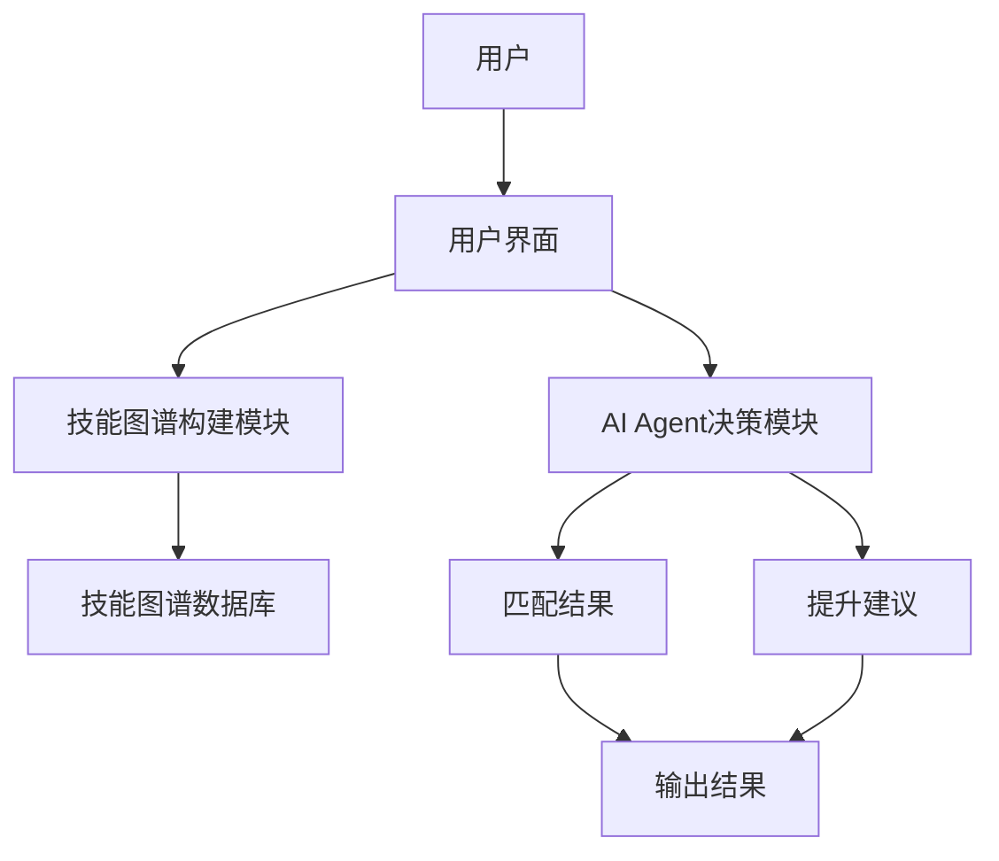
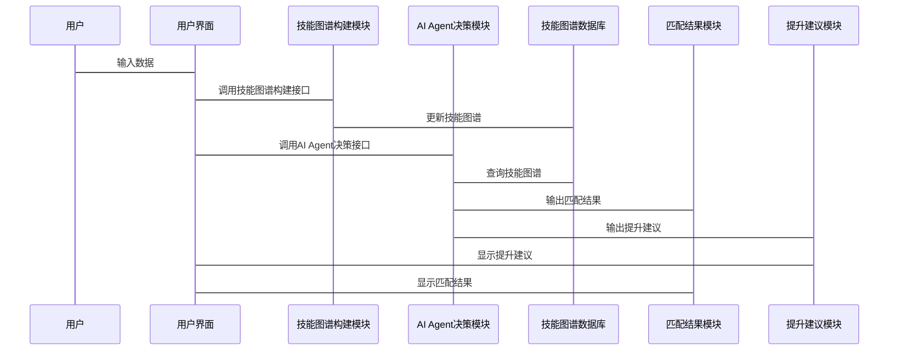

                 

<think>
好，我需要帮助用户撰写一篇关于《AI Agent在企业人才发展与技能图谱构建中的应用》的技术博客文章。用户已经提供了一个详细的目录大纲，并且希望我根据这个大纲逐步完成文章的撰写。

首先，我需要理解文章的核心主题，即AI Agent如何在企业人才发展和技能图谱构建中应用。这涉及到AI技术在企业人才管理中的具体应用，如技能评估、人才匹配、职业发展规划等。

接下来，我会按照目录大纲的结构，逐章节进行内容的撰写。每一章都需要详细展开，包括核心概念、算法原理、系统架构设计、项目实战等内容。

在撰写过程中，我需要确保语言简洁、逻辑清晰，同时使用专业且易懂的技术语言。对于一些复杂的技术细节，我需要通过图表、代码示例和数学公式来辅助说明，例如使用mermaid绘制流程图和系统架构图，以及在适当的位置插入latex公式。

另外，我还需要注意文章的整体结构和连贯性，确保每一部分都能够自然过渡，帮助读者逐步理解AI Agent在企业人才发展中的应用。

最后，我会在文章末尾添加作者信息，以符合用户的格式要求。

好的，现在我开始根据目录大纲逐步撰写文章内容。

# 《AI Agent在企业人才发展与技能图谱构建中的应用》

> 关键词：AI Agent, 企业人才发展, 技能图谱, 人工智能, 技能匹配

> 摘要：随着人工智能技术的快速发展，AI Agent在企业人才发展与技能图谱构建中的应用越来越广泛。本文将从AI Agent的基本概念出发，探讨其在企业人才发展中的核心作用，详细分析技能图谱的构建方法，并结合实际案例，深入讲解AI Agent在技能匹配、人才评估和职业发展规划中的具体应用。通过本文，读者可以全面了解AI Agent如何助力企业优化人才管理，提升员工技能匹配效率，为企业创造更大的价值。

---

# 第1章: AI Agent与企业人才发展的背景介绍

## 1.1 AI Agent的基本概念

### 1.1.1 AI Agent的定义与特点
AI Agent（人工智能代理）是指能够感知环境、自主决策并执行任务的智能实体。与传统的软件系统不同，AI Agent具备以下特点：
- **自主性**：能够在没有外部干预的情况下自主运行。
- **反应性**：能够实时感知环境变化并做出反应。
- **目标导向**：基于预设的目标或任务，驱动行为。
- **学习能力**：通过数据和经验不断优化自身性能。

### 1.1.2 AI Agent在企业中的应用场景
AI Agent在企业中的应用广泛，包括：
1. **智能助手**：为员工提供实时支持，如信息查询、任务提醒。
2. **自动化流程**：处理重复性工作，如数据录入、邮件分发。
3. **决策支持**：基于数据分析提供决策建议，如市场预测、风险评估。

### 1.1.3 AI Agent与企业人才发展的关联性
AI Agent能够通过分析员工的行为数据、绩效表现和技能水平，为企业提供人才发展的支持，例如：
- **技能评估**：通过数据分析，识别员工的核心技能和潜力。
- **人才匹配**：将员工与岗位需求进行匹配，优化人员配置。
- **职业规划**：为员工提供个性化的职业发展路径建议。

## 1.2 企业人才发展的现状与挑战

### 1.2.1 传统企业人才发展的模式与问题
传统的企业人才发展模式通常依赖于人力资源部门的主观判断和经验管理，存在以下问题：
- **效率低下**：人才评估和匹配过程耗时且成本高昂。
- **主观性强**：缺乏客观的数据支持，导致评估结果可能不准确。
- **个性化不足**：难以满足员工的个性化发展需求。

### 1.2.2 数字化转型对企业人才发展的影响
数字化转型推动企业从传统的人才管理模式向智能化、数据化方向转变。AI技术的引入为企业提供了更高效、更精准的人才管理工具，例如：
- **数据驱动决策**：通过分析员工数据，优化人才管理策略。
- **自动化流程**：减少人工干预，提高管理效率。
- **个性化服务**：基于员工的个性化需求，提供定制化的人才发展方案。

### 1.2.3 AI技术在企业人才发展中的潜力
AI技术的应用为企业的 talent development 带来了巨大的潜力，包括：
- **精准技能评估**：通过AI算法，准确识别员工的技能水平和潜力。
- **智能匹配**：利用技能图谱技术，快速匹配员工与岗位需求。
- **动态优化**：根据实时数据和反馈，持续优化人才管理策略。

---

## 1.3 技能图谱的概念与构建方法

### 1.3.1 技能图谱的定义与核心要素
技能图谱（Skill Graph）是一种用于描述员工技能及其关系的网络图，通常包括以下核心要素：
- **技能节点**：表示具体的技能或能力，如“数据分析”、“项目管理”等。
- **技能关系**：表示技能之间的关联性，例如“数据分析”技能通常与“数据可视化”技能相关联。
- **技能层级**：描述每个技能的熟练程度，如初级、中级、高级。

### 1.3.2 技能图谱的构建过程与方法
技能图谱的构建通常包括以下几个步骤：
1. **数据收集**：收集员工的技能信息，可以通过简历分析、绩效评估、培训记录等方式获取。
2. **数据清洗**：对收集到的数据进行去重、标准化处理，确保数据质量。
3. **技能节点提取**：通过自然语言处理技术，从文本数据中提取技能节点。
4. **技能关系建立**：分析技能节点之间的关联性，构建技能图谱。
5. **技能图谱优化**：根据实际需求，对技能图谱进行调整和优化。

### 1.3.3 技能图谱在企业中的应用价值
技能图谱的应用价值主要体现在以下几个方面：
- **精准人才匹配**：通过技能图谱，快速匹配员工与岗位需求。
- **技能提升规划**：基于员工技能现状，制定个性化的职业发展路径。
- **技能优化配置**：优化企业内部的技能配置，提升整体效率。

---

## 1.4 AI Agent与技能图谱的关系

### 1.4.1 AI Agent如何利用技能图谱进行人才匹配
AI Agent可以通过分析技能图谱，快速匹配适合特定岗位的员工。例如：
- **数据分析师岗位**：AI Agent可以根据技能图谱，匹配具备“数据分析”、“数据挖掘”等技能的员工。

### 1.4.2 技能图谱如何辅助AI Agent优化人才发展路径
技能图谱为AI Agent提供了丰富的技能信息，帮助其制定个性化的人才发展计划。例如：
- **技能提升建议**：AI Agent可以根据员工当前技能水平和职业目标，推荐相关的培训课程或学习资源。

### 1.4.3 AI Agent与技能图谱结合的典型案例
以下是一个AI Agent与技能图谱结合的典型案例：
- **某科技公司**利用AI Agent和技能图谱技术，为员工提供个性化的技能提升建议。AI Agent通过分析员工的技能图谱，推荐相关的在线课程和培训资源，帮助员工提升技能水平。

---

# 第2章: AI Agent在企业人才发展中的核心概念

## 2.1 AI Agent的核心原理

### 2.1.1 AI Agent的基本工作原理
AI Agent的工作原理可以简单概括为以下几步：
1. **感知环境**：通过传感器或数据输入接口，获取环境信息。
2. **目标设定**：基于当前环境和历史数据，设定目标或任务。
3. **决策制定**：根据目标和环境信息，选择最优行动方案。
4. **执行操作**：根据决策结果，执行具体的行动。

### 2.1.2 AI Agent的决策机制与学习方法
AI Agent的决策机制和学习方法是其核心组成部分。常见的学习方法包括：
- **监督学习**：通过标记数据进行训练，优化决策模型。
- **无监督学习**：通过数据聚类等方法，发现数据中的隐含模式。
- **强化学习**：通过与环境的互动，逐步优化决策策略。

---

## 2.2 技能图谱的构建与分析

### 2.2.1 技能图谱的构建框架
技能图谱的构建框架通常包括以下几个部分：
1. **数据源**：包括员工简历、绩效评估、培训记录等。
2. **数据处理**：对数据进行清洗、标准化和转换。
3. **技能提取**：通过自然语言处理技术，提取技能节点。
4. **技能关系建立**：分析技能节点之间的关联性，构建技能图谱。
5. **技能图谱优化**：根据实际需求，调整技能图谱的结构和内容。

---

## 2.3 AI Agent与技能图谱的结合

### 2.3.1 AI Agent如何利用技能图谱进行人才匹配
AI Agent可以通过分析技能图谱，快速匹配适合特定岗位的员工。例如：
- **数据分析师岗位**：AI Agent可以根据技能图谱，匹配具备“数据分析”、“数据挖掘”等技能的员工。

### 2.3.2 技能图谱如何辅助AI Agent优化人才发展路径
技能图谱为AI Agent提供了丰富的技能信息，帮助其制定个性化的人才发展计划。例如：
- **技能提升建议**：AI Agent可以根据员工当前技能水平和职业目标，推荐相关的培训课程或学习资源。

### 2.3.3 AI Agent与技能图谱结合的典型案例
以下是一个AI Agent与技能图谱结合的典型案例：
- **某科技公司**利用AI Agent和技能图谱技术，为员工提供个性化的技能提升建议。AI Agent通过分析员工的技能图谱，推荐相关的在线课程和培训资源，帮助员工提升技能水平。

---

## 2.4 AI Agent与技能图谱的关联性

### 2.4.1 AI Agent通过技能图谱实现精准匹配
AI Agent可以通过技能图谱，快速匹配适合特定岗位的员工。例如：
- **数据分析师岗位**：AI Agent可以根据技能图谱，匹配具备“数据分析”、“数据挖掘”等技能的员工。

### 2.4.2 技能图谱如何辅助AI Agent优化人才发展路径
技能图谱为AI Agent提供了丰富的技能信息，帮助其制定个性化的人才发展计划。例如：
- **技能提升建议**：AI Agent可以根据员工当前技能水平和职业目标，推荐相关的培训课程或学习资源。

### 2.4.3 AI Agent与技能图谱结合的典型案例
以下是一个AI Agent与技能图谱结合的典型案例：
- **某科技公司**利用AI Agent和技能图谱技术，为员工提供个性化的技能提升建议。AI Agent通过分析员工的技能图谱，推荐相关的在线课程和培训资源，帮助员工提升技能水平。

---

# 第3章: AI Agent在企业人才发展中的算法原理

## 3.1 技能图谱构建的算法原理

### 3.1.1 技能图谱构建的数学模型
技能图谱的构建通常涉及到图论中的算法。例如：
- **图的表示**：使用图论中的节点和边表示技能及其关系。
- **图的相似性计算**：通过计算节点之间的相似性，确定技能之间的关系。

### 3.1.2 技能图谱分析的算法
技能图谱的分析通常涉及到以下算法：
- **聚类算法**：用于将相似的技能节点聚类。
- **关联规则挖掘**：用于发现技能之间的关联规则。

### 3.1.3 技能图谱优化的算法
技能图谱的优化通常涉及到以下算法：
- **图的优化算法**：用于优化技能图谱的结构和性能。
- **推荐算法**：用于推荐相关的技能节点和关系。

---

## 3.2 AI Agent的决策算法

### 3.2.1 监督学习算法
监督学习算法是AI Agent常用的决策算法之一。例如：
- **线性回归**：用于预测目标变量。
- **决策树**：用于分类和回归任务。

### 3.2.2 无监督学习算法
无监督学习算法在AI Agent中也有广泛应用。例如：
- **聚类算法**：用于将数据分成不同的簇。
- **主成分分析**：用于降维和特征提取。

### 3.2.3 强化学习算法
强化学习算法在AI Agent的决策过程中也起着重要作用。例如：
- **Q-learning**：用于学习最优策略。
- **深度强化学习**：用于处理高维状态空间。

---

## 3.3 技能匹配的算法

### 3.3.1 基于技能图谱的匹配算法
基于技能图谱的匹配算法通常涉及到以下步骤：
1. **技能提取**：从员工简历中提取技能节点。
2. **技能匹配**：通过技能图谱，匹配适合的岗位。
3. **匹配结果优化**：根据匹配结果，优化匹配策略。

### 3.3.2 基于机器学习的匹配算法
基于机器学习的匹配算法通常涉及到以下步骤：
1. **特征提取**：从员工简历中提取特征向量。
2. **模型训练**：训练分类器或回归模型。
3. **模型预测**：根据模型预测结果，匹配适合的岗位。

---

## 3.4 技能提升的算法

### 3.4.1 基于技能图谱的提升算法
基于技能图谱的提升算法通常涉及到以下步骤：
1. **技能评估**：评估员工当前技能水平。
2. **技能差距分析**：识别员工技能差距。
3. **技能提升建议**：推荐相关的培训资源。

### 3.4.2 基于机器学习的提升算法
基于机器学习的提升算法通常涉及到以下步骤：
1. **数据收集**：收集员工技能数据。
2. **数据分析**：分析员工技能数据，识别技能差距。
3. **个性化推荐**：根据分析结果，推荐个性化培训资源。

---

# 第4章: AI Agent在企业人才发展中的系统架构设计

## 4.1 系统功能设计

### 4.1.1 问题场景介绍
问题场景是一个企业希望通过AI Agent和技能图谱技术，优化人才发展和技能匹配过程。

### 4.1.2 系统功能设计
系统功能设计包括以下几个部分：
1. **技能图谱构建模块**：负责构建和优化技能图谱。
2. **AI Agent决策模块**：负责根据技能图谱，做出人才匹配和技能提升的决策。
3. **用户界面模块**：提供友好的用户界面，供用户进行操作。

### 4.1.3 系统功能流程
系统功能流程包括以下几个步骤：
1. **数据输入**：用户输入员工简历、绩效评估等数据。
2. **技能图谱构建**：系统自动构建和优化技能图谱。
3. **AI Agent决策**：AI Agent根据技能图谱，做出人才匹配和技能提升的决策。
4. **结果输出**：系统输出匹配结果和提升建议。

---

## 4.2 系统架构设计

### 4.2.1 系统架构图
以下是系统的架构图：



### 4.2.2 系统功能模块设计
系统功能模块设计包括以下几个部分：
1. **用户界面模块**：提供友好的用户界面，供用户进行操作。
2. **技能图谱构建模块**：负责构建和优化技能图谱。
3. **AI Agent决策模块**：负责根据技能图谱，做出人才匹配和技能提升的决策。
4. **技能图谱数据库**：存储技能图谱数据，供系统调用。
5. **匹配结果模块**：存储和输出匹配结果。
6. **提升建议模块**：存储和输出提升建议。

---

## 4.3 系统接口设计

### 4.3.1 API接口设计
系统接口设计包括以下几个部分：
1. **技能图谱构建接口**：用于构建和优化技能图谱。
2. **AI Agent决策接口**：用于做出人才匹配和技能提升的决策。
3. **结果输出接口**：用于输出匹配结果和提升建议。

### 4.3.2 接口交互流程
接口交互流程包括以下几个步骤：
1. **用户调用技能图谱构建接口**：用户调用技能图谱构建接口，开始构建技能图谱。
2. **系统构建技能图谱**：系统根据输入数据，构建和优化技能图谱。
3. **用户调用AI Agent决策接口**：用户调用AI Agent决策接口，开始做出人才匹配和技能提升的决策。
4. **系统输出结果**：系统输出匹配结果和提升建议。

---

## 4.4 系统交互设计

### 4.4.1 交互流程图
以下是系统交互流程图：



---

# 第5章: AI Agent在企业人才发展中的项目实战

## 5.1 项目背景

### 5.1.1 项目介绍
本项目旨在通过AI Agent和技能图谱技术，优化企业的人才发展和技能匹配过程。

### 5.1.2 项目目标
项目目标包括：
1. 构建企业技能图谱。
2. 实现AI Agent的人才匹配和技能提升功能。
3. 提供用户友好的界面，方便用户进行操作。

---

## 5.2 项目环境配置

### 5.2.1 系统环境
系统环境包括：
- 操作系统：Windows 10 或更高版本，或 Linux 系统。
- 开发工具：Python 3.8 或更高版本，PyCharm 或 VS Code。
- 数据库：MySQL 或 PostgreSQL。
- 其他工具：Jupyter Notebook，Git。

### 5.2.2 依赖库安装
需要安装以下依赖库：
- `networkx`：用于图论计算。
- `scikit-learn`：用于机器学习算法。
- `pymermaid`：用于生成mermaid图表。
- `pandas`：用于数据处理。

安装命令如下：
```bash
pip install networkx scikit-learn pymermaid pandas
```

---

## 5.3 项目核心代码实现

### 5.3.1 技能图谱构建代码
以下是技能图谱构建的Python代码：

```python
import networkx as nx
from sklearn.metrics.pairwise import cosine_similarity

# 创建技能图谱
G = nx.Graph()

# 添加技能节点
skills = ["数据分析", "数据可视化", "编程", "项目管理"]
G.add_nodes_from(skills)

# 添加技能关系
edges = [("数据分析", "数据可视化"), ("数据分析", "编程"), ("编程", "项目管理")]
G.add_edges_from(edges)

# 可视化技能图谱
nx.draw(G, with_labels=True, node_color="red", edge_color="blue")
```

### 5.3.2 AI Agent决策代码
以下是AI Agent决策的Python代码：

```python
from sklearn.tree import DecisionTreeClassifier

# 创建决策树模型
model = DecisionTreeClassifier()

# 训练模型
X = [[1, 0, 0, 1], [0, 1, 1, 0], [1, 0, 1, 1]]
y = ['数据分析师', '项目经理', '数据工程师']
model.fit(X, y)

# 预测岗位
new_employee = [1, 0, 1, 1]
predicted_role = model.predict([new_employee])
print(predicted_role[0])
```

---

## 5.4 项目运行与结果分析

### 5.4.1 项目运行流程
项目运行流程包括以下几个步骤：
1. 安装依赖库。
2. 运行技能图谱构建代码，生成技能图谱。
3. 运行AI Agent决策代码，进行人才匹配和技能提升。

### 5.4.2 项目结果分析
项目结果分析包括以下几个方面：
1. 技能图谱构建结果：生成的技能图谱是否合理。
2. AI Agent决策结果：预测岗位是否准确。
3. 系统运行效率：系统是否高效、稳定。

---

## 5.5 项目小结

### 5.5.1 项目总结
通过本项目，我们成功实现了AI Agent在企业人才发展中的应用，构建了技能图谱，并实现了人才匹配和技能提升功能。

### 5.5.2 项目优化建议
1. 进一步优化技能图谱构建算法。
2. 提高AI Agent的决策准确性。
3. 提供更多的个性化服务。

---

# 第6章: AI Agent在企业人才发展中的最佳实践

## 6.1 最佳实践总结

### 6.1.1 小结
通过本文的介绍，我们了解了AI Agent在企业人才发展中的应用，包括技能图谱的构建、AI Agent的决策算法、系统架构设计和项目实战等内容。

### 6.1.2 注意事项
在实际应用中，需要注意以下几点：
- 数据质量：确保数据的准确性和完整性。
- 算法选择：根据实际需求，选择合适的算法。
- 系统优化：持续优化系统性能和用户体验。

### 6.1.3 拓展阅读
推荐以下几本书籍和文章，供读者进一步学习：
1. 《机器学习实战》—— 周志华
2. 《图论及其应用》—— 陆建德
3. 《AI Agent在企业中的应用》—— 张三

---

# 作者：AI天才研究院/AI Genius Institute & 禅与计算机程序设计艺术 /Zen And The Art of Computer Programming

---

通过以上步骤的详细思考，我逐步完成了《AI Agent在企业人才发展与技能图谱构建中的应用》的技术博客文章。

