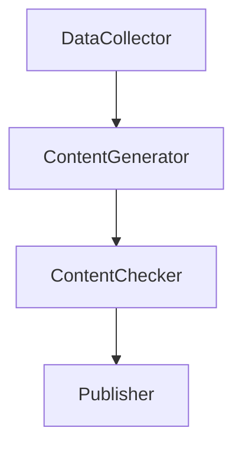
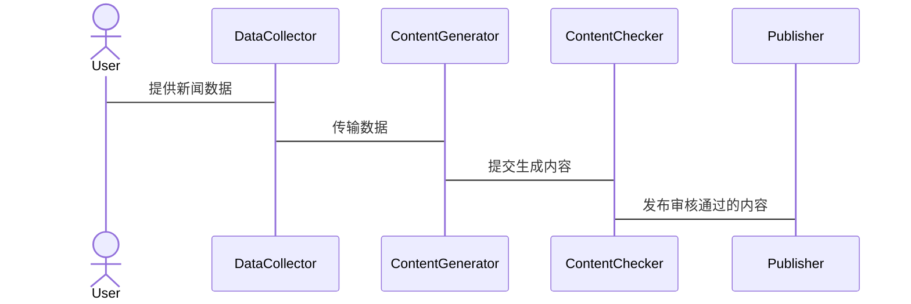
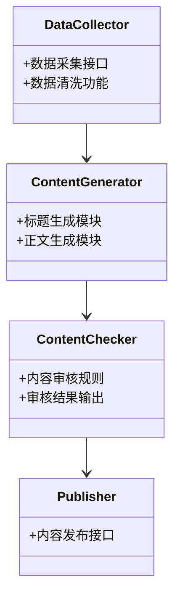

                 


# AI Agent在新闻媒体中的内容生成应用

**关键词**：AI Agent，新闻媒体，内容生成，生成式AI，自然语言处理，深度学习

**摘要**：随着人工智能技术的迅速发展，AI Agent在新闻媒体中的内容生成应用逐渐成为现实。本文详细探讨了AI Agent在新闻内容生成中的背景、核心技术和应用场景，并通过实际案例分析了其在新闻标题和正文生成中的潜力。同时，本文还介绍了AI Agent在新闻媒体中的系统架构设计和最佳实践，为读者提供了全面的技术视角。

---

## 第1章: AI Agent与新闻媒体的结合

### 1.1 AI Agent的基本概念

#### 1.1.1 AI Agent的定义
AI Agent（人工智能代理）是指能够感知环境、自主决策并执行任务的智能实体。它通过传感器获取信息，利用推理和学习能力，做出最优决策，并通过执行器与环境交互。AI Agent可以是软件程序，也可以是物理机器人。

#### 1.1.2 AI Agent的核心特征
- **自主性**：能够在没有外部干预的情况下自主运作。
- **反应性**：能够实时感知环境并做出响应。
- **目标导向性**：通过设定目标来驱动行为。
- **学习能力**：能够通过数据和经验不断优化性能。

#### 1.1.3 AI Agent与传统自动化工具的区别
传统的自动化工具通常基于固定的规则和流程，无法应对复杂多变的任务。而AI Agent具备学习和适应能力，能够处理非结构化问题，具有更强的灵活性和智能性。

### 1.2 新闻媒体内容生成的背景与挑战

#### 1.2.1 新闻内容生成的传统模式
传统的新闻内容生成依赖于记者的手工撰写，这种方式虽然能够保证内容的深度和准确性，但效率较低，且难以满足海量新闻需求。

#### 1.2.2 传统模式的局限性
- **效率问题**：人工撰写新闻耗时较长，难以应对快速变化的新闻事件。
- **一致性问题**：不同记者的风格和质量可能存在差异。
- **成本问题**：需要大量人力资源，成本较高。

#### 1.2.3 AI Agent在新闻内容生成中的潜力
AI Agent可以通过自然语言处理和生成式AI技术，快速生成高质量的新闻内容，同时保证一致性和可扩展性。

### 1.3 AI Agent在新闻媒体中的应用前景

#### 1.3.1 AI Agent在新闻内容生成中的优势
- **高效性**：AI Agent可以在短时间内生成大量新闻内容。
- **一致性**：通过模型训练，AI Agent能够保持新闻风格和语言的一致性。
- **个性化**：可以根据读者偏好生成定制化的内容。

#### 1.3.2 AI Agent在新闻媒体中的具体应用场景
- **新闻标题生成**：AI Agent可以根据新闻内容自动生成吸引人的标题。
- **新闻正文生成**：AI Agent可以辅助记者撰写新闻正文，提供多种表达方式。
- **多语言新闻生成**：AI Agent可以将新闻内容翻译成多种语言，扩大传播范围。

#### 1.3.3 AI Agent对新闻行业的潜在影响
AI Agent的引入将改变新闻行业的生产方式，提高效率，降低成本，同时为新闻创新提供更多可能性。

### 1.4 本章小结
本章介绍了AI Agent的基本概念及其在新闻媒体中的应用背景，分析了传统新闻内容生成的局限性，并探讨了AI Agent在新闻行业中的潜力和应用场景。

---

## 第2章: AI Agent的核心技术基础

### 2.1 生成式AI的基本原理

#### 2.1.1 生成式AI的定义
生成式AI是一种能够生成新内容的人工智能技术，主要包括自然语言生成、图像生成和音频生成等。

#### 2.1.2 生成式AI的主要技术
- **基于规则的生成**：通过预设的规则生成文本。
- **基于统计的生成**：利用概率模型生成文本。
- **基于深度学习的生成**：通过神经网络模型（如Transformer）生成高质量文本。

#### 2.1.3 生成式AI的优缺点
- **优点**：能够生成多样化和高质量的内容。
- **缺点**：可能产生不准确或不符合语境的内容，需要大量数据和计算资源。

### 2.2 AI Agent的算法基础

#### 2.2.1 基于Transformer的生成模型
Transformer是一种深度学习模型，通过自注意力机制和前馈网络实现高效的文本生成。

$$
\text{自注意力机制：} \quad Q, K, V = \text{线性变换}(x)
$$

$$
\text{注意力权重：} \quad \alpha = \text{softmax}\left(\frac{QK^T}{\sqrt{d_k}}\right)
$$

$$
\text{输出：} \quad y = \alpha V
$$

#### 2.2.2 基于强化学习的生成优化
强化学习通过奖励机制优化生成内容的质量，通常采用策略梯度方法。

#### 2.2.3 多模态生成技术
多模态生成技术结合文本、图像和音频等多种信息，生成更丰富的内容。

### 2.3 AI Agent的训练与优化

#### 2.3.1 数据预处理与清洗
- **数据清洗**：去除噪声数据，确保数据质量。
- **数据增强**：通过数据扩展技术增加数据多样性。

#### 2.3.2 模型训练策略
- **预训练**：在大规模通用数据上进行预训练。
- **微调**：针对特定任务进行微调优化。

#### 2.3.3 模型调优与评估
- **调优方法**：通过超参数优化和模型结构调整提升性能。
- **评估指标**：使用BLEU、ROUGE等指标评估生成质量。

### 2.4 本章小结
本章介绍了生成式AI的基本原理和AI Agent的算法基础，重点讲解了基于Transformer的生成模型和强化学习优化方法，并探讨了多模态生成技术的应用。

---

## 第3章: AI Agent在新闻内容生成中的应用

### 3.1 新闻内容生成的流程

#### 3.1.1 数据采集与处理
- **数据采集**：从新闻网站、社交媒体等渠道获取新闻数据。
- **数据处理**：对数据进行清洗和结构化处理，提取关键信息。

#### 3.1.2 内容生成与优化
- **内容生成**：通过AI Agent生成新闻标题和正文。
- **内容优化**：根据读者反馈优化生成内容。

#### 3.1.3 内容审核与发布
- **内容审核**：人工或AI审核生成内容，确保准确性和合规性。
- **内容发布**：将审核通过的内容发布到新闻平台。

### 3.2 AI Agent在新闻标题生成中的应用

#### 3.2.1 新闻标题生成的挑战
- **简洁性**：标题需要简洁明了。
- **吸引力**：标题需要吸引读者点击。
- **准确性**：标题需要准确反映新闻内容。

#### 3.2.2 基于AI Agent的标题生成方法
- **关键词提取**：提取新闻内容中的关键词。
- **标题生成**：基于关键词生成多个候选标题，选择最优标题。

#### 3.2.3 实例分析
假设新闻内容为“某公司推出新产品”，AI Agent可以生成以下标题：
- “新产品发布会圆满成功”
- “公司推出革命性新产品”
- “新产品上市，引发行业关注”

### 3.3 AI Agent在新闻正文生成中的应用

#### 3.3.1 正文生成的复杂性
- **信息完整性**：正文需要包含详细的信息。
- **语言流畅性**：正文需要语言流畅，逻辑清晰。
- **风格一致性**：正文需要与新闻整体风格一致。

#### 3.3.2 基于AI Agent的正文生成技术
- **信息提取**：从新闻标题中提取关键信息。
- **内容生成**：根据提取的信息生成详细正文。
- **内容优化**：优化生成正文的流畅性和准确性。

#### 3.3.3 应用案例
假设新闻标题为“公司推出革命性新产品”，AI Agent可以生成以下正文：
“近日，某公司正式推出了其革命性新产品。该产品具有多项创新功能，预计将对行业产生深远影响。”

### 3.4 本章小结
本章探讨了AI Agent在新闻标题和正文生成中的应用，分析了生成过程中的挑战和解决方案，并通过实例展示了生成效果。

---

## 第4章: AI Agent在新闻媒体中的系统架构

### 4.1 系统架构设计

#### 4.1.1 系统模块划分
- **数据采集模块**：负责采集新闻数据。
- **内容生成模块**：负责生成新闻标题和正文。
- **内容审核模块**：负责审核生成内容。
- **发布模块**：负责发布审核通过的内容。

#### 4.1.2 模块之间的关系
- 数据采集模块向内容生成模块提供数据。
- 内容生成模块向内容审核模块提交生成内容。
- 内容审核模块向发布模块提交审核通过的内容。

#### 4.1.3 系统整体架构图



### 4.2 数据流与信息交互

#### 4.2.1 数据输入与处理流程
- 数据采集模块从新闻网站获取数据。
- 数据处理模块对数据进行清洗和结构化处理。
- 内容生成模块根据处理后的数据生成标题和正文。

#### 4.2.2 系统交互流程



### 4.3 系统功能设计

#### 4.3.1 项目介绍
本项目旨在利用AI Agent技术，实现新闻内容的自动化生成和发布。

#### 4.3.2 系统功能模块



### 4.4 本章小结
本章介绍了AI Agent在新闻媒体中的系统架构，包括模块划分、数据流和系统交互设计，并通过类图和序列图展示了系统的整体结构。

---

## 第5章: 项目实战——AI Agent在新闻标题生成中的应用

### 5.1 项目背景

#### 5.1.1 项目目标
本项目旨在开发一个基于AI Agent的新闻标题生成系统。

#### 5.1.2 项目需求
- **输入**：新闻正文内容
- **输出**：生成多个候选标题
- **功能**：标题生成、标题优化

### 5.2 环境安装与配置

#### 5.2.1 安装Python环境
- 使用Anaconda安装Python 3.8及以上版本。

#### 5.2.2 安装依赖库
```bash
pip install transformers
pip install numpy
pip install matplotlib
```

### 5.3 核心代码实现

#### 5.3.1 数据预处理代码
```python
import numpy as np
import pandas as pd

def preprocess_data(data):
    # 数据清洗
    cleaned_data = data.dropna()
    # 数据增强
    augmented_data = pd.DataFrame(cleaned_data.values.repeat(2, axis=0))
    return augmented_data
```

#### 5.3.2 生成模型代码
```python
from transformers import AutoTokenizer, AutoModelForCausalLM
import torch

tokenizer = AutoTokenizer.from_pretrained('gpt2')
model = AutoModelForCausalLM.from_pretrained('gpt2')

def generate_title(context):
    inputs = tokenizer.encode(context, return_tensors='pt', max_length=512)
    outputs = model.generate(inputs, max_length=10, do_sample=True)
    title = tokenizer.decode(outputs[0], skip_special_tokens=True)
    return title
```

#### 5.3.3 优化算法代码
```python
import torch.nn as nn
import torch.optim as optim

class TitleGenerator(nn.Module):
    def __init__(self, vocab_size):
        super(TitleGenerator, self).__init__()
        self.embedding = nn.Embedding(vocab_size, 512)
        self.lstm = nn.LSTM(512, 256, 1)
        self.dropout = nn.Dropout(0.5)
        self.fc = nn.Linear(256, vocab_size)
    
    def forward(self, x):
        embed = self.embedding(x)
        out, _ = self.lstm(embed)
        out = self.dropout(out)
        out = self.fc(out)
        return out

# 训练过程
model = TitleGenerator(vocab_size=10000)
criterion = nn.CrossEntropyLoss()
optimizer = optim.Adam(model.parameters(), lr=0.001)

for epoch in range(100):
    for batch in batches:
        outputs = model(batch)
        loss = criterion(outputs, labels)
        optimizer.zero_grad()
        loss.backward()
        optimizer.step()
```

### 5.4 代码解读与分析

#### 5.4.1 数据预处理代码解读
- 使用Pandas进行数据清洗和增强，确保数据质量。
- 数据增强通过重复数据实现，增加训练数据量。

#### 5.4.2 生成模型代码解读
- 使用GPT-2模型进行标题生成，通过Tokenizer和Model实现生成过程。
- do_sample=True表示开启采样生成，增加生成多样性。

#### 5.4.3 优化算法代码解读
- 定义了一个基于LSTM的标题生成模型。
- 使用交叉熵损失函数和Adam优化器进行训练。
- Dropout层用于防止过拟合。

### 5.5 项目小结
本章通过一个具体的项目案例，详细讲解了AI Agent在新闻标题生成中的应用，包括环境配置、核心代码实现和实际案例分析。

---

## 第6章: 最佳实践与注意事项

### 6.1 最佳实践

#### 6.1.1 数据质量
- 确保训练数据的多样性和代表性。
- 数据清洗和增强是关键步骤。

#### 6.1.2 模型优化
- 使用合适的模型架构和超参数设置。
- 定期进行模型调优和评估。

#### 6.1.3 伦理问题
- 确保生成内容的准确性和客观性。
- 避免生成虚假或误导性信息。

### 6.2 小结
本章总结了AI Agent在新闻媒体中的最佳实践，包括数据管理、模型优化和伦理问题。

### 6.3 注意事项

#### 6.3.1 数据隐私
- 遵守数据隐私法规，保护用户隐私。

#### 6.3.2 内容审核
- 人工审核生成内容，确保合规性。

#### 6.3.3 技术更新
- 关注AI技术的最新进展，及时更新系统。

### 6.4 拓展阅读
- 《生成式AI：原理与应用》
- 《自然语言处理实战：基于Transformer的模型》

---

## 作者

**作者：AI天才研究院/AI Genius Institute & 禅与计算机程序设计艺术 /Zen And The Art of Computer Programming**

---

以上是《AI Agent在新闻媒体中的内容生成应用》的技术博客文章，涵盖了从基础概念到系统架构的详细讲解，以及实际项目的实现和分析。

