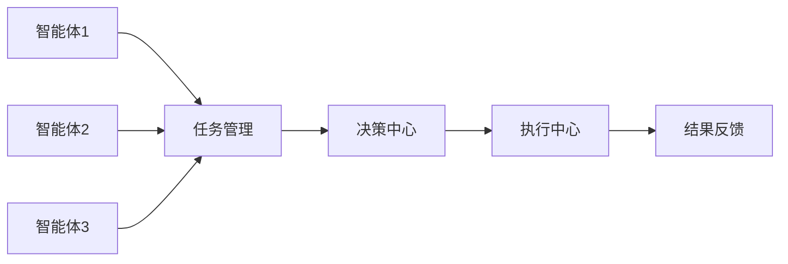

                 


# AI Agent的多智能体协同决策机制

> 关键词：AI Agent, 多智能体, 协同决策, 机制, 算法, 系统架构, 实现案例

> 摘要：本文将深入探讨AI Agent在多智能体系统中的协同决策机制，分析其核心概念、算法原理、系统架构及实现案例。通过详细的技术分析和实际案例，揭示多智能体协同决策的内在逻辑和实现方法，帮助读者全面理解这一复杂而重要的技术领域。

---

# 第一部分: AI Agent与多智能体系统概述

## 第1章: AI Agent的基本概念与背景

### 1.1 AI Agent的定义
AI Agent（人工智能代理）是指能够感知环境、自主决策并执行任务的智能实体。它可以是一个软件程序、机器人或其他智能系统，具备以下核心特征：
- **自主性**：能够独立决策和行动，无需外部干预。
- **反应性**：能够实时感知环境并做出响应。
- **主动性**：主动采取行动以实现目标。

### 1.2 多智能体系统的重要性
多智能体系统（Multi-Agent System, MAS）由多个智能体组成，通过协同合作完成复杂的任务。与单智能体系统相比，多智能体系统具有以下优势：
- **任务分解**：通过分工合作，提高任务效率。
- **鲁棒性**：单个智能体的故障不会导致整个系统崩溃。
- **适应性**：多个智能体可以根据环境变化动态调整策略。

### 1.3 多智能体系统的关键问题
在多智能体系统中，协同决策是核心问题，主要涉及以下方面：
- **通信与协作**：智能体之间如何有效通信并协作完成任务。
- **冲突与协调**：如何处理智能体之间的冲突，确保整体目标的实现。
- **分布式计算**：如何在分布式环境中进行高效计算和决策。

---

## 第2章: 多智能体协同决策的背景与意义

### 2.1 协同决策的定义与特点
协同决策是指多个智能体通过合作和信息共享，共同制定最优决策的过程。其特点包括：
- **分布式决策**：决策过程分布在多个智能体之间。
- **信息共享**：智能体之间需要共享信息以提高决策质量。
- **动态性**：环境和任务目标可能动态变化，决策过程需要灵活调整。

### 2.2 多智能体协同决策的应用场景
多智能体协同决策广泛应用于多个领域：
- **机器人协作**：多个机器人协同完成复杂任务，如物流运输、灾害救援。
- **分布式系统优化**：如分布式计算、云计算中的资源分配。
- **游戏AI**：多智能体协同完成游戏任务，如MOBA游戏中的团队协作。

### 2.3 协同决策的核心挑战
在多智能体协同决策中，面临的主要挑战包括：
- **信息不对称**：智能体之间可能无法完全共享信息。
- **策略协调**：如何确保多个智能体的策略一致。
- **计算复杂性**：多智能体决策问题通常具有较高的计算复杂性。

---

# 第二部分: 多智能体协同决策的核心概念与联系

## 第3章: 多智能体系统的实体关系分析

### 3.1 实体关系图（ER图）
以下是多智能体系统中的实体关系图：

```mermaid
er
actor:
    name
    role
    id
    communication_channel
    decision_behavior

relation:
    communication_message
    decision_strategy
    task_assignment
```

### 3.2 多智能体系统的角色与关系
在多智能体系统中，角色和关系的定义直接影响协同决策的效果。以下是关键角色及其关系：

#### 3.2.1 个体智能体
个体智能体是多智能体系统的基本单元，负责感知环境、处理信息并执行任务。

#### 3.2.2 协调机制
协调机制是连接多个智能体的纽带，负责信息共享、任务分配和策略协调。

#### 3.2.3 全局目标与局部目标
全局目标是整个系统需要实现的最终目标，而局部目标是每个智能体需要完成的任务。

---

## 第4章: 多智能体系统中的通信与协作

### 4.1 智能体之间的通信方式
多智能体系统中，智能体之间的通信方式包括：
- **直接通信**：智能体之间直接交换信息。
- **间接通信**：通过中间媒介（如共享数据库）进行信息交换。

### 4.2 协作协议的设计原则
协作协议的设计需要考虑以下原则：
- **一致性**：确保所有智能体遵循相同的协议。
- **高效性**：减少通信开销，提高决策效率。
- **容错性**：能够处理通信故障和信息丢失。

### 4.3 通信与协作的实现挑战
通信与协作的实现面临以下挑战：
- **信息冗余**：过多的信息交换可能导致系统性能下降。
- **信息不一致**：不同智能体的信息可能存在冲突。
- **实时性要求**：需要在实时环境中快速响应。

---

# 第三部分: 多智能体协同决策的算法原理

## 第5章: 分布式计算与多智能体决策

### 5.1 分布式计算的基本原理
分布式计算是多智能体协同决策的核心技术之一。以下是其基本流程：


### 5.2 分布式计算的实现步骤
以下是分布式计算的实现步骤：

1. **任务分解**：将整体任务分解为多个子任务。
2. **任务分配**：将子任务分配给不同的智能体。
3. **任务执行**：每个智能体独立执行分配的任务。
4. **结果汇总**：将所有智能体的结果汇总，形成最终决策。

### 5.3 分布式计算的优缺点
- **优点**：
  - 能够充分利用资源，提高计算效率。
  - 具有良好的扩展性，适合大规模任务。
- **缺点**：
  - 系统复杂性高，需要复杂的通信和协调机制。
  - 可能存在信息不对称，影响决策质量。

---

## 第6章: 博弈论与多智能体决策

### 6.1 博弈论的基本原理
博弈论是研究多个智能体之间策略互动的数学理论。以下是博弈论的关键概念：

- **玩家**：参与博弈的智能体。
- **策略**：智能体在博弈中采取的行动方案。
- **收益**：智能体采取某种策略后的所得。

### 6.2 纳什均衡
纳什均衡是博弈论中的一个关键概念，表示在所有参与方采取最优策略的情况下，无法通过单方面改变策略而获得收益增加的状态。

数学公式表示为：
$$ \text{纳什均衡} \iff \forall i, u_i(s_i, S_{-i}) \geq u_i(s'_i, S_{-i}) $$

### 6.3 博弈论在多智能体决策中的应用
博弈论可以应用于多智能体系统的任务分配、资源分配等场景。例如，在分布式资源分配中，智能体可以通过博弈论模型找到最优的资源分配方案。

---

## 第7章: 强化学习与多智能体决策

### 7.1 强化学习的基本原理
强化学习是一种通过试错方法学习最优策略的技术。以下是其基本流程：


### 7.2 多智能体强化学习的挑战
多智能体强化学习面临以下挑战：
- **策略协调**：多个智能体需要协调策略以实现全局目标。
- **信息共享**：智能体之间的信息共享可能影响学习效果。

### 7.3 多智能体强化学习的应用
多智能体强化学习可以应用于机器人协作、自动驾驶等领域。例如，在自动驾驶中，多个车辆需要通过强化学习协调行驶策略，避免碰撞并提高通行效率。

---

# 第四部分: 多智能体协同决策的数学模型

## 第8章: 多智能体决策的数学模型

### 8.1 马尔可夫决策过程
马尔可夫决策过程（Markov Decision Process, MDP）是描述智能体在不确定环境中的决策过程的数学模型。其主要组成部分包括：
- **状态**：智能体所处的环境状态。
- **动作**：智能体可以执行的动作。
- **转移概率**：动作执行后状态的转移概率。
- **奖励函数**：执行动作后的奖励。

数学公式表示为：
$$ P(s' | s, a) $$
$$ R(s, a) $$

### 8.2 多智能体决策的数学表达
在多智能体系统中，决策过程涉及多个智能体的协作。以下是其数学表达：

- **全局状态**：所有智能体的状态的集合。
- **全局动作**：所有智能体的动作的集合。
- **全局奖励**：所有智能体的奖励的总和。

数学公式表示为：
$$ S = \{s_1, s_2, \dots, s_n\} $$
$$ A = \{a_1, a_2, \dots, a_n\} $$
$$ R = \sum_{i=1}^{n} R_i(s_i, a_i) $$

### 8.3 约束条件与优化目标
多智能体决策需要满足以下约束条件：
- **通信约束**：智能体之间的通信带宽有限。
- **计算约束**：智能体的计算能力有限。

优化目标是最大化全局奖励：
$$ \max_{A} R $$

---

# 第五部分: 多智能体协同决策的系统架构

## 第9章: 系统功能设计

### 9.1 系统功能模块
多智能体协同决策系统主要包括以下功能模块：
- **任务管理模块**：负责任务的分解和分配。
- **通信模块**：负责智能体之间的信息交换。
- **决策模块**：负责制定协同决策策略。
- **执行模块**：负责执行决策结果。

### 9.2 系统功能流程
以下是系统功能流程图：


### 9.3 功能模块的实现
- **任务管理模块**：实现任务的分解和分配，确保每个智能体都有明确的任务。
- **通信模块**：实现智能体之间的信息交换，确保信息共享和实时通信。
- **决策模块**：基于共享信息制定决策策略，确保全局目标的实现。
- **执行模块**：执行决策结果，完成任务并反馈结果。

---

## 第10章: 系统架构设计

### 10.1 系统架构概述
多智能体协同决策系统的架构设计需要考虑系统的可扩展性、可靠性和高效性。以下是系统架构图：



### 10.2 系统架构的特点
- **模块化设计**：系统功能模块化，便于维护和扩展。
- **分布式架构**：任务分解和决策过程分布在多个智能体中，提高系统的并行处理能力。
- **高可用性**：系统具备容错机制，确保在部分智能体故障时仍能正常运行。

### 10.3 系统架构的实现
- **通信机制**：实现智能体之间的通信，确保信息实时共享。
- **任务分配**：根据智能体的能力和负载进行任务分配。
- **决策机制**：基于共享信息制定决策策略，确保全局目标的实现。

---

# 第六部分: 多智能体协同决策的项目实战

## 第11章: 环境安装与核心代码实现

### 11.1 环境安装
以下是实现多智能体协同决策所需的环境安装步骤：

1. **安装Python**：确保安装了Python 3.6或更高版本。
2. **安装依赖库**：安装所需的依赖库，如`numpy`、`pandas`、`matplotlib`等。
3. **安装机器学习框架**：安装`TensorFlow`或`PyTorch`等机器学习框架。

### 11.2 核心代码实现
以下是实现多智能体协同决策的核心代码示例：

```python
import numpy as np

def multi_agent_decision(n_agents, states):
    # 初始化决策结果
    decisions = []
    
    # 遍历每个智能体的状态
    for i in range(n_agents):
        # 根据当前状态制定决策
        decision = np.random.choice([0, 1], size=1)
        decisions.append(decision)
    
    return decisions

# 示例调用
n_agents = 5
states = [0, 1, 0, 1, 0]
result = multi_agent_decision(n_agents, states)
print("决策结果：", result)
```

### 11.3 代码解读与分析
- **代码功能**：该代码实现了多个智能体的协同决策，每个智能体根据自身状态制定决策。
- **实现原理**：通过随机选择的方式制定决策，适用于简单的决策场景。
- **优化建议**：可以根据具体任务需求，引入更复杂的决策算法，如强化学习或博弈论模型。

---

## 第12章: 项目实战与案例分析

### 12.1 项目实战
以下是多智能体协同决策的项目实战案例：

**项目背景**：实现一个多智能体协作机器人系统，用于仓库货物分拣。

**项目目标**：
1. 实现多个机器人协同完成货物分拣任务。
2. 确保机器人之间能够高效通信和协作。

**项目实现步骤**：
1. **任务分解**：将货物分拣任务分解为货物识别、搬运和放置三个子任务。
2. **任务分配**：根据每个机器人的状态和能力进行任务分配。
3. **协同决策**：机器人之间通过通信模块共享信息，制定协同决策。
4. **任务执行**：机器人根据决策结果执行任务。

### 12.2 案例分析
以下是机器人协作分拣货物的案例分析：

1. **任务分解**：
   - 货物识别：通过传感器识别货物类型。
   - 搬运：将货物从起始点搬运到目标位置。
   - 放置：将货物放置到指定区域。

2. **任务分配**：
   - 根据机器人当前负载和位置，分配货物识别、搬运和放置任务。

3. **协同决策**：
   - 机器人之间通过通信模块共享货物信息和位置信息。
   - 根据货物类型和目标位置，制定搬运路线和顺序。

4. **任务执行**：
   - 机器人根据分配的任务和决策结果，执行货物分拣任务。

---

## 第13章: 项目总结与优化建议

### 13.1 项目总结
在多智能体协同决策的项目中，通过合理设计系统架构和算法，可以实现多个智能体的高效协作。项目成功的关键在于：
- **系统设计**：合理的系统架构设计能够提高系统的可扩展性和可靠性。
- **算法选择**：选择合适的算法能够提高决策的效率和质量。
- **通信机制**：高效的通信机制能够确保智能体之间的信息共享和实时协作。

### 13.2 优化建议
为了进一步优化多智能体协同决策系统，可以考虑以下优化建议：
- **算法优化**：引入更复杂的决策算法，如强化学习和博弈论模型，提高决策的智能性。
- **通信优化**：优化通信机制，减少通信开销，提高系统的实时性。
- **系统扩展**：增加系统的可扩展性，支持更多的智能体和更复杂任务。

---

# 第七部分: 总结与展望

## 第14章: 总结与展望

### 14.1 总结
本文全面探讨了AI Agent在多智能体系统中的协同决策机制，分析了其核心概念、算法原理、系统架构及实现案例。通过详细的技术分析和实际案例，揭示了多智能体协同决策的内在逻辑和实现方法，帮助读者全面理解这一复杂而重要的技术领域。

### 14.2 展望
随着人工智能技术的不断发展，多智能体协同决策将更加智能化和复杂化。未来的研究方向可能包括：
- **智能体自主性提升**：提高智能体的自主决策能力。
- **多智能体协作优化**：优化多智能体协作算法，提高决策效率。
- **多智能体系统应用拓展**：将多智能体系统应用于更多领域，如智慧城市、智能家居等。

---

# 作者：AI天才研究院 & 禅与计算机程序设计艺术

