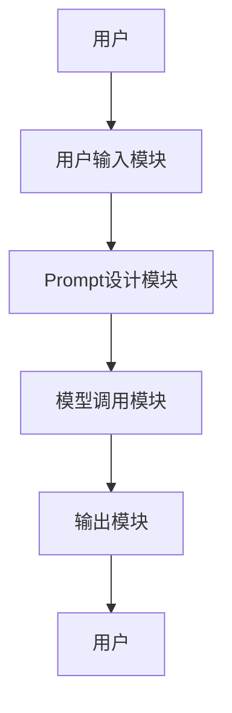
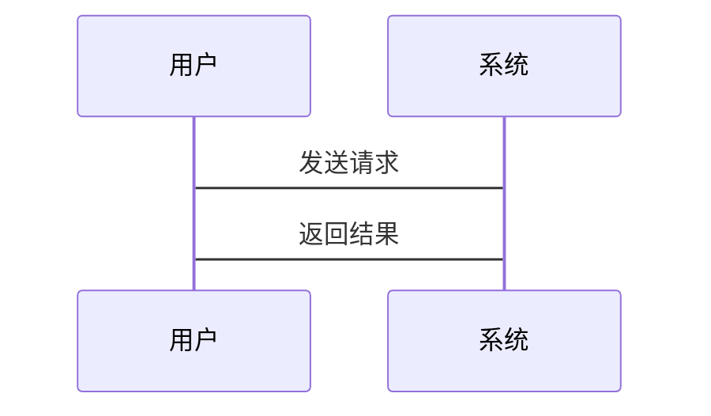
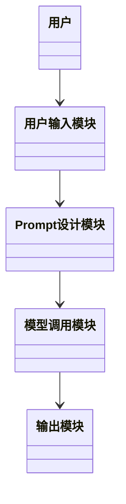

                 


# Prompt工程：设计有效提示以优化AI Agent输出

> 关键词：Prompt工程，AI Agent，自然语言处理，生成式AI，Prompt设计

> 摘要：本文深入探讨了Prompt工程的核心概念、设计原则、优化策略及其在AI Agent中的应用。通过分析Prompt对生成式AI的影响，结合实际案例，详细讲解了如何设计有效的Prompt以优化AI Agent的输出质量。文章还介绍了Prompt的系统架构与实现方法，并提供了具体的项目实战和最佳实践建议。

---

## 第1章: Prompt工程概述

### 1.1 什么是Prompt工程
Prompt工程是一门专注于设计和优化提示（Prompt）的学科，旨在通过精心设计的提示语，引导AI模型生成高质量的输出。与传统的AI交互方式不同，Prompt工程强调对提示语的系统性设计和优化，以最大化AI模型的潜力。

#### 1.1.1 Prompt工程的定义
Prompt工程是通过设计和优化提示语，以提升AI模型输出质量的系统性方法。它结合了自然语言处理、生成式AI和人机交互等多领域的知识。

#### 1.1.2 Prompt工程的核心要素
- **用户意图**：明确用户的实际需求和期望。
- **模型能力**：了解AI模型的能力和限制。
- **提示设计**：设计简洁、明确的提示语。
- **输出控制**：通过提示语优化输出质量。

#### 1.1.3 Prompt工程的背景与意义
随着生成式AI的普及，如何设计有效的Prompt成为提升AI系统性能的关键。Prompt工程通过系统化的方法，帮助开发者更好地利用AI模型的能力。

---

### 1.2 AI Agent与Prompt的关系
AI Agent通过Prompt与用户交互，Prompt决定了AI Agent的输出质量和行为模式。

#### 1.2.1 AI Agent的基本概念
AI Agent是一种能够感知环境并自主决策的智能体，广泛应用于对话系统、推荐系统等领域。

#### 1.2.2 Prompt在AI Agent中的作用
- **引导行为**：通过Prompt指导AI Agent的行为。
- **优化输出**：设计有效的Prompt可以提升AI Agent的输出质量。
- **增强交互**：Prompt帮助用户与AI Agent更好地沟通。

#### 1.2.3 Prompt工程的目标与价值
Prompt工程的目标是通过优化Prompt设计，提升AI Agent的用户体验和性能。其价值在于通过系统化的方法，降低AI Agent的开发难度，提高其实用性。

---

### 1.3 本章小结
本章介绍了Prompt工程的基本概念和其在AI Agent中的作用，为后续章节奠定了基础。

---

## 第2章: Prompt设计的核心概念

### 2.1 Prompt的基本结构
Prompt的设计需要考虑用户意图、模型能力和输出格式。

#### 2.1.1 用户意图的表达
- **明确需求**：通过Prompt明确用户的实际需求。
- **模糊需求**：设计能够处理模糊需求的Prompt。

#### 2.1.2 语言模型的调用
- **模型输入**：Prompt作为输入，指导模型生成输出。
- **模型输出**：模型根据Prompt生成响应。

#### 2.1.3 输出格式的规范
- **结构化输出**：设计结构化的输出格式，便于后续处理。
- **自由格式输出**：允许模型自由发挥。

---

### 2.2 Prompt的语义分析
Prompt的语义分析是确保输出符合用户期望的关键。

#### 2.2.1 语义理解的基本原理
- **语义解析**：将Prompt转换为模型可以理解的语义表示。
- **上下文关联**：考虑上下文信息，优化语义理解。

#### 2.2.2 Prompt的上下文关联
- **上下文依赖**：设计依赖上下文的Prompt。
- **上下文无关**：设计独立于上下文的Prompt。

#### 2.2.3 语义歧义的处理方法
- **消除歧义**：通过明确的Prompt设计消除语义歧义。
- **处理歧义**：设计能够处理歧义的Prompt。

---

### 2.3 Prompt的可扩展性设计
可扩展性设计使Prompt能够适应不同的场景和需求。

#### 2.3.1 功能扩展的实现
- **模块化设计**：将Prompt分解为多个模块，便于功能扩展。
- **动态参数调节**：通过动态调节参数，实现功能扩展。

#### 2.3.2 参数调节的优化
- **参数范围**：定义参数的取值范围。
- **参数权重**：调整参数的权重，影响输出结果。

#### 2.3.3 模块化设计的应用
- **模块组合**：通过组合不同的模块，实现复杂的Prompt设计。
- **模块优化**：对每个模块进行优化，提升整体性能。

---

### 2.4 本章小结
本章详细探讨了Prompt设计的核心概念，包括基本结构、语义分析和可扩展性设计。

---

## 第3章: Prompt设计的原则与策略

### 3.1 明确用户需求
明确用户需求是设计有效Prompt的前提。

#### 3.1.1 需求分析的方法
- **用户调研**：通过问卷、访谈等方式了解用户需求。
- **需求分类**：将需求分为明确需求和模糊需求。

#### 3.1.2 用户画像的构建
- **用户画像**：基于用户数据，构建用户画像。
- **画像分析**：分析用户画像，指导Prompt设计。

#### 3.1.3 需求优先级的排序
- **需求排序**：根据需求的重要性排序。
- **优先级调整**：根据实际情况调整需求优先级。

---

### 3.2 设计简洁明了的Prompt
简洁的Prompt更易于理解和实现。

#### 3.2.1 语言简洁性的重要性
- **语言简洁**：使用简洁的语言表达需求。
- **避免冗余**：避免不必要的信息，减少歧义。

#### 3.2.2 结构清晰的设计原则
- **结构化设计**：将Prompt分解为多个部分，结构清晰。
- **层次分明**：确保每个部分的逻辑层次分明。

#### 3.2.3 示例Prompt的分析
- **示例分析**：分析几个典型Prompt的设计，总结经验。

---

### 3.3 保持灵活性与可调性
灵活的Prompt设计能够适应不同的场景和需求。

#### 3.3.1 灵活性的设计要点
- **灵活设计**：设计能够适应多种场景的Prompt。
- **动态调整**：通过动态调整参数，实现灵活的输出控制。

#### 3.3.2 参数调节的优化
- **参数范围**：定义参数的取值范围。
- **参数权重**：调整参数的权重，影响输出结果。

#### 3.3.3 模块化设计的应用
- **模块组合**：通过组合不同的模块，实现复杂的Prompt设计。
- **模块优化**：对每个模块进行优化，提升整体性能。

---

### 3.4 本章小结
本章详细探讨了Prompt设计的原则与策略，包括明确用户需求、设计简洁明了的Prompt以及保持灵活性与可调性。

---

## 第4章: Prompt对AI Agent输出的影响

### 4.1 Prompt与生成式AI的关系
Prompt在生成式AI中起着关键作用。

#### 4.1.1 生成式AI的基本原理
- **生成式AI**：通过深度学习模型生成文本、图像等内容。
- **生成过程**：包括编码、解码和生成三个阶段。

#### 4.1.2 Prompt在生成过程中的作用
- **输入影响**：Prompt作为输入，影响生成结果。
- **输出控制**：通过设计Prompt，控制生成内容的质量和方向。

#### 4.1.3 不同Prompt对输出质量的影响
- **高质量Prompt**：设计有效的Prompt，提升输出质量。
- **低质量Prompt**：设计不佳的Prompt，可能导致输出质量下降。

---

### 4.2 Prompt对模型推理能力的优化
优化Prompt可以提升模型的推理能力。

#### 4.2.1 推理过程的优化方法
- **推理优化**：通过优化Prompt设计，提升推理能力。
- **推理结果分析**：分析推理结果，进一步优化Prompt。

#### 4.2.2 Prompt对模型理解能力的提升
- **理解能力提升**：设计能够提升模型理解能力的Prompt。
- **理解能力验证**：通过实验验证Prompt对模型理解能力的提升效果。

#### 4.2.3 模型推理中的常见问题及解决方案
- **问题分析**：分析模型推理中的常见问题。
- **解决方案设计**：设计解决方案，提升推理能力。

---

### 4.3 Prompt对输出结果的控制
有效的Prompt设计能够控制输出结果的质量。

#### 4.3.1 输出结果的多样性控制
- **多样性控制**：通过设计Prompt，控制输出结果的多样性。
- **多样性评估**：评估输出结果的多样性，进一步优化Prompt设计。

#### 4.3.2 输出结果的准确性优化
- **准确性优化**：设计能够提升输出准确性的Prompt。
- **准确性评估**：评估输出结果的准确性，进一步优化Prompt设计。

#### 4.3.3 输出结果的可解释性增强
- **可解释性增强**：设计能够增强输出可解释性的Prompt。
- **可解释性评估**：评估输出结果的可解释性，进一步优化Prompt设计。

---

### 4.4 本章小结
本章探讨了Prompt对AI Agent输出的影响，包括生成式AI的基本原理、Prompt对模型推理能力的优化以及对输出结果的控制。

---

## 第5章: Prompt的优化与调优策略

### 5.1 Prompt的评估指标
科学的评估指标是优化Prompt的基础。

#### 5.1.1 输出质量的评估标准
- **质量评估**：从准确性、相关性和流畅性等方面评估输出质量。
- **评估方法**：使用人工评估和自动评估相结合的方法。

#### 5.1.2 用户满意度的测量方法
- **满意度测量**：通过问卷调查等方式测量用户满意度。
- **满意度分析**：分析用户满意度数据，进一步优化Prompt设计。

#### 5.1.3 模型性能的量化评估
- **性能评估**：通过量化指标评估模型性能。
- **评估方法**：使用准确率、召回率等指标进行评估。

---

### 5.2 Prompt的自动优化算法
自动优化算法能够提升Prompt设计的效率。

#### 5.2.1 自动优化算法的基本原理
- **算法原理**：通过机器学习算法自动优化Prompt设计。
- **算法实现**：实现自动优化算法，提升Prompt设计效率。

#### 5.2.2 基于反馈的优化方法
- **反馈收集**：收集用户反馈，用于优化Prompt设计。
- **反馈分析**：分析用户反馈，进一步优化Prompt设计。

#### 5.2.3 进化算法的应用
- **进化算法**：通过进化算法优化Prompt设计。
- **算法实现**：实现进化算法，应用于Prompt优化。

---

### 5.3 Prompt的多轮对话设计
多轮对话设计能够提升用户体验。

#### 5.3.1 多轮对话的流程管理
- **流程设计**：设计多轮对话的流程，确保对话流畅。
- **流程优化**：优化对话流程，提升用户体验。

#### 5.3.2 对话历史的记录与应用
- **历史记录**：记录对话历史，用于后续对话。
- **历史应用**：应用对话历史，优化后续对话内容。

#### 5.3.3 对话策略的优化技巧
- **策略设计**：设计有效的对话策略，优化对话过程。
- **策略优化**：通过实验和反馈，进一步优化对话策略。

---

### 5.4 本章小结
本章探讨了Prompt的优化与调优策略，包括评估指标、自动优化算法和多轮对话设计。

---

## 第6章: Prompt工程的系统架构与实现

### 6.1 系统架构设计
科学的系统架构是实现Prompt工程的基础。

#### 6.1.1 系统功能模块划分
- **功能模块**：将系统划分为多个功能模块，如用户输入、Prompt设计、模型调用等。
- **模块设计**：设计每个模块的功能和接口。

#### 6.1.2 系统交互流程
- **交互流程**：设计系统的交互流程，确保流程清晰。
- **流程优化**：优化交互流程，提升系统效率。

#### 6.1.3 系统架构图


---

### 6.2 系统实现细节

#### 6.2.1 环境安装
- **环境要求**：安装必要的开发环境，如Python、框架等。
- **依赖管理**：管理第三方库的依赖关系。

#### 6.2.2 核心实现源代码
```python
def design_prompt(user_request):
    # 分析用户请求
    user_intent = analyze_request(user_request)
    # 设计Prompt
    prompt = generate_prompt(user_intent)
    return prompt
```

#### 6.2.3 代码应用解读与分析
- **代码解读**：解读核心代码，分析其功能。
- **代码优化**：对代码进行优化，提升性能。

---

### 6.3 系统接口设计
系统接口设计是系统实现的关键。

#### 6.3.1 API设计
- **API定义**：定义系统API，包括输入和输出接口。
- **API实现**：实现API，确保接口功能正常。

#### 6.3.2 接口文档
- **文档编写**：编写详细的接口文档，便于开发者使用。
- **文档更新**：根据系统优化，更新接口文档。

---

### 6.4 系统交互序列图


---

### 6.5 本章小结
本章详细探讨了Prompt工程的系统架构与实现，包括系统架构设计、实现细节、接口设计和系统交互。

---

## 第7章: 项目实战与最佳实践

### 7.1 项目背景与目标
- **项目背景**：介绍项目的背景和意义。
- **项目目标**：明确项目的总体目标。

#### 7.1.1 项目介绍
- **项目名称**：介绍项目的名称和核心功能。
- **项目特点**：总结项目的独特特点和优势。

---

### 7.2 系统功能设计
- **功能模块**：设计系统的功能模块。
- **功能实现**：实现每个功能模块的核心功能。

#### 7.2.1 领域模型设计


---

### 7.3 系统架构设计
- **架构选择**：选择适合的系统架构。
- **架构实现**：实现系统架构，确保功能正常。

#### 7.3.1 系统架构图


---

### 7.4 系统接口设计
- **接口定义**：定义系统的接口，包括输入和输出。
- **接口实现**：实现系统接口，确保功能正常。

#### 7.4.1 接口文档
- **文档编写**：编写详细的接口文档，便于开发者使用。
- **文档更新**：根据系统优化，更新接口文档。

---

### 7.5 本章小结
本章通过实际项目案例，详细探讨了Prompt工程的项目实战和最佳实践。

---

## 第8章: 总结与展望

### 8.1 本章总结
- **总结内容**：总结全文的主要内容和关键点。
- **核心结论**：总结Prompt工程的核心结论和实践经验。

#### 8.1.1 核心观点回顾
- **Prompt设计**：回顾Prompt设计的核心概念和方法。
- **系统架构**：回顾系统的架构设计和实现。

---

### 8.2 未来展望
- **发展趋势**：分析Prompt工程未来的发展趋势。
- **研究方向**：提出未来的研究方向和优化策略。

#### 8.2.1 拓展阅读
- **推荐书籍**：推荐相关的书籍和资源，供读者进一步学习。
- **推荐论文**：推荐相关的论文和研究，供读者深入了解。

---

## 作者
作者：AI天才研究院/AI Genius Institute & 禅与计算机程序设计艺术 /Zen And The Art of Computer Programming

---

### 注意事项
- 本文内容基于生成式AI和自然语言处理技术，具体实现需根据实际场景调整。
- 本文代码示例仅供参考，实际应用需根据需求进行优化和调整。

