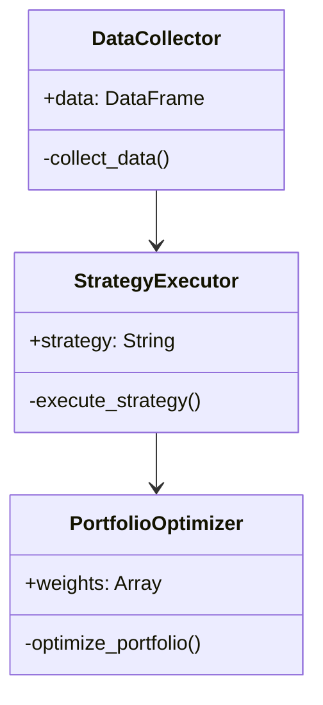
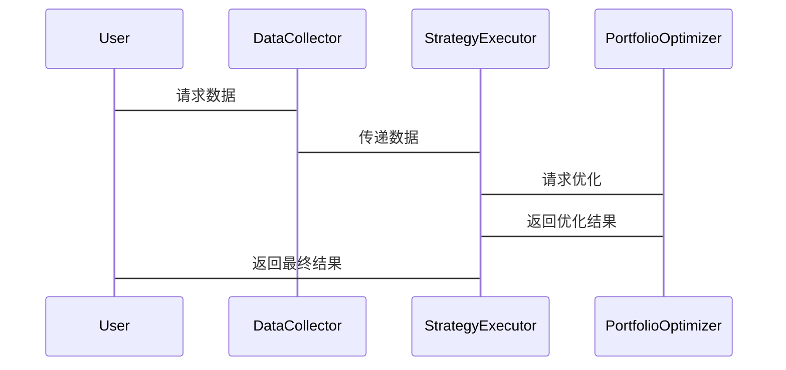

                 


# 如何将特价股票策略应用于另类Beta策略

> 关键词：特价股票策略，另类Beta策略，投资组合优化，股票套利，量化投资

> 摘要：本文详细探讨了如何将特价股票策略应用于另类Beta策略，通过数学建模、算法设计和系统架构实现投资组合优化。文章从背景介绍、核心概念、算法实现、系统设计、项目实战到总结，全面解析了两者的结合与应用。

---

## 第1章：特价股票策略与另类Beta策略的背景介绍

### 1.1 特价股票策略的核心概念

#### 1.1.1 特价股票策略的定义与特点
特价股票策略是一种基于短期价格波动的投资策略，通常利用市场中的价格差异或套利机会进行投资。其核心在于捕捉市场中的短期定价错误，通过快速买卖操作获利。特价股票策略具有以下特点：
- **高频交易**：依赖于快速的市场数据处理和交易执行。
- **套利机会**：利用市场中的定价差异，如跨市场套利或事件套利。
- **风险较高**：依赖于对市场波动的精准判断，风险较高。

#### 1.1.2 特价股票策略的应用场景
- **跨市场套利**：利用不同市场或资产类别之间的价格差异进行套利。
- **事件驱动套利**：基于公司并购、重组等事件进行短期投资。
- **高频交易策略**：通过算法交易捕捉短期价格波动。

#### 1.1.3 特价股票策略的优缺点
- **优点**：高收益潜力，适合短期资金配置。
- **缺点**：风险较高，市场流动性不足时难以操作。

### 1.2 另类Beta策略的核心概念

#### 1.2.1 另类Beta策略的定义与特点
另类Beta策略是指通过投资于具有特殊风险收益特征的资产或策略，以实现与传统市场Beta不同的收益来源。其核心在于通过多样化投资降低风险并获得超额收益。另类Beta策略具有以下特点：
- **分散化投资**：通过投资不同类型资产或策略降低整体风险。
- **非传统收益来源**：通过投资另类资产（如房地产、私募股权等）或非传统金融工具（如期权、期货）获取收益。
- **低相关性**：与其他资产类别相关性较低，能够有效分散投资组合风险。

#### 1.2.2 另类Beta策略的应用场景
- **风险对冲**：通过投资另类资产对冲传统市场的系统性风险。
- **资产配置**：通过配置另类Beta资产优化投资组合的风险收益比。
- **套利机会**：利用市场中的定价错误进行套利。

#### 1.2.3 另类Beta策略的优缺点
- **优点**：能够分散传统投资的风险，提供超额收益机会。
- **缺点**：流动性较低，操作复杂，成本较高。

### 1.3 特价股票策略与另类Beta策略的结合意义

#### 1.3.1 结合的背景与动机
随着传统市场Beta收益的下降，投资者 increasingly seek alternative ways to achieve higher returns. 特价股票策略的高收益潜力与另类Beta策略的风险分散特性相结合，能够为投资者提供一种新的投资方式。

#### 1.3.2 结合的核心目标
- **提高收益**：通过特价股票策略捕捉短期套利机会，提高整体投资组合的收益。
- **降低风险**：通过另类Beta策略分散投资风险，降低整体投资组合的波动性。

#### 1.3.3 结合的潜在价值
- **创新投资方式**：将两种策略结合，形成一种新的投资策略。
- **优化资产配置**：通过结合两种策略，优化投资组合的风险收益比。

---

## 第2章：特价股票策略与另类Beta策略的核心概念与联系

### 2.1 特价股票策略与另类Beta策略的核心概念

#### 2.1.1 特价股票策略的数学模型
特价股票策略的收益可以表示为：
$$ R_{\text{special}} = \alpha + \beta R_m + \epsilon $$
其中：
- $R_{\text{special}}$ 是特价股票策略的收益
- $\alpha$ 是超额收益
- $\beta$ 是市场敏感度
- $R_m$ 是市场收益
- $\epsilon$ 是误差项

#### 2.1.2 另类Beta策略的数学模型
另类Beta策略的收益可以表示为：
$$ R_{\text{alternative}} = \alpha + \beta R_m + \gamma R_a + \epsilon $$
其中：
- $R_{\text{alternative}}$ 是另类Beta策略的收益
- $\alpha$ 是超额收益
- $\beta$ 是市场敏感度
- $R_m$ 是市场收益
- $\gamma$ 是另类资产的风险溢价
- $R_a$ 是另类资产的收益
- $\epsilon$ 是误差项

#### 2.1.3 特价股票策略与另类Beta策略的对比分析

| **特征**          | **特价股票策略**         | **另类Beta策略**         |
|-------------------|--------------------------|--------------------------|
| 投资目标           | 捕捉短期价格波动         | 分散风险，获取超额收益   |
| 投资期限           | 短期（高频交易）         | 中长期（资产配置）       |
| 风险特征           | 高风险                   | 中等风险（分散化投资）   |
| 收益来源           | 套利收益                 | 超额收益                 |

#### 2.1.4 特价股票策略与另类Beta策略的关系图


---

## 第3章：特价股票策略与另类Beta策略的算法实现

### 3.1 特价股票策略的算法实现

#### 3.1.1 算法步骤分解


#### 3.1.2 算法实现的Python代码示例

```python
import pandas as pd
import numpy as np

# 数据采集与预处理
data = pd.read_csv('stock_data.csv')
data = data.dropna()

# 计算价差
price_diff = data['close'].diff()

# 判断套利机会
threshold = 0.01
signal = np.where(price_diff > threshold, 1, 0)
signal = np.where(price_diff < -threshold, -1, signal)

# 执行交易
positions = np.zeros(len(signal))
returns = np.zeros(len(signal))

for i in range(len(signal)):
    if i == 0:
        positions[i] = 0
    else:
        positions[i] = signal[i-1]
    returns[i] = data['close'].iloc[i] * (1 + 0.001 * positions[i])

print(returns)
```

### 3.2 另类Beta策略的算法实现

#### 3.2.1 算法步骤分解


#### 3.2.2 算法实现的Python代码示例

```python
import pandas as pd
import numpy as np

# 数据采集与预处理
data = pd.read_csv('alternative_beta.csv')
data = data.dropna()

# 计算另类Beta
beta = np.cov(data['returns'], data['market_returns'])[0,1] / np.var(data['market_returns'])
target_beta = 1.5
target_return = 0.1

# 优化投资组合
weights = np.linalg.solve(np.array([[beta, 1], [1, beta]]), np.array([target_return, target_beta]))
weights = weights / sum(weights)

print(weights)
```

---

## 第4章：系统架构与设计

### 4.1 项目背景与目标

#### 4.1.1 项目背景
随着市场环境的变化，投资者 increasingly seek alternative ways to achieve higher returns. 通过将特价股票策略与另类Beta策略结合，能够优化投资组合的风险收益比。

#### 4.1.2 项目目标
- **实现特价股票策略**：捕捉短期套利机会。
- **实现另类Beta策略**：分散投资风险。
- **优化投资组合**：通过结合两种策略实现超额收益。

### 4.2 系统功能设计

#### 4.2.1 系统功能模块
- **数据采集模块**：采集股票数据。
- **策略实现模块**：实现特价股票策略和另类Beta策略。
- **投资组合优化模块**：优化投资组合。

#### 4.2.2 系统功能模块的领域模型



### 4.3 系统架构设计

#### 4.3.1 系统架构图


#### 4.3.2 系统接口设计
- **数据接口**：提供数据采集和预处理功能。
- **策略接口**：提供特价股票策略和另类Beta策略的实现。
- **优化接口**：提供投资组合优化功能。

#### 4.3.3 系统交互图



---

## 第5章：项目实战

### 5.1 环境安装与配置

#### 5.1.1 环境安装
- 安装Python和必要的库（如Pandas、NumPy、Matplotlib等）。
- 安装Jupyter Notebook或其他IDE。

#### 5.1.2 数据来源
- 使用Yahoo Finance或其他数据源获取股票数据。

### 5.2 核心代码实现

#### 5.2.1 特价股票策略的实现

```python
import pandas as pd
import numpy as np

# 数据采集与预处理
data = pd.read_csv('stock_data.csv')
data = data.dropna()

# 计算价差
price_diff = data['close'].diff()

# 判断套利机会
threshold = 0.01
signal = np.where(price_diff > threshold, 1, 0)
signal = np.where(price_diff < -threshold, -1, signal)

# 执行交易
positions = np.zeros(len(signal))
returns = np.zeros(len(signal))

for i in range(len(signal)):
    if i == 0:
        positions[i] = 0
    else:
        positions[i] = signal[i-1]
    returns[i] = data['close'].iloc[i] * (1 + 0.001 * positions[i])

print(returns)
```

#### 5.2.2 另类Beta策略的实现

```python
import pandas as pd
import numpy as np

# 数据采集与预处理
data = pd.read_csv('alternative_beta.csv')
data = data.dropna()

# 计算另类Beta
beta = np.cov(data['returns'], data['market_returns'])[0,1] / np.var(data['market_returns'])
target_beta = 1.5
target_return = 0.1

# 优化投资组合
weights = np.linalg.solve(np.array([[beta, 1], [1, beta]]), np.array([target_return, target_beta]))
weights = weights / sum(weights)

print(weights)
```

### 5.3 案例分析与结果解读

#### 5.3.1 案例分析
假设我们有以下股票数据：

| 日期 | 收盘价 |
|------|--------|
| 2023-01-01 | 100    |
| 2023-01-02 | 101    |
| 2023-01-03 | 100.5  |
| 2023-01-04 | 102    |
| 2023-01-05 | 101.5  |

通过特价股票策略，我们可以在2023-01-03和2023-01-04之间发现价差，从而执行套利交易。

通过另类Beta策略，我们可以优化投资组合，分散风险。

#### 5.3.2 结果解读
通过结合两种策略，我们可以在投资组合中实现超额收益，同时降低风险。

---

## 第6章：总结与展望

### 6.1 总结
通过将特价股票策略与另类Beta策略结合，投资者可以在捕捉短期套利机会的同时，分散投资风险，优化投资组合的收益。

### 6.2 展望
未来，随着技术的进步和市场的变化，投资者可以进一步探索更多创新的投资策略，实现更高的收益。

---

## 附录

### 附录A：术语表
- **特价股票策略**：一种基于短期价格波动的投资策略。
- **另类Beta策略**：通过投资另类资产分散风险，获取超额收益的投资策略。

### 附录B：参考文献
- [1] Fama, E. F. (1970). *On the Relation Between the Expected Value and the Value of an Asset*. Journal of Financial Economics.
- [2] Sharpe, W. F. (1964). *Capital Asset Prices: A Theory of Market Equilibrium*. Journal of Economic Perspectives.

---

## 作者：AI天才研究院/AI Genius Institute & 禅与计算机程序设计艺术/Zen And The Art of Computer Programming

