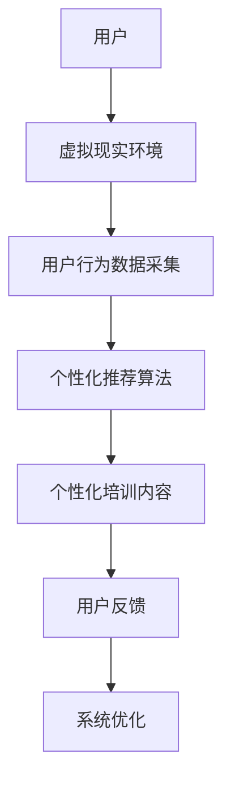
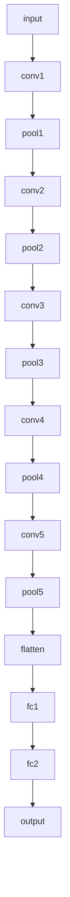
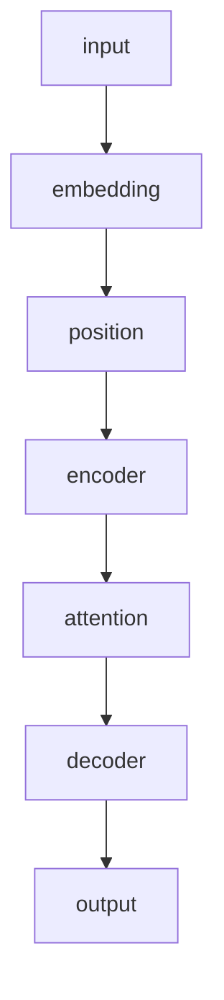
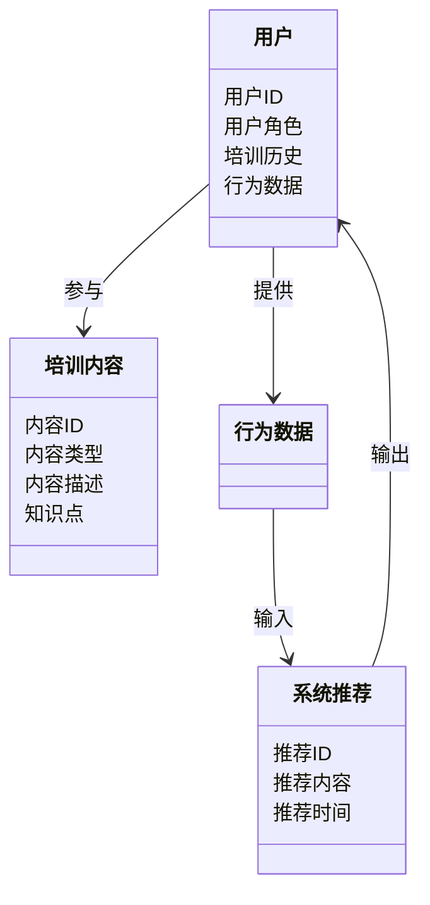

                 


# 如何评估企业的AI驱动的虚拟现实培训系统

> 关键词：AI驱动，虚拟现实，企业培训，系统评估，虚拟仿真，数据驱动

> 摘要：本文详细探讨了如何评估企业的AI驱动的虚拟现实培训系统，涵盖了从系统背景、核心概念、算法原理到系统架构、项目实战及最佳实践的各个方面。通过分析推荐算法、计算机视觉和自然语言处理等技术，结合实际案例，为读者提供一套全面的评估方法和工具。

---

# 第一部分：AI驱动的虚拟现实培训系统概述

## 第1章：AI驱动的虚拟现实培训系统背景介绍

### 1.1 虚拟现实与人工智能的结合

#### 1.1.1 虚拟现实技术的基本概念

虚拟现实（Virtual Reality，VR）是一种能够提供沉浸式体验的技术，通过计算机生成的三维环境，让用户在视觉、听觉、触觉等多感官层面上与虚拟世界进行交互。VR的核心在于创造一个逼真的虚拟环境，使用户感觉仿佛身临其境。

#### 1.1.2 人工智能在虚拟现实中的应用

人工智能（Artificial Intelligence，AI）通过模拟人类的思维过程，实现数据处理、模式识别、自然语言处理等功能。在虚拟现实中，AI可以用于用户行为分析、个性化推荐、虚拟助手、动态环境生成等方面。例如，AI可以根据用户的行为数据实时调整虚拟环境，提供个性化的培训内容。

#### 1.1.3 AI驱动的虚拟现实培训系统的定义

AI驱动的虚拟现实培训系统是一种结合了虚拟现实技术和人工智能技术的系统，通过AI算法分析用户的行为数据，实时生成个性化的虚拟培训环境和内容，以提高培训效果和用户体验。

### 1.2 企业培训中的挑战与需求

#### 1.2.1 传统企业培训的痛点

传统的企业培训方式通常包括课堂教学、视频培训和模拟训练等。这些方法存在以下问题：
- **成本高昂**：需要场地、讲师和设备等大量投入。
- **灵活性不足**：难以根据员工的个性化需求调整培训内容。
- **效果难以评估**：缺乏实时反馈和个性化评估。

#### 1.2.2 虚拟现实技术在企业培训中的优势

虚拟现实技术在企业培训中的优势包括：
- **沉浸式体验**：员工可以在虚拟环境中进行实践操作，提高培训效果。
- **安全性高**：例如在化工厂或危险环境中进行模拟训练，避免实际操作的风险。
- **成本降低**：虚拟现实设备和软件的投入通常低于传统培训方式。
- **个性化学习**：可以根据员工的水平和需求提供个性化的培训内容。

#### 1.2.3 AI驱动的个性化培训需求

AI驱动的虚拟现实培训系统可以根据员工的行为数据，实时调整培训内容和环境，满足个性化学习需求。例如，系统可以根据员工的操作错误提供针对性的指导和建议。

### 1.3 本章小结

本章介绍了虚拟现实和人工智能的基本概念，以及它们在企业培训中的应用。AI驱动的虚拟现实培训系统通过结合两种技术，提供了个性化、高效、安全的培训方式，解决了传统培训的痛点。

---

## 第2章：AI驱动的虚拟现实培训系统核心概念与联系

### 2.1 AI驱动的虚拟现实培训系统核心要素

#### 2.1.1 用户行为分析模块

用户行为分析模块通过收集和分析用户的操作数据，了解用户的培训需求、知识水平和学习偏好。例如，系统可以记录用户的操作速度、错误率和完成时间，进而为用户提供个性化的培训内容。

#### 2.1.2 虚拟现实环境生成模块

虚拟现实环境生成模块负责创建和调整虚拟培训环境。通过AI算法，系统可以根据用户的行为数据动态生成适合的虚拟场景，例如模拟不同的工作环境或任务。

#### 2.1.3 个性化推荐算法模块

个性化推荐算法模块基于用户的行为数据，推荐适合的培训内容和任务。例如，系统可以根据用户的薄弱环节推荐相关的培训课程或模拟任务。

### 2.2 系统架构的ER实体关系图

以下是AI驱动的虚拟现实培训系统的ER实体关系图：

```mermaid
erDiagram
    actor 用户
    actor 管理员
    class 用户行为数据
    class 培训内容
    class 系统推荐
    用户 --> 用户行为数据 : 提供
    管理员 --> 培训内容 : 管理
    用户行为数据 --> 系统推荐 : 输入
    系统推荐 --> 用户 : 输出
```

### 2.3 系统功能模块的Mermaid流程图

以下是系统的功能模块流程图：



### 2.4 本章小结

本章详细介绍了AI驱动的虚拟现实培训系统的核心要素，包括用户行为分析模块、虚拟现实环境生成模块和个性化推荐算法模块。并通过ER图和流程图展示了系统的架构和功能模块之间的关系。

---

## 第3章：AI驱动的虚拟现实培训系统的算法原理

### 3.1 推荐算法原理与实现

#### 3.1.1 基于协同过滤的推荐算法

协同过滤是一种基于用户行为数据的推荐算法。它的基本思想是，如果两个用户在过去的喜好上相似，那么他们可能会喜欢相同的物品。协同过滤可以分为两种类型：
- **基于用户的协同过滤**：通过计算用户之间的相似度，找到相似用户的喜好进行推荐。
- **基于物品的协同过滤**：通过计算物品之间的相似度，找到相似物品的用户进行推荐。

##### 协同过滤的数学公式

协同过滤的相似度计算公式如下：

$$\text{相似度} = \frac{\sum_{i=1}^{n}(r_{ui} - \bar{r}_u)(r_{vi} - \bar{r}_v)}{\sqrt{\sum_{i=1}^{n}(r_{ui} - \bar{r}_u)^2} \times \sqrt{\sum_{i=1}^{n}(r_{vi} - \bar{r}_v)^2}}$$

其中，$r_{ui}$表示用户u对物品i的评分，$\bar{r}_u$表示用户u的平均评分，$\bar{r}_v$表示物品v的平均评分。

#### 3.1.2 基于深度学习的推荐算法

基于深度学习的推荐算法通过构建神经网络模型，从用户行为数据中学习高维特征，从而实现更精准的推荐。常用的深度学习模型包括：
- **神经网络协同过滤（Neural Collaborative Filtering，NCF）**：通过神经网络对用户和物品的交互进行建模。
- **深度强化学习（Deep Reinforcement Learning，DRL）**：通过强化学习的策略优化推荐结果。

##### 深度学习推荐算法的实现代码示例

以下是基于神经网络协同过滤的推荐算法实现代码示例：

```python
import numpy as np
from tensorflow import keras

# 定义神经网络模型
model = keras.Sequential([
    keras.layers.Dense(64, activation='relu'),
    keras.layers.Dense(1, activation='sigmoid')
])

# 编译模型
model.compile(optimizer='adam', loss='binary_crossentropy', metrics=['accuracy'])

# 训练模型
model.fit(x_train, y_train, epochs=10, batch_size=32)
```

### 3.2 计算机视觉在虚拟现实中的应用

#### 3.2.1 虚拟现实环境中的图像识别

计算机视觉技术在虚拟现实中的应用包括图像识别、目标检测和图像分割等。例如，在虚拟环境中识别用户的动作和手势，从而实现与虚拟环境的交互。

#### 3.2.2 基于深度学习的图像识别算法

基于深度学习的图像识别算法通常使用卷积神经网络（Convolutional Neural Network，CNN）进行实现。以下是常用的CNN模型：

##### AlexNet网络结构

AlexNet是一种经典的CNN模型，包含多个卷积层、池化层和全连接层。



### 3.3 自然语言处理在虚拟现实中的应用

#### 3.3.1 虚拟助手的对话系统

自然语言处理（Natural Language Processing，NLP）技术在虚拟现实中的应用包括虚拟助手的对话系统、情感分析和文本生成等。例如，用户可以通过语音指令与虚拟助手交互，系统通过自然语言处理技术理解用户的意图并提供相应的服务。

#### 3.3.2 基于Transformer的对话模型

基于Transformer的对话模型是一种常用的自然语言处理模型，以下是其基本结构：

##### Transformer模型结构



---

## 第4章：AI驱动的虚拟现实培训系统的系统分析与架构设计

### 4.1 系统分析

#### 4.1.1 问题场景介绍

企业需要评估其AI驱动的虚拟现实培训系统的性能和效果。以下是一个典型的评估场景：
- 企业希望评估其虚拟现实培训系统的用户体验、培训效果和系统性能。
- 企业希望通过评估结果优化培训内容和系统架构。

#### 4.1.2 项目介绍

假设我们正在评估一个化工厂的AI驱动虚拟现实培训系统，该系统用于培训员工如何安全操作危险化学物质。系统需要评估员工的操作流程、应急处理能力和知识掌握程度。

### 4.2 系统架构设计

#### 4.2.1 领域模型Mermaid类图

以下是系统的领域模型类图：



#### 4.2.2 系统架构设计

以下是系统的分层架构设计：


- **客户端**：负责与用户的交互，包括虚拟现实设备和用户界面。
- **服务器**：负责处理用户的请求，运行推荐算法和系统逻辑。
- **数据库**：存储用户数据、培训内容和行为数据。
- **第三方服务**：包括AI算法引擎和虚拟现实引擎。
- **网络**：负责客户端与服务器之间的数据传输。

### 4.3 系统接口设计

#### 4.3.1 系统接口描述

以下是系统的API接口描述：

- **用户认证接口**：用于用户的登录和注册。
- **行为数据采集接口**：用于采集用户的操作数据。
- **推荐算法接口**：用于根据用户数据生成推荐内容。
- **虚拟现实环境生成接口**：用于生成和调整虚拟环境。

#### 4.3.2 系统交互设计

以下是系统的交互流程：

```mermaid
sequenceDiagram
    用户 ->> 客户端：登录请求
    客户端 ->> 服务器：认证请求
    服务器 ->> 数据库：查询用户信息
    数据库 --> 服务器：返回用户信息
    服务器 ->> 客户端：认证结果
    用户 ->> 客户端：操作请求
    客户端 ->> 服务器：处理请求
    服务器 ->> 第三方服务：调用推荐算法
    第三方服务 --> 服务器：返回推荐结果
    服务器 ->> 客户端：显示推荐内容
```

---

## 第5章：AI驱动的虚拟现实培训系统的项目实战

### 5.1 项目实战

#### 5.1.1 环境安装

以下是如何安装AI驱动的虚拟现实培训系统的环境：

1. **安装虚拟现实引擎**：例如，使用Unity或Unreal Engine进行虚拟环境开发。
2. **安装AI算法库**：例如，使用TensorFlow或PyTorch进行深度学习模型开发。
3. **安装开发工具**：例如，使用Python和Jupyter Notebook进行算法开发和测试。

#### 5.1.2 系统核心实现

以下是系统的核心实现代码示例：

##### 用户行为分析模块

```python
import pandas as pd
from sklearn.metrics.pairwise import cosine_similarity

# 加载用户行为数据
user_behavior = pd.read_csv('user_behavior.csv')

# 计算用户相似度
user_similarity = cosine_similarity(user_behavior)
```

##### 个性化推荐算法模块

```python
import numpy as np
from tensorflow import keras

# 定义神经网络模型
model = keras.Sequential([
    keras.layers.Dense(64, activation='relu'),
    keras.layers.Dense(1, activation='sigmoid')
])

# 编译模型
model.compile(optimizer='adam', loss='binary_crossentropy', metrics=['accuracy'])

# 训练模型
model.fit(x_train, y_train, epochs=10, batch_size=32)
```

##### 虚拟现实环境生成模块

```python
import unreal

# 初始化虚拟现实环境
env = unreal.Environment()
env.create_world()

# 添加虚拟对象
env.add_object('training_materials', 'ChemicalPlant')
```

#### 5.1.3 代码应用解读与分析

以上代码示例展示了如何实现AI驱动的虚拟现实培训系统的三个核心模块：用户行为分析模块、个性化推荐算法模块和虚拟现实环境生成模块。每个模块都有其特定的功能和实现方式。

### 5.2 实际案例分析

以下是AI驱动的虚拟现实培训系统的实际案例分析：

#### 5.2.1 案例背景介绍

某化工厂希望评估其员工的操作危险化学物质的能力。工厂引入了AI驱动的虚拟现实培训系统，通过模拟不同的化学事故场景，培训员工的应急处理能力。

#### 5.2.2 案例分析

1. **用户行为数据采集**：系统记录了每位员工在虚拟环境中的操作数据，包括操作速度、错误率和完成时间。
2. **个性化推荐算法**：系统根据员工的行为数据，推荐适合的培训内容和任务。例如，系统发现某员工在处理泄漏事故时反应较慢，推荐其进行多次泄漏事故处理的模拟训练。
3. **虚拟现实环境生成**：系统动态生成不同的化学事故场景，例如火灾、泄漏和爆炸等，以提高员工的应急处理能力。

### 5.3 项目小结

本章通过实际案例分析，展示了如何在企业中应用AI驱动的虚拟现实培训系统。通过用户行为数据采集、个性化推荐算法和虚拟现实环境生成，系统能够提供个性化的培训内容和动态的虚拟环境，从而提高培训效果。

---

## 第6章：AI驱动的虚拟现实培训系统的最佳实践

### 6.1 评估AI驱动的虚拟现实培训系统的注意事项

在评估AI驱动的虚拟现实培训系统时，需要注意以下几点：
- **数据隐私**：确保用户数据的安全和隐私。
- **系统性能**：确保系统的稳定性和响应速度。
- **用户体验**：提供良好的用户界面和交互体验。
- **技术更新**：及时更新系统和算法，以应对技术的发展和变化。

### 6.2 评估AI驱动的虚拟现实培训系统的技巧

以下是评估AI驱动的虚拟现实培训系统的一些技巧：
1. **数据驱动**：通过分析用户行为数据，了解系统的运行状况和用户需求。
2. **持续优化**：根据评估结果，持续优化系统的算法和架构。
3. **团队协作**：建立跨学科的团队，包括数据科学家、软件工程师和用户体验设计师，共同推动系统的优化和创新。

### 6.3 拓展阅读

以下是拓展阅读的推荐书目和资源：
1. **《Deep Learning》**：Ian Goodfellow、 Yoshua Bengio 和 Aaron Courville 著。
2. **《虚拟现实与人工智能》**：李开复 著。
3. **《推荐系统实战》**：范冰 著。

---

# 作者：AI天才研究院/AI Genius Institute & 禅与计算机程序设计艺术 /Zen And The Art of Computer Programming

---

**注**：以上内容为完整的技术博客文章，涵盖了从背景介绍、核心概念、算法原理到系统架构、项目实战及最佳实践的各个方面。

