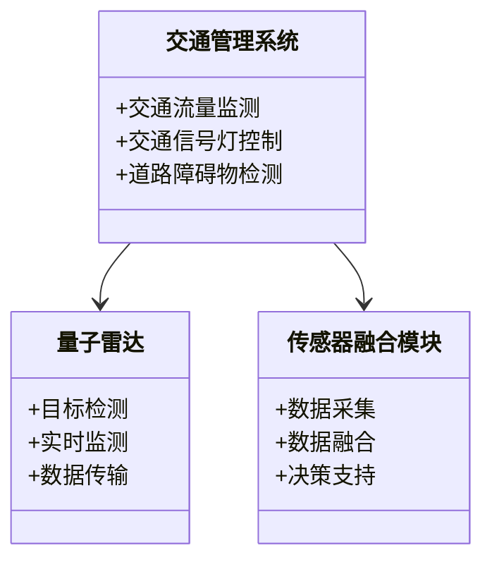
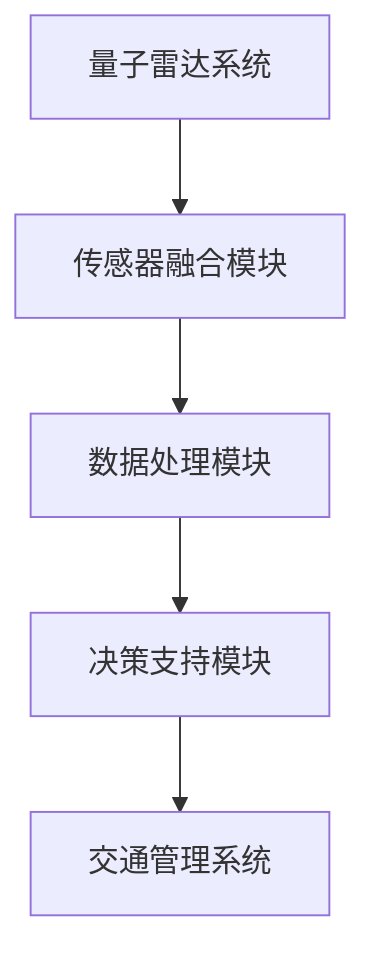
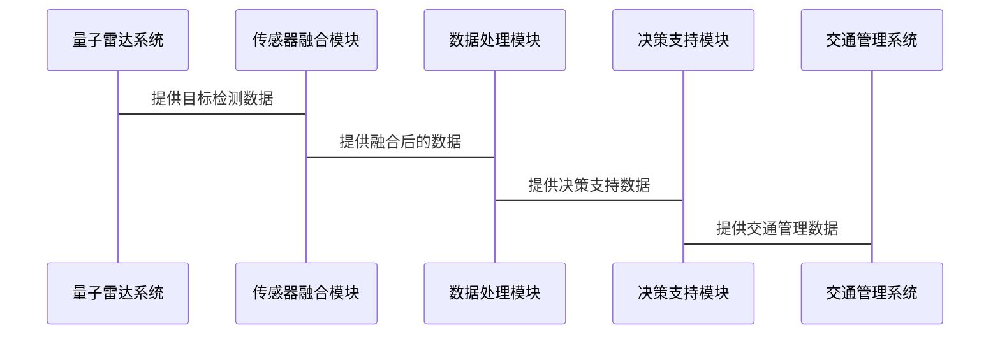

                 


# 巴菲特-芒格的量子雷达和传感器融合技术投资：智能交通的基石

**关键词：** 巴菲特投资理念，芒格多元思维模型，量子雷达，传感器融合技术，智能交通系统，数据融合算法，卡尔曼滤波

**摘要：** 本文探讨巴菲特和芒格的投资理念如何与量子雷达和传感器融合技术相结合，特别是在智能交通系统中的应用。通过分析量子雷达和传感器融合技术的核心原理、算法实现、系统架构设计以及实际案例，本文展示了这些技术如何成为智能交通的基石，并为投资者提供了基于巴菲特-芒格投资理念的实战策略。

---

## 第1章: 巴菲特-芒格投资理念

### 1.1 巴菲特-芒格投资理念的核心思想

#### 1.1.1 巴菲特的价值投资理论
巴菲特的价值投资理论强调以低于内在价值的价格买入优质资产。他的投资哲学是寻找具有持续竞争优势、良好治理结构和优秀管理团队的企业，并长期持有。这种理念的核心在于关注企业的内在价值，而非短期市场波动。

#### 1.1.2 芒格的多元思维模型
芒格的多元思维模型强调将多个学科的基本原理结合起来，形成一个相互关联的知识框架。他主张通过跨学科的视角来分析问题，以避免单一思维的局限性。这种思维方式在技术投资中尤为重要，尤其是在涉及复杂系统（如量子雷达和传感器融合技术）时。

#### 1.1.3 投资理念与技术应用的结合
巴菲特和芒格的投资理念并非仅适用于传统金融领域，也可以延伸至技术创新和技术投资。通过将价值投资与多元思维模型结合，投资者可以更好地评估技术的潜在价值、市场前景以及技术对企业盈利能力的影响。

---

## 第2章: 量子雷达与传感器融合技术

### 2.1 量子雷达的基本原理

#### 2.1.1 量子雷达的定义与工作原理
量子雷达是一种利用量子效应进行目标检测和识别的雷达技术。与传统雷达相比，量子雷达具有更高的灵敏度和分辨率，能够在复杂环境中检测微弱信号。其核心原理是利用量子叠加和纠缠效应，通过量子态的测量来实现目标检测。

#### 2.1.2 量子雷达的优势与应用场景
量子雷达的优势在于其极低的截获概率（LPI）和对复杂环境的适应能力。它在军事侦察、航空航天、智能交通等领域具有广泛的应用前景。特别是在智能交通系统中，量子雷达可以用于实时监测交通流量、识别障碍物，并提供高精度的目标定位。

#### 2.1.3 量子雷达的技术挑战
尽管量子雷达具有诸多优势，但其技术实现仍然面临许多挑战，包括量子噪声的抑制、量子态的稳定性和大规模生产成本高等。这些问题需要进一步的技术突破和成本优化。

### 2.2 传感器融合技术的核心概念

#### 2.2.1 传感器融合的定义与特点
传感器融合是指将来自多个传感器的数据进行综合处理，以提高系统感知能力和决策能力的技术。其特点是通过数据融合算法，将来自不同传感器的信息进行互补和优化，从而提高系统的整体性能。

#### 2.2.2 传感器融合的主要技术方法
传感器融合的主要技术方法包括基于统计的方法（如卡尔曼滤波）、基于图论的方法（如图模型）和基于深度学习的方法（如神经网络）。每种方法都有其优缺点，适用于不同的应用场景。

#### 2.2.3 传感器融合在智能交通中的应用
在智能交通系统中，传感器融合技术可以用于实时监测交通流量、识别道路障碍物、优化交通信号灯控制等。通过传感器融合，系统能够更准确地感知环境，从而提高交通效率和安全性。

---

## 第3章: 巴菲特-芒格投资理念与量子雷达的结合

### 3.1 投资理念与技术应用的契合点

#### 3.1.1 价值投资与技术潜力的结合
巴菲特的价值投资理念强调寻找具有持续竞争优势的企业。量子雷达和传感器融合技术作为新兴技术领域，具有较高的技术壁垒和市场潜力，符合价值投资的选股标准。

#### 3.1.2 多元思维模型在技术评估中的应用
芒格的多元思维模型可以帮助投资者从多个角度评估技术的可行性。例如，通过物理学、计算机科学和经济学的视角，分析量子雷达和传感器融合技术的市场前景、技术瓶颈和商业化路径。

#### 3.1.3 技术创新对投资价值的影响
技术创新是企业核心竞争力的重要来源。量子雷达和传感器融合技术的创新不仅能够提升企业的市场地位，还能够为企业带来持续的利润增长，从而提高企业的内在价值。

### 3.2 量子雷达与传感器融合技术的市场前景

#### 3.2.1 智能交通领域的市场潜力
随着智能交通系统的快速发展，市场对高精度感知技术的需求日益增加。量子雷达和传感器融合技术在智能交通中的应用前景广阔，尤其是在自动驾驶和智能交通管理领域。

#### 3.2.2 量子雷达在智能交通中的应用前景
量子雷达的高灵敏度和低截获概率使其在智能交通中的应用潜力巨大。例如，它可以用于实时监测交通流量、识别道路障碍物，并提供高精度的目标定位。

#### 3.2.3 传感器融合技术的未来发展趋势
随着人工智能和深度学习技术的快速发展，传感器融合技术将朝着更加智能化和自动化的方向发展。未来，传感器融合技术将与量子雷达技术相结合，进一步提升系统的感知能力和决策能力。

---

## 第4章: 巴菲特-芒格投资策略在量子雷达领域的实战案例

### 4.1 巴菲特-芒格投资策略的实战分析

#### 4.1.1 量子雷达领域的投资机会
量子雷达领域的投资机会主要集中在技术研发、产品开发和市场拓展三个方面。投资者需要关注企业的技术壁垒、市场定位和商业化能力。

#### 4.1.2 传感器融合技术的市场评估
传感器融合技术的市场评估需要从技术成熟度、市场需求和竞争格局三个维度进行分析。投资者需要关注企业的技术优势、市场占有率和盈利能力。

#### 4.1.3 投资决策中的关键因素分析
在投资决策中，关键因素包括企业的技术实力、管理团队、财务状况和市场前景。投资者需要综合考虑这些因素，以做出明智的投资决策。

### 4.2 实战案例分析

#### 4.2.1 典型量子雷达企业的投资分析
以某典型量子雷达企业为例，分析其技术实力、市场定位和财务状况。通过对企业基本面的深入分析，评估其投资价值和风险。

#### 4.2.2 传感器融合技术企业的投资评估
以某传感器融合技术企业为例，分析其技术优势、市场占有率和盈利能力。通过对企业核心竞争力的评估，判断其投资潜力。

#### 4.2.3 投资组合的构建与优化
基于巴菲特-芒格投资理念，构建一个以量子雷达和传感器融合技术为核心的多元投资组合。通过资产配置和风险分散，优化投资组合的收益与风险比。

---

## 第5章: 量子雷达与传感器融合技术的系统架构设计

### 5.1 量子雷达系统的架构设计

#### 5.1.1 量子雷达系统的组成与功能
量子雷达系统通常由量子发射器、量子接收器、信号处理模块和目标识别模块组成。每个模块的功能包括量子态的生成、测量、信号处理和目标识别。

#### 5.1.2 系统架构设计的优缺点分析
量子雷达系统的架构设计需要考虑系统的可扩展性、可维护性和成本效益。虽然量子雷达系统具有高精度和低截获概率的优势，但其复杂性和高成本也是一大挑战。

#### 5.1.3 系统架构的可扩展性与可维护性
为了提高系统的可扩展性和可维护性，量子雷达系统需要采用模块化设计。通过模块化设计，可以方便地对系统进行功能扩展和维护。

### 5.2 传感器融合技术的系统架构设计

#### 5.2.1 传感器数据采集与处理
传感器融合技术的第一步是数据采集。通过多种传感器（如雷达、激光雷达、摄像头等）采集环境数据，并对数据进行预处理。

#### 5.2.2 数据融合算法的设计与实现
数据融合算法是传感器融合技术的核心。通过算法对多源数据进行融合，提高系统的感知能力和决策能力。常用的算法包括卡尔曼滤波和图模型方法。

#### 5.2.3 系统架构的性能优化
为了提高系统的性能，需要对传感器融合系统的架构进行优化。优化措施包括提高数据处理速度、降低系统延迟和提高系统的鲁棒性。

---

## 第6章: 传感器融合技术的算法原理与实现

### 6.1 数据融合算法的核心原理

#### 6.1.1 卡尔曼滤波算法的原理与实现
卡尔曼滤波是一种基于递归的算法，用于估计系统的状态。其核心思想是通过不断更新系统的状态估计，以最小化估计误差。卡尔曼滤波的数学模型如下：

$$
\begin{cases}
\mathbf{x}_k = \mathbf{x}_{k-1} + \mathbf{w}_k \\
\mathbf{z}_k = \mathbf{x}_k + \mathbf{v}_k
\end{cases}
$$

其中，$\mathbf{x}_k$ 是系统状态，$\mathbf{w}_k$ 是过程噪声，$\mathbf{z}_k$ 是观测值，$\mathbf{v}_k$ 是观测噪声。

卡尔曼滤波的实现步骤包括状态预测、观测更新和状态更新。通过这些步骤，可以得到系统的最优估计。

#### 6.1.2 图论在数据融合中的应用
图论在数据融合中的应用主要体现在图模型方法。图模型通过构建概率图，描述变量之间的依赖关系。图模型的构建和推理需要借助概率论和图论的知识。

#### 6.1.3 数据融合算法的优缺点分析
卡尔曼滤波的优点是计算简单、实时性好，缺点是假设噪声服从高斯分布，且模型线性化。图模型的优点是能够处理非线性问题，缺点是计算复杂度较高。

### 6.2 传感器数据融合的数学模型与公式

#### 6.2.1 卡尔曼滤波的数学模型
卡尔曼滤波的数学模型包括状态转移方程和观测方程。状态转移方程描述系统状态的变化，观测方程描述观测值与系统状态的关系。

#### 6.2.2 卡尔曼滤波的实现代码
以下是卡尔曼滤波的Python实现代码：

```python
import numpy as np

def kalman_filter(x0, P0, A, B, C, D, Q, R):
    x = x0
    P = P0
    for k in range(n):
        x = A * x + B * u
        P = A * P * A.T + Q
        K = P * C.T * np.linalg.inv(C * P * C.T + R)
        x = x + K * (z - C * x)
        P = (I - K * C) * P
    return x, P
```

其中，x 是状态估计，P 是估计误差协方差，A 是状态转移矩阵，B 是控制输入矩阵，C 是观测矩阵，D 是观测噪声矩阵，Q 是过程噪声协方差，R 是观测噪声协方差。

---

## 第7章: 量子雷达与传感器融合技术的系统分析与架构设计

### 7.1 问题场景介绍

#### 7.1.1 智能交通系统的应用场景
智能交通系统（ITS）是一个复杂的系统，涉及交通管理、交通监控、交通预测等多个方面。量子雷达和传感器融合技术在智能交通系统中的应用可以提高系统的感知能力和决策能力。

#### 7.1.2 量子雷达与传感器融合技术的结合
通过将量子雷达与传感器融合技术结合，可以实现高精度的目标检测和实时监测。这种结合可以提高智能交通系统的安全性和效率。

### 7.2 系统功能设计

#### 7.2.1 领域模型设计
领域模型是系统功能设计的重要组成部分。通过构建领域模型，可以明确系统的功能需求和模块划分。领域模型的设计可以通过Mermaid类图来表示。



#### 7.2.2 系统架构设计
系统架构设计需要考虑系统的可扩展性、可维护性和性能。通过构建系统架构图，可以明确系统的各个模块及其之间的关系。系统架构图可以通过Mermaid架构图来表示。



#### 7.2.3 系统接口设计
系统接口设计需要明确系统各个模块之间的接口及其功能。通过接口设计，可以确保系统的各个模块能够协同工作。系统接口设计可以通过Mermaid序列图来表示。



---

## 第8章: 传感器融合技术的项目实战

### 8.1 项目环境安装

#### 8.1.1 Python环境的安装与配置
为了实现传感器融合技术，需要安装Python环境。推荐使用Anaconda作为Python环境的管理工具。

#### 8.1.2 数据处理库的安装
安装必要的数据处理库，如NumPy、Pandas、Matplotlib等。

#### 8.1.3 深度学习框架的安装
安装深度学习框架，如TensorFlow或PyTorch，以实现复杂的数据融合算法。

### 8.2 系统核心实现源代码

#### 8.2.1 卡尔曼滤波的实现
以下是卡尔曼滤波的Python实现代码：

```python
import numpy as np

def kalman_filter(x0, P0, A, B, C, D, Q, R):
    x = x0
    P = P0
    for k in range(n):
        x = A * x + B * u
        P = A * P * A.T + Q
        K = P * C.T * np.linalg.inv(C * P * C.T + R)
        x = x + K * (z - C * x)
        P = (np.eye(len(P)) - K * C) * P
    return x, P
```

#### 8.2.2 数据融合算法的实现
以下是基于图模型的数据融合算法的Python实现代码：

```python
import networkx as nx

def graph_fusion(G, nodes, edges):
    G.add_nodes_from(nodes)
    G.add_edges_from(edges)
    nx.draw(G, with_labels=True, node_color='red', edge_color='blue')
    plt.show()
```

### 8.3 代码应用解读与分析

#### 8.3.1 卡尔曼滤波的代码解读
卡尔曼滤波的代码实现了系统的状态估计和估计误差的最小化。通过不断更新系统的状态估计，可以实现高精度的目标检测和跟踪。

#### 8.3.2 数据融合算法的代码解读
基于图模型的数据融合算法通过构建概率图，实现数据的融合和推理。这种算法适用于复杂的非线性问题，具有较高的灵活性和扩展性。

### 8.4 实际案例分析与详细讲解剖析

#### 8.4.1 案例分析
以某智能交通系统为例，分析量子雷达和传感器融合技术的应用。通过实际案例分析，可以更好地理解技术的应用场景和实现过程。

#### 8.4.2 详细讲解剖析
通过对实际案例的详细讲解，分析量子雷达和传感器融合技术在智能交通系统中的具体应用，以及技术对企业盈利能力的影响。

### 8.5 项目小结

#### 8.5.1 项目总结
通过本项目，我们深入理解了量子雷达和传感器融合技术的核心原理和实现方法。同时，我们也掌握了如何将这些技术应用于智能交通系统中。

#### 8.5.2 经验与教训
在项目实施过程中，我们积累了宝贵的经验，也发现了一些问题和挑战。通过不断优化和改进，我们可以进一步提高系统的性能和可靠性。

---

## 第9章: 最佳实践与小结

### 9.1 最佳实践 tips

#### 9.1.1 投资策略建议
在量子雷达和传感器融合技术的投资中，建议投资者关注企业的技术实力、管理团队和市场前景。同时，要注意分散投资风险，避免过度集中。

#### 9.1.2 技术实现建议
在技术实现中，建议采用模块化设计，以便于系统的扩展和维护。同时，要注意数据安全和隐私保护，确保系统的安全性和合规性。

### 9.2 小结

#### 9.2.1 核心内容回顾
本文围绕巴菲特-芒格投资理念与量子雷达和传感器融合技术的结合，探讨了技术的核心原理、系统架构设计和实际应用。通过深入分析，我们揭示了这些技术在智能交通系统中的重要作用。

#### 9.2.2 投资与技术的结合
通过将巴菲特-芒格投资理念与量子雷达和传感器融合技术结合，投资者可以更好地评估技术的市场前景和投资价值。同时，技术的创新和应用也可以为企业创造更多的价值。

### 9.3 注意事项

#### 9.3.1 投资风险提示
量子雷达和传感器融合技术的投资具有较高的技术风险和市场风险。投资者需要充分评估技术的可行性和市场前景，避免盲目投资。

#### 9.3.2 技术实现风险
在技术实现中，需要注意系统的可靠性和稳定性。通过严格的测试和验证，可以有效降低技术实现的风险。

### 9.4 拓展阅读

#### 9.4.1 推荐书籍
1. 巴菲特的《巴菲特致股东的信》
2. 芒格的《芒格写给投资者的话》
3. 量子雷达领域的《量子雷达原理与应用》
4. 传感器融合技术的《传感器融合与估计理论》

#### 9.4.2 推荐文章
1. 《量子雷达与智能交通系统的结合》
2. 《传感器融合技术在自动驾驶中的应用》
3. 《巴菲特-芒格投资理念与技术创新的结合》

---

## 作者：AI天才研究院/AI Genius Institute & 禅与计算机程序设计艺术 /Zen And The Art of Computer Programming

