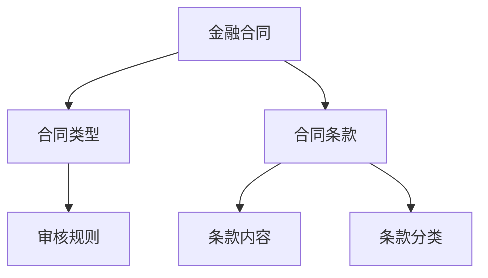
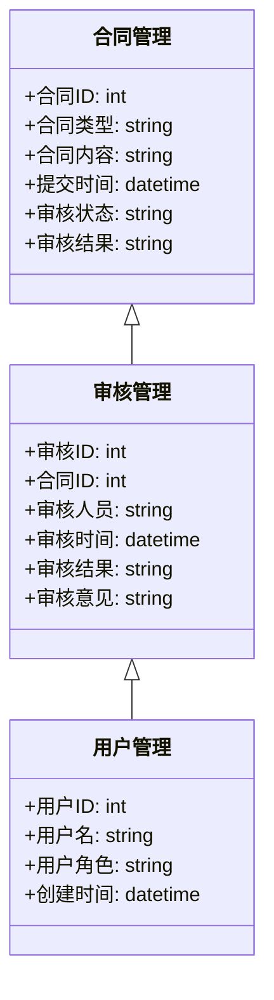

                 


# 开发基于大模型的金融合同审核系统

> 关键词：金融合同审核，AI大模型，NLP，自然语言处理，系统架构设计

> 摘要：本文详细探讨了开发基于大模型的金融合同审核系统的背景、核心概念、算法原理、系统架构设计、项目实现和优化与部署。文章从问题背景出发，分析了传统合同审核的痛点，介绍了大模型技术在合同审核中的应用，详细讲解了系统的架构设计、算法实现和优化策略，并通过实际案例展示了系统的实现过程。

---

# 第一部分: 背景介绍

## 第1章: 背景介绍

### 1.1 问题背景

#### 1.1.1 传统金融合同审核的痛点

金融合同审核是金融业务中的核心环节，传统审核方式主要依赖人工检查和简单的规则匹配。然而，这种方式存在以下痛点：

- **低效性**：人工审核需要大量时间，尤其是面对海量合同时，效率低下。
- **准确性差**：人工审核容易出现疏漏，尤其是在处理复杂条款时，错误率较高。
- **一致性不足**：不同审核人员对合同的理解可能存在差异，导致审核结果不一致。
- **成本高昂**：需要大量专业人员参与，企业需要承担高昂的人力成本。

#### 1.1.2 大模型技术的引入与优势

随着人工智能技术的快速发展，大模型（如GPT、BERT等）在自然语言处理（NLP）领域取得了突破性进展。将大模型技术引入金融合同审核，可以显著提升审核效率和准确性。其优势包括：

- **高效性**：大模型可以在短时间内处理大量合同，显著提高审核效率。
- **准确性高**：通过深度学习模型，可以捕捉到合同中的复杂关系和潜在风险。
- **一致性**：基于统一的模型进行审核，确保所有合同的审核标准一致。
- **可扩展性**：模型可以轻松扩展到新的合同类型和条款。

#### 1.1.3 金融行业对智能化审核的需求

金融行业对智能化合同审核的需求日益迫切，主要体现在以下几个方面：

- **合规性要求**：金融合同涉及复杂的法律条款，需要确保审核的合规性。
- **风险控制**：及时发现合同中的潜在风险，避免经济损失。
- **数字化转型**：金融行业正在加速数字化转型，智能化审核是必然趋势。

### 1.2 问题描述

#### 1.2.1 金融合同审核的核心任务

金融合同审核的核心任务包括：

- **合同分类**：根据合同类型进行分类，如贷款合同、保险合同等。
- **关键信息抽取**：提取合同中的关键信息，如金额、期限、担保条款等。
- **风险评估**：识别合同中的潜在风险，如霸王条款、不合理的收费等。
- **合规性检查**：确保合同内容符合相关法律法规。

#### 1.2.2 现有审核系统的局限性

现有审核系统主要依赖规则匹配和关键词提取，存在以下局限性：

- **规则有限**：无法处理复杂的合同条款和潜在风险。
- **灵活性差**：难以适应新的合同类型和法律法规的变化。
- **效率低下**：人工审核耗时长，且容易出错。

#### 1.2.3 基于大模型的解决方案

基于大模型的解决方案可以通过以下方式实现：

- **预训练模型**：利用大规模预训练模型（如BERT、GPT）进行合同理解。
- **微调模型**：在金融合同数据上对模型进行微调，提升领域适应性。
- **多任务学习**：同时进行合同分类、关键信息抽取和风险评估。

### 1.3 问题解决

#### 1.3.1 大模型在合同审核中的应用

大模型在合同审核中的应用主要体现在以下几个方面：

- **合同理解**：通过大模型对合同文本进行深度理解，提取关键信息。
- **智能分类**：利用大模型对合同进行分类，提高分类准确率。
- **风险识别**：识别合同中的潜在风险，帮助审核人员快速定位问题。

#### 1.3.2 从传统规则到智能模型的转变

从传统规则到智能模型的转变主要体现在以下几个方面：

- **规则匹配**：传统系统依赖于关键词匹配和简单的规则，而智能模型可以通过上下文理解进行更准确的判断。
- **数据驱动**：传统系统依赖于人工规则，而智能模型可以通过大量数据进行训练，自动学习审核规则。
- **适应性**：智能模型可以快速适应新的合同类型和法律法规变化，而传统系统需要手动调整规则。

#### 1.3.3 系统实现的关键技术

系统实现的关键技术包括：

- **自然语言处理（NLP）**：用于合同文本的理解和分析。
- **大模型训练**：利用大规模数据训练模型，提升模型的泛化能力。
- **微调与适配**：在金融合同数据上进行微调，提升模型的领域适应性。

### 1.4 系统的核心要素

#### 1.4.1 数据来源与处理

数据来源与处理是系统开发的重要环节，主要包括以下步骤：

1. **数据收集**：收集各种金融合同文本，包括贷款合同、保险合同等。
2. **数据清洗**：去除噪声数据，确保数据的干净和一致性。
3. **数据标注**：对合同文本进行标注，如标注关键信息、合同类型等。
4. **数据分割**：将数据划分为训练集、验证集和测试集。

#### 1.4.2 模型训练与优化

模型训练与优化是系统开发的核心，主要包括以下步骤：

1. **预训练**：利用大规模通用数据对模型进行预训练，提升模型的语义理解能力。
2. **微调**：在金融合同数据上对模型进行微调，提升模型的领域适应性。
3. **优化策略**：通过调整学习率、批量大小等参数，优化模型的性能。

#### 1.4.3 系统架构与部署

系统架构与部署是系统开发的重要环节，主要包括以下步骤：

1. **系统架构设计**：设计系统的整体架构，包括前端和后端的设计。
2. **接口设计**：设计系统与其他系统的接口，如与企业OA系统的接口。
3. **部署与测试**：将系统部署到生产环境，并进行测试，确保系统的稳定性和可靠性。

---

## 第2章: 核心概念与联系

### 2.1 AI大模型的基本原理

#### 2.1.1 大模型的训练机制

大模型的训练机制主要包括以下几个步骤：

1. **预训练**：利用大规模通用数据（如书籍、网页等）对模型进行预训练，提升模型的语义理解能力。
2. **微调**：在特定领域数据（如金融合同）上对模型进行微调，提升模型的领域适应性。
3. **适应性优化**：通过调整模型的参数，优化模型在特定任务上的性能。

#### 2.1.2 大模型的推理过程

大模型的推理过程主要包括以下几个步骤：

1. **输入处理**：将合同文本输入模型，进行分词和编码。
2. **模型编码**：将文本编码为模型可以理解的向量表示。
3. **输出结果**：模型根据编码后的向量进行推理，输出最终结果。

#### 2.1.3 大模型的可解释性

大模型的可解释性是金融合同审核中的一个重要问题。为了提高模型的可解释性，可以采用以下方法：

- **注意力机制**：通过注意力机制，展示模型在推理过程中关注的部分。
- **中间结果分析**：分析模型在推理过程中的中间结果，找出模型的决策依据。

### 2.2 金融合同审核的关键技术

#### 2.2.1 合同文本的特征提取

合同文本的特征提取是合同审核的核心任务之一。特征提取主要包括以下几个方面：

- **文本分词**：将合同文本分词为词语或短语。
- **词向量表示**：将分词后的词语转换为词向量表示。
- **句法分析**：分析句子的语法结构，提取关键词和关键短语。

#### 2.2.2 合同分类与关键信息抽取

合同分类与关键信息抽取是合同审核的重要任务，主要包括以下几个方面：

- **合同分类**：根据合同内容进行分类，如贷款合同、保险合同等。
- **关键信息抽取**：从合同中提取关键信息，如金额、期限、担保条款等。

#### 2.2.3 多任务学习的应用

多任务学习在合同审核中的应用主要体现在以下几个方面：

- **合同分类与关键信息抽取**：同时进行合同分类和关键信息抽取，提升任务的效率和准确性。
- **风险评估与合规性检查**：同时进行风险评估和合规性检查，确保合同的全面性。

### 2.3 核心概念对比分析

#### 2.3.1 大模型与传统机器学习的对比

大模型与传统机器学习的对比如下：

| 对比维度         | 大模型                 | 传统机器学习           |
|------------------|-----------------------|-----------------------|
| 数据需求         | 需要大量数据           | 数据需求较小           |
| 模型复杂度       | 模型复杂度高           | 模型复杂度低           |
| 任务适应性       | 适应性强，可以处理多种任务 | 适应性较弱，需要针对特定任务设计模型 |

#### 2.3.2 基于规则的系统与基于模型的系统的对比

基于规则的系统与基于模型的系统的对比如下：

| 对比维度         | 基于规则的系统         | 基于模型的系统         |
|------------------|-----------------------|-----------------------|
| 系统灵活性       | 灵活性低，规则固定       | 灵活性高，可以自动调整规则 |
| 系统维护成本     | 维护成本高，需要手动调整规则 | 维护成本低，可以通过训练新数据优化模型 |
| 适应性           | 适应性差，难以处理复杂任务 | 适应性强，可以处理复杂任务 |

#### 2.3.3 金融合同审核的领域模型与通用模型的对比

领域模型与通用模型的对比如下：

| 对比维度         | 领域模型               | 通用模型               |
|------------------|-----------------------|-----------------------|
| 适用范围         | 适用于特定领域         | 适用于通用领域         |
| 性能             | 在特定领域内性能更高     | 在通用任务上性能均衡   |
| 训练数据         | 需要大量领域内数据     | 数据来源广泛，包括多个领域 |

### 2.4 ER实体关系图



---

## 第3章: 算法原理讲解

### 3.1 大模型的训练过程

#### 3.1.1 预训练阶段

预训练阶段的主要目标是提升模型的语义理解能力。常用的预训练方法包括：

- **自监督学习**：通过预测词的方法（如Masked Language Model）进行预训练。
- **语言模型微调**：利用大规模通用数据对模型进行微调，提升模型的语义理解能力。

#### 3.1.2 微调阶段

微调阶段的主要目标是提升模型在金融合同审核任务上的性能。常用的微调方法包括：

- **任务特定微调**：在金融合同数据上进行微调，提升模型在特定任务上的性能。
- **数据增强**：通过数据增强技术（如同义词替换、句式变化等）提升模型的泛化能力。

#### 3.1.3 适应金融合同数据的策略

适应金融合同数据的策略主要包括以下几个方面：

- **数据清洗**：去除噪声数据，确保数据的干净和一致性。
- **数据标注**：对合同文本进行标注，如标注关键信息、合同类型等。
- **数据分割**：将数据划分为训练集、验证集和测试集。

### 3.2 模型推理流程

#### 3.2.1 输入处理

输入处理的主要步骤包括：

- **文本分词**：将合同文本分词为词语或短语。
- **词向量表示**：将分词后的词语转换为词向量表示。
- **输入编码**：将词向量编码为模型可以理解的输入格式。

#### 3.2.2 模型编码

模型编码的主要步骤包括：

- **词嵌入**：将输入的文本转换为词嵌入向量。
- **序列编码**：利用模型的编码层对序列进行编码，生成上下文表示。
- **注意力机制**：通过注意力机制，关注重要的词语和短语。

#### 3.2.3 输出结果解析

输出结果解析的主要步骤包括：

- **分类输出**：根据模型的输出结果进行分类，如合同分类、条款分类等。
- **关键信息抽取**：从模型的输出结果中提取关键信息，如金额、期限等。
- **风险评估**：根据模型的输出结果，评估合同中的潜在风险。

### 3.3 数学模型与公式

#### 3.3.1 损失函数

$$
L = -\sum_{i=1}^{n} y_i \log(p_i) + (1 - y_i) \log(1 - p_i)
$$

其中，$y_i$ 是标签，$p_i$ 是模型的预测概率。

#### 3.3.2 概率计算

$$
P(y|x) = \frac{P(x,y)}{P(x)}
$$

其中，$P(x,y)$ 是联合概率，$P(x)$ 是边缘概率。

---

## 第4章: 系统分析与架构设计方案

### 4.1 问题场景介绍

金融合同审核系统需要处理大量的金融合同，包括贷款合同、保险合同等。系统需要具备以下功能：

- **合同分类**：根据合同内容进行分类。
- **关键信息抽取**：从合同中提取关键信息。
- **风险评估**：识别合同中的潜在风险。
- **合规性检查**：确保合同内容符合相关法律法规。

### 4.2 系统功能设计

#### 4.2.1 领域模型设计

领域模型设计包括以下几个部分：



#### 4.2.2 系统架构设计

系统架构设计包括以下几个部分：

```mermaid
rect
    前端 {
        用户界面
        合同提交
        审核结果查询
    }
    后端 {
        API Gateway
        合同管理服务
        审核管理服务
        用户管理服务
    }
    数据库 {
        合同管理表
        审核管理表
        用户管理表
    }
    接口 {
        REST API
        WebSocket
    }
```

#### 4.2.3 系统接口设计

系统接口设计包括以下几个部分：

- **合同提交接口**：用于提交新的合同。
- **合同审核接口**：用于进行合同审核。
- **审核结果查询接口**：用于查询审核结果。

#### 4.2.4 系统交互流程

系统交互流程如下：

1. 用户提交合同。
2. 系统进行合同分类和关键信息抽取。
3. 系统进行风险评估和合规性检查。
4. 系统生成审核结果。
5. 用户查询审核结果。

---

## 第5章: 项目实战

### 5.1 环境安装

项目实战需要以下环境：

- **Python**：3.6+
- **TensorFlow**或**PyTorch**：2.0+
- **Transformers**库：用于加载预训练模型。
- **Mermaid**：用于绘制图表。

### 5.2 核心实现

#### 5.2.1 数据处理

```python
import pandas as pd

def process_data(data_path):
    # 读取数据
    df = pd.read_csv(data_path)
    # 数据清洗
    df.dropna(inplace=True)
    # 数据标注
    df['label'] = df['label'].apply(lambda x: str(x))
    return df
```

#### 5.2.2 模型训练

```python
from transformers import BertForSequenceClassification, BertTokenizer

def train_model(train_data, model_name='bert-base-uncased'):
    tokenizer = BertTokenizer.from_pretrained(model_name)
    model = BertForSequenceClassification.from_pretrained(model_name, num_labels=len(train_data['label'].unique()))
    # 定义训练函数
    def train_func(batch):
        inputs = tokenizer(batch['text'], padding=True, truncation=True, return_tensors='pt')
        labels = torch.tensor(batch['label'], dtype=torch.int64)
        outputs = model(**inputs)
        loss = outputs.loss
        return {'loss': loss}
    # 开始训练
    trainer = Trainer(model=model, train_dataset=train_data, 
                      dataloader=train_data, 
                      compute_metrics=lambda pred: {'accuracy': accuracy_score(pred.predictions, pred.label_ids)})
    trainer.train()
    return model, tokenizer
```

#### 5.2.3 接口开发

```python
from flask import Flask, request, jsonify

app = Flask(__name__)

@app.route('/api/contract_audit', methods=['POST'])
def contract_audit():
    data = request.json
    text = data['text']
    # 调用模型进行审核
    inputs = tokenizer(text, padding=True, truncation=True, return_tensors='pt')
    outputs = model(**inputs)
    result = outputs logits.argmax(dim=1).item()
    return jsonify({'result': result})

if __name__ == '__main__':
    app.run(port=5000)
```

---

## 第6章: 优化与部署

### 6.1 模型调优

#### 6.1.1 参数调整

- **学习率**：调整学习率，找到最优学习率。
- **批量大小**：调整批量大小，找到最优批量大小。
- **模型层数**：增加或减少模型层数，找到最优模型复杂度。

#### 6.1.2 数据增强

- **同义词替换**：替换部分词语为同义词，增加数据多样性。
- **句式变化**：通过改变句式结构，增加数据的多样性。

### 6.2 系统性能优化

#### 6.2.1 代码优化

- **并行计算**：利用多线程或多进程进行并行计算，提高计算效率。
- **缓存优化**：优化数据缓存，减少I/O时间。

#### 6.2.2 网络优化

- **负载均衡**：通过负载均衡技术，分散网络流量，提高系统的抗压能力。
- **CDN加速**：利用CDN技术，加速静态资源的加载速度。

### 6.3 线上部署

#### 6.3.1 环境配置

- **服务器配置**：选择合适的服务器，配置操作系统和相关软件。
- **数据库配置**：配置数据库，确保数据的安全性和稳定性。
- **网络配置**：配置网络，确保系统的稳定性和可扩展性。

#### 6.3.2 系统监控

- **日志监控**：实时监控系统日志，及时发现和解决问题。
- **性能监控**：监控系统的性能指标，如CPU、内存、磁盘使用情况。

#### 6.3.3 安全措施

- **身份认证**：通过身份认证技术，确保系统的安全性。
- **访问控制**：通过访问控制技术，限制非授权访问。
- **数据加密**：对敏感数据进行加密处理，确保数据的安全性。

---

## 第7章: 总结与展望

### 7.1 总结

本文详细探讨了开发基于大模型的金融合同审核系统的背景、核心概念、算法原理、系统架构设计、项目实现和优化与部署。通过分析传统合同审核的痛点，介绍了大模型技术在合同审核中的应用，详细讲解了系统的架构设计、算法实现和优化策略，并通过实际案例展示了系统的实现过程。

### 7.2 未来展望

未来，随着大模型技术的不断发展，金融合同审核系统将更加智能化和自动化。以下是未来的发展方向：

1. **模型优化**：进一步优化模型的性能，提升审核的准确性和效率。
2. **多模态融合**：结合图像识别、语音识别等技术，实现多模态合同审核。
3. **智能化决策**：通过大模型技术，实现合同审核的智能化决策，减少人工干预。

---

## 作者信息

作者：AI天才研究院/AI Genius Institute & 禅与计算机程序设计艺术 /Zen And The Art of Computer Programming

