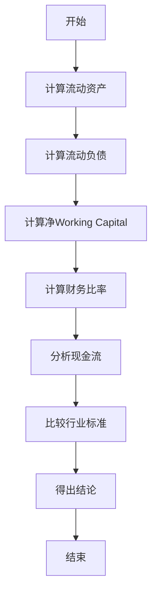
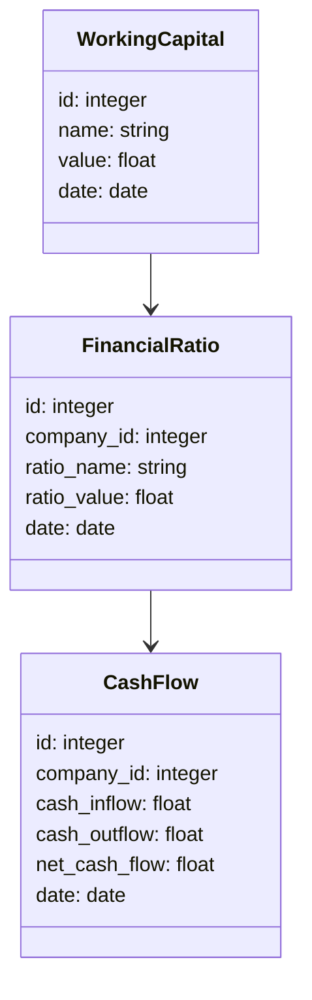
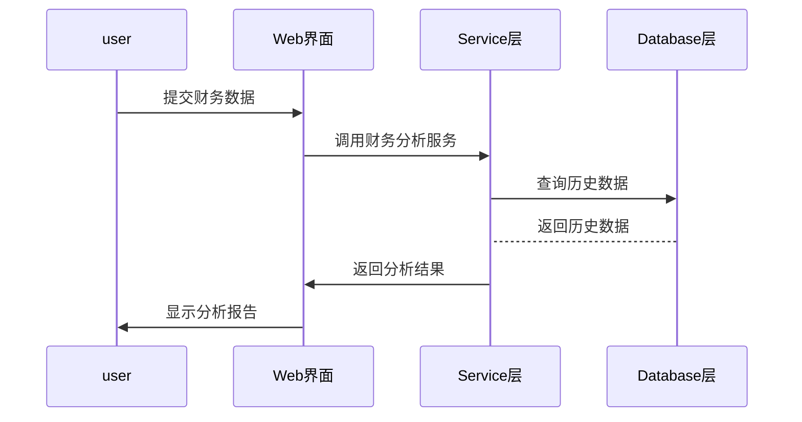

                 


# 彼得林奇对公司working capital效率的评估

## 关键词：彼得·林奇，Working Capital，公司评估，财务比率，现金流

## 摘要：本文详细探讨了彼得·林奇对公司working capital效率的评估方法。首先，我们介绍了working capital的基本概念和其在公司管理中的重要性。接着，我们分析了working capital的构成要素及其管理原则，并深入探讨了彼得·林奇的评估方法和其独特见解。通过具体案例分析和数学模型的建立，我们展示了如何通过财务比率和现金流分析来评估working capital的效率。最后，我们总结了彼得·林奇评估方法的核心要点，并提出了实际应用中的最佳实践建议。

---

## 第一部分: 背景介绍

### 第1章: Working Capital 的定义与重要性

#### 1.1 Working Capital 的基本概念

- **1.1.1 Working Capital 的定义**
  Working Capital（流动资本）是指公司在日常运营中可以快速转换为现金的资产总和，主要包括现金、应收账款、存货等流动资产减去流动负债后的净额。它是衡量公司短期偿债能力和运营效率的重要指标。

- **1.1.2 Working Capital 的重要性**
  - Working Capital是公司维持日常运营的基础，直接影响公司的现金流和偿债能力。
  - 足够的Working Capital能够确保公司在短期内偿还债务，避免流动性危机。
  - 优化Working Capital管理可以提高资金利用效率，降低成本，提升公司整体盈利能力。

- **1.1.3 Working Capital 的核心要素**
  - 流动资产：包括现金、应收账款、存货等。
  - 流动负债：包括应付账款、短期借款、应计费用等。
  - 净Working Capital：流动资产减去流动负债，反映公司短期偿债能力。

#### 1.2 彼得·林奇与公司评估方法

- **1.2.1 彼得·林奇的背景与投资理念**
  彼得·林奇是美国著名投资经理人，以其在富达基金的长期优异表现而闻名。他强调基本面分析，注重公司财务健康状况和管理层质量，尤其擅长通过财务数据评估公司的内在价值。

- **1.2.2 彼得·林奇对公司效率的评估方法**
  林奇认为，评估公司的效率不仅要看财务数据，还要结合行业特点和公司实际情况。他特别关注公司如何管理和优化Working Capital，认为这是衡量公司短期偿债能力和运营效率的关键指标。

- **1.2.3 Working Capital 在公司评估中的作用**
  Working Capital是林奇评估公司财务健康的重要组成部分。通过分析公司的Working Capital效率，林奇能够判断公司是否具备良好的短期偿债能力，以及是否存在资金浪费或管理不善的问题。

---

### 第2章: Working Capital 的构成与管理

#### 2.1 Working Capital 的构成要素

- **2.1.1 现金与现金等价物**
  - 包括库存现金、银行存款、短期投资等，是公司最直接的流动资产。
  - 现金管理的核心是平衡流动性与收益性，避免过多的现金闲置或过度依赖短期负债融资。

- **2.1.2 应收账款**
  - 公司因赊销而产生的未收回款项，是流动资产的重要组成部分。
  - 应收账款的管理直接影响公司的现金流和信用风险，需要通过合理的信用政策和催收机制来优化。

- **2.1.3 存货**
  - 包括原材料、在制品和成品，是公司生产和销售的重要保障。
  - 存货管理的目标是在满足生产和销售需求的前提下，尽量减少库存占用，降低存储成本。

- **2.1.4 预付账款**
  - 公司为购买商品或服务而预先支付的款项，通常与供应商的信用政策相关。
  - 预付账款的管理需要结合采购计划和供应商信用状况，避免资金闲置。

- **2.1.5 其他流动资产**
  - 包括其他应收款、短期投资等，是流动资产中较为特殊的一部分。
  - 其他流动资产的管理需要根据公司的具体业务特点和财务策略进行。

#### 2.2 Working Capital 的管理原则

- **2.2.1 流动性管理**
  - 确保公司具备足够的流动性，能够及时偿还短期债务，避免流动性风险。
  - 通过合理配置流动资产和流动负债，保持Working Capital的健康状况。

- **2.2.2 效率管理**
  - 优化Working Capital的使用效率，减少不必要的资金占用，降低成本。
  - 通过分析存货周转率、应收账款回收周期等指标，评估Working Capital的管理效率。

- **2.2.3 风险管理**
  - 识别和评估Working Capital管理中的潜在风险，如信用风险、存货跌价风险等。
  - 建立风险控制机制，制定应急预案，降低风险对公司财务状况的影响。

#### 2.3 彼得·林奇的管理理念

- **2.3.1 林奇对Working Capital 的独特见解**
  - 林奇认为，Working Capital不仅是财务数据的一部分，更是公司运营效率和管理水平的体现。
  - 他强调，公司应该通过优化Working Capital管理，提升资金使用效率，降低运营成本。

- **2.3.2 林奇的管理策略**
  - 通过分析财务报表，识别Working Capital管理中的问题和机会。
  - 结合行业特点和公司实际情况，制定个性化的优化方案。

- **2.3.3 林奇的管理工具与方法**
  - 利用财务比率分析工具，如速动比率、流动比率等，评估公司短期偿债能力。
  - 通过现金流分析，监控公司现金流的健康状况，确保资金链的安全。

---

## 第二部分: 核心概念与联系

### 第3章: Working Capital 的核心概念原理

#### 3.1 Working Capital 的属性特征对比

- **3.1.1 流动资产与非流动资产的对比**
  | **属性**       | **流动资产**         | **非流动资产**       |
  |------------------|----------------------|----------------------|
  | 定义             | 能够在一年内转换为现金的资产 | 不能在一年内转换为现金的资产 |
  | 常见类型         | 现金、应收账款、存货等 | 长期投资、固定资产、无形资产等 |
  | 管理目标         | 提高流动性，降低风险 | 保值增值，长期投资 |

- **3.1.2 流动负债与非流动负债的对比**
  | **属性**       | **流动负债**         | **非流动负债**       |
  |------------------|----------------------|----------------------|
  | 定义             | 需要在一年内偿还的债务 | 需要超过一年偿还的债务 |
  | 常见类型         | 应付账款、短期借款等 | 长期借款、债券等     |
  | 管理目标         | 确保短期偿债能力     | 优化长期债务结构     |

- **3.1.3 Working Capital 与 Net Working Capital 的对比**
  - **Working Capital**：流动资产减去流动负债，反映公司短期偿债能力。
  - **Net Working Capital**：净流动资本，通常指流动资产减去流动负债后的净额，用于衡量公司资本结构的健康状况。

#### 3.2 ER 实体关系图架构

```mermaid
entity WorkingCapital {
    id
    name
    value
    date
}
```

---

## 第三部分: 算法原理

### 第4章: 彼得·林奇的评估方法

#### 4.1 彼得·林奇的评估原理

- **4.1.1 基于财务比率的分析**
  - 速动比率（Acid-Proof Ratio）：速动资产（流动资产减去存货）与流动负债的比率，衡量公司短期偿债能力。
  - 流动比率（Current Ratio）：流动资产与流动负债的比率，反映公司整体流动性状况。
  - 资产负债率（Debt-to-Asset Ratio）：流动负债与流动资产的比率，评估公司短期债务压力。

- **4.1.2 基于现金流的分析**
  - 经营活动现金流：公司日常运营产生的现金流，反映公司实际盈利能力。
  - 投资活动现金流：公司投资活动产生的现金流，影响公司长期发展能力。
  - 筹资活动现金流：公司筹资活动产生的现金流，影响公司资本结构和偿债能力。

- **4.1.3 基于行业标准的比较**
  - 行业平均值：通过比较公司与行业平均水平的差距，判断公司财务状况的优劣。
  - 同行业公司比较：分析公司在行业中的相对位置，识别潜在的优势和劣势。

#### 4.2 评估方法的流程图



---

## 第四部分: 数学模型

### 第5章: 数学模型与公式

#### 5.1 速动比率

速动比率的计算公式为：
$$ \text{速动比率} = \frac{\text{速动资产}}{\text{流动负债}} $$

其中，速动资产 = 流动资产 - 存货。

#### 5.2 流动比率

流动比率的计算公式为：
$$ \text{流动比率} = \frac{\text{流动资产}}{\text{流动负债}} $$

#### 5.3 资产负债率

资产负债率的计算公式为：
$$ \text{资产负债率} = \frac{\text{流动负债}}{\text{流动资产}} $$

#### 5.4 实际案例分析

以某公司为例，假设其流动资产为100万元，流动负债为50万元，存货为20万元。

1. 计算速动资产：
$$ \text{速动资产} = 100 - 20 = 80 \text{万元} $$

2. 计算速动比率：
$$ \text{速动比率} = \frac{80}{50} = 1.6 $$

3. 计算流动比率：
$$ \text{流动比率} = \frac{100}{50} = 2 $$

4. 计算资产负债率：
$$ \text{资产负债率} = \frac{50}{100} = 0.5 $$

---

## 第五部分: 系统分析

### 第6章: 系统分析与架构设计方案

#### 6.1 系统功能设计

- **领域模型（mermaid类图）**


- **系统架构图（mermaid架构图）**
```mermaid
container WorkingCapital_System {
    Web界面
    -> Service层
    -> Database层
}
```

- **系统接口设计**
  - 输入接口：提供公司财务数据的导入功能，支持Excel、CSV等格式。
  - 输出接口：生成财务比率分析报告、现金流分析报告等。

- **系统交互流程（mermaid序列图）**


---

## 第六部分: 项目实战

### 第7章: 项目实战与总结

#### 7.1 项目环境安装

- 安装必要的Python库：
  ```bash
  pip install pandas numpy matplotlib
  ```

#### 7.2 核心实现源代码

```python
import pandas as pd
import numpy as np

# 示例数据
data = {
    '流动资产': [100, 120, 90],
    '流动负债': [50, 60, 40],
    '存货': [20, 25, 15]
}

df = pd.DataFrame(data)

# 计算速动资产
df['速动资产'] = df['流动资产'] - df['存货']

# 计算速动比率
df['速动比率'] = df['速动资产'] / df['流动负债']

# 计算流动比率
df['流动比率'] = df['流动资产'] / df['流动负债']

# 计算资产负债率
df['资产负债率'] = df['流动负债'] / df['流动资产']

print(df)
```

#### 7.3 代码应用解读与分析

- **数据输入**：用户输入公司财务数据，包括流动资产、流动负债和存货。
- **速动资产计算**：通过流动资产减去存货，得到速动资产。
- **速动比率和流动比率计算**：分别计算速动资产与流动负债的比率，以及流动资产与流动负债的比率。
- **资产负债率计算**：流动负债与流动资产的比率，反映公司短期债务压力。

#### 7.4 实际案例分析

以某公司为例，分析其Working Capital效率：

1. **数据输入**：
   - 流动资产：100万元
   - 流动负债：50万元
   - 存货：20万元

2. **计算速动资产**：
   $$ \text{速动资产} = 100 - 20 = 80 \text{万元} $$

3. **计算速动比率**：
   $$ \text{速动比率} = \frac{80}{50} = 1.6 $$

4. **计算流动比率**：
   $$ \text{流动比率} = \frac{100}{50} = 2 $$

5. **计算资产负债率**：
   $$ \text{资产负债率} = \frac{50}{100} = 0.5 $$

---

### 第7章: 项目总结

通过本项目，我们学会了如何利用Python编程语言和相关库（如Pandas、NumPy）进行Working Capital效率的评估。通过实际案例分析，我们掌握了速动比率、流动比率和资产负债率的计算方法，并能够通过这些指标评估公司的短期偿债能力和运营效率。未来，我们可以将这些方法应用到实际工作中，优化公司的资金管理，提升整体盈利能力。

---

## 总结

彼得·林奇对公司Working Capital效率的评估方法为我们提供了一个全新的视角。通过分析财务比率和现金流，我们可以更全面地评估公司的短期偿债能力和运营效率。本文通过理论分析、数学建模和实际案例，详细讲解了林奇的评估方法，并通过Python代码展示了如何将这些方法应用于实际工作中。希望本文能够为读者在公司管理与优化方面提供有价值的参考。

---

## 作者：AI天才研究院/AI Genius Institute & 禅与计算机程序设计艺术 /Zen And The Art of Computer Programming

