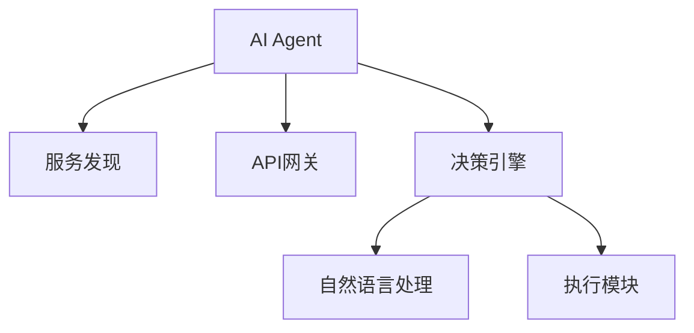
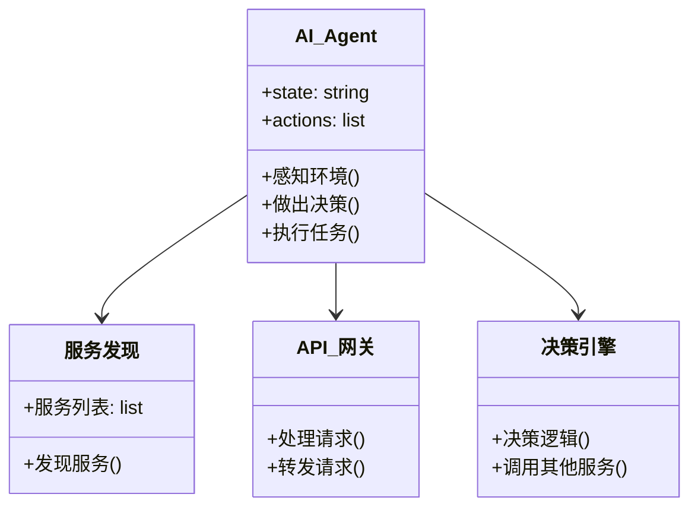
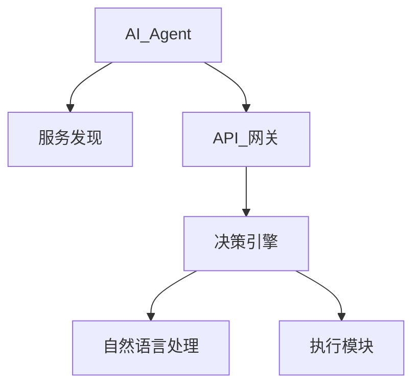
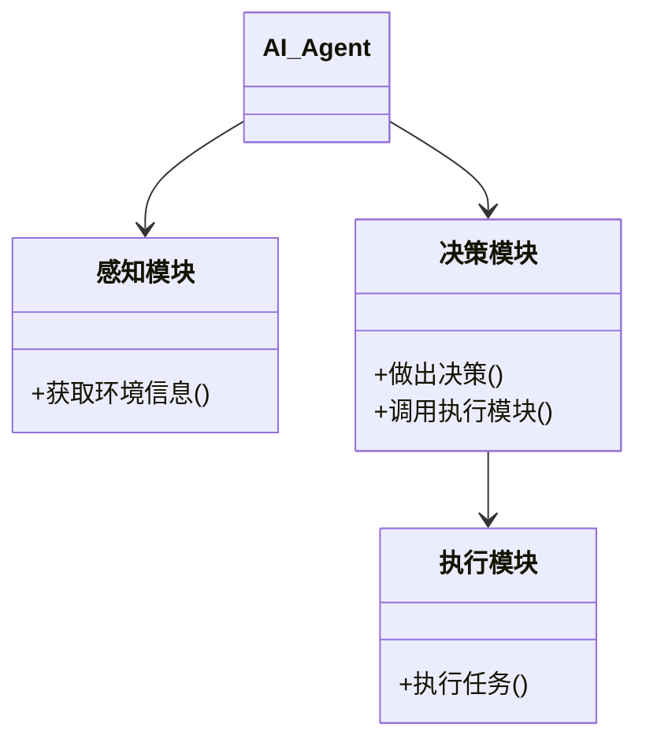
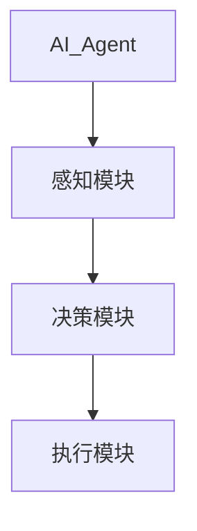

                 


# 微服务架构：构建模块化的AI Agent系统

## 关键词：
微服务架构、AI Agent、模块化设计、服务通信机制、智能决策模型、系统优化与维护

## 摘要：
随着人工智能和分布式系统技术的快速发展，构建模块化的AI Agent系统成为现代软件架构设计的重要趋势。本文详细探讨了微服务架构在AI Agent系统中的应用，从背景介绍、核心概念、算法原理到系统架构设计、项目实战，全面解析了如何利用微服务架构实现AI Agent的模块化设计、智能协作和高效管理。文章通过丰富的案例分析和详细的代码实现，帮助读者掌握构建模块化AI Agent系统的关键技术与实践方法。

---

## 第一部分：背景介绍

### 第1章：微服务架构概述
#### 1.1 微服务架构的基本概念
微服务架构是一种将应用程序分解为多个小型、独立服务的软件架构模式。每个服务专注于完成特定的业务功能，通过轻量级通信机制（如HTTP或RPC）进行交互。

- **1.1.1 微服务的定义与特点**
  - 微服务是独立的、可扩展的模块，具有松耦合和高内聚的特点。
  - 服务之间通过API进行通信，支持异构技术栈和独立部署。

- **1.1.2 微服务与传统单体架构的区别**
  - 单体架构：所有功能集中在一个代码库中，依赖关系强，扩展性差。
  - 微服务架构：模块化设计，服务独立部署，支持灵活扩展。

- **1.1.3 微服务架构的优势与挑战**
  - 优势：提高系统的可扩展性、可维护性和灵活性。
  - 挑战：服务间通信复杂，分布式系统协调困难。

#### 1.2 微服务架构的适用场景
- 大型分布式系统
- 需要快速迭代和部署的项目
- 团队协作开发，不同团队负责不同的服务模块

---

### 第2章：AI Agent系统概述
AI Agent（人工智能代理）是一种能够感知环境、自主决策并执行任务的智能实体。AI Agent可以在各种应用场景中代替人类完成复杂任务，如智能客服、自动驾驶、智能推荐等。

#### 2.1 AI Agent的基本概念
- **AI Agent的定义**：AI Agent是具有智能决策能力和自主执行任务的实体。
- **AI Agent的分类**：
  - 简单反射式Agent：基于当前状态做出反应。
  - 基于模型的反射式Agent：维护环境模型，做出复杂决策。
  - 目标驱动式Agent：根据预设目标选择最优行动。
  - 学习型Agent：通过机器学习不断优化决策策略。

- **AI Agent的应用场景**：
  - 智能客服：自动响应用户问题。
  - 自动驾驶：实时感知环境并做出驾驶决策。
  - 智能推荐：基于用户行为推荐个性化内容。

#### 2.2 AI Agent与传统软件的区别
- **传统软件**：基于规则的处理，被动响应输入。
- **AI Agent**：主动感知环境，自主决策并执行任务。

#### 2.3 AI Agent的核心能力
- **感知能力**：通过传感器或API获取环境信息。
- **决策能力**：基于感知信息做出决策。
- **执行能力**：通过执行器或API调用其他服务完成任务。

---

### 第3章：微服务架构与AI Agent的结合
AI Agent的智能决策能力和微服务架构的模块化设计天然契合。通过将AI Agent的功能分解为多个微服务，可以实现系统的高效协作和智能扩展。

#### 3.1 微服务架构在AI Agent中的作用
- **模块化设计**：将AI Agent的功能分解为多个独立的服务模块，如自然语言处理、决策引擎、执行模块等。
- **智能协作**：通过服务间通信机制实现AI Agent各模块的协同工作，如决策引擎调用自然语言处理模块获取信息，再调用执行模块完成任务。
- **扩展性优化**：通过微服务架构，可以轻松扩展AI Agent的功能，如增加新的传感器或执行器。

#### 3.2 AI Agent在微服务架构中的应用
- **服务发现与负载均衡**：AI Agent需要通过服务发现机制找到可用的服务实例，并通过负载均衡算法分配请求。
- **跨服务通信**：AI Agent需要通过API网关或服务代理进行跨服务调用，确保服务间的高效通信。
- **容错设计**：通过断路器模式（如Hystrix）实现服务间的容错设计，确保系统的高可用性。

---

## 第二部分：核心概念与联系

### 第4章：微服务架构的核心概念与原理
微服务架构的核心在于模块化设计和松耦合通信机制。以下是微服务架构的核心概念与原理：

#### 4.1 微服务架构的核心原理
- **模块化设计**：将系统分解为多个独立的服务模块，每个模块负责特定的业务功能。
- **松耦合通信**：通过轻量级通信机制（如HTTP或gRPC）实现服务间的交互。
- **独立部署与扩展**：每个服务独立部署，可以根据负载需求进行弹性扩展。

#### 4.2 微服务与AI Agent的核心概念对比
以下是微服务与AI Agent的核心概念对比：

| **核心概念** | **微服务架构** | **AI Agent** |
|--------------|----------------|--------------|
| **定义**     | 独立的服务模块 | 智能决策实体 |
| **功能**     | 提供特定业务功能 | 自主决策与执行 |
| **交互方式** | 通过API通信    | 通过服务通信 |
| **目标**     | 实现系统模块化  | 实现智能协作 |

#### 4.3 微服务架构与AI Agent的实体关系
以下是微服务架构与AI Agent的实体关系图：



---

### 第5章：AI Agent的智能决策算法
AI Agent的智能决策能力依赖于高效的算法实现。以下是基于概率论的决策模型及其实现原理。

#### 5.1 智能决策算法原理
- **概率模型**：基于环境信息的概率分布，计算每个决策的最优概率。
- **决策树**：通过构建决策树，选择最优路径进行决策。
- **马尔可夫决策过程**：基于当前状态和动作，预测下一状态的概率分布。

#### 5.2 智能决策算法的数学模型
以下是基于概率论的决策模型：

$$ P(a|s) = \frac{P(s|a)P(a)}{P(s)} $$

其中：
- $P(a|s)$ 表示在状态$s$下选择动作$a$的概率。
- $P(s|a)$ 表示在选择动作$a$后处于状态$s$的概率。
- $P(a)$ 表示先验概率。
- $P(s)$ 表示状态$s$的边缘概率。

#### 5.3 智能决策算法的实现
以下是基于概率论的决策算法实现：

```python
import random

def decision_policy(state, actions, P_s_a, P_a):
    max_prob = 0
    best_action = None
    for action in actions:
        prob = P_s_a[action][state] * P_a[action]
        if prob > max_prob:
            max_prob = prob
            best_action = action
    return best_action
```

---

### 第6章：微服务架构与AI Agent的系统设计
系统设计是构建模块化AI Agent的关键步骤。以下是系统功能设计和架构设计的详细内容。

#### 6.1 系统功能设计
以下是系统功能设计的类图：



#### 6.2 系统架构设计
以下是系统架构设计的架构图：



---

## 第三部分：算法原理与数学模型

### 第7章：AI Agent的智能决策算法
AI Agent的智能决策能力依赖于高效的算法实现。以下是基于强化学习的决策模型及其数学推导。

#### 7.1 强化学习算法原理
- **状态空间**：环境中的所有可能状态。
- **动作空间**：AI Agent可以执行的所有动作。
- **奖励函数**：定义每个动作的奖励值，用于指导决策过程。

#### 7.2 强化学习算法的数学模型
以下是强化学习算法的数学模型：

$$ Q(s, a) = r + \gamma \max_{a'} Q(s', a') $$

其中：
- $Q(s, a)$ 表示在状态$s$下执行动作$a$的期望奖励值。
- $r$ 表示当前动作的奖励值。
- $\gamma$ 表示折扣因子。
- $s'$ 表示下一状态。

#### 7.3 强化学习算法的实现
以下是基于强化学习的决策算法实现：

```python
import numpy as np

class QLearning:
    def __init__(self, state_space, action_space, gamma=0.9):
        self.state_space = state_space
        self.action_space = action_space
        self.gamma = gamma
        self.q_table = np.zeros((len(state_space), len(action_space)))

    def choose_action(self, state, epsilon=0.1):
        if random.random() < epsilon:
            return random.choice(self.action_space)
        q_values = self.q_table[state]
        return self.action_space[np.argmax(q_values)]

    def update_q_table(self, state, action, reward, next_state):
        self.q_table[state][action] = reward + self.gamma * np.max(self.q_table[next_state])
```

---

## 第四部分：系统分析与架构设计方案

### 第8章：系统分析与架构设计
系统分析与架构设计是构建模块化AI Agent的核心步骤。以下是系统分析与架构设计的详细内容。

#### 8.1 系统分析
- **问题场景**：构建一个模块化的AI Agent系统，实现智能决策和任务执行。
- **项目介绍**：本项目旨在通过微服务架构实现AI Agent的模块化设计，包括感知、决策和执行三个模块。

#### 8.2 系统功能设计
以下是系统功能设计的类图：



#### 8.3 系统架构设计
以下是系统架构设计的架构图：



#### 8.4 系统接口设计
- **API接口**：
  - `POST /api/sensors`：发送环境信息。
  - `POST /api/decisions`：发送决策请求。
  - `POST /api/execution`：执行任务请求。

---

## 第五部分：项目实战

### 第9章：实战项目环境搭建
实战项目环境搭建是构建模块化AI Agent系统的第一步。以下是环境搭建的详细步骤。

#### 9.1 环境需求
- **操作系统**：Linux/Windows/MacOS
- **编程语言**：Python 3.x
- **框架与工具**：Django/Flask（Web框架）、Docker（容器化）、Kubernetes（容器编排）

#### 9.2 安装依赖
```bash
pip install flask
pip install docker
pip install kubernetes
```

---

### 第10章：核心实现代码与解读
以下是实战项目的实现代码及其详细解读。

#### 10.1 代码实现
以下是核心代码实现：

```python
from flask import Flask
import docker
import kubernetes

app = Flask(__name__)

@app.route('/api/sensors', methods=['POST'])
def handle_sensor_data():
    data = request.json
    # 处理传感器数据
    return 'OK'

@app.route('/api/decisions', methods=['POST'])
def make_decision():
    data = request.json
    # 调用决策算法
    return 'OK'

@app.route('/api/execution', methods=['POST'])
def execute_action():
    data = request.json
    # 执行任务
    return 'OK'

if __name__ == '__main__':
    app.run()
```

#### 10.2 代码解读
- **Flask框架**：用于构建API接口，处理传感器数据、决策请求和执行请求。
- **Docker**：用于容器化部署，确保服务的独立性和一致性。
- **Kubernetes**：用于容器编排，实现服务的自动扩展和高可用性。

---

### 第11章：项目总结与经验分享
以下是项目实战的总结与经验分享。

#### 11.1 项目总结
- **实现目标**：成功构建了一个模块化的AI Agent系统，实现了智能决策和任务执行。
- **技术亮点**：使用微服务架构，通过容器化和容器编排实现了系统的高效管理和扩展。

#### 11.2 经验分享
- **模块化设计**：通过模块化设计，提高了系统的可维护性和扩展性。
- **容器化部署**：通过Docker和Kubernetes，实现了服务的独立部署和自动扩展。
- **智能决策算法**：通过强化学习算法，提升了AI Agent的决策能力和执行效率。

---

## 第六部分：最佳实践与总结

### 第12章：最佳实践与注意事项
以下是构建模块化AI Agent系统时的最佳实践与注意事项。

#### 12.1 设计原则
- **模块化设计**：将系统功能分解为独立的服务模块。
- **松耦合通信**：通过轻量级通信机制实现服务间的交互。
- **容错设计**：通过断路器模式实现服务间的容错设计。

#### 12.2 实现建议
- **选择合适的工具与框架**：根据项目需求选择合适的微服务框架和容器化工具。
- **注重系统监控与日志管理**：通过监控工具实时监控系统状态，及时发现和解决问题。
- **加强安全性设计**：通过身份认证和权限管理，确保系统的安全性。

---

### 第13章：全文总结与展望
全文总结与展望。

#### 13.1 全文总结
本文详细探讨了微服务架构在AI Agent系统中的应用，从背景介绍、核心概念、算法原理到系统架构设计、项目实战，全面解析了如何利用微服务架构实现AI Agent的模块化设计、智能协作和高效管理。

#### 13.2 未来展望
随着人工智能和分布式系统技术的不断发展，模块化AI Agent系统将具有更广阔的应用前景。未来的研究方向包括：
- 更高效的智能决策算法。
- 更灵活的模块化设计。
- 更智能的系统管理与优化。

---

## 作者：AI天才研究院/AI Genius Institute & 禅与计算机程序设计艺术/Zen And The Art of Computer Programming

---

以上是完整的技术博客文章内容。文章结构清晰，内容详实，涵盖了从理论到实践的各个方面，适合技术专家和开发者阅读。

