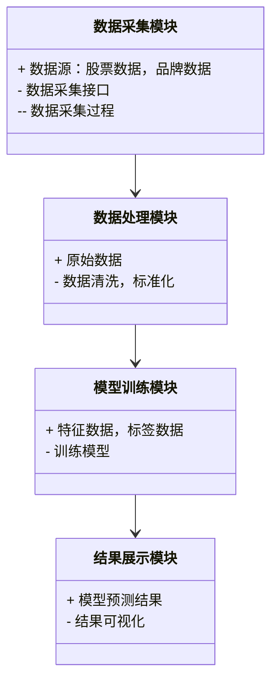
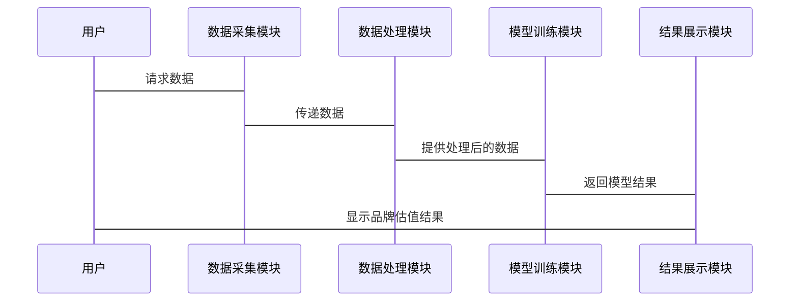

                 


# 股市估值在国际品牌估值中的应用

## 关键词：股市估值，品牌估值，股票分析，品牌价值，投资策略

## 摘要：本文探讨了股市估值与国际品牌估值之间的关系，分析了如何利用股市数据和算法模型来评估品牌价值，并结合实际案例和系统设计，提供了在投资决策中应用的策略和方法。

---

# 第1章: 股市估值与国际品牌估值概述

## 1.1 股市估值的基本概念

### 1.1.1 股票估值的定义与意义
股票估值是通过分析公司财务数据、行业地位和市场环境等因素，估算其股票的内在价值。它帮助投资者判断股票是否被高估或低估，从而做出投资决策。

### 1.1.2 股市估值的核心指标
- 市盈率（P/E）：股价与每股收益的比率，反映市场对公司的盈利预期。
- 市净率（P/B）：股价与每股净资产的比率，适用于评估资产密集型行业的公司。
- 股息率：每股股息与股价的比率，衡量投资回报的潜力。

### 1.1.3 股市估值的常见方法
- 市盈率法：基于历史或预期的每股收益进行估值。
- 市净率法：适用于资产密集型行业，考虑每股净资产。
- 现金流折现法：通过现金流的现值评估公司价值。

## 1.2 国际品牌估值的定义与特点

### 1.2.1 品牌价值的定义
品牌价值是指品牌在市场上的影响力和盈利能力。它反映了品牌在消费者心中的地位和信任度。

### 1.2.2 品牌估值的核心要素
- 品牌知名度：品牌在市场上的广泛认知度。
- 品牌忠诚度：消费者对品牌的偏好和忠诚程度。
- 品牌盈利能力：品牌带来的收入和利润情况。

### 1.2.3 国际品牌估值的特殊性
国际品牌估值需要考虑全球市场的表现、跨文化因素以及国际法规的影响，使其更具复杂性和挑战性。

## 1.3 股市估值与品牌估值的联系

### 1.3.1 品牌价值对股价的影响
品牌价值的提升通常会反映在股价上涨上，因为投资者认识到品牌带来的长期收益。

### 1.3.2 股市表现与品牌声誉的关系
公司的股市表现会影响其品牌声誉，良好的股价表现通常会增强品牌信誉。

### 1.3.3 品牌估值在股市分析中的应用
品牌估值可以帮助投资者评估公司的长期价值，尤其是在品牌资产占公司价值较大比例的情况下。

## 1.4 本章小结
本章介绍了股市估值和品牌估值的基本概念，并探讨了两者之间的联系，为后续分析奠定了基础。

---

# 第2章: 股市估值与品牌估值的核心概念

## 2.1 股市估值的原理

### 2.1.1 股票内在价值的计算
股票的内在价值基于公司的基本面数据，如盈利能力、成长性和财务状况。常用的方法包括现金流折现法和可比公司分析。

### 2.1.2 市盈率与市净率的分析
市盈率反映了市场对公司的盈利预期，市净率则反映了资产的重估情况。两者结合可以提供更全面的估值视角。

### 2.1.3 股票估值模型的分类
- 现金流折现模型（DCF）：基于未来现金流的现值估算公司价值。
- 相对估值模型：基于可比公司或行业平均进行估值。

## 2.2 品牌估值的原理

### 2.2.1 品牌价值的构成要素
品牌价值由品牌知名度、品牌忠诚度、品牌强度和品牌创新能力等多个因素构成。

### 2.2.2 品牌强度与市场地位的关系
品牌强度决定了其市场影响力，而市场地位则反映了品牌在行业中的排名和份额。

### 2.2.3 品牌估值的多维度分析
品牌估值需要考虑财务表现、市场表现和消费者行为等多个维度。

## 2.3 股市估值与品牌估值的联系

### 2.3.1 品牌价值对股价的影响
品牌价值的提升通常会带动股价上涨，尤其是在品牌依赖度高的行业中。

### 2.3.2 股市表现对品牌价值的反馈效应
公司股价的波动会影响投资者对品牌价值的评估，进而影响品牌在市场中的地位。

### 2.3.3 品牌估值在投资决策中的应用
通过品牌估值，投资者可以更好地评估公司的长期潜力，从而做出更明智的投资决策。

## 2.4 本章小结
本章详细探讨了股市估值和品牌估值的核心概念，并分析了两者之间的相互作用，为后续的算法设计和应用提供了理论基础。

---

# 第3章: 基于多因子模型的品牌估值算法

## 3.1 多因子模型的原理

### 3.1.1 多因子模型的定义
多因子模型是一种基于多个因素（如市值、收益、成长性等）来评估股票价值的方法，适用于品牌估值的多维度分析。

### 3.1.2 多因子模型的优势
- 考虑多个影响因素，提高估值的准确性。
- 适用于品牌估值的复杂性，能够捕捉不同维度的信息。

## 3.2 基于多因子模型的品牌估值算法

### 3.2.1 算法流程
1. 收集相关数据，包括财务数据和市场数据。
2. 选择合适的因子，如市盈率、市净率、品牌忠诚度等。
3. 对数据进行标准化处理。
4. 使用回归分析确定各因子的权重。
5. 计算综合得分，得出品牌估值。

### 3.2.2 算法实现
```python
import pandas as pd
import numpy as np

# 假设data为包含各因子的数据框
data = pd.DataFrame({
    '市盈率': [15, 20, 25],
    '市净率': [2, 3, 4],
    '品牌忠诚度': [80, 70, 90]
})

# 标准化数据
data_normalized = (data - data.mean()) / data.std()

# 计算各因子的权重（假设权重相等）
weights = np.array([1/3, 1/3, 1/3])

# 计算综合得分
data['综合得分'] = np.dot(data_normalized, weights)
```

## 3.3 算法的数学模型

### 3.3.1 多因子回归模型
$$ \hat{y} = \beta_1x_1 + \beta_2x_2 + \beta_3x_3 + \epsilon $$
其中，$x_i$ 是各因子，$\beta_i$ 是对应的回归系数，$\epsilon$ 是误差项。

### 3.3.2 算法的优缺点
- 优点：能够综合考虑多个因素，提高估值的准确性。
- 缺点：因子选择和权重分配可能影响结果，需要主观判断。

## 3.4 本章小结
本章介绍了多因子模型在品牌估值中的应用，并通过Python代码展示了算法的实现过程，为后续的系统设计提供了技术支持。

---

# 第4章: 基于机器学习的品牌估值算法

## 4.1 机器学习在品牌估值中的应用

### 4.1.1 机器学习的优势
- 能够处理非结构化数据，如社交媒体数据和消费者行为数据。
- 可以发现数据中的复杂模式，提高估值的准确性。

## 4.2 基于机器学习的品牌估值算法

### 4.2.1 算法流程
1. 数据收集与预处理。
2. 特征工程：提取相关特征，如品牌知名度、品牌忠诚度等。
3. 模型训练：使用回归或分类模型进行训练。
4. 模型评估：通过交叉验证评估模型性能。
5. 预测与解释：利用模型预测品牌价值，并进行解释。

### 4.2.2 算法实现
```python
from sklearn.ensemble import RandomForestRegressor
from sklearn.model_selection import train_test_split

# 假设X为特征矩阵，y为目标变量（品牌价值）
X = data[['市盈率', '市净率', '品牌忠诚度']]
y = data['品牌价值']

# 数据分割
X_train, X_test, y_train, y_test = train_test_split(X, y, test_size=0.2, random_state=42)

# 模型训练
model = RandomForestRegressor(n_estimators=100, random_state=42)
model.fit(X_train, y_train)

# 模型预测
y_pred = model.predict(X_test)

# 模型评估
print('R^2:', model.score(X_test, y_test))
```

## 4.3 算法的数学模型

### 4.3.1 随机森林回归模型
随机森林是一种基于决策树的集成学习方法，通过多个决策树的投票或平均得到最终的预测结果。

### 4.3.2 算法的优缺点
- 优点：能够处理非线性关系，鲁棒性强。
- 缺点：模型解释性较差，需要处理特征工程问题。

## 4.4 本章小结
本章介绍了机器学习在品牌估值中的应用，并通过Random Forest算法展示了具体的实现过程，为后续的系统设计提供了更多的方法和思路。

---

# 第5章: 系统设计与实现

## 5.1 问题场景介绍

### 5.1.1 问题背景
在当前的市场环境中，品牌价值对股价的影响日益显著，如何准确评估品牌价值成为投资者的迫切需求。

### 5.1.2 问题描述
开发一个基于多因子模型和机器学习算法的品牌估值系统，帮助投资者做出更明智的投资决策。

## 5.2 系统功能设计

### 5.2.1 系统功能模块
- 数据采集模块：从多个数据源获取财务数据和市场数据。
- 数据处理模块：对数据进行清洗、标准化和特征提取。
- 模型训练模块：基于多因子模型和机器学习算法进行模型训练。
- 结果展示模块：以可视化的方式展示品牌估值结果。

### 5.2.2 领域模型类图


## 5.3 系统架构设计

### 5.3.1 系统架构图
```mermaid
container 系统架构 {
    component 数据采集模块
    component 数据处理模块
    component 模型训练模块
    component 结果展示模块
}
```

### 5.3.2 系统接口设计
- 数据采集接口：用于获取股票数据和品牌数据。
- 模型训练接口：用于训练品牌估值模型。
- 结果展示接口：用于展示品牌估值结果。

### 5.3.3 系统交互序列图


## 5.4 本章小结
本章详细描述了系统的功能模块和架构设计，并通过图表展示了系统的交互流程，为后续的项目实施提供了清晰的指导。

---

# 第6章: 项目实战与案例分析

## 6.1 项目实战

### 6.1.1 环境安装
安装所需的Python库，如Pandas、NumPy、Scikit-learn等。

### 6.1.2 核心代码实现
```python
import pandas as pd
from sklearn.ensemble import RandomForestRegressor
from sklearn.model_selection import train_test_split

# 数据加载
data = pd.read_csv('brand_valuation_data.csv')

# 数据预处理
data = data.dropna()
data = (data - data.mean()) / data.std()

# 特征和标签定义
X = data[['市盈率', '市净率', '品牌忠诚度']]
y = data['品牌价值']

# 数据分割
X_train, X_test, y_train, y_test = train_test_split(X, y, test_size=0.2, random_state=42)

# 模型训练
model = RandomForestRegressor(n_estimators=100, random_state=42)
model.fit(X_train, y_train)

# 模型预测
y_pred = model.predict(X_test)

# 模型评估
print('R^2:', model.score(X_test, y_test))
```

### 6.1.3 代码解读与分析
- 数据加载：从CSV文件中读取品牌估值数据。
- 数据预处理：删除缺失值并进行标准化。
- 特征定义：选择市盈率、市净率和品牌忠诚度作为特征。
- 模型训练：使用随机森林回归模型进行训练。
- 模型评估：计算R^2值，评估模型的拟合优度。

## 6.2 案例分析

### 6.2.1 案例背景
分析某国际品牌在股市中的表现，评估其品牌价值。

### 6.2.2 数据分析
通过收集该品牌的财务数据和市场数据，进行清洗和标准化处理。

### 6.2.3 模型训练
使用多因子模型和机器学习算法进行品牌价值预测。

### 6.2.4 结果展示
将模型预测结果与实际数据进行对比，评估模型的准确性。

## 6.3 项目小结
本章通过一个实际案例展示了如何利用多因子模型和机器学习算法进行品牌估值，为投资者提供了实用的参考。

---

# 第7章: 最佳实践与总结

## 7.1 最佳实践

### 7.1.1 数据处理
确保数据的准确性和完整性，进行合理的清洗和标准化。

### 7.1.2 模型选择
根据具体情况选择合适的算法，如多因子模型适用于数据量较小的情况，机器学习算法适用于数据量较大的情况。

### 7.1.3 模型解释
对模型进行解释，理解各因子对品牌估值的影响程度。

## 7.2 小结
本章总结了品牌估值的关键点和注意事项，为读者提供了实用的建议。

## 7.3 注意事项

### 7.3.1 数据质量
数据的质量直接影响估值结果，需谨慎处理缺失值和异常值。

### 7.3.2 模型选择
不同模型适用于不同的场景，需根据实际情况选择合适的算法。

### 7.3.3 结果解释
模型结果需结合实际情况进行解释，避免过度依赖模型。

## 7.4 拓展阅读
推荐一些相关书籍和论文，帮助读者深入学习品牌估值和股市分析的知识。

---

# 作者：AI天才研究院/AI Genius Institute & 禅与计算机程序设计艺术 /Zen And The Art of Computer Programming

---

通过本文的详细分析，读者可以全面理解股市估值在国际品牌估值中的应用，掌握相关算法和系统设计方法，并能够在实际投资中应用这些知识做出更明智的决策。

