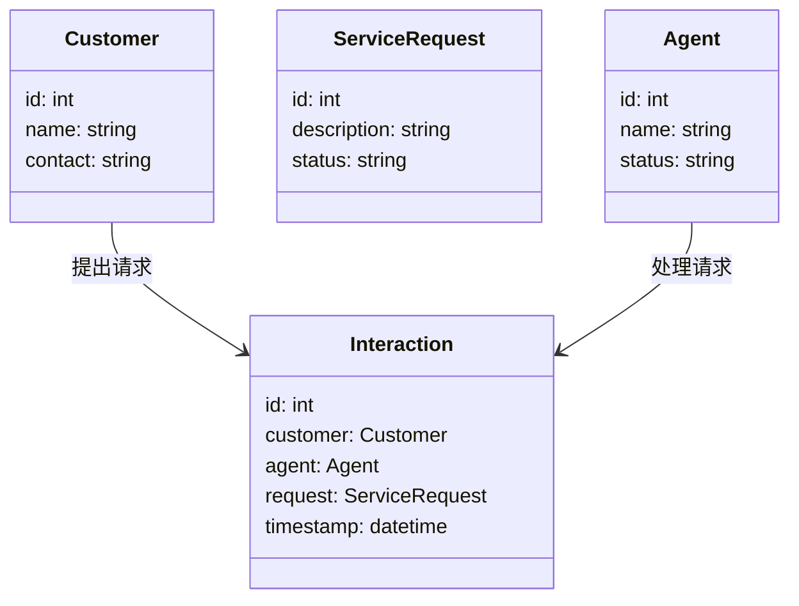

                 


# AI Agent在客户服务中的革新作用

## 关键词：
AI Agent，客户服务，自然语言处理，机器学习，智能系统，客户服务革新

## 摘要：
本文深入探讨了AI Agent在客户服务中的革新作用，分析了其核心概念、算法原理、系统架构以及实际应用。通过详细讲解AI Agent的基本概念、工作原理和应用场景，本文揭示了其在提升客户服务效率和客户体验方面的巨大潜力。同时，结合实际案例和系统设计，本文展示了如何利用AI Agent技术构建智能客服系统，为未来的客户服务模式提供了重要参考。

---

## 第一部分: AI Agent在客户服务中的背景与概念

### 第1章: AI Agent与客户服务的背景介绍

#### 1.1 AI Agent的基本概念

##### 1.1.1 AI Agent的定义
AI Agent（人工智能代理）是一种智能系统，能够感知环境、执行任务并做出决策。在客户服务领域，AI Agent通常以聊天机器人或虚拟助手的形式出现，能够与客户进行自然语言交互，解决客户问题并提供个性化服务。

##### 1.1.2 AI Agent的核心要素
AI Agent的核心要素包括：
1. **感知能力**：通过自然语言处理（NLP）技术理解客户的需求和意图。
2. **推理能力**：利用机器学习和逻辑推理技术分析问题并生成解决方案。
3. **执行能力**：通过自动化流程执行任务，如查询数据库、调用API或触发后续操作。
4. **学习能力**：通过反馈机制不断优化自身的响应和决策能力。

##### 1.1.3 AI Agent与传统客服系统的主要区别
| 特性                | AI Agent                 | 传统客服系统            |
|---------------------|--------------------------|-------------------------|
| 智能化水平           | 高                       | 低                     |
| 响应速度           | 快                       | 较慢                   |
| 可扩展性           | 强                       | 较弱                   |
| 7×24小时可用性     | 是                      | 否                     |

#### 1.2 AI Agent在客户服务中的应用背景

##### 1.2.1 客户服务的演变历程
- **传统客服**：依赖人工坐席执行简单任务，效率低且成本高。
- **自动化客服**：引入自动拨号和IVR系统，初步实现了自动化。
- **智能客服**：结合AI技术，提供更加智能化和个性化的服务。

##### 1.2.2 当前客户服务的主要挑战
1. **效率问题**：人工客服响应慢，难以满足大量客户需求。
2. **一致性问题**：不同客服人员的服务质量参差不齐。
3. **成本问题**：人工客服需要大量培训和管理，成本高昂。
4. **多样性问题**：客户需求日益多样化，传统系统难以应对。

#### 1.2.3 AI Agent在客户服务中的潜在价值
- **提升效率**：通过自动化处理大量简单请求，减少人工干预。
- **提高客户满意度**：提供一致性和个性化的服务体验。
- **降低成本**：减少人工客服的数量，降低运营成本。

#### 1.3 AI Agent在客户服务中的问题背景

##### 1.3.1 客户服务效率低下问题
传统客服系统依赖人工处理，导致响应速度慢，客户等待时间长。

##### 1.3.2 客户体验不一致问题
不同客服人员的知识和技能差异导致服务质量不稳定。

##### 1.3.3 人工客服成本高昂问题
招聘、培训和管理人工客服的成本较高。

##### 1.3.4 客户需求多样化的挑战
客户需求日益多样化，传统系统难以满足复杂需求。

#### 1.4 本章小结
本章介绍了AI Agent的基本概念和核心要素，分析了传统客户服务的挑战，并探讨了AI Agent在客户服务中的潜在价值。

### 第2章: AI Agent的核心概念与联系

#### 2.1 AI Agent的核心原理

##### 2.1.1 自然语言处理（NLP）在AI Agent中的应用
NLP技术使AI Agent能够理解和生成自然语言文本，实现与客户的有效沟通。

##### 2.1.2 机器学习在AI Agent中的应用
机器学习算法帮助AI Agent从历史数据中学习，优化问题解决能力。

##### 2.1.3 强化学习在AI Agent中的应用
强化学习使AI Agent能够在与客户的互动中不断改进其决策策略。

#### 2.2 AI Agent的核心特征

##### 2.2.1 自适应性
AI Agent能够根据客户的需求和反馈动态调整其行为。

##### 2.2.2 智能性
AI Agent具备问题解决和决策能力，能够处理复杂请求。

##### 2.2.3 可扩展性
AI Agent能够轻松扩展以支持更多客户和更多类型的服务请求。

#### 2.3 AI Agent与相关概念的对比

##### 2.3.1 AI Agent与传统客服系统对比
| 特性                | AI Agent                 | 传统客服系统            |
|---------------------|--------------------------|-------------------------|
| 智能化水平           | 高                       | 低                     |
| 响应速度           | 快                       | 较慢                   |
| 可扩展性           | 强                       | 较弱                   |
| 7×24小时可用性     | 是                      | 否                     |

##### 2.3.2 AI Agent与聊天机器人对比
聊天机器人通常不具备AI Agent的自主学习和决策能力，更多依赖预设的规则和流程。

##### 2.3.3 AI Agent与专家系统对比
专家系统依赖专家知识库进行推理，而AI Agent结合了知识推理和自主学习能力。

#### 2.4 AI Agent的ER实体关系图
```mermaid
er
    Customer: 客户
    Agent: AI Agent
    Interaction: 交互记录
    Service: 服务请求
    KnowledgeBase: 知识库
    Customer: 客户 -> 1..n : 提出服务请求
    Agent: AI Agent -> 1..n : 处理服务请求
    Interaction: 交互记录 -> 1..n : 记录处理过程
    KnowledgeBase: 知识库 -> 1..n : 提供支持
```

#### 2.5 本章小结
本章详细探讨了AI Agent的核心原理和特征，并通过对比分析突出了其在客户服务中的独特优势。

### 第3章: AI Agent的算法原理与数学模型

#### 3.1 自然语言处理（NLP）在AI Agent中的应用

##### 3.1.1 NLP的核心算法
1. **分词（Tokenization）**：将文本分割成单词或短语。
2. **句法分析（Parsing）**：分析句子的语法结构。
3. **实体识别（NER）**：识别文本中的命名实体。
4. **意图识别（Intent Recognition）**：识别用户的意图。

##### 3.1.2 基于深度学习的NLP模型
- **词嵌入（Word Embedding）**：使用词向量表示单词，如Word2Vec、GloVe。
- **序列模型（Sequence Models）**：如RNN、LSTM、Transformer（如BERT）。

##### 3.1.3 NLP在客服中的具体应用
例如，当客户输入“我忘记我的密码了”，AI Agent需要识别出客户的需求是“找回密码”，并引导客户完成相关操作。

#### 3.2 机器学习在AI Agent中的应用

##### 3.2.1 机器学习的核心算法
1. **监督学习**：如支持向量机（SVM）、随机森林（Random Forest）。
2. **无监督学习**：如聚类分析（K-means）。
3. **半监督学习**：结合少量标注数据和大量未标注数据进行训练。

##### 3.2.2 基于机器学习的客服分类
例如，使用监督学习算法对客户问题进行分类，如“技术支持”、“订单查询”等。

#### 3.3 强化学习在AI Agent中的应用

##### 3.3.1 强化学习的核心概念
- **状态（State）**：当前的交互状态。
- **动作（Action）**：AI Agent在状态下的决策。
- **奖励（Reward）**：根据动作的效果给予反馈。

##### 3.3.2 基于强化学习的客服优化
例如，AI Agent在与客户互动时，根据客户反馈调整回答策略，以提高客户满意度。

#### 3.4 AI Agent的数学模型

##### 3.4.1 概率论基础
- **贝叶斯定理**：用于计算条件概率，如$P(A|B) = \frac{P(B|A)P(A)}{P(B)}$。

##### 3.4.2 神经网络模型
- **全连接神经网络**：如多层感知机（MLP）。
- **卷积神经网络（CNN）**：适用于图像处理。
- **循环神经网络（RNN）**：适用于序列数据处理。

##### 3.4.3 深度学习模型
- **Transformer模型**：如BERT、GPT，用于自然语言理解。

#### 3.5 本章小结
本章详细讲解了AI Agent中常用的NLP、机器学习和强化学习算法，并结合数学模型进行了深入分析。

---

## 第二部分: AI Agent在客户服务中的系统分析与架构设计

### 第4章: 系统分析与架构设计方案

#### 4.1 项目介绍
我们以一个智能客服系统为例，设计一个基于AI Agent的解决方案，目标是实现高效、智能的客户服务。

#### 4.2 系统功能设计

##### 4.2.1 领域模型设计


#### 4.2.2 系统架构设计


#### 4.2.3 接口设计
- **API接口**：提供RESTful API，如`POST /api/v1/agent/query`。
- **交互协议**：支持HTTP、WebSocket等协议。

#### 4.2.4 交互流程设计
```mermaid
sequenceDiagram
    客户端 -> 入口层: 发起请求
    入口层 -> 路由层: 转发请求
    路由层 -> 服务层: 处理请求
    服务层 -> 数据层: 查询数据
    数据层 -> 知识库: 获取知识支持
    服务层 -> AI Engine: 调用AI算法
    AI Engine -> 返回结果
    服务层 -> 客户端: 返回响应
```

#### 4.3 本章小结
本章通过系统分析和架构设计，展示了如何构建一个基于AI Agent的智能客服系统。

---

## 第三部分: AI Agent在客户服务中的项目实战

### 第5章: 项目实战

#### 5.1 环境安装
- **Python 3.8+**
- **安装依赖**：`pip install Flask requests transformers`

#### 5.2 核心代码实现

##### 5.2.1 NLP模块
```python
from transformers import pipeline

nlp = pipeline("text-classification", model="snli")
def get_intent(text):
    result = nlp(text)
    return result['label']
```

##### 5.2.2 机器学习模块
```python
from sklearn.ensemble import RandomForestClassifier
import pandas as pd

def train_model(X, y):
    model = RandomForestClassifier()
    model.fit(X, y)
    return model
```

##### 5.2.3 强化学习模块
```python
import numpy as np
from collections import deque

class Agent:
    def __init__(self, state_space, action_space):
        self.state_space = state_space
        self.action_space = action_space
        self.memory = deque(maxlen=1000)
        self.gamma = 0.99

    def remember(self, state, action, reward, next_state):
        self.memory.append((state, action, reward, next_state))

    def act(self, state):
        # 简单策略：随机选择动作
        return np.random.choice(self.action_space)
```

#### 5.3 代码应用解读与分析
- **NLP模块**：用于意图识别，帮助AI Agent理解客户需求。
- **机器学习模块**：用于客户问题分类，提高处理效率。
- **强化学习模块**：用于优化AI Agent的决策策略，提升客户满意度。

#### 5.4 案例分析与详细讲解
以一个具体的客户服务场景为例，展示AI Agent如何处理客户请求并优化服务流程。

#### 5.5 本章小结
本章通过实际案例展示了如何实现一个基于AI Agent的智能客服系统，并分析了其核心模块的实现细节。

---

## 第四部分: 最佳实践与未来展望

### 第6章: 最佳实践

#### 6.1 实施AI Agent的注意事项
- **数据隐私**：确保客户数据的安全性和隐私性。
- **用户体验**：保持简洁直观的交互界面，避免过度复杂化。
- **系统维护**：定期更新和优化AI模型，确保其准确性和效率。

#### 6.2 小结
总结本文的核心内容和主要观点，强调AI Agent在客户服务中的重要作用。

#### 6.3 注意事项
在实际应用中，需注意AI Agent的局限性，如处理复杂问题的能力有限，需与人工客服结合使用。

#### 6.4 拓展阅读
推荐一些相关书籍和资源，供读者深入学习和研究。

---

## 结语

AI Agent正在 revolutionize 客户服务领域，通过智能化和自动化的方式，显著提升了客户服务的效率和质量。未来，随着AI技术的不断发展，AI Agent将在客户服务中发挥越来越重要的作用。

---

## 作者

作者：AI天才研究院/AI Genius Institute & 禅与计算机程序设计艺术 /Zen And The Art of Computer Programming

