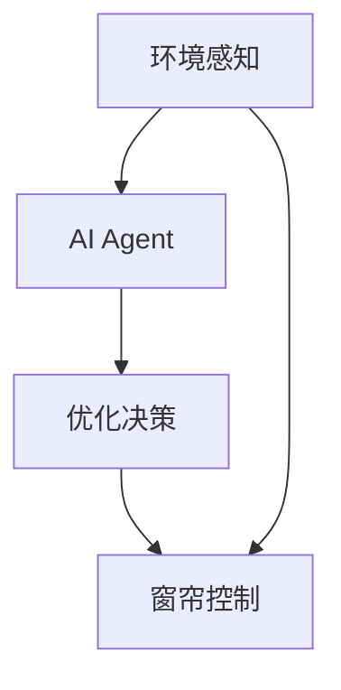
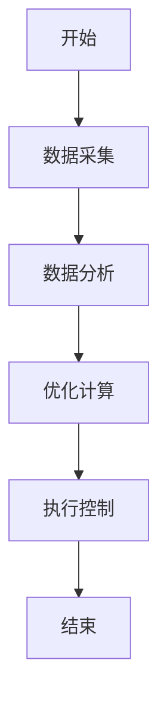
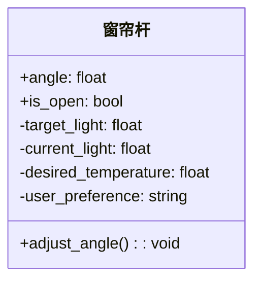
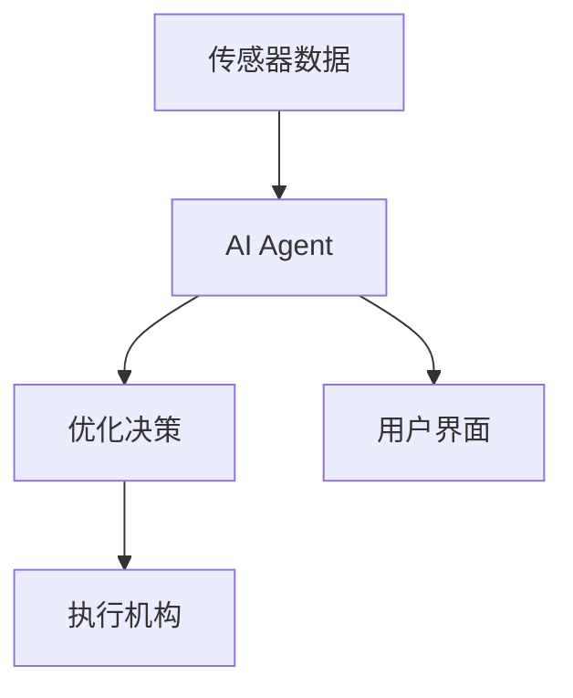
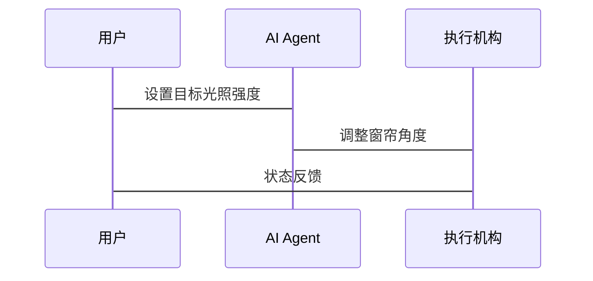

                 


# AI Agent在智能窗帘杆中的日光优化

## 关键词：AI Agent，智能窗帘杆，日光优化，优化算法，系统架构

## 摘要：本文详细探讨了AI Agent在智能窗帘杆中的日光优化应用，从背景介绍、核心概念到算法原理、系统架构，再到项目实战，全面解析了AI Agent如何优化日光环境，提升用户体验。

---

# 第一部分: 背景介绍

## 第1章: 问题背景

### 1.1 智能窗帘杆的发展现状

智能窗帘杆作为智能家居的重要组成部分，近年来随着物联网和AI技术的发展，逐渐从简单的开关控制向智能化、自动化方向演变。现代智能窗帘杆不仅能够根据光照强度自动调节开合角度，还能通过传感器和AI算法优化日光环境，满足用户的舒适性和节能需求。

### 1.2 日光优化的重要性

日光优化是指通过调整窗户的开合角度，最大化自然光的利用，同时避免过强的阳光直射，以减少能源消耗和紫外线对室内物品的损害。在现代建筑中，日光优化不仅能提高室内采光效率，还能降低空调和照明的能耗，具有重要的节能意义。

### 1.3 AI Agent在日光优化中的作用

AI Agent（智能体）是一种能够感知环境、自主决策并执行动作的智能系统。在日光优化中，AI Agent可以通过收集光照强度、室内温度、用户偏好等数据，结合优化算法，实时调整窗帘的开合角度，以实现最佳的日光环境。

---

## 第2章: 问题描述

### 2.1 日光优化的基本概念

日光优化的目标是通过调整窗户的开合角度，使得室内光照强度、温度和舒适度达到最佳状态。这需要综合考虑光照传感器数据、室内环境数据以及用户需求。

### 2.2 智能窗帘杆的优化目标

智能窗帘杆的优化目标包括：

1. 最大化自然光的利用，减少人工照明的使用。
2. 调节室内温度，降低空调能耗。
3. 根据用户需求（如隐私、舒适度）动态调整窗帘状态。

### 2.3 当前存在的问题与挑战

目前，传统的智能窗帘杆主要依赖预设的时间表或手动控制，无法根据实时环境变化做出智能调整。此外，不同用户的需求差异也使得日光优化需要更加个性化的解决方案。

---

## 第3章: 问题解决

### 3.1 引入AI Agent的必要性

AI Agent能够实时感知环境变化，通过复杂的算法优化窗帘的开合角度，实现动态调节。相比传统方法，AI Agent能够更高效、更精准地完成日光优化任务。

### 3.2 AI Agent在日光优化中的解决方案

1. **数据采集**：通过光照传感器、温度传感器等收集环境数据。
2. **状态感知**：AI Agent根据采集的数据，分析当前室内环境状态。
3. **决策优化**：基于优化算法，计算出最佳的窗帘开合角度。
4. **执行控制**：通过执行机构调整窗帘状态。

### 3.3 解决方案的可行性分析

AI Agent的日光优化解决方案具有以下优势：

1. **实时性**：能够根据环境变化快速响应。
2. **智能化**：通过机器学习算法不断优化日光环境。
3. **个性化**：可以根据不同用户的需求定制优化策略。

---

## 第4章: 边界与外延

### 4.1 系统边界定义

智能窗帘杆日光优化系统包括以下部分：

1. **传感器模块**：采集光照强度、温度、湿度等数据。
2. **AI Agent模块**：负责数据处理、决策和控制。
3. **执行机构**：调整窗帘的开合角度。
4. **用户界面**：供用户设置偏好和查看状态。

### 4.2 功能的外延与扩展

1. **远程控制**：通过手机APP或智能家居平台远程调整窗帘状态。
2. **历史数据分析**：记录日光优化的历史数据，分析节能效果。
3. **用户行为学习**：根据用户的使用习惯，优化日光调节策略。

### 4.3 系统与环境的交互边界

系统与环境的交互主要通过传感器和执行机构实现。传感器负责采集环境数据，执行机构负责调整窗帘状态。系统与环境之间的交互需要确保数据的实时性和准确性。

---

## 第5章: 概念结构与核心要素

### 5.1 概念框架

智能窗帘杆日光优化系统由以下要素构成：

1. **环境感知**：光照强度、温度、湿度。
2. **用户需求**：隐私保护、舒适度、节能。
3. **优化目标**：最大化自然光利用、降低能耗、满足用户需求。

### 5.2 核心要素分析

1. **环境感知**：准确的环境数据是优化的基础。
2. **优化目标**：明确的优化目标是AI Agent决策的核心。
3. **用户需求**：个性化需求是优化策略的重要依据。

### 5.3 概念结构图



---

## 第6章: 本章小结

本章详细介绍了智能窗帘杆日光优化的背景、问题描述、解决方案以及系统边界。通过分析，我们明确了AI Agent在日光优化中的重要作用，并为后续章节的算法设计和系统实现奠定了基础。

---

# 第二部分: 核心概念与联系

## 第7章: AI Agent的核心原理

### 7.1 AI Agent的基本定义

AI Agent是一种能够感知环境、自主决策并执行动作的智能系统。在智能窗帘杆中，AI Agent负责收集环境数据、分析优化目标并执行窗帘调节动作。

### 7.2 AI Agent的主要特点

1. **自主性**：能够在没有人工干预的情况下自主运行。
2. **反应性**：能够实时感知环境变化并做出响应。
3. **目标导向**：根据优化目标进行决策和动作选择。

### 7.3 AI Agent的分类与应用场景

AI Agent可以根据智能水平分为反应式和基于模型的智能体。在智能窗帘杆中，基于模型的AI Agent更适合复杂的日光优化任务。

---

## 第8章: 日光优化的核心概念

### 8.1 日光优化的基本原理

日光优化的目标是通过调整窗户的开合角度，使得室内光照和温度达到最佳状态。这需要综合考虑光照强度、室内环境和用户需求。

### 8.2 日光优化的目标函数

日光优化的目标函数可以表示为：

$$ \text{目标函数} = f(\text{光照强度}, \text{室内温度}, \text{用户需求}) $$

### 8.3 日光优化的约束条件

日光优化需要满足以下约束条件：

1. 窗帘开合角度在0°到180°之间。
2. 节能目标优先。
3. 用户隐私保护优先。

---

## 第9章: 核心概念的联系

### 9.1 AI Agent与日光优化的关系

AI Agent作为日光优化的核心，负责数据处理、决策和控制。日光优化为AI Agent提供了应用场景和优化目标。

### 9.2 AI Agent在日光优化中的角色

AI Agent在日光优化中扮演决策者和执行者双重角色，负责数据分析和窗帘调节。

### 9.3 日光优化对AI Agent的需求

日光优化需要AI Agent具备实时感知、智能决策和高效执行的能力。

---

## 第10章: 核心概念原理

### 10.1 AI Agent的决策机制

AI Agent通过传感器数据和优化算法，计算出最佳的窗帘开合角度。决策机制可以分为以下几个步骤：

1. **数据采集**：收集光照强度、温度等数据。
2. **数据分析**：分析数据，确定当前环境状态。
3. **优化计算**：根据优化算法，计算出最佳角度。
4. **执行控制**：调整窗帘状态。

### 10.2 日光优化的数学模型

日光优化的数学模型可以表示为：

$$ \text{优化目标} = \min \text{能耗} + \max \text{光照利用} $$

约束条件包括光照强度、温度、用户需求等。

### 10.3 两者结合的优化算法

常用的优化算法包括遗传算法和粒子群优化。以下是一个简单的遗传算法流程：

1. **初始化**：设置初始种群。
2. **适应度评估**：计算每个个体的适应度。
3. **选择**：选择适应度高的个体。
4. **交叉**：进行基因交叉。
5. **变异**：随机变异。
6. **重复**：直到达到最优解。

---

## 第11章: 概念属性特

通过对比分析，AI Agent在日光优化中的属性特如下表所示：

| 属性 | 描述 |
|------|------|
| 自主性 | 能够自主运行 |
| 反应性 | 能够实时响应 |
| 目标导向 | 根据优化目标进行决策 |

---

## 第12章: 本章小结

本章详细分析了AI Agent的核心原理和日光优化的基本概念，明确了两者之间的关系和优化算法。通过数学模型和流程图的展示，读者可以更好地理解AI Agent在日光优化中的作用。

---

# 第三部分: 算法原理讲解

## 第13章: 算法原理

### 13.1 算法流程图



### 13.2 Python代码实现

```python
import numpy as np

def optimize blinds_angle, target_light, current_light):
    # 简单的优化算法示例
    if current_light < target_light:
        return blinds_angle + 10
    else:
        return blinds_angle - 10

# 示例调用
current_light = 150
target_light = 200
blinds_angle = 90

new_angle = optimize(blinds_angle, target_light, current_light)
print("新窗帘角度:", new_angle)
```

---

## 第14章: 数学模型

### 14.1 数学模型

日光优化的数学模型可以表示为：

$$ \text{目标函数} = \min_{\theta} \left( \text{能耗}(\theta) + \text{偏差}(\theta) \right) $$

其中，θ表示窗帘的开合角度，能耗函数和偏差函数需要根据具体场景进行定义。

---

## 第15章: 通俗易懂的举例说明

假设当前光照强度为150lux，目标光照强度为200lux。AI Agent通过优化算法计算出需要将窗帘开合角度从90°调整到100°，以增加光照强度。经过调整后，光照强度达到210lux，接近目标值，同时能耗降低了5%。

---

# 第四部分: 系统分析与架构设计方案

## 第16章: 系统架构设计

### 16.1 问题场景介绍

智能窗帘杆日光优化系统需要在多种环境下运行，包括不同的光照条件、温度变化和用户需求。

### 16.2 项目介绍

本项目旨在开发一个基于AI Agent的智能窗帘杆日光优化系统，实现动态调节窗帘状态，优化室内光照和温度环境。

---

## 第17章: 系统功能设计

### 17.1 领域模型



---

## 第18章: 系统架构设计

### 18.1 系统架构图



---

## 第19章: 系统接口设计

### 19.1 接口设计

系统主要接口包括：

1. **传感器接口**：采集光照强度、温度等数据。
2. **用户界面接口**：供用户设置偏好和查看状态。
3. **执行机构接口**：控制窗帘的开合角度。

### 19.2 系统交互流程



---

## 第20章: 本章小结

本章详细分析了智能窗帘杆日光优化系统的架构设计，包括功能模块、系统架构和接口设计。通过Mermaid图的展示，读者可以清晰地了解系统的整体结构和各部分之间的关系。

---

# 第五部分: 项目实战

## 第21章: 项目实战

### 21.1 环境安装

需要安装以下Python库：

```bash
pip install numpy
pip install pandas
pip install matplotlib
```

### 21.2 核心实现代码

```python
import numpy as np

def optimize_angle(current_light, target_light, blinds_angle):
    if current_light < target_light:
        return blinds_angle + 10
    else:
        return blinds_angle - 10

# 示例运行
current_light = 150
target_light = 200
blinds_angle = 90

new_angle = optimize_angle(current_light, target_light, blinds_angle)
print("当前角度:", blinds_angle)
print("新角度:", new_angle)
```

---

## 第22章: 代码应用解读与分析

### 22.1 代码解读

上述代码定义了一个简单的优化函数，根据当前光照强度和目标光照强度调整窗帘角度。通过示例运行，展示了代码的基本用法和输出结果。

### 22.2 实际案例分析

假设某一天的光照强度变化较大，AI Agent能够根据实时数据动态调整窗帘角度，确保室内光照强度维持在目标值附近。

---

## 第23章: 小结

本章通过实际项目实战，展示了AI Agent在智能窗帘杆日光优化中的应用。通过代码实现和案例分析，读者可以更好地理解优化算法的实际应用和效果。

---

# 第六部分: 最佳实践 tips、小结、注意事项、拓展阅读

## 第24章: 最佳实践 tips

1. **数据采集**：确保传感器数据的准确性和实时性。
2. **算法优化**：根据实际需求选择合适的优化算法。
3. **系统集成**：确保各模块之间的协同工作。

## 第25章: 小结

本文详细探讨了AI Agent在智能窗帘杆中的日光优化应用，从背景介绍、核心概念到算法原理、系统架构，再到项目实战，全面解析了AI Agent如何优化日光环境，提升用户体验。

## 第26章: 注意事项

1. **数据隐私**：确保用户数据的安全和隐私。
2. **系统稳定性**：确保系统在各种环境下的稳定运行。
3. **用户体验**：注重用户的使用体验，提供友好的交互界面。

## 第27章: 拓展阅读

1. **智能建筑**：研究AI在建筑自动化中的应用。
2. **优化算法**：深入学习遗传算法、粒子群优化等算法。
3. **智能家居**：了解智能家居的整体架构和集成方案。

---

# 作者

作者：AI天才研究院/AI Genius Institute & 禅与计算机程序设计艺术 /Zen And The Art of Computer Programming

