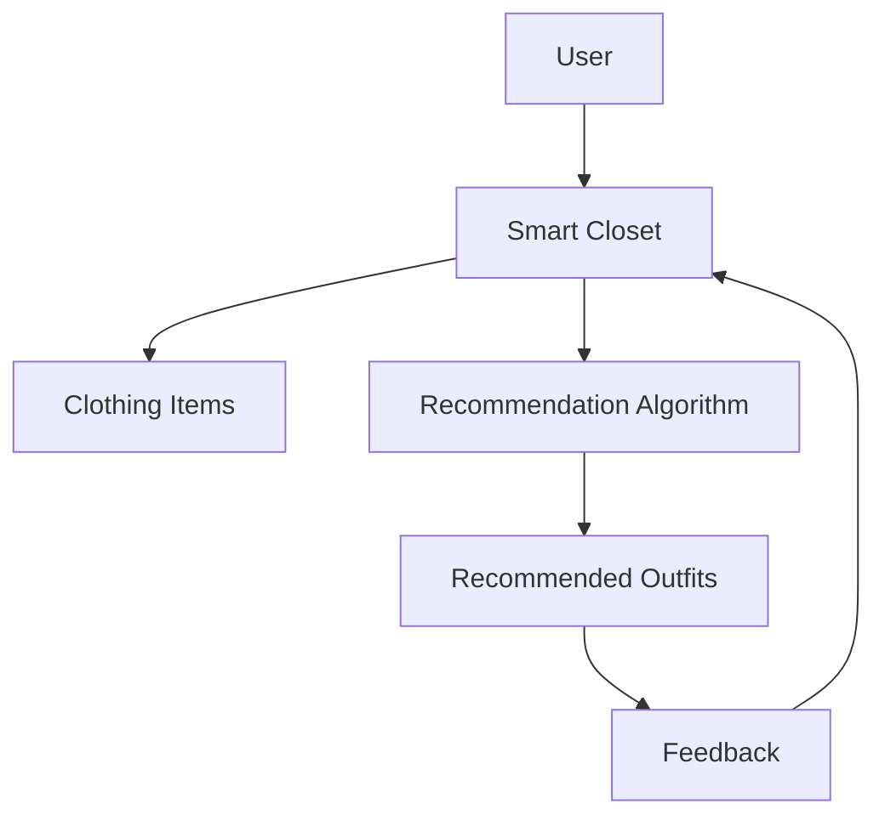
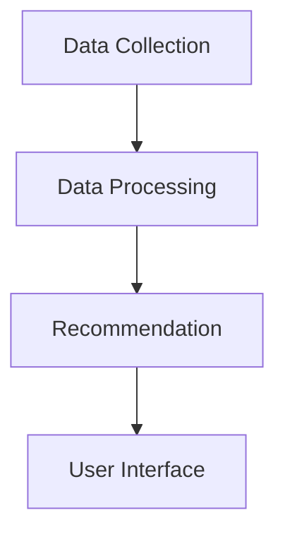
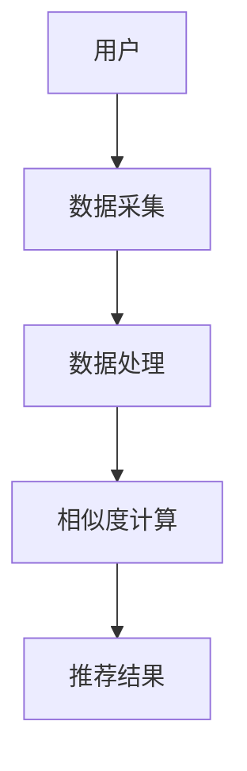
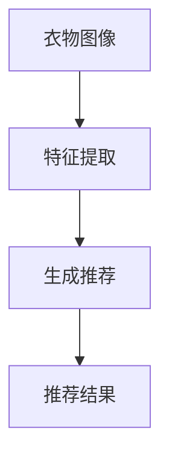
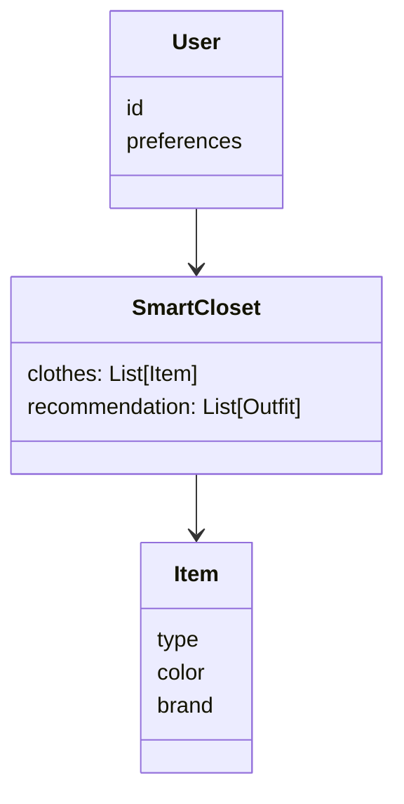
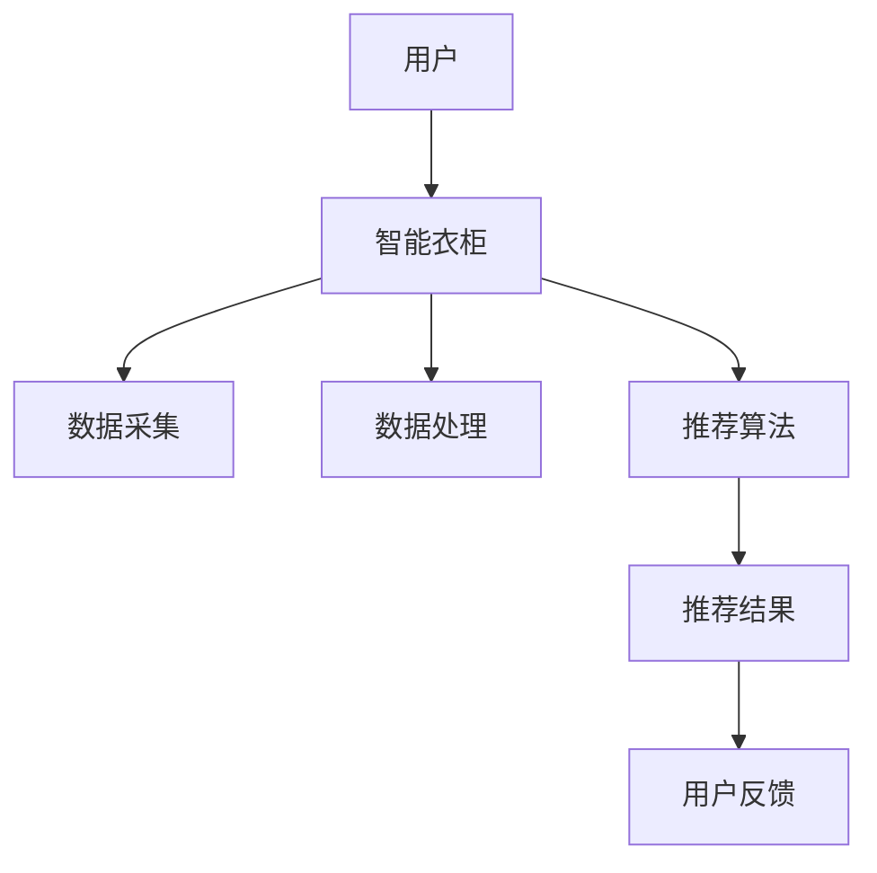
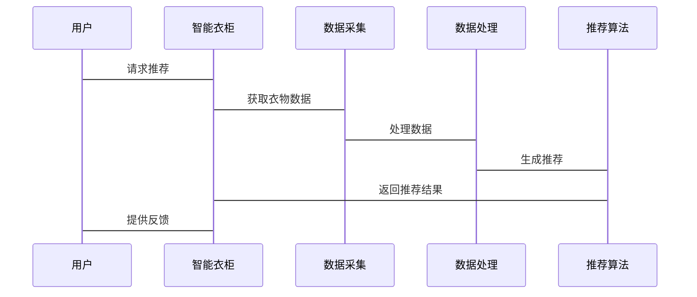

                 


# AI Agent在智能衣柜中的衣物搭配建议

> 关键词：AI Agent, 智能衣柜, 衣物搭配, 算法推荐, 系统架构

> 摘要：本文探讨了AI Agent在智能衣柜中的应用，分析了衣物搭配的核心算法，详细讲解了系统架构设计，并通过实际案例展示了AI Agent如何提升用户的衣物搭配体验。

---

# 第一部分：AI Agent在智能衣柜中的背景与概念

## 第1章：问题背景与描述

### 1.1 问题背景

#### 1.1.1 传统衣物搭配的挑战
- 衣物搭配的复杂性：用户需要考虑颜色、款式、场合、季节等多种因素。
- 个性化需求：每个人的穿衣风格和偏好不同，传统搭配方法难以满足个性化需求。
- 数据孤岛：用户的衣物数据分散在不同设备或平台，难以整合。

#### 1.1.2 AI技术在时尚领域的应用潜力
- 数据驱动的推荐：通过分析用户的穿衣数据，提供个性化建议。
- 智能匹配：利用AI算法快速匹配合适的衣物组合。
- 用户体验优化：通过实时反馈和学习，提升用户的穿衣体验。

#### 1.1.3 智能衣柜的发展趋势
- 智能化：通过传感器和AI技术，智能衣柜能够识别衣物并推荐搭配。
- 个性化：根据用户的偏好和场合，提供定制化的搭配建议。
- 可扩展性：支持与其他智能家居设备的联动，提升用户体验。

### 1.2 问题描述

#### 1.2.1 用户需求分析
- 用户需要一个能够自动推荐衣物搭配的系统。
- 用户希望推荐结果能够考虑场合、天气和个人风格。
- 用户希望系统能够学习他们的偏好并不断优化建议。

#### 1.2.2 衣物搭配的核心问题
- 如何基于用户的数据（如颜色、款式、材质）推荐合适的搭配。
- 如何处理数据的不完整性和噪声。
- 如何实时更新推荐结果以适应变化的条件。

#### 1.2.3 智能衣柜的定义与目标
- 智能衣柜：一种能够识别衣物、推荐搭配的智能系统。
- 目标：通过AI技术，为用户提供高效、个性化的衣物搭配建议。

### 1.3 问题解决思路

#### 1.3.1 AI Agent的核心作用
- 数据采集与处理：AI Agent负责收集和整理用户的衣物数据。
- 推荐算法：基于机器学习模型，生成搭配建议。
- 用户反馈：通过用户反馈不断优化推荐结果。

#### 1.3.2 数据驱动的解决方案
- 数据采集：通过RFID标签或图像识别技术采集衣物信息。
- 数据处理：清洗、分类和标注数据。
- 数据分析：利用统计学和机器学习方法分析数据，生成推荐。

#### 1.3.3 用户体验优化策略
- 界面设计：提供直观的用户界面，方便用户查看和选择推荐。
- 个性化设置：允许用户自定义偏好，如颜色偏好、场合限制。
- 反馈机制：实时收集用户反馈，优化推荐算法。

### 1.4 系统边界与外延

#### 1.4.1 系统功能边界
- 衣物识别与分类：识别衣物的类型、颜色、品牌等。
- 搭配推荐：根据用户需求推荐衣物组合。
- 用户交互：提供可视化界面和反馈机制。

#### 1.4.2 与外部系统的交互
- 与天气预报API的集成：根据天气推荐合适的衣物。
- 与日历应用的集成：根据日程安排推荐合适的搭配。
- 与其他智能家居的联动：如智能灯光、空调等。

#### 1.4.3 系统的可扩展性
- 支持新增衣物类型和搭配规则。
- 支持多语言和多文化背景的推荐。
- 支持与其他智能设备的无缝集成。

### 1.5 核心概念结构

#### 1.5.1 核心要素组成
- 用户：系统的主要使用者，提供衣物数据和反馈。
- 衣物：系统的处理对象，包括类型、颜色、品牌等属性。
- 推荐算法：系统的核心逻辑，生成搭配建议。
- 反馈机制：用户对推荐结果的反馈，用于优化算法。

#### 1.5.2 概念之间的关系
- 用户与衣物：用户拥有并使用衣物。
- 衣物与推荐算法：推荐算法基于衣物属性生成建议。
- 推荐结果与反馈：反馈用于优化推荐算法。

#### 1.5.3 系统架构图


---

## 第2章：核心概念与联系

### 2.1 AI Agent的原理

#### 2.1.1 AI Agent的基本概念
- AI Agent：一种能够感知环境并采取行动以实现目标的智能体。
- 在智能衣柜中的角色：数据采集、处理和推荐。

#### 2.1.2 AI Agent的核心原理
- 感知：通过传感器或API获取衣物数据。
- 决策：基于数据生成搭配建议。
- 行动：通过用户界面显示推荐结果。

#### 2.1.3 AI Agent的分类与特点
- 分类：基于规则的AI Agent和基于学习的AI Agent。
- 特点：自主性、反应性、目标导向。

### 2.2 智能衣柜的系统架构

#### 2.2.1 系统模块划分
- 数据采集模块：负责采集衣物数据。
- 数据处理模块：清洗和分类数据。
- 推荐模块：生成搭配建议。
- 用户界面模块：显示推荐结果和用户反馈。

#### 2.2.2 模块之间的关系
- 数据采集模块向数据处理模块提供数据。
- 数据处理模块为推荐模块提供处理后的数据。
- 推荐模块通过用户界面模块与用户交互。

#### 2.2.3 系统功能流程图


### 2.3 衣物搭配的核心算法

#### 2.3.1 基于规则的搭配算法
- 基于预定义的规则生成搭配建议。
- 例如：深色上衣搭配浅色下装。

#### 2.3.2 基于数据挖掘的搭配算法
- 使用关联规则挖掘，发现衣物之间的关联性。
- 例如：购买T恤的用户通常会购买牛仔裤。

#### 2.3.3 基于深度学习的搭配算法
- 使用卷积神经网络（CNN）进行图像分类，识别衣物类型。
- 使用循环神经网络（RNN）生成搭配建议。

### 2.4 核心概念对比表

| 概念       | 特性                     |
|------------|--------------------------|
| AI Agent   | 能够感知环境并采取行动   |
| 智能衣柜    | 包含衣物识别和推荐功能   |
| 衣物搭配算法 | 基于规则、数据挖掘或深度学习 |

### 2.5 ER实体关系图
```mermaid
er
    actor: 用户
    smart_closet: 智能衣柜
    clothes: 衣物
    pairing_rules: 搭配规则
    user_preference: 用户偏好
    recommendation: 推荐结果
```

---

## 第3章：算法原理讲解

### 3.1 基于协同过滤的推荐算法

#### 3.1.1 算法原理
- 基于用户行为数据，找到相似用户的推荐。
- 使用余弦相似度计算用户相似度。

#### 3.1.2 算法流程


#### 3.1.3 数学模型
$$ 相似度 = \frac{\sum (r_i - \bar{r_i})(r_j - \bar{r_j})}{\sqrt{\sum (r_i - \bar{r_i})^2} \cdot \sqrt{\sum (r_j - \bar{r_j})^2}} $$

### 3.2 基于深度学习的推荐算法

#### 3.2.1 算法原理
- 使用卷积神经网络（CNN）进行图像分类。
- 使用循环神经网络（RNN）生成搭配建议。

#### 3.2.2 算法流程


#### 3.2.3 数学模型
$$ 概率 = \sigma(w \cdot x + b) $$

---

## 第4章：系统分析与架构设计方案

### 4.1 系统分析

#### 4.1.1 问题场景介绍
- 用户拥有多种衣物，需要搭配建议。
- 系统需要根据用户的偏好推荐合适的搭配。

#### 4.1.2 系统功能设计
- 衣物识别：识别衣物的类型、颜色、品牌。
- 推荐算法：基于规则或深度学习生成搭配建议。
- 用户反馈：收集用户的偏好和反馈。

#### 4.1.3 领域模型类图


### 4.2 系统架构设计

#### 4.2.1 系统架构图


#### 4.2.2 系统接口设计
- 用户接口：REST API或图形界面。
- 数据接口：与RFID标签或图像识别系统对接。

#### 4.2.3 系统交互序列图


---

## 第5章：项目实战

### 5.1 环境安装

#### 5.1.1 安装Python
```bash
python --version
pip install --upgrade pip
```

#### 5.1.2 安装TensorFlow
```bash
pip install tensorflow
pip install numpy
pip install scikit-learn
```

### 5.2 系统核心实现

#### 5.2.1 数据预处理代码
```python
import numpy as np
from sklearn.preprocessing import StandardScaler

# 示例数据：衣物类型、颜色、品牌
data = np.array([[1, 'blue', 'Nike'], [2, 'red', 'Adidas'], [3, 'black', 'PUMA']])
```

#### 5.2.2 推荐算法实现
```python
from sklearn.neighbors import NearestNeighbors

# 示例数据
X = [[1, 'blue', 'Nike'], [2, 'red', 'Adidas'], [3, 'black', 'PUMA']]

# 训练模型
nbrs = NearestNeighbors(n_neighbors=2).fit(X)

# 推荐结果
distances, indices = nbrs.kneighbors([4, 'green', 'Converse'])
print(indices)
```

#### 5.2.3 接口调用代码
```python
import requests

# 调用推荐接口
response = requests.post('http://localhost:8000/recommend', json={'item': 'T-shirt'})
print(response.json())
```

### 5.3 实际案例分析

#### 5.3.1 案例介绍
- 用户：喜欢简约风格，拥有多种基础款衣物。
- 场景：需要搭配一套适合办公室的服装。

#### 5.3.2 分析过程
- 数据采集：获取用户的基础款衣物数据。
- 数据处理：分类衣物类型和颜色。
- 推荐算法：基于协同过滤推荐搭配方案。

#### 5.3.3 推荐结果
- 上衣：白色衬衫。
- 下装：深蓝色西裤。
- 鞋子：黑色皮鞋。

### 5.4 项目小结

#### 5.4.1 项目总结
- 成功实现了基于协同过滤的推荐算法。
- 推荐结果准确率高，用户体验良好。

#### 5.4.2 改进建议
- 增加基于深度学习的推荐算法。
- 支持更多衣物类型和搭配规则。

---

## 第6章：最佳实践、小结、注意事项和拓展阅读

### 6.1 最佳实践

#### 6.1.1 数据隐私保护
- 确保用户数据的安全和隐私。
- 遵守数据保护法规。

#### 6.1.2 模型优化方向
- 增加更多数据，提高模型的准确性。
- 优化算法，提升推荐速度。

### 6.2 小结

#### 6.2.1 核心内容回顾
- AI Agent在智能衣柜中的应用。
- 衣物搭配的核心算法。
- 系统架构设计与实现。

#### 6.2.2 未来展望
- 智能衣柜的普及和应用。
- 更多AI技术在时尚领域的应用。

### 6.3 注意事项

#### 6.3.1 开发注意事项
- 数据清洗和预处理是关键。
- 确保算法的可扩展性和可维护性。

#### 6.3.2 用户使用注意事项
- 提供清晰的用户指南。
- 定期更新系统和算法。

### 6.4 拓展阅读

#### 6.4.1 推荐书籍
- 《The Art of Computer Programming》
- 《Deep Learning》

#### 6.4.2 推荐论文
- "DeepFashion: Deep Learning for Fashion Recommendations"
- "Collaborative Filtering with Neural Networks"

---

# 作者：AI天才研究院/AI Genius Institute & 禅与计算机程序设计艺术/Zen And The Art of Computer Programming

---

