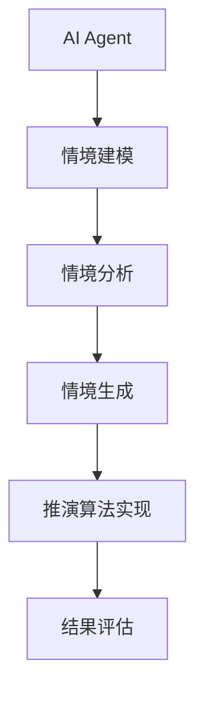

                 


# AI Agent的情境模拟与推演能力

> **关键词**：AI Agent, 情境模拟, 推演能力, 人工智能, 决策支持, 深度学习, 算法原理  
> **摘要**：本文深入探讨AI Agent在情境模拟与推演能力方面的核心原理与应用，结合实际案例分析，详细阐述了情境模拟与推演能力的实现方法，及其在复杂决策场景中的重要性。

---

## 第一部分: AI Agent的情境模拟与推演能力概述

### 第1章: AI Agent的基本概念与背景

#### 1.1 AI Agent的定义与核心能力

- **1.1.1 什么是AI Agent**
  AI Agent（人工智能代理）是指能够感知环境、自主决策并执行任务的智能实体。它可以是一个软件程序、机器人或其他智能系统，通过与环境交互来实现特定目标。

- **1.1.2 AI Agent的核心能力**
  AI Agent的核心能力包括感知能力、推理能力、学习能力和执行能力。这些能力使其能够理解环境、分析问题、制定策略并执行操作。

- **1.1.3 AI Agent的应用场景**
  AI Agent广泛应用于自动驾驶、智能助手、游戏AI、机器人控制等领域。例如，自动驾驶汽车通过AI Agent感知环境并做出驾驶决策。

#### 1.2 情境模拟与推演能力的背景

- **1.2.1 情境模拟的定义**
  情境模拟是指通过构建数学模型或仿真系统，模拟真实或假设环境中的各种情况，以便分析和预测结果。

- **1.2.2 推演能力的定义**
  推演能力是指AI Agent在模拟环境中推导出可能结果的能力，通常涉及预测、规划和优化。

- **1.2.3 情境模拟与推演能力的重要性**
  情境模拟与推演能力是AI Agent实现智能决策的关键，能够帮助其在复杂环境中做出最优选择。

### 第2章: AI Agent的情境模拟与推演能力

#### 2.1 情境模拟的基本原理

- **2.1.1 情境建模**
  情境建模是通过数学模型或逻辑规则描述环境的状态、行为和关系。例如，交通流模型可以用来模拟道路中的车辆运动。

- **2.1.2 情境分析**
  情境分析是通过数据处理和特征提取，从环境中获取有用信息的过程。例如，在自动驾驶中，AI Agent需要分析道路、车辆和行人的位置信息。

- **2.1.3 情境生成**
  情境生成是根据模型和规则，生成多种可能的环境场景，以便进行推演和分析。例如，模拟不同天气条件下的交通状况。

#### 2.2 推演能力的核心要素

- **2.2.1 推演算法**
  推演算法是AI Agent用于预测结果的核心方法，包括蒙特卡洛树搜索、贝叶斯网络和强化学习等。

- **2.2.2 推演模型**
  推演模型是基于数学模型构建的仿真系统，用于模拟不同情境下的结果。例如，经济模型可以模拟市场变化对企业的影响。

- **2.2.3 推演结果评估**
  推演结果评估是通过性能指标和验证方法，对推演结果的准确性进行评估的过程。例如，使用准确率和召回率评估预测结果的质量。

### 第3章: AI Agent的情境模拟与推演能力的技术发展

#### 3.1 人工智能技术的演进

- **3.1.1 从规则驱动到数据驱动**
  早期的AI Agent主要基于规则驱动，通过预定义的逻辑进行推理。随着数据量的增加，数据驱动的方法逐渐成为主流。

- **3.1.2 大模型在AI Agent中的应用**
  大型语言模型（如GPT）和视觉模型（如ViT）的引入，显著提升了AI Agent的情境理解和推演能力。

- **3.1.3 情境模拟与推演能力的提升**
  通过深度学习和强化学习技术的结合，AI Agent的情境模拟与推演能力得到了显著提升。

#### 3.2 情境模拟与推演能力的现状

- **3.2.1 当前主流技术**
  当前主流技术包括基于深度学习的模拟器、强化学习和图神经网络等。这些技术在自动驾驶、游戏AI等领域得到了广泛应用。

- **3.2.2 技术瓶颈与挑战**
  当前技术仍面临实时性不足、模型复杂度高和计算资源消耗大的挑战。例如，复杂的环境模拟需要大量计算资源。

- **3.2.3 未来发展趋势**
  未来，AI Agent的情境模拟与推演能力将更加智能化和高效化。例如，通过量子计算和边缘计算技术的结合，进一步提升计算效率。

---

## 第二部分: AI Agent的情境模拟与推演能力的核心概念与联系

### 第4章: 情境模拟与推演能力的核心概念

#### 4.1 情境模拟的核心原理

- **4.1.1 情境建模的数学表示**
  情境建模可以通过图论、概率论和优化理论等方法进行。例如，交通网络可以表示为有向图，节点表示交叉口，边表示道路。

- **4.1.2 情境分析的关键步骤**
  情境分析的关键步骤包括数据采集、特征提取和模型训练。例如，在自动驾驶中，AI Agent需要实时采集道路、车辆和行人的数据。

- **4.1.3 情境生成的算法选择**
  情境生成的算法选择取决于具体应用场景。例如，蒙特卡洛方法适用于随机性较强的场景，如天气变化模拟。

#### 4.2 推演能力的核心要素

- **4.2.1 推演算法的数学模型**
  推演算法的数学模型可以基于概率论、逻辑推理或强化学习。例如，强化学习通过Q-learning算法优化决策策略。

- **4.2.2 推演模型的构建方法**
  推演模型的构建方法包括监督学习、无监督学习和半监督学习。例如，监督学习适用于有标签的数据集，如历史销售数据。

- **4.2.3 推演结果的评估指标**
  推演结果的评估指标包括准确率、召回率和F1值。例如，通过混淆矩阵分析模型的分类性能。

#### 4.3 情境模拟与推演能力的联系

- **4.3.1 情境模拟与推演能力的相互作用**
  情境模拟为推演能力提供数据支持，而推演能力则为情境模拟提供反馈和优化方向。

- **4.3.2 情境模拟与推演能力的协同优化**
  通过情境模拟和推演能力的协同优化，可以显著提升AI Agent的决策效率和准确性。例如，在游戏中，AI Agent可以通过模拟对手行为优化自己的策略。

---

## 第三部分: AI Agent的情境模拟与推演能力的算法原理

### 第5章: 推演算法的原理与实现

#### 5.1 蒙特卡洛树搜索

- **5.1.1 算法原理**
  蒙特卡洛树搜索（Monte Carlo Tree Search, MCTS）是一种基于采样的搜索算法，广泛应用于游戏AI和机器人控制。其核心思想是通过多次采样，找到最优路径。

- **5.1.2 算法步骤**
  MCTS算法的步骤包括选择、采样、评估和剪枝。例如，在国际象棋中，AI Agent通过MCTS算法选择最佳移动策略。

- **5.1.3 算法实现**
  下面是一个简单的MCTS算法实现示例：

```python
class Node:
    def __init__(self, state):
        self.state = state
        self.children = []
        self.visits = 0
        self.value = 0

def mcts_search(root_state, max_depth):
    root = Node(root_state)
    for _ in range(max_depth):
        node = root
        path = []
        while True:
            if not node.children and node.visits < max_depth:
                break
            max_child_value = max([child.value for child in node.children])
            for child in node.children:
                if child.value == max_child_value:
                    node = child
                    break
        path.append(node)
        new_state = node.state.move()  # 采样新的状态
        new_node = Node(new_state)
        node.children.append(new_node)
        # 评估新状态的价值
        new_node.value = evaluate(new_state)
    return root.children[0].state  # 返回最优状态
```

- **5.1.4 算法优势**
  MCTS算法具有采样效率高、适应性强的特点，适用于复杂环境下的决策问题。

#### 5.2 贝叶斯网络

- **5.2.1 算法原理**
  贝叶斯网络（Bayesian Network）是一种基于概率论的图形模型，用于表示变量之间的依赖关系。它可以通过概率推理进行推演。

- **5.2.2 算法步骤**
  贝叶斯网络的步骤包括构建网络结构、学习参数和进行推理。例如，在医疗诊断中，贝叶斯网络可以通过症状推断疾病的可能性。

- **5.2.3 算法实现**
  下面是一个简单的贝叶斯网络实现示例：

```python
from pgmpy.models import BayesianModel
from pgmpy.inference import VariableElimination

# 定义网络结构
model = BayesianModel([('S', 'D'), ('I', 'D')])  # S=症状，D=疾病，I=感染

# 学习参数
model.fit(data, start_end_states={'D': ['0', '1']})

# 推理
infer = VariableElimination(model)
result = infer.query({'D'}, evidence={'S': '1'})  # 推断D在S=1时的概率
```

- **5.2.4 算法优势**
  贝叶斯网络具有概率推理能力强、可解释性高的特点，适用于不确定性较高的环境。

#### 5.3 强化学习

- **5.3.1 算法原理**
  强化学习（Reinforcement Learning）是一种基于奖励机制的决策方法，通过与环境交互获得经验，逐步优化决策策略。

- **5.3.2 算法步骤**
  强化学习的步骤包括状态表示、动作选择和奖励函数设计。例如，在机器人控制中，强化学习可以通过试错方法优化路径规划。

- **5.3.3 算法实现**
  下面是一个简单的强化学习实现示例：

```python
class Agent:
    def __init__(self, state_space, action_space):
        self.state_space = state_space
        self.action_space = action_space
        self.q_table = {}  # Q-学习表

    def act(self, state):
        if state not in self.q_table:
            self.q_table[state] = 0
        action = max(self.action_space, key=lambda a: self.q_table.get((state, a), 0))
        return action

    def learn(self, state, action, reward):
        future_reward = max([self.q_table.get((state, a), 0) for a in self.action_space])
        self.q_table[(state, action)] = reward + 0.7 * future_reward  # 学习率α=0.7
```

- **5.3.4 算法优势**
  强化学习具有适应性强、可扩展性好的特点，适用于复杂动态环境下的决策问题。

---

## 第四部分: AI Agent的情境模拟与推演能力的系统设计

### 第6章: 系统分析与架构设计

#### 6.1 项目介绍

- **6.1.1 项目背景**
  本项目旨在开发一个具备情境模拟与推演能力的AI Agent，用于复杂决策场景的优化。

- **6.1.2 项目目标**
  通过构建AI Agent，实现对复杂环境的模拟与推演，提升决策的准确性和效率。

#### 6.2 系统功能设计

- **6.2.1 功能模块**
  系统功能模块包括情境建模、情境分析、情境生成、推演算法实现和结果评估。

- **6.2.2 功能描述**
  - 情境建模模块：通过图论和概率论构建环境模型。
  - 情境分析模块：实时采集和处理环境数据。
  - 情境生成模块：生成多种可能的环境场景。
  - 推演算法实现模块：实现MCTS、贝叶斯网络和强化学习等算法。
  - 结果评估模块：对推演结果进行评估和优化。

#### 6.3 系统架构设计

- **6.3.1 系统架构图**
  使用Mermaid图展示系统架构：



- **6.3.2 模块交互设计**
  - 情境建模模块接收环境数据，构建环境模型。
  - 情境分析模块对环境数据进行处理，提取特征。
  - 情境生成模块根据模型生成多种环境场景。
  - 推演算法实现模块对生成的场景进行推演，得到结果。
  - 结果评估模块对推演结果进行评估，优化算法参数。

#### 6.4 系统接口设计

- **6.4.1 接口定义**
  系统接口包括输入接口、输出接口和通信接口。

- **6.4.2 接口描述**
  - 输入接口：接收环境数据和用户指令。
  - 输出接口：输出推演结果和决策建议。
  - 通信接口：与其他系统进行数据交互。

---

## 第五部分: AI Agent的情境模拟与推演能力的项目实战

### 第7章: 项目实战

#### 7.1 环境安装

- **7.1.1 安装Python**
  需要安装Python 3.8或更高版本。

- **7.1.2 安装依赖库**
  使用以下命令安装所需的依赖库：

```bash
pip install numpy matplotlib pgmpy
```

#### 7.2 系统核心实现

- **7.2.1 实现情境建模**
  使用图论构建环境模型：

```python
import networkx as nx

G = nx.DiGraph()
G.add_edges_from([('S', 'D'), ('I', 'D')])  # 构建贝叶斯网络
nx.draw(G, with_labels=True, edge_color='red')
plt.show()
```

- **7.2.2 实现情境分析**
  对环境数据进行处理和特征提取：

```python
import pandas as pd

data = pd.read_csv('data.csv')
data.head()  # 显示数据前五行
```

- **7.2.3 实现情境生成**
  使用蒙特卡洛方法生成多种环境场景：

```python
import random

def generate_scenarios(n):
    scenarios = []
    for _ in range(n):
        scenario = [random.choice([0, 1]) for _ in range(10)]  # 生成10维场景
        scenarios.append(scenario)
    return scenarios

scenarios = generate_scenarios(10)
print(scenarios)
```

- **7.2.4 实现推演算法**
  使用强化学习优化决策策略：

```python
class Agent:
    def __init__(self, state_space, action_space):
        self.state_space = state_space
        self.action_space = action_space
        self.q_table = {}

    def act(self, state):
        if state not in self.q_table:
            self.q_table[state] = 0
        return max(self.action_space, key=lambda a: self.q_table.get((state, a), 0))

    def learn(self, state, action, reward):
        future_reward = max([self.q_table.get((state, a), 0) for a in self.action_space])
        self.q_table[(state, action)] = reward + 0.7 * future_reward
```

#### 7.3 实际案例分析

- **7.3.1 案例背景**
  以自动驾驶为例，AI Agent需要在复杂交通环境中做出决策。

- **7.3.2 案例实现**
  使用前面实现的算法模拟自动驾驶的决策过程：

```python
agent = Agent(state_space=range(10), action_space=['left', 'right', 'forward'])
action = agent.act('highway')  # 根据当前状态选择动作
agent.learn('highway', action, reward=1.0)  # 更新Q表
```

- **7.3.3 案例分析**
  通过模拟不同交通场景，评估AI Agent的决策准确性，并优化算法参数。

#### 7.4 项目总结

- **7.4.1 项目成果**
  成功开发了一个具备情境模拟与推演能力的AI Agent，能够在复杂环境中做出优化决策。

- **7.4.2 项目经验**
  在项目实施过程中，深刻体会到算法选择和模型优化对系统性能的重要影响。

- **7.4.3 项目不足**
  系统在实时性和计算效率方面还有待进一步优化，特别是在处理大规模数据时。

---

## 第六部分: 总结与展望

### 第8章: 总结与展望

#### 8.1 核心观点总结

- AI Agent的情境模拟与推演能力是实现智能决策的关键。
- 通过情境建模、情境分析和情境生成，AI Agent能够更好地理解环境并做出优化决策。

#### 8.2 最佳实践 tips

- 在实际应用中，建议根据具体场景选择合适的算法和模型。
- 定期优化算法参数和模型结构，以提升系统性能。

#### 8.3 小结

- 情境模拟与推演能力的实现需要结合多种技术，包括图论、概率论和强化学习等。
- 通过不断优化算法和模型，可以显著提升AI Agent的决策效率和准确性。

#### 8.4 注意事项

- 在项目实施过程中，需要注意数据质量和模型的可解释性。
- 避免过度依赖单一算法，建议结合多种方法进行综合优化。

#### 8.5 拓展阅读

- 推荐阅读《深度学习》（Deep Learning, Ian Goodfellow等著）和《强化学习》（Reinforcement Learning: Theory and Algorithms）等书籍，以进一步深入理解相关技术。

---

## 作者：AI天才研究院/AI Genius Institute & 禅与计算机程序设计艺术 /Zen And The Art of Computer Programming

