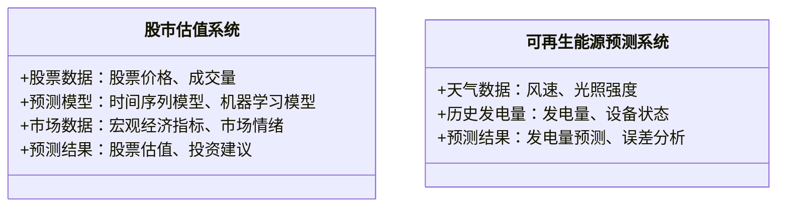
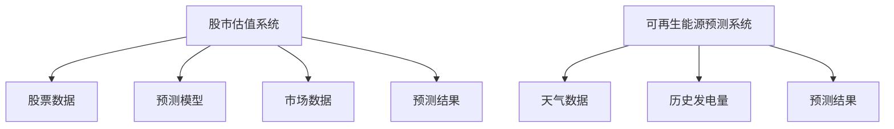
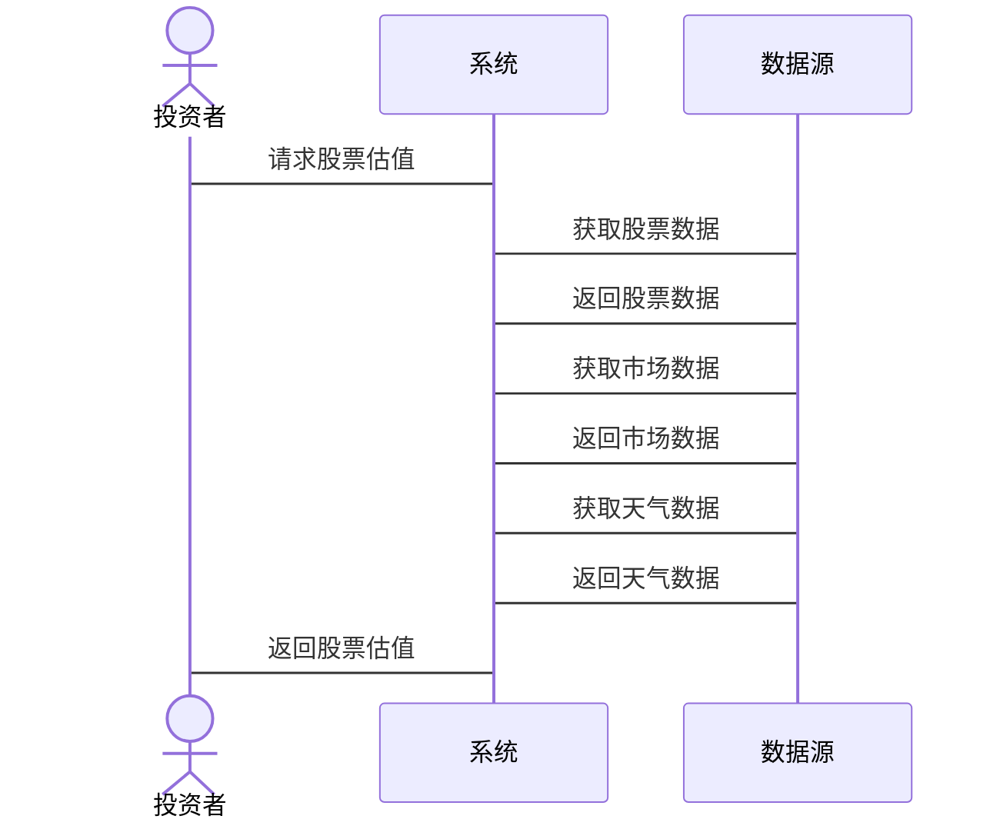

                 


# 全球股市估值与可再生能源预测技术的关系

## 关键词
全球股市估值、可再生能源预测、时间序列分析、机器学习、能源经济、投资策略

## 摘要
本文探讨了全球股市估值与可再生能源预测技术之间的关系，分析了如何通过可再生能源预测技术影响股市估值，并提出了基于时间序列分析和机器学习模型的投资策略。文章详细介绍了股市估值和可再生能源预测的核心概念，分析了它们的关联性，提出了数学模型，并通过实际案例验证了模型的有效性。

---

## 第一部分: 全球股市估值与可再生能源预测技术的背景介绍

### 第1章: 核心概念与问题背景

#### 1.1 全球股市估值概述

##### 1.1.1 股市估值的基本概念
股市估值是通过对公司财务数据的分析，评估其股票的内在价值。常见的估值方法包括市盈率（P/E）、市净率（P/B）和股息率等。股市估值受到宏观经济因素、公司业绩和市场情绪的影响。

##### 1.1.2 股市估值的主要方法
1. 市盈率法：基于净利润和股价的关系。
2. 市净率法：基于净资产和股价的关系。
3. 股息率法：基于股息与股价的关系。

##### 1.1.3 影响股市估值的主要因素
1. 宏观经济因素：GDP增速、利率、通货膨胀等。
2. 公司业绩：净利润、营业收入、资产负债表等。
3. 市场情绪：投资者情绪、市场流动性等。

#### 1.2 可再生能源预测技术概述

##### 1.2.1 可再生能源的基本概念
可再生能源包括太阳能、风能、水能等，是替代传统化石能源的重要能源形式。可再生能源的预测技术用于预测其发电量，帮助电力公司优化能源调度。

##### 1.2.2 可再生能源预测的主要方法
1. 时间序列分析：基于历史数据预测未来趋势。
2. 机器学习模型：如随机森林、支持向量机（SVM）和长短期记忆网络（LSTM）。
3. 气象数据驱动模型：利用天气预报数据预测发电量。

##### 1.2.3 影响可再生能源预测的主要因素
1. 天气条件：如风速、光照强度等。
2. 设备状态：如设备故障率、维护情况等。
3. 市场需求：电力需求波动影响预测准确性。

#### 1.3 问题背景与研究意义

##### 1.3.1 全球股市与可再生能源的关系
随着全球能源结构转型，可再生能源公司逐渐成为股市的重要组成部分。可再生能源的投资回报率与股市估值密切相关。

##### 1.3.2 研究全球股市估值与可再生能源预测技术关系的意义
1. 帮助投资者优化投资组合，降低风险。
2. 为能源公司提供科学的决策依据，提升能源利用效率。
3. 推动绿色能源技术发展，促进可持续发展。

##### 1.3.3 本研究的创新点与研究目标
1. 创新点：将可再生能源预测技术应用于股市估值，提出新的投资策略。
2. 研究目标：构建可再生能源预测模型，分析其对股市估值的影响，提出优化投资组合的方法。

---

## 第二部分: 股市估值与可再生能源预测的核心概念

### 第2章: 核心概念与联系

#### 2.1 股市估值的核心概念

##### 2.1.1 股市估值的基本原理
股市估值通过分析公司基本面和市场情绪，确定股票的内在价值。常见的估值模型包括现金流折现模型（DCF）和股利折现模型（DDM）。

##### 2.1.2 股市估值的关键指标
1. 市盈率（P/E）：股价与每股收益的比率。
2. 市净率（P/B）：股价与每股净资产的比率。
3. 股息率：股息与股价的比率。

##### 2.1.3 股市估值的模型与方法
1. DCF模型：基于未来现金流折现评估公司价值。
2. DDM模型：基于股息折现评估公司价值。
3. 市场比较法：基于可比公司估值确定目标公司价值。

#### 2.2 可再生能源预测的核心概念

##### 2.2.1 可再生能源预测的基本原理
可再生能源预测基于历史数据和气象数据，利用统计方法和机器学习模型预测发电量。

##### 2.2.2 可再生能源预测的关键指标
1. 预测准确率：预测值与实际值的偏差程度。
2. 平均绝对误差（MAE）：预测值与实际值的平均绝对差值。
3. 均方误差（MSE）：预测值与实际值的平方差的平均值。

##### 2.2.3 可再生能源预测的模型与方法
1. 时间序列分析：ARIMA、Prophet模型。
2. 机器学习模型：随机森林、LSTM。
3. 混合模型：结合时间序列和机器学习的优势。

#### 2.3 股市估值与可再生能源预测的关联性分析

##### 2.3.1 股市估值与可再生能源预测的内在联系
可再生能源公司的股票估值受到其发电量预测的影响。准确的预测可以帮助投资者评估公司的盈利能力和市场地位。

##### 2.3.2 股市估值对可再生能源预测的影响
股市估值的变化可能反映市场对可再生能源公司的信心，进而影响预测模型的参数调整。

##### 2.3.3 可再生能源预测对股市估值的影响
准确的预测可以帮助投资者做出更明智的投资决策，降低投资风险。

---

## 第三部分: 股市估值与可再生能源预测的核心概念与联系

### 第3章: 核心概念的原理分析

#### 3.1 核心概念的原理分析

##### 3.1.1 股市估值的数学模型
$$ V = \frac{CF}{r - g} $$
其中，\( V \) 为股票价值，\( CF \) 为未来现金流，\( r \) 为折现率，\( g \) 为股息增长率。

##### 3.1.2 可再生能源预测的数学模型
$$ P(t) = a \cdot P(t-1) + b \cdot e(t) + c $$
其中，\( P(t) \) 为第 \( t \) 时刻的预测值，\( P(t-1) \) 为前一时刻的预测值，\( e(t) \) 为误差项，\( a \)、\( b \)、\( c \) 为模型参数。

#### 3.2 核心概念的属性特征对比

##### 3.2.1 股市估值与可再生能源预测的属性对比
| 属性       | 股市估值                        | 可再生能源预测                |
|------------|--------------------------------|-----------------------------|
| 输入数据    | 公司财务数据、市场数据          | 天气数据、历史发电量数据      |
| 输出结果    | 股票价值、投资建议              | 发电量预测、误差分析          |
| 主要影响因素 | 宏观经济、市场情绪              | 天气、设备状态                |
| 预测周期    | 短期、中期、长期                | 短期（小时、天）              |

#### 3.3 核心概念的关系图

##### 3.3.1 ER实体关系图

```mermaid
er
    actor 投资者 {
        <---o 依赖
        <---o 关注
    }
    actor 电力公司 {
        <---o 依赖
        <---o 关注
    }
    entity 股市估值 {
        <--- 关联 股票价格
        <--- 关联 投资回报率
    }
    entity 可再生能源预测 {
        <--- 关联 发电量预测
        <--- 关联 误差分析
    }
```

---

## 第四部分: 股市估值与可再生能源预测的算法原理

### 第4章: 算法原理讲解

#### 4.1 时间序列分析

##### 4.1.1 时间序列分析的原理
时间序列分析基于历史数据，利用统计方法预测未来趋势。常用模型包括ARIMA、Prophet等。

##### 4.1.2 时间序列分析的步骤
1. 数据预处理：清洗、归一化。
2. 模型选择：ARIMA、Prophet等。
3. 模型训练：基于历史数据拟合模型。
4. 模型预测：利用模型预测未来趋势。
5. 模型评估：计算MAE、MSE等指标。

##### 4.1.3 时间序列分析的代码实现
```python
from statsmodels.tsa.arima_model import ARIMA
import pandas as pd
import numpy as np

# 数据加载
data = pd.read_csv('renewable_energy.csv')
train_data = data['energy'].values
test_data = data['energy'].values[-100:]

# 模型训练
model = ARIMA(train_data, order=(5, 1, 0))
model_fit = model.fit()

# 模型预测
forecast = model_fit.forecast(steps=len(test_data))
```

#### 4.2 机器学习模型

##### 4.2.1 机器学习模型的原理
机器学习模型通过学习历史数据，识别数据中的模式和特征，用于预测未来结果。常用的模型包括随机森林、支持向量机（SVM）、长短期记忆网络（LSTM）。

##### 4.2.2 机器学习模型的步骤
1. 数据预处理：特征提取、归一化。
2. 模型选择：随机森林、SVM、LSTM等。
3. 模型训练：基于训练数据拟合模型。
4. 模型预测：利用模型预测未来结果。
5. 模型评估：计算准确率、F1分数等指标。

##### 4.2.3 机器学习模型的代码实现
```python
from sklearn.ensemble import RandomForestRegressor
from sklearn.model_selection import train_test_split
import pandas as pd

# 数据加载
data = pd.read_csv('renewable_energy.csv')
X = data[['wind_speed', 'solar_radiation', 'temperature']]
y = data['energy']

# 数据分割
X_train, X_test, y_train, y_test = train_test_split(X, y, test_size=0.2)

# 模型训练
model = RandomForestRegressor(n_estimators=100)
model.fit(X_train, y_train)

# 模型预测
y_pred = model.predict(X_test)
```

---

## 第五部分: 股市估值与可再生能源预测的数学模型

### 第5章: 数学模型与公式

#### 5.1 时间序列分析的数学模型
$$ ARIMA(p, d, q) $$
其中，\( p \) 为自回归阶数，\( d \) 为差分阶数，\( q \) 为移动平均阶数。

#### 5.2 机器学习模型的数学模型
$$ y = \sum_{i=1}^{n} w_i x_i + b $$
其中，\( w_i \) 为权重，\( x_i \) 为特征，\( b \) 为截距。

#### 5.3 综合模型的数学公式
$$ V = \alpha \cdot P(t) + \beta \cdot M(t) $$
其中，\( V \) 为股票价值，\( P(t) \) 为可再生能源预测值，\( M(t) \) 为市场情绪指标，\( \alpha \)、\( \beta \) 为权重系数。

---

## 第六部分: 股市估值与可再生能源预测的系统架构设计

### 第6章: 系统分析与架构设计方案

#### 6.1 问题场景介绍
本研究旨在构建一个结合可再生能源预测技术的股市估值系统，帮助投资者优化投资组合，降低投资风险。

#### 6.2 系统功能设计

##### 6.2.1 领域模型类图


#### 6.3 系统架构设计

##### 6.3.1 系统架构图


#### 6.4 系统接口设计
1. 输入接口：股票数据、市场数据、天气数据。
2. 输出接口：股票估值、投资建议、发电量预测。

#### 6.5 系统交互序列图


---

## 第七部分: 股市估值与可再生能源预测的项目实战

### 第7章: 项目实战

#### 7.1 环境安装与配置

##### 7.1.1 安装Python环境
使用Anaconda安装Python 3.8以上版本。

##### 7.1.2 安装依赖库
安装Pandas、NumPy、Scikit-learn、Statsmodels等库。

#### 7.2 核心代码实现

##### 7.2.1 时间序列分析代码
```python
import pandas as pd
from statsmodels.tsa.arima_model import ARIMA
import matplotlib.pyplot as plt

# 数据加载
data = pd.read_csv('renewable_energy.csv')
train_data = data['energy'].values
test_data = data['energy'].values[-100:]

# 模型训练
model = ARIMA(train_data, order=(5, 1, 0))
model_fit = model.fit()

# 模型预测
forecast = model_fit.forecast(steps=len(test_data))

# 结果可视化
plt.plot(test_data, label='实际值')
plt.plot(forecast, label='预测值')
plt.xlabel('时间')
plt.ylabel('发电量')
plt.legend()
plt.show()
```

##### 7.2.2 机器学习模型代码
```python
from sklearn.ensemble import RandomForestRegressor
from sklearn.model_selection import train_test_split
import pandas as pd

# 数据加载
data = pd.read_csv('renewable_energy.csv')
X = data[['wind_speed', 'solar_radiation', 'temperature']]
y = data['energy']

# 数据分割
X_train, X_test, y_train, y_test = train_test_split(X, y, test_size=0.2)

# 模型训练
model = RandomForestRegressor(n_estimators=100)
model.fit(X_train, y_train)

# 模型预测
y_pred = model.predict(X_test)

# 结果评估
from sklearn.metrics import mean_absolute_error
mae = mean_absolute_error(y_test, y_pred)
print(f'MAE: {mae}')
```

#### 7.3 实际案例分析与详细解读

##### 7.3.1 案例分析
假设我们有一个可再生能源公司的股票数据，我们可以通过上述模型预测其股票价值，并制定相应的投资策略。

##### 7.3.2 案例解读
1. 数据预处理：清洗、归一化。
2. 模型训练：选择ARIMA或Random Forest模型。
3. 模型预测：预测未来股票价值。
4. 模型评估：计算MAE、MSE等指标。
5. 投资决策：根据预测结果制定投资策略。

#### 7.4 项目小结
通过本项目，我们验证了可再生能源预测技术对股市估值的影响，提出了新的投资策略，为投资者提供了科学的决策依据。

---

## 第八部分: 股市估值与可再生能源预测的最佳实践

### 第8章: 最佳实践

#### 8.1 最佳实践 tips
1. 数据预处理是关键，确保数据的准确性和完整性。
2. 模型选择应根据数据特征和预测目标灵活调整。
3. 定期更新模型，适应市场变化。

#### 8.2 小结
本文详细探讨了全球股市估值与可再生能源预测技术的关系，提出了基于时间序列分析和机器学习模型的投资策略，为投资者和能源公司提供了科学的决策依据。

#### 8.3 注意事项
1. 模型的预测结果仅供参考，实际投资需谨慎。
2. 数据来源和模型选择会影响预测准确性。
3. 模型的实时性与准确性之间存在权衡。

#### 8.4 拓展阅读
1. 时间序列分析的经典书籍：《 forecasting: principles and practice》。
2. 机器学习在金融领域的应用：《机器学习实战》。
3. 可再生能源预测技术的最新研究：《Renewable Energy》期刊。

---

## 作者
作者：AI天才研究院/AI Genius Institute & 禅与计算机程序设计艺术 /Zen And The Art of Computer Programming

