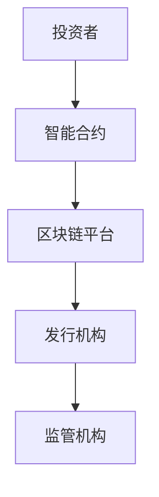
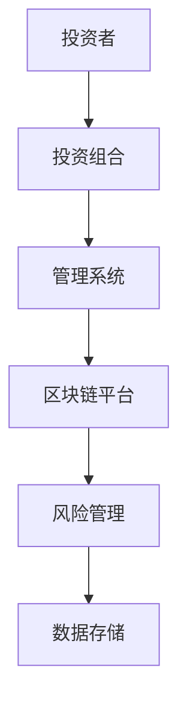
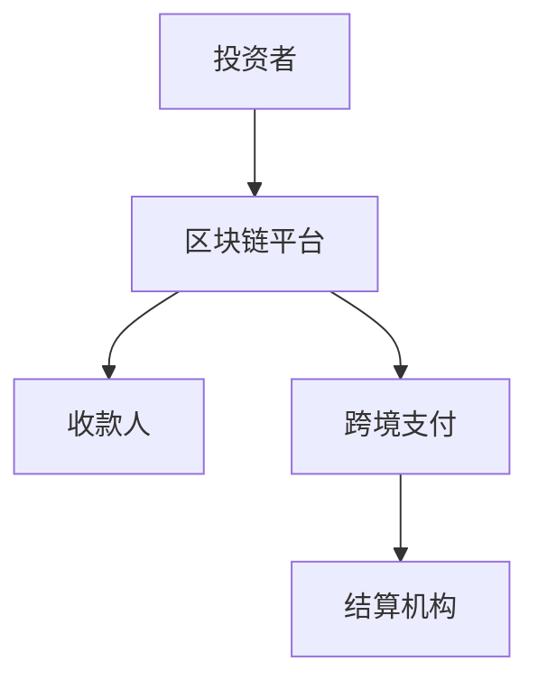
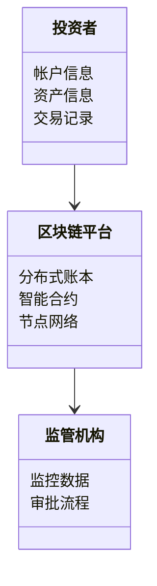
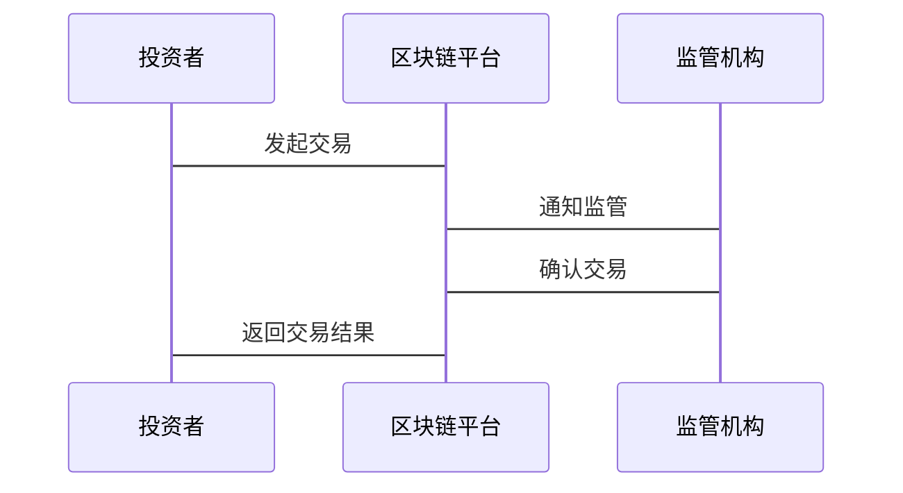

                 


# 区块链技术对投资行业的潜在影响

> 关键词：区块链技术、投资行业、金融创新、智能合约、去中心化、数字化转型

> 摘要：区块链技术作为一项革命性的技术，正在逐步改变投资行业的运作方式。本文从区块链技术的基本概念出发，分析其在投资行业中的应用场景，探讨其对投资行业带来的潜在影响，包括提升效率、降低成本、增强透明度等方面。同时，本文还详细阐述了区块链技术的核心原理，包括分布式账本、共识机制、智能合约等，并通过实际案例分析了区块链技术在投资行业的实际应用。最后，本文总结了区块链技术对投资行业的未来展望，提出了应对挑战的策略。

---

# 第一部分: 区块链技术对投资行业的潜在影响概述

## 第1章: 区块链技术与投资行业的背景介绍

### 1.1 区块链技术的基本概念

#### 1.1.1 区块链的定义与核心要素

区块链是一种去中心化的分布式账本技术，通过加密算法和共识机制实现数据的安全存储和传输。其核心要素包括：

- **分布式账本**：数据分散存储在多个节点上，确保数据的不可篡改性。
- **共识机制**：通过算法（如PoW、PoS、BFT等）达成全网一致的交易确认。
- **智能合约**：自动执行的代码脚本，用于实现复杂的业务逻辑。
- **去中心化**：没有单点控制中心，数据由多个节点共同维护。

#### 1.1.2 区块链的起源与发展历程

区块链起源于比特币的白皮书，由中本聪（Satoshi Nakamoto）提出。随后，以太坊（Ethereum）引入智能合约，将区块链技术从单纯的数字货币扩展到更广泛的应用场景。近年来，区块链技术逐渐应用于金融、医疗、教育等多个领域。

#### 1.1.3 区块链在金融领域的应用现状

目前，区块链技术已在金融领域取得了显著进展，尤其是在支付、结算、证券发行等方面。例如，许多金融机构开始采用区块链技术进行跨境支付，以降低交易成本和提高效率。

### 1.2 投资行业的数字化转型

#### 1.2.1 投资行业的传统模式与痛点

传统投资行业存在以下痛点：

- **交易成本高**：中介机构的佣金和手续费较高。
- **效率低**：跨境支付和结算需要较长时间。
- **透明度低**：信息不对称导致投资者难以信任机构。
- **风险管理难**：难以实时监控和追踪交易数据。

#### 1.2.2 数字化转型的必要性与趋势

随着数字化技术的快速发展，投资行业也在逐步向数字化转型。区块链技术作为数字化转型的重要工具，能够帮助投资机构降低运营成本、提高效率、增强透明度。

#### 1.2.3 区块链技术在投资行业中的潜在价值

区块链技术能够解决投资行业中的痛点，其潜在价值包括：

- **降低交易成本**：通过去中心化和自动化流程减少中介费用。
- **提高效率**：实现快速结算和跨境支付。
- **增强透明度**：通过分布式账本实现数据的透明共享。
- **创新投资产品**：支持新的金融工具和业务模式。

### 1.3 区块链技术对投资行业的核心影响

#### 1.3.1 提高交易透明度与信任度

区块链的分布式账本技术确保了数据的透明性和不可篡改性，投资者可以实时查看交易记录，增强信任。

#### 1.3.2 降低交易成本与提升效率

通过去中心化和自动化流程，区块链技术能够大幅降低交易成本并提高效率。

#### 1.3.3 创新投资产品与服务模式

智能合约的应用使得新的投资产品（如自动化金融产品）得以实现，同时支持个性化的服务模式。

### 1.4 本章小结

本章介绍了区块链技术的基本概念、发展历程及其在金融领域的应用现状。同时，分析了投资行业面临的痛点以及区块链技术的潜在价值，为后续章节的深入分析奠定了基础。

---

## 第2章: 区块链技术的核心概念与原理

### 2.1 区块链的核心技术原理

#### 2.1.1 分布式账本技术

分布式账本是区块链的核心组件，数据分散存储在多个节点上，确保数据的安全性和一致性。

#### 2.1.2 共识机制（PoW, PoS, BFT等）

共识机制用于确保所有节点对交易记录的一致性。常见的共识机制包括：

- **PoW（工作量证明）**：通过计算哈希值来验证交易。
- **PoS（权益证明）**：基于持币者的权益进行验证。
- **BFT（拜占庭容错）**：通过投票机制达成共识。

#### 2.1.3 智能合约的执行与管理

智能合约是区块链上的自动执行代码，用于实现复杂的业务逻辑。智能合约的执行过程包括部署、触发、执行和状态更新。

### 2.2 区块链的属性特征对比

#### 2.2.1 去中心化与中心化的对比分析

- **去中心化**：数据由多个节点共同维护，无单点故障。
- **中心化**：数据集中存储在单一机构，存在单点故障风险。

#### 2.2.2 可追溯性与不可篡改性的特点

- **可追溯性**：通过区块链的交易记录可以追溯资金流向。
- **不可篡改性**：数据一旦写入区块链，无法被修改或删除。

#### 2.2.3 交易透明性与隐私保护的平衡

- **交易透明性**：区块链上的交易记录公开透明。
- **隐私保护**：通过零知识证明等技术实现隐私保护。

### 2.3 区块链的ER实体关系图

以下是区块链系统的ER实体关系图：

```mermaid
erd
    投资者 --> 交易记录
    交易记录 --> 区块链平台
    区块链平台 --> 智能合约
    智能合约 --> 监管机构
```

### 2.4 本章小结

本章详细讲解了区块链技术的核心概念与原理，包括分布式账本、共识机制和智能合约等。通过对比分析区块链的属性特征，进一步理解其在投资行业中的潜在应用价值。

---

## 第3章: 区块链技术在投资行业的算法原理

### 3.1 区块链共识机制的算法原理

#### 3.1.1 工作量证明机制（PoW）

PoW机制通过计算哈希值来验证交易，确保网络安全。以下是PoW算法的简单实现：

```python
import hashlib

def compute_hash(prefix):
    while True:
        random_num = random.getrandbits(64)
        suffix = str(random_num)
        hash_value = hashlib.sha256((prefix + suffix).encode()).hexdigest()
        if hash_value.startswith('0000'):
            return suffix
```

#### 3.1.2 权益证明机制（PoS）

PoS机制基于持币者的权益进行验证，以下是PoS算法的伪代码：

```python
def pos_consensus(block):
    proposer = select_validator()
    validator_votes = []
    for validator in validators:
        if validator.votes_for_block(block):
            validator_votes.append(validator)
    if len(validator_votes) > (len(validators) / 2):
        return True
    else:
        return False
```

#### 3.1.3 其他共识算法（如BFT系列）

BFT系列算法通过投票机制实现共识，以下是PBFT算法的伪代码：

```python
def pbft_execute(request):
    view_number = request.view_number
    for node in nodes:
        if node.view_number != view_number:
            node.view_number = view_number
    primary_node.process_request(request)
    primary_node.broadcast_request(request)
    for node in nodes:
        if node.status == 'faulty':
            handle_fault(node)
    primary_node.broadcast_reply(reply)
    return reply
```

### 3.2 智能合约的执行流程

#### 3.2.1 合约部署与编译

智能合约在区块链上部署的过程包括：

1. 合约编写（Solidity等语言）。
2. 合约编译为 bytecode。
3. 合约部署到区块链网络。
4. 合约初始化并开始执行。

#### 3.2.2 合约触发与执行

智能合约通过外部调用或区块链事件触发执行。以下是智能合约的执行流程：

1. 调用者发起交易，触发智能合约。
2. 区块链节点接收交易并验证。
3. 智能合约执行代码，修改区块链状态。
4. 交易确认并写入区块链。

#### 3.2.3 合约状态的更新与存储

智能合约的状态包括：

- **已部署**：合约已成功部署到区块链。
- **执行中**：合约正在处理交易。
- **已完成**：合约执行完毕并返回结果。

### 3.3 区块链网络的通信协议

#### 3.3.1 P2P网络通信

区块链节点之间通过P2P协议进行通信，以下是P2P网络的通信流程：

1. 节点建立连接，进行握手协议。
2. 节点发送交易或区块信息。
3. 节点接收并验证数据，进行广播或确认。

#### 3.3.2 区块传播机制

区块通过Gossip算法进行传播，以下是Gossip协议的伪代码：

```python
def gossip(protocol, node, message):
    if random.random() < protocolossip_prob:
        for neighbor in neighbors:
            if neighbor != node:
                gossip(protocol, neighbor, message)
    else:
        if random.random() < protocolbroadcast_prob:
            broadcast(message)
```

#### 3.3.3 交易验证与确认流程

交易验证流程包括：

1. 节点接收交易请求。
2. 节点验证交易的有效性。
3. 交易通过共识机制确认。
4. 交易写入区块链。

### 3.4 本章小结

本章详细讲解了区块链技术在投资行业中的算法原理，包括共识机制、智能合约的执行流程和区块链网络的通信协议。通过算法实现和流程图分析，进一步理解区块链技术在投资行业中的技术细节。

---

## 第4章: 区块链技术对投资行业的系统分析与架构设计

### 4.1 投资行业区块链应用的场景分析

#### 4.1.1 股票与证券发行

区块链技术可以实现证券的数字化发行，简化发行流程并降低成本。以下是股票发行的流程图：



#### 4.1.2 投资组合管理

通过区块链技术实现投资组合的实时监控和管理，以下是投资组合管理的流程图：



#### 4.1.3 跨境支付与结算

区块链技术可以实现跨境支付的快速结算，以下是跨境支付的流程图：



### 4.2 区块链系统的功能设计

#### 4.2.1 领域模型设计（Mermaid类图）

以下是区块链系统的领域模型设计：



#### 4.2.2 系统架构设计

区块链系统的架构设计包括：

- **应用层**：投资者与系统交互的界面。
- **合约层**：智能合约的部署与执行。
- **网络层**：区块链节点的通信与数据传输。
- **数据层**：分布式账本的存储与管理。

#### 4.2.3 系统接口设计

系统接口设计包括：

- **API接口**：投资者与系统交互的接口。
- **区块链接口**：智能合约与区块链平台的接口。
- **监管接口**：监管机构与区块链平台的接口。

#### 4.2.4 系统交互设计（Mermaid序列图）

以下是系统交互的序列图：



### 4.3 本章小结

本章通过场景分析和系统设计，详细讲解了区块链技术在投资行业中的应用场景和系统架构设计。通过领域模型设计和系统交互设计，进一步理解区块链技术在投资行业中的实际应用。

---

## 第5章: 区块链技术对投资行业的最佳实践与未来展望

### 5.1 区块链技术的最佳实践

#### 5.1.1 技术实现上的注意事项

- 确保智能合约的安全性，避免漏洞。
- 选择合适的共识机制，平衡效率与安全性。
- 保护用户隐私，防止数据泄露。

#### 5.1.2 业务模式上的创新

- 推动金融产品的创新，如自动化金融产品。
- 提供个性化的投资服务，提升用户体验。
- 加强与传统金融机构的合作，实现优势互补。

#### 5.1.3 监管与合规

- 遵守相关法律法规，确保合规性。
- 与监管机构保持良好沟通，争取政策支持。
- 探索区块链技术在监管合规中的应用。

### 5.2 区块链技术的未来展望

#### 5.2.1 技术发展趋势

- **Layer 2扩展技术**：如侧链、Rollup等，进一步提升交易效率。
- **跨链技术**：实现不同区块链之间的互操作性。
- **隐私保护技术**：如零知识证明，进一步增强数据隐私。

#### 5.2.2 投资行业的发展趋势

- **数字化转型加速**：投资行业将更加依赖数字化技术。
- **智能合约广泛应用**：智能合约将渗透到更多的投资场景。
- **去中心化金融（DeFi）**：DeFi将推动投资行业的创新。

#### 5.2.3 挑战与应对策略

- **技术挑战**：如性能瓶颈、安全性问题等。
- **监管挑战**：如法律法规的不确定性。
- **市场接受度**：投资者对新技术的接受程度。

### 5.3 本章小结

本章总结了区块链技术在投资行业中的最佳实践，并展望了未来的技术发展趋势和投资行业的发展方向。同时，提出了应对挑战的策略，为投资行业的发展提供了有益的参考。

---

## 附录: 区块链技术相关工具与资源

### 1. 区块链开发框架

- **以太坊（Ethereum）**：支持智能合约的开源平台。
- **Hyperledger Fabric**：企业级区块链框架。
- **SOLANA**：高性能区块链平台。

### 2. 区块链开发工具

- **Remix IDE**：以太坊智能合约开发工具。
- **Truffle Suite**：区块链开发框架。
- **Web3.js**：与以太坊交互的JavaScript库。

### 3. 区块链相关资源

- **官方文档**：各区块链平台的官方文档。
- **开发者论坛**：如ethereum.stackexchange.com。
- **技术博客**：如medium上的区块链技术文章。

---

## 作者：AI天才研究院/AI Genius Institute & 禅与计算机程序设计艺术 /Zen And The Art of Computer Programming

---

**摘要**：本文从区块链技术的基本概念出发，详细分析了其在投资行业中的应用场景和潜在影响。通过技术原理、系统设计和实际案例的分析，展示了区块链技术在提升效率、降低成本、增强透明度等方面的巨大潜力。同时，本文还展望了区块链技术的未来发展趋势，并提出了应对挑战的策略，为投资行业的发展提供了有益的参考。

