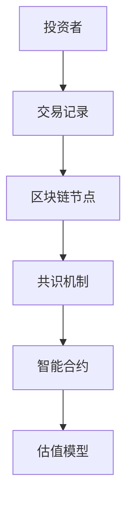
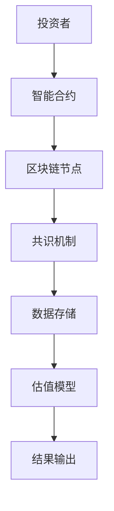
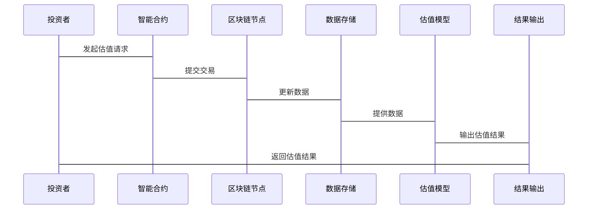

                 


# 区块链技术对股市估值方法的潜在影响

> 关键词：区块链技术，股市估值方法，数据透明度，智能合约，去中心化，分布式账本

> 摘要：区块链技术通过其去中心化、数据不可篡改和高透明度的特点，正在改变传统的股市估值方法。本文将详细分析区块链技术的核心概念、其对股市估值的潜在影响，并通过实际案例和系统设计展示其在提升估值模型准确性和优化金融数据分析中的应用。

---

## 第一部分：区块链技术与传统股市估值方法的背景介绍

### 第1章：区块链技术与传统股市估值方法概述

#### 1.1 区块链技术的基本概念

- **1.1.1 区块链的定义与核心特点**
  区块链是一种去中心化的分布式账本技术，通过加密算法和共识机制确保数据的安全性和不可篡改性。其核心特点包括去中心化、数据透明性、不可篡改性和安全性。

- **1.1.2 区块链的起源与发展历程**
  区块链起源于比特币的出现，最初用于加密货币的交易，随后扩展到金融、供应链管理等多个领域。近年来，区块链技术得到了快速发展，并在多个行业展现出广泛的应用潜力。

- **1.1.3 区块链在金融领域的应用现状**
  区块链在金融领域的应用主要集中在支付结算、智能合约、供应链金融和证券交易等方面。其在金融领域的应用潜力巨大，尤其是在提升交易效率和数据安全性方面。

#### 1.2 传统股市估值方法的概述

- **1.2.1 股市估值的基本概念**
  股市估值是指对股票内在价值的估算，通常基于公司财务数据、市场状况和行业趋势等因素进行分析。常见的估值方法包括市盈率（P/E）、市净率（P/B）和现金流折现模型（DCF）等。

- **1.2.2 主流的估值模型与方法**
  主流的估值模型包括：
  - 市盈率模型（P/E）
  - 市净率模型（P/B）
  - 现金流折现模型（DCF）
  - 股东权益模型（EV）
  - 增长模型（Gordon Growth Model）

- **1.2.3 传统估值方法的优缺点**
  优点：传统估值方法基于财务数据，能够较为全面地反映公司的经营状况。
  缺点：依赖于公司财务数据的准确性，可能存在数据造假或操控的风险；同时，传统估值方法难以实时更新，无法适应市场变化的快速需求。

#### 1.3 区块链技术对股市估值的潜在影响

- **1.3.1 区块链技术如何改变金融数据的可信度**
  区块链通过去中心化和数据不可篡改性，提高了金融数据的可信度。投资者可以通过区块链技术直接访问准确的公司财务数据和市场信息，从而减少信息不对称。

- **1.3.2 区块链如何提升交易透明度**
  区块链技术能够实时记录和追踪每一笔交易，确保交易的透明性和可追溯性。这种透明性有助于投资者更好地理解市场动态，从而做出更准确的估值。

- **1.3.3 区块链对传统估值模型的挑战与机遇**
  区块链技术为传统估值模型提供了新的数据来源和分析工具，但同时也对传统估值模型的假设和方法提出了挑战。例如，区块链技术可能使得实时估值成为可能，从而提高了估值的及时性和准确性。

#### 1.4 本章小结

本章主要介绍了区块链技术和传统股市估值方法的基本概念，并探讨了区块链技术对股市估值的潜在影响。通过分析区块链技术的特点和传统估值方法的优缺点，我们初步了解了区块链技术在提升数据可信度、交易透明度以及优化估值模型方面的潜力。

---

## 第二部分：区块链技术的核心概念与原理

### 第2章：区块链技术的核心概念

#### 2.1 区块链的核心概念

- **2.1.1 块链式结构**
  区块链由一系列按顺序连接的区块组成，每个区块包含一定数量的交易记录，并通过哈希值与前一个区块相连，形成不可篡改的链式结构。

- **2.1.2 分布式账本**
  区块链是一个去中心化的分布式账本，数据分布在多个节点上，每个节点都有一份完整的账本副本，通过共识机制保证账本的一致性。

- **2.1.3 共识机制**
  共识机制是区块链的核心机制之一，用于确保所有节点达成一致。常见的共识机制包括工作量证明（PoW）、权益证明（PoS）和拜占庭容错（BFT）等。

- **2.1.4 加密算法**
  区块链使用加密算法确保数据的安全性和隐私性。常见的加密算法包括椭圆曲线加密（ECC）和哈希函数（如SHA-256）。

- **2.1.5 智能合约**
  智能合约是区块链上的自动执行程序，能够在区块链网络上自动执行合同条款。智能合约可以用于自动执行金融交易、支付和结算等操作。

#### 2.2 区块链的核心原理

- **2.2.1 去中心化**
  区块链的去中心化特性使得数据不再依赖于单一中心机构，而是分布在多个节点上，通过共识机制保证数据的一致性和安全性。

- **2.2.2 数据不可篡改性**
  区块链上的数据一旦写入，就无法被修改或删除。每个区块都包含时间戳和前一个区块的哈希值，确保数据的完整性和不可篡改性。

- **2.2.3 交易的透明性和可追溯性**
  区块链上的交易记录是公开透明的，任何人都可以通过区块链浏览器查看交易信息。同时，区块链的可追溯性使得我们可以追溯每笔交易的来源和流向。

- **2.2.4 网络的安全性**
  区块链通过加密算法和共识机制确保网络的安全性。攻击者需要投入巨大的计算资源才能篡改区块链数据，从而保证了网络的高安全性。

#### 2.3 区块链的核心属性对比

- **2.3.1 中心化与去中心化对比**
  | 特性 | 中心化 | 去中心化 |
  |------|--------|----------|
  | 数据存储 | 单一中心节点 | 分布式节点 |
  | 数据控制 | 中心机构控制 | 节点共同维护 |
  | 数据安全性 | 依赖中心机构 | 依赖共识机制 |

- **2.3.2 数据可篡改性与不可篡改性对比**
  | 特性 | 数据可篡改性 | 数据不可篡改性 |
  |------|--------------|----------------|
  | 数据安全性 | 较低 | 较高 |
  | 数据完整性 | 较低 | 较高 |
  | 修改数据难度 | 易 | 难 |

- **2.3.3 交易透明度与隐私保护对比**
  | 特性 | 透明度 | 隐私保护 |
  |------|---------|----------|
  | 数据可访问性 | 高 | 低 |
  | 数据机密性 | 低 | 高 |
  | 交易可追溯性 | 高 | 低 |

#### 2.4 区块链的ER实体关系图



#### 2.5 本章小结

本章详细介绍了区块链技术的核心概念和原理，包括块链式结构、分布式账本、共识机制、加密算法和智能合约等。通过对比中心化和去中心化的特性，我们进一步理解了区块链技术在数据安全性和交易透明性方面的优势。

---

## 第三部分：区块链技术对股市估值方法的影响

### 第3章：区块链技术对股市估值的核心影响

#### 3.1 区块链技术对股市估值透明度的提升

- **3.1.1 传统估值方法的不透明性**
  传统估值方法依赖于公司提供的财务数据，这些数据可能存在不准确或不完整的情况，导致估值结果的不透明性。

- **3.1.2 区块链技术如何实现数据透明**
  区块链技术通过分布式账本和智能合约，使得公司财务数据和交易记录能够被实时记录和公开查询，从而提高了数据的透明度。

- **3.1.3 透明数据对估值模型的影响**
  透明数据使得投资者可以更准确地获取公司财务数据和市场信息，从而提高估值模型的准确性和可靠性。

#### 3.2 区块链技术对数据准确性的增强

- **3.2.1 数据准确性对估值的重要性**
  数据准确性是估值模型的核心， inaccurate data can lead to incorrect valuation results.

- **3.2.2 区块链如何确保数据的真实性**
  区块链通过不可篡改性和去中心化的特性，确保数据的真实性，从而提高估值模型的数据基础。

- **3.2.3 数据准确性对估值模型的优化**
  高准确性的数据能够帮助估值模型更好地反映公司的实际价值，从而优化估值结果。

#### 3.3 区块链技术对智能合约的应用

- **3.3.1 智能合约的基本概念**
  智能合约是区块链上的自动执行程序，能够在区块链网络上自动执行合同条款。智能合约可以用于自动执行金融交易、支付和结算等操作。

- **3.3.2 智能合约在估值中的应用**
  智能合约可以用于自动计算公司价值和股票估值，从而简化估值过程并提高效率。

- **3.3.3 智能合约对传统估值方法的改进**
  智能合约可以通过自动化和智能化的方式，实时更新和优化估值模型，从而提高估值的准确性和及时性。

#### 3.4 区块链技术对估值模型的优化

- **3.4.1 传统估值模型的局限性**
  传统估值模型依赖于历史数据和假设条件，难以适应市场变化的快速需求。

- **3.4.2 区块链技术如何优化估值模型**
  区块链技术通过实时数据和智能合约，优化了传统估值模型的数据基础和计算方式，使得估值更加动态和准确。

- **3.4.3 新型估值模型的设计与实现**
  新型估值模型基于区块链技术，结合智能合约和实时数据分析，能够更准确地反映公司价值和市场动态。

#### 3.5 本章小结

本章详细探讨了区块链技术对股市估值的核心影响，包括提升透明度、增强数据准确性和优化估值模型等方面。通过区块链技术的应用，我们能够实现更准确、更实时的估值结果，从而提高股市估值的可靠性和有效性。

---

## 第四部分：区块链技术在股市估值中的系统分析与架构设计

### 第4章：系统分析与架构设计方案

#### 4.1 项目介绍

- **项目目标**：利用区块链技术优化股市估值方法，提高估值的准确性和透明度。
- **项目范围**：包括数据采集、智能合约设计、估值模型优化和系统实现等方面。
- **项目需求**：实时数据更新、高数据安全性、高效计算和易用性。

#### 4.2 系统功能设计

- **投资者身份验证**：确保只有授权投资者可以访问系统。
- **数据采集与存储**：实时采集公司财务数据和市场信息，并存储在区块链上。
- **智能合约设计**：设计智能合约用于自动计算公司价值和股票估值。
- **估值模型优化**：基于区块链数据，优化传统估值模型，提高估值的准确性和及时性。

#### 4.3 系统架构设计



#### 4.4 系统接口设计

- **数据接口**：与公司财务系统和市场数据源对接，实现实时数据采集。
- **智能合约接口**：与区块链网络对接，实现智能合约的自动执行。
- **用户接口**：提供友好的用户界面，方便投资者查询和分析估值结果。

#### 4.5 系统交互设计



#### 4.6 本章小结

本章详细分析了区块链技术在股市估值中的系统设计，包括功能设计、架构设计、接口设计和交互设计等方面。通过系统的架构设计，我们能够更好地理解区块链技术在提升估值模型准确性和优化金融数据分析中的应用。

---

## 第五部分：项目实战

### 第5章：项目实战

#### 5.1 环境安装与配置

- **区块链框架选择**：选择合适的区块链框架，如Ethereum、Hyperledger Fabric等。
- **开发工具安装**：安装区块链开发环境和智能合约开发工具，如Solidity、 Remix等。
- **数据库配置**：配置分布式数据库，用于存储区块链数据和估值结果。

#### 5.2 核心代码实现

- **智能合约实现**：编写智能合约代码，用于自动计算公司价值和股票估值。
  ```solidity
  // 智能合约代码示例
  contract StockValuation {
      mapping(address => uint) public valuations;

      function calculateValuation(address companyAddress) public {
          // 自动计算公司估值
          valuations[companyAddress] = calculateValue(companyAddress);
      }

      function getValue(address companyAddress) public view returns (uint) {
          return valuations[companyAddress];
      }
  }
  ```

- **数据接口实现**：实现与公司财务系统和市场数据源的数据接口，实现实时数据采集和更新。
  ```python
  # 数据接口实现代码示例
  import requests

  def fetch_market_data(symbol):
      response = requests.get(f'https://api.market.com/{symbol}')
      return response.json()
  ```

#### 5.3 案例分析与详细讲解

- **案例背景**：假设我们有一家科技公司，希望通过区块链技术优化其股票估值方法。
- **数据采集**：实时采集公司的财务数据和市场信息，如收入、利润和行业趋势。
- **智能合约执行**：通过智能合约自动计算公司的估值，并将结果存储在区块链上。
- **结果输出**：将估值结果返回给投资者，供其参考投资决策。

#### 5.4 项目小结

本章通过项目实战，详细讲解了区块链技术在股市估值中的具体实现。通过智能合约和数据接口的设计与实现，我们能够实现实时数据采集、自动化估值和高透明度的结果输出。

---

## 第六部分：最佳实践与总结

### 第6章：最佳实践与总结

#### 6.1 最佳实践

- **数据安全性**：确保区块链网络的数据安全性，防止数据篡改和攻击。
- **智能合约测试**：在智能合约上线前，进行充分的测试和验证，确保其正确性和可靠性。
- **系统可扩展性**：设计可扩展的系统架构，以应对未来数据量和交易量的增加。

#### 6.2 小结

区块链技术通过其去中心化、数据不可篡改和高透明度的特点，正在改变传统的股市估值方法。通过优化数据基础和提升交易透明度，区块链技术能够帮助投资者更准确地进行股票估值，从而提高股市估值的可靠性和有效性。

#### 6.3 注意事项

- 区块链技术的应用需要考虑法律和合规问题，尤其是在金融领域。
- 系统的设计和实现需要考虑性能和可扩展性，以应对大规模数据处理的需求。
- 智能合约的编写和部署需要高度谨慎，确保其逻辑的正确性和安全性。

#### 6.4 拓展阅读

- 《区块链技术入门与应用》
- 《智能合约与去中心化应用开发》
- 《金融数据分析与建模》

---

## 作者信息

作者：AI天才研究院/AI Genius Institute & 禅与计算机程序设计艺术 /Zen And The Art of Computer Programming

---

以上是《区块链技术对股市估值方法的潜在影响》的完整目录和内容概述。希望这篇文章能够为您提供关于区块链技术在股市估值中的应用和影响的深刻理解。

