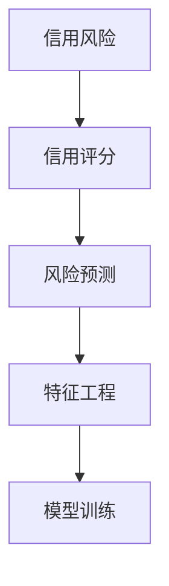
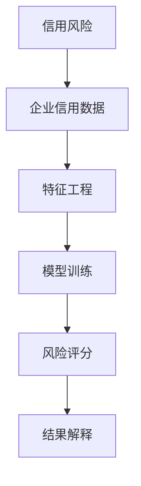
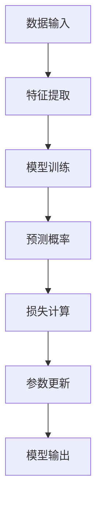
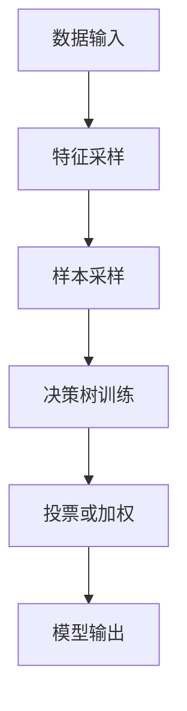
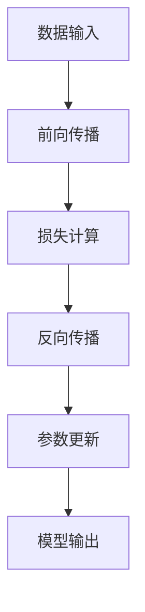
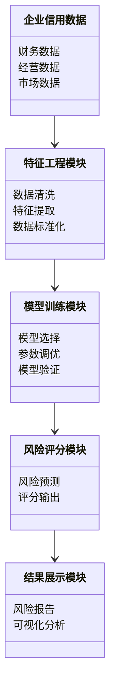
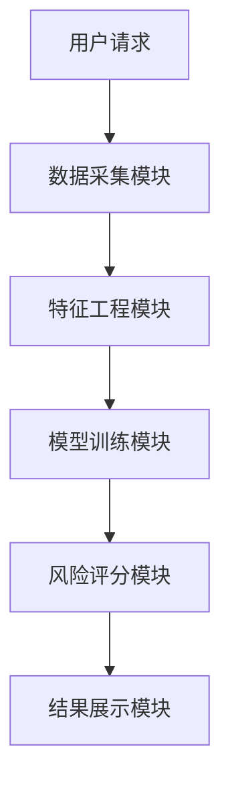
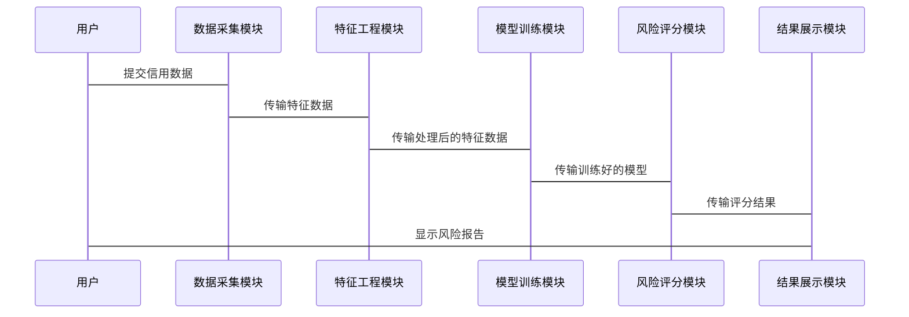

                 


# 开发智能化的企业信用风险评估模型

> 关键词：企业信用风险评估，智能化模型，机器学习，信用评分，风险管理

> 摘要：企业信用风险评估是企业风险管理中的核心环节，传统的评估方法存在效率低、精度差等问题。随着人工智能技术的快速发展，基于机器学习的智能化信用风险评估模型逐渐成为研究的热点。本文将从背景介绍、核心概念、算法原理、系统设计、项目实战等多方面详细阐述如何开发智能化的企业信用风险评估模型，并通过实际案例分析，帮助读者全面掌握模型开发的关键技术。

---

# 第一部分: 背景介绍

## 第1章: 信用风险评估的基本概念

### 1.1 信用风险的定义与特征
信用风险是指企业在信用交易中，由于交易对手方（如客户、供应商等）无法履行其合同义务而导致企业遭受损失的可能性。它是企业风险管理的重要组成部分，主要体现在企业与客户、供应商、合作伙伴等的交易活动中。

#### 1.1.1 信用风险的定义
信用风险的核心在于“信用”，即交易双方基于信任而产生的债务关系。如果债务方因各种原因无法履行还款或履行合同义务，债权方将面临损失的风险。在企业经营中，信用风险主要体现在应收账款回收、贷款发放、供应链管理等多个方面。

#### 1.1.2 信用风险的主要特征
信用风险具有以下主要特征：
- **隐蔽性**：信用风险通常在交易发生时难以直接量化，只有在债务方违约时才会显现。
- **多样性**：信用风险的表现形式多样，包括客户违约、供应商延迟交付、合作伙伴资金链断裂等。
- **动态性**：信用风险会随着市场环境、企业经营状况的变化而变化。
- **关联性**：信用风险往往与其他风险（如市场风险、流动性风险）交织在一起，形成复杂的相互影响。

#### 1.1.3 信用风险与企业经营的关系
信用风险贯穿于企业的整个经营过程，是企业财务管理的核心内容之一。有效的信用风险管理能够帮助企业降低损失、提高资金周转效率、优化资源配置，从而增强企业的竞争力和抗风险能力。

### 1.2 企业信用风险评估的背景与意义
随着全球经济的快速发展和企业规模的不断扩大，信用风险的复杂性和危害性也在不断增加。传统的信用风险评估方法往往依赖于人工经验，存在效率低、精度差、覆盖面窄等问题，难以满足现代企业对高效、精准风险管理的需求。

#### 1.2.1 企业信用风险评估的背景
- **经济全球化**：企业的信用交易规模不断扩大，信用风险的复杂性显著增加。
- **数据爆炸**：现代企业积累了大量的交易数据，如何利用这些数据进行风险评估成为关键。
- **技术进步**：人工智能和大数据技术的快速发展为企业信用风险评估提供了新的工具和方法。

#### 1.2.2 信用风险评估对企业的重要性
- **降低损失**：通过提前识别和预警高风险交易，企业可以采取措施避免或减少损失。
- **优化资源配置**：基于信用评分的交易决策能够提高企业的资金利用效率。
- **提升客户信任**：良好的信用管理能够增强客户对企业的信任，促进长期合作关系的建立。

#### 1.2.3 智能化信用风险评估的优势
智能化信用风险评估通过机器学习算法和大数据技术，能够实现以下目标：
- **自动化与智能化**：自动从海量数据中提取特征，构建模型，实时评估信用风险。
- **高精度**：通过复杂的算法模型，显著提高信用风险评估的准确性。
- **动态调整**：根据市场环境和企业经营状况的变化，实时调整评估策略。

---

## 第2章: 信用风险评估的核心概念与联系

### 2.1 核心概念的定义与属性
信用风险评估模型的核心概念包括：
- **信用评分**：通过对企业的财务状况、经营能力、偿债能力等多维度进行量化分析，得出信用评分。
- **风险预测**：基于历史数据和当前数据，预测未来的信用风险。
- **特征工程**：从原始数据中提取能够反映信用风险的特征。
- **模型训练**：使用机器学习算法对特征数据进行建模和训练。

#### 2.1.1 核心概念的关系图


#### 2.1.2 核心概念的属性对比表
| 概念         | 属性                   | 描述                                             |
|--------------|------------------------|--------------------------------------------------|
| 信用评分      | 数值范围               | 通常为0到1之间的分数，分数越高，信用风险越低。 |
| 风险预测      | 时间跨度               | 可以是短期、中期或长期预测。                     |
| 特征工程      | 特征类型               | 包括财务特征、经营特征、市场特征等。             |
| 模型训练      | 算法类型               | 可以是逻辑回归、随机森林、神经网络等。           |

---

### 2.2 核心概念与联系的Mermaid图


---

## 第3章: 信用风险评估模型的核心要素

### 3.1 数据流与特征工程
#### 3.1.1 数据采集与预处理
- **数据来源**：企业内部数据（如财务报表、交易记录）和外部数据（如行业数据、市场数据）。
- **数据清洗**：处理缺失值、异常值、重复值等。
- **数据标准化**：将不同量纲的特征进行标准化处理，例如归一化或标准化。

#### 3.1.2 特征选择与工程化
- **特征选择**：通过统计分析或模型解释性方法，选择对信用风险影响较大的特征。
- **特征工程**：对原始特征进行组合、分解、衍生等操作，生成更具代表性的新特征。

#### 3.1.3 数据质量与标准化
- 数据质量是信用风险评估模型的基础，低质量的数据会导致模型的准确性和可靠性下降。
- 数据标准化是将不同量纲的特征转换为统一的尺度，例如使用最小-最大标准化或Z-score标准化。

---

### 3.2 模型训练与优化
#### 3.2.1 模型选择与训练
- **模型选择**：根据数据特征和业务需求选择合适的算法，例如逻辑回归、随机森林、支持向量机（SVM）等。
- **模型训练**：使用训练数据对模型进行训练，调整模型参数，优化模型性能。

#### 3.2.2 超参数调优
- **超参数调优**：通过网格搜索（Grid Search）或随机搜索（Random Search）等方法，优化模型的超参数，例如学习率、树深等。

#### 3.2.3 模型评估与验证
- **模型评估**：使用验证集或交叉验证方法评估模型的性能，例如准确率、召回率、F1分数等。
- **模型验证**：通过测试集验证模型的泛化能力，确保模型不会过拟合或欠拟合。

---

### 3.3 评分策略与结果解释
#### 3.3.1 风险评分体系
- **评分体系**：将企业的信用风险分为不同的等级，例如AAA、AA、A、BBB、BB、B、CCC、CC、C、D等。
- **评分策略**：根据评分结果制定相应的风险管理策略，例如对高风险企业采取限制交易或提高首付比例等措施。

#### 3.3.2 评分结果的解释方法
- **结果解释**：通过模型的解释性工具（如SHAP值、特征重要性排序等）分析评分结果的原因。
- **动态调整**：根据市场环境和企业经营状况的变化，动态调整评分策略。

---

## 第4章: 信用风险评估模型的算法原理

### 4.1 逻辑回归算法
逻辑回归是一种常用的分类算法，适用于二分类问题。其核心思想是通过Logit函数将线性回归的结果映射到概率空间，从而实现分类。

#### 4.1.1 逻辑回归的损失函数
逻辑回归的损失函数为对数损失函数：
$$
L(y, \hat{y}) = -\sum_{i=1}^{n} [y_i \ln(\hat{y}_i) + (1 - y_i) \ln(1 - \hat{y}_i)]
$$
其中，$y_i$是真实标签，$\hat{y}_i$是预测概率。

#### 4.1.2 逻辑回归的训练过程


#### 4.1.3 逻辑回归的优缺点
- **优点**：简单易懂，适合线性可分数据，可以输出概率。
- **缺点**：对非线性关系的拟合能力较差，容易受异常值影响。

---

### 4.2 随机森林算法
随机森林是一种基于决策树的集成算法，具有高精度和强健性。

#### 4.2.1 随机森林的训练过程


#### 4.2.2 随机森林的优缺点
- **优点**：能够处理高维数据，对噪声数据有较强的鲁棒性，适合非线性关系。
- **缺点**：计算复杂度较高，解释性较差。

---

### 4.3 神经网络算法
神经网络是一种模仿人脑结构和功能的深度学习算法，适用于复杂的非线性关系。

#### 4.3.1 神经网络的训练过程


#### 4.3.2 神经网络的优缺点
- **优点**：能够处理复杂的非线性关系，模型表达能力强。
- **缺点**：计算复杂度高，需要大量的训练数据，解释性较差。

---

## 第5章: 信用风险评估模型的系统分析与架构设计

### 5.1 问题场景介绍
在企业信用风险管理中，信用风险评估模型需要能够实时处理海量数据，快速生成信用评分，并提供风险预警。

### 5.2 系统功能设计
#### 5.2.1 领域模型设计


#### 5.2.2 系统架构设计


### 5.3 系统接口与交互设计
#### 5.3.1 系统接口设计
- **输入接口**：接收企业的信用数据。
- **输出接口**：输出信用评分和风险报告。

#### 5.3.2 系统交互流程


---

## 第6章: 信用风险评估模型的项目实战

### 6.1 环境安装与配置
- **Python环境**：安装Python 3.x及以上版本。
- **依赖库安装**：使用pip安装必要的库，例如pandas、numpy、scikit-learn、xgboost等。

### 6.2 核心代码实现

#### 6.2.1 数据预处理
```python
import pandas as pd
import numpy as np

# 数据加载
df = pd.read_csv('企业信用数据.csv')

# 数据清洗
df.dropna(inplace=True)
df = df.drop_duplicates()

# 特征提取
features = df[['年收入', '净利润率', '资产负债率', '应收账款周转率']]
target = df['违约标记']

# 数据标准化
from sklearn.preprocessing import StandardScaler
scaler = StandardScaler()
features_scaled = scaler.fit_transform(features)
```

#### 6.2.2 模型训练与优化
```python
from sklearn.ensemble import RandomForestClassifier
from sklearn.model_selection import GridSearchCV

# 参数调优
param_grid = {
    'n_estimators': [100, 200],
    'max_depth': [None, 10, 20],
    'min_samples_split': [2, 5]
}

grid_search = GridSearchCV(RandomForestClassifier(), param_grid, cv=5)
grid_search.fit(features_scaled, target)

# 最佳参数
best_params = grid_search.best_params_
print(best_params)
```

#### 6.2.3 模型评估与部署
```python
from sklearn.metrics import classification_report

# 模型评估
best_model = grid_search.best_estimator_
y_pred = best_model.predict(features_scaled)
print(classification_report(target, y_pred))

# 模型部署
import joblib
joblib.dump(best_model, 'credit_risk_model.pkl')
```

---

## 第7章: 最佳实践与小结

### 7.1 最佳实践
- **数据质量**：确保数据的完整性和准确性，数据预处理是模型训练的基础。
- **特征工程**：合理选择和工程化特征，能够显著提高模型的性能。
- **模型选择**：根据业务需求和数据特征选择合适的算法，避免盲目追求数值结果。
- **持续优化**：定期更新模型，根据市场环境和企业经营状况的变化进行动态调整。

### 7.2 小结
智能化企业信用风险评估模型的开发是一个复杂但极具挑战性的任务。通过机器学习算法和大数据技术，企业能够更高效、更精准地评估信用风险，从而降低损失、优化资源配置。然而，模型的开发和应用需要结合企业的实际情况，注重数据质量、模型解释性和结果的可操作性。

### 7.3 注意事项
- **数据隐私**：在数据采集和处理过程中，必须遵守相关法律法规，保护数据隐私。
- **模型解释性**：复杂的模型可能难以解释，需要结合业务需求选择合适的模型。
- **动态调整**：信用风险是动态变化的，模型需要定期更新和优化。

---

## 第8章: 拓展阅读与深入思考

### 8.1 拓展阅读
- **书籍推荐**：
  - 《机器学习实战》—— 周志华
  - 《信用评分模型开发与应用》—— 张三
- **技术博客**：
  - https://towardsdatascience.com/credit-risk-modeling-with-machine-learning
  - https://medium.com/.../building-a-credit-risk-model-using-python

### 8.2 深入思考
- **模型的可解释性**：如何在保证模型性能的同时，提高模型的可解释性？
- **实时性要求**：如何实现信用风险的实时评估？
- **多模型融合**：如何通过集成学习进一步提高模型的性能和稳定性？

---

作者：AI天才研究院/AI Genius Institute & 禅与计算机程序设计艺术 /Zen And The Art of Computer Programming

