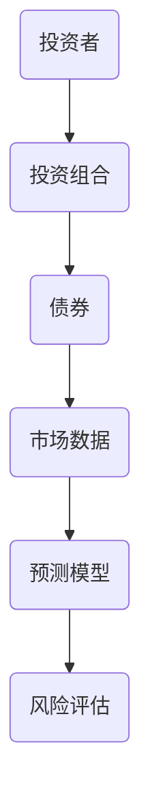
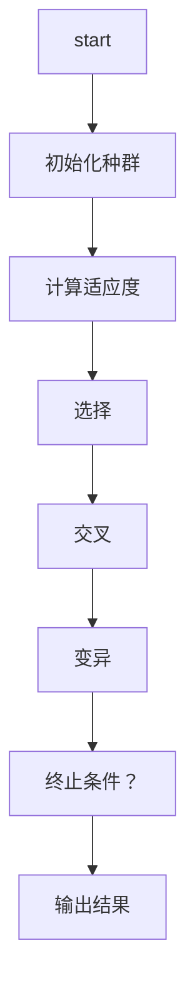
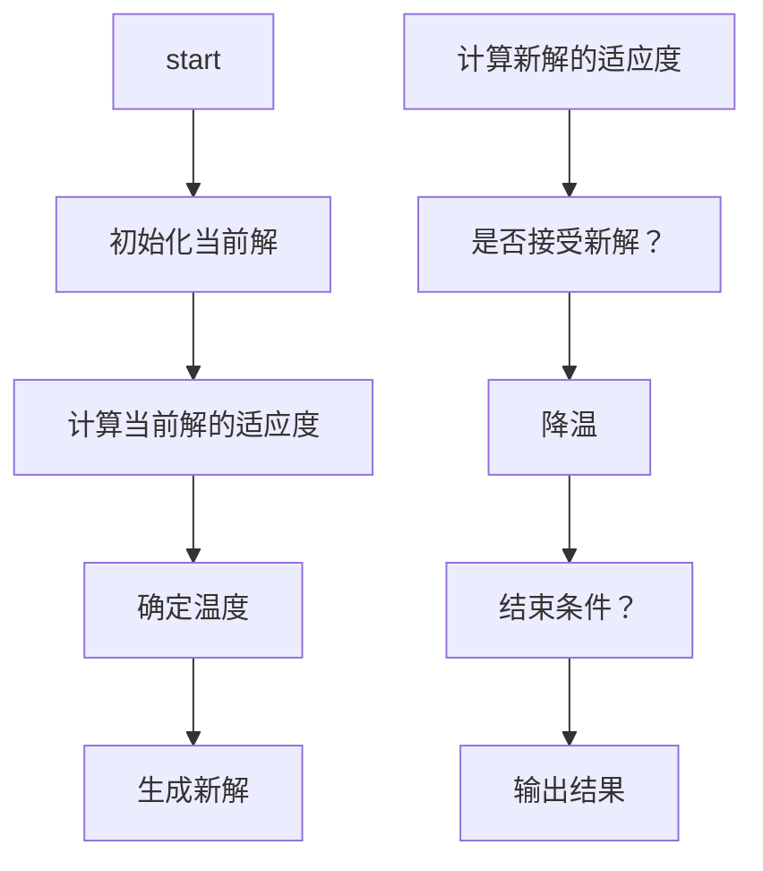
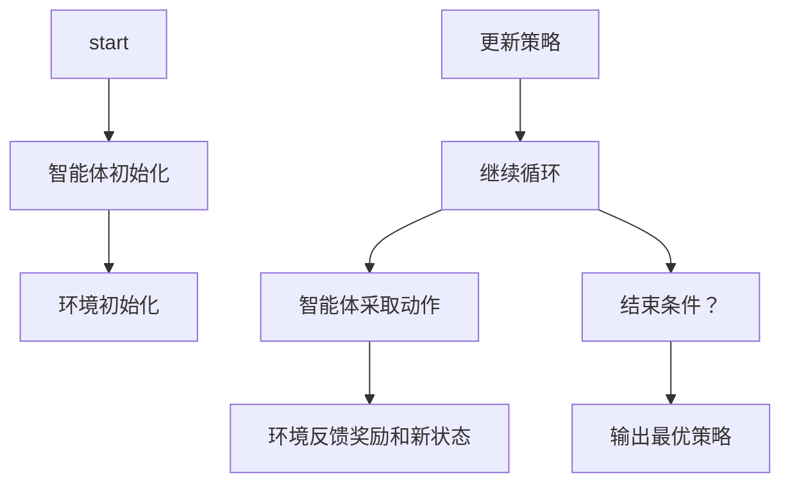
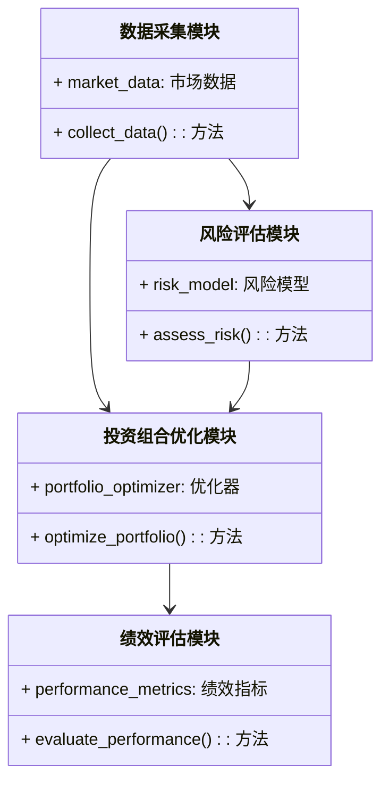
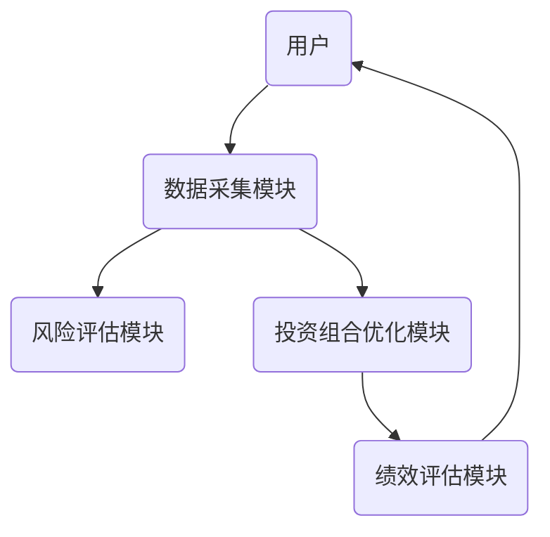
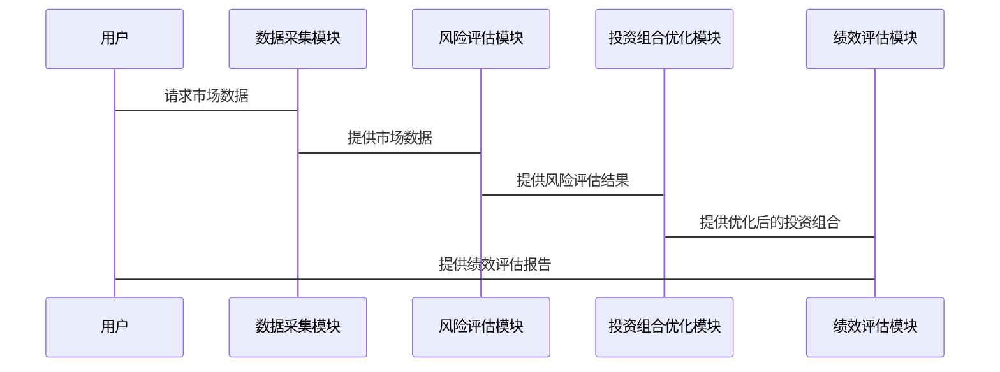

                 


# 智能债券投资组合管理工具

> **关键词**：智能债券投资、投资组合管理、人工智能、优化算法、风险管理、系统架构

> **摘要**：随着金融市场的复杂化和数据量的爆炸式增长，传统债券投资方式逐渐暴露出效率低下、风险控制不足等问题。本文提出了一种基于人工智能的智能债券投资组合管理工具，通过优化算法和风险管理模型，帮助投资者实现高效、智能的债券投资组合管理。本文详细探讨了该工具的核心概念、算法原理、系统架构，并通过实际案例展示了工具的实现与应用。

---

# 第1章: 智能债券投资组合管理工具的背景与核心概念

## 1.1 债券投资的基本概念

### 1.1.1 债券的定义与分类

债券是一种债务工具，发行人向债券持有者借款，并承诺在特定时间支付利息和本金。债券按发行主体可分为政府债券、企业债券和垃圾债券；按期限可分为短期债券、中期债券和长期债券；按利率可分为固定利率债券和浮动利率债券。

### 1.1.2 债券市场的基本运作机制

债券市场是一个复杂的金融体系，包括一级市场和二级市场。一级市场是债券的发行市场，二级市场是债券的交易市场。债券的价格受市场供需、利率水平、发行人信用评级等多种因素影响。

### 1.1.3 债券投资的目标与风险

债券投资的主要目标是实现资产保值增值，同时控制风险。债券投资的主要风险包括利率风险、信用风险、流动性风险和通货膨胀风险。

## 1.2 智能投资组合管理的必要性

### 1.2.1 传统债券投资的局限性

传统债券投资依赖人工分析和经验判断，存在效率低、主观性强、难以应对复杂市场环境等问题。此外，传统方法难以处理海量数据，难以实现大规模优化。

### 1.2.2 智能化投资的优势

人工智能技术的应用可以显著提高债券投资的效率和准确性。通过机器学习算法，可以自动分析市场数据，预测市场趋势，优化投资组合，降低投资风险。

### 1.2.3 智能债券投资组合管理的定义

智能债券投资组合管理是一种基于人工智能技术的债券投资策略优化方法。通过分析市场数据和投资者需求，智能工具能够自动构建和调整债券投资组合，以实现最优的投资目标。

## 1.3 人工智能在金融领域的应用

### 1.3.1 人工智能在金融中的主要应用领域

人工智能在金融领域的应用包括智能投顾、风险管理、算法交易、信用评估、市场预测等。

### 1.3.2 人工智能在债券投资中的潜力

人工智能可以通过分析历史数据和市场信号，预测债券价格走势，识别投资机会，优化投资组合。

### 1.3.3 智能债券投资组合管理的现状与未来趋势

目前，智能债券投资组合管理工具已应用于部分机构投资者，但仍有很大的改进空间。未来，随着人工智能技术的不断发展，智能债券投资将更加智能化、个性化和高效化。

---

## 1.4 本章小结

本章介绍了债券投资的基本概念和智能投资组合管理的必要性，分析了人工智能在金融领域的应用及其在债券投资中的潜力，展望了智能债券投资组合管理的未来发展趋势。

---

# 第2章: 智能债券投资组合管理工具的核心概念与联系

## 2.1 核心概念原理

### 2.1.1 债券评级与风险评估模型

债券评级是衡量债券信用风险的重要指标。智能工具可以通过机器学习算法对债券发行人进行信用评级，预测债券违约风险。

### 2.1.2 投资组合优化算法

投资组合优化算法是智能债券投资的核心技术。通过优化算法，可以在满足风险约束的条件下，最大化投资组合的收益。

### 2.1.3 市场预测模型

市场预测模型是智能债券投资的重要组成部分。通过分析历史数据和市场信号，可以预测未来债券市场的走势，指导投资决策。

## 2.2 核心概念属性对比表

| 概念         | 属性             | 描述                                   |
|--------------|------------------|----------------------------------------|
| 债券评级      | 风险等级         | 根据债券发行方的信用状况进行评级     |
| 投资组合优化 | 目标函数         | 最大化收益或最小化风险                |
| 市场预测      | 预测准确性       | 基于历史数据预测未来市场走势          |

## 2.3 ER实体关系图



---

## 2.4 本章小结

本章详细阐述了智能债券投资组合管理工具的核心概念，包括债券评级、投资组合优化和市场预测模型，并通过对比表和ER图展示了这些概念之间的联系。

---

# 第3章: 常用算法原理与实现

## 3.1 常用优化算法

### 3.1.1 遗传算法

遗传算法是一种模拟生物进化过程的优化算法，常用于解决复杂的非线性优化问题。以下是遗传算法的流程图：



以下是一个简单的遗传算法实现示例：

```python
import random

def fitness(individual):
    # 计算适应度，这里简化为计算收益
    return sum(individual)

def selection(population, fitness_values):
    # 简单的轮盘赌选择
    total_fitness = sum(fitness_values)
    pick = random.uniform(0, total_fitness)
    for i in range(len(population)):
        if pick < fitness_values[i]:
            return population[i]
    return population[-1]

def crossover(parent1, parent2):
    # 单点交叉
    point = random.randint(1, len(parent1)-1)
    return parent1[:point] + parent2[point:], parent2[:point] + parent1[point:]

def mutation(individual):
    # 突变操作
    point = random.randint(0, len(individual)-1)
    individual[point] = 1 - individual[point]
    return individual

def genetic_algorithm(pop_size, ind_size, max_iter):
    population = [[random.randint(0,1) for _ in range(ind_size)] for _ in range(pop_size)]
    for _ in range(max_iter):
        fitness_values = [fitness(ind) for ind in population]
        new_population = []
        for _ in range(pop_size):
            parent1 = selection(population, fitness_values)
            parent2 = selection(population, fitness_values)
            child1, child2 = crossover(parent1, parent2)
            child1 = mutation(child1)
            child2 = mutation(child2)
            new_population.append(child1)
            new_population.append(child2)
        population = new_population
    best = max(fitness(ind) for ind in population)
    return best

# 示例运行
print(genetic_algorithm(10, 5, 10))
```

### 3.1.2 模拟退火算法

模拟退火算法是一种全局优化算法，能够有效避免陷入局部最优。以下是模拟退火算法的流程图：



以下是一个模拟退火算法的实现示例：

```python
import random
import math

def fitness(individual):
    # 计算适应度，这里简化为计算收益
    return sum(individual)

def neighbor(individual):
    # 简单的邻域生成，随机翻转一个元素
    new_ind = individual.copy()
    point = random.randint(0, len(new_ind)-1)
    new_ind[point] = 1 - new_ind[point]
    return new_ind

def simulated_annealing(initial_solution, max_iterations, temp):
    current = initial_solution
    current_fitness = fitness(current)
    best = current
    best_fitness = current_fitness
    for _ in range(max_iterations):
        temp_current = temp / (_ + 1)
        neighbor_solution = neighbor(current)
        neighbor_fitness = fitness(neighbor_solution)
        if neighbor_fitness > current_fitness:
            current = neighbor_solution
            current_fitness = neighbor_fitness
            if current_fitness > best_fitness:
                best = current
                best_fitness = current_fitness
        else:
            prob = math.exp((current_fitness - neighbor_fitness) / temp_current)
            if random.random() < prob:
                current = neighbor_solution
                current_fitness = neighbor_fitness
    return best

# 示例运行
initial = [0, 0, 0, 0, 0]
print(simulated_annealing(initial, 100, 10))
```

### 3.1.3 强化学习算法

强化学习算法通过智能体与环境的交互，学习最优策略。以下是一个简单的强化学习框架：



以下是一个强化学习算法的实现示例：

```python
import numpy as np

class Agent:
    def __init__(self, state_space, action_space):
        self.state_space = state_space
        self.action_space = action_space
        self.Q = np.zeros((state_space, action_space))

    def act(self, state):
        if np.random.random() < 0.5:
            return np.random.randint(self.action_space)
        else:
            return np.argmax(self.Q[state])

    def update(self, state, action, reward, next_state):
        self.Q[state, action] += reward

# 示例运行
state_space = 5
action_space = 2
agent = Agent(state_space, action_space)
state = 0
action = agent.act(state)
reward = 1
next_state = 1
agent.update(state, action, reward, next_state)
```

## 3.2 算法的数学模型与公式

### 3.2.1 遗传算法的适应度函数

$$ \text{适应度} = \sum_{i=1}^{n} w_i x_i $$

其中，\( w_i \) 是权重，\( x_i \) 是决策变量。

### 3.2.2 模拟退火算法的退火过程

$$ P(\text{接受} | \Delta E) = e^{-\Delta E / T} $$

其中，\( \Delta E \) 是能量差，\( T \) 是温度。

### 3.2.3 强化学习算法的Q-learning公式

$$ Q(s, a) = Q(s, a) + \alpha (r + \gamma \max Q(s', a') - Q(s, a)) $$

其中，\( \alpha \) 是学习率，\( \gamma \) 是折扣因子。

## 3.3 本章小结

本章详细讲解了常用优化算法，包括遗传算法、模拟退火算法和强化学习算法，并通过公式和代码示例展示了它们的实现方法。

---

# 第4章: 智能债券投资组合管理工具的系统架构设计

## 4.1 系统功能设计

智能债券投资组合管理工具的主要功能包括：

1. 数据采集与处理：收集债券市场数据，包括债券价格、收益率、信用评级等。
2. 风险评估与预测：利用机器学习模型预测债券违约风险和市场波动风险。
3. 投资组合优化：基于优化算法构建和调整债券投资组合。
4. 绩效评估与报告：定期评估投资组合的绩效，并生成报告。

## 4.2 系统架构设计

以下是系统架构设计的类图：



以下是系统架构设计的架构图：



## 4.3 系统接口设计

系统接口包括：

1. 数据接口：与数据源（如金融数据库）对接，获取市场数据。
2. 用户接口：提供用户输入和输出功能，方便用户操作。
3. 第三方接口：与第三方服务（如信用评级机构）对接，获取额外数据。

## 4.4 系统交互流程

以下是系统交互流程的序列图：



## 4.5 本章小结

本章详细描述了智能债券投资组合管理工具的系统架构设计，包括功能模块、架构图、接口设计和交互流程。

---

# 第5章: 智能债券投资组合管理工具的项目实战

## 5.1 环境安装与配置

### 5.1.1 安装Python与相关库

需要安装的Python库包括：

- `numpy`
- `pandas`
- `scikit-learn`
- `matplotlib`

安装命令：

```bash
pip install numpy pandas scikit-learn matplotlib
```

### 5.1.2 安装其他依赖

根据具体需求，安装其他依赖库，如`tensorflow`或`pytorch`。

## 5.2 系统核心实现

### 5.2.1 数据采集模块

```python
import pandas as pd
import requests

def collect_data(api_key):
    url = f"https://api.example.com/bond_data?api_key={api_key}"
    response = requests.get(url)
    data = response.json()
    df = pd.DataFrame(data)
    return df
```

### 5.2.2 风险评估模块

```python
from sklearn.model_selection import train_test_split
from sklearn.metrics import accuracy_score

def assess_risk(X_train, X_test, y_train, y_test):
    # 假设使用逻辑回归模型
    from sklearn.linear_model import LogisticRegression
    model = LogisticRegression()
    model.fit(X_train, y_train)
    y_pred = model.predict(X_test)
    return accuracy_score(y_test, y_pred)
```

### 5.2.3 投资组合优化模块

```python
import numpy as np
from scipy.optimize import minimize

def portfolio_optimization(returns, weights):
    n = len(returns)
    # 定义目标函数
    def objective(weights):
        return -np.dot(returns.T, weights)
    # 定义约束条件
    constraints = [{'type': 'eq', 'fun': lambda w: np.sum(w) - 1}]
    # 使用SLSQP求解
    result = minimize(objective, weights, method='SLSQP', constraints=constraints)
    return result.x

# 示例数据
returns = np.array([0.05, 0.07, 0.03, 0.06])
weights = np.array([0.25, 0.25, 0.25, 0.25])
optimized_weights = portfolio_optimization(returns, weights)
print(optimized_weights)
```

### 5.2.4 绩效评估模块

```python
import matplotlib.pyplot as plt

def evaluate_performance(portfolio_returns, benchmark_returns):
    plt.plot(portfolio_returns, label='Portfolio Returns')
    plt.plot(benchmark_returns, label='Benchmark Returns')
    plt.xlabel('Time')
    plt.ylabel('Returns')
    plt.legend()
    plt.show()

# 示例数据
portfolio_returns = [0.04, 0.05, 0.06, 0.07]
benchmark_returns = [0.03, 0.04, 0.05, 0.06]
evaluate_performance(portfolio_returns, benchmark_returns)
```

## 5.3 项目实战总结

通过以上代码示例，可以实现智能债券投资组合管理工具的核心功能。数据采集模块负责获取市场数据，风险评估模块评估债券风险，投资组合优化模块优化投资组合，绩效评估模块评估投资组合的绩效。

---

# 第6章: 智能债券投资组合管理工具的总结与展望

## 6.1 本章小结

本章对智能债券投资组合管理工具进行了总结，回顾了文章的主要内容和关键点。工具的核心功能包括数据采集、风险评估、投资组合优化和绩效评估，这些功能通过合理的系统架构和优化算法得以实现。

## 6.2 项目实战经验与教训

在项目实战中，我们发现数据质量对工具的性能影响较大。同时，算法的参数设置也需要根据具体场景进行调整，以达到最佳效果。

## 6.3 智能债券投资组合管理工具的注意事项

1. 数据来源的可靠性至关重要，需确保数据的准确性和及时性。
2. 算法的选择需根据具体问题和数据特点进行，避免盲目使用流行算法。
3. 系统的可扩展性和可维护性需在设计阶段加以考虑，以应对未来需求的变化。

## 6.4 拓展阅读与学习资源

建议读者进一步学习以下内容：

1. 深度学习在金融中的应用
2. 更复杂的优化算法（如粒子群优化）
3. 金融市场预测的高级方法

---

# 作者

**作者：AI天才研究院/AI Genius Institute & 禅与计算机程序设计艺术/Zen And The Art of Computer Programming**

