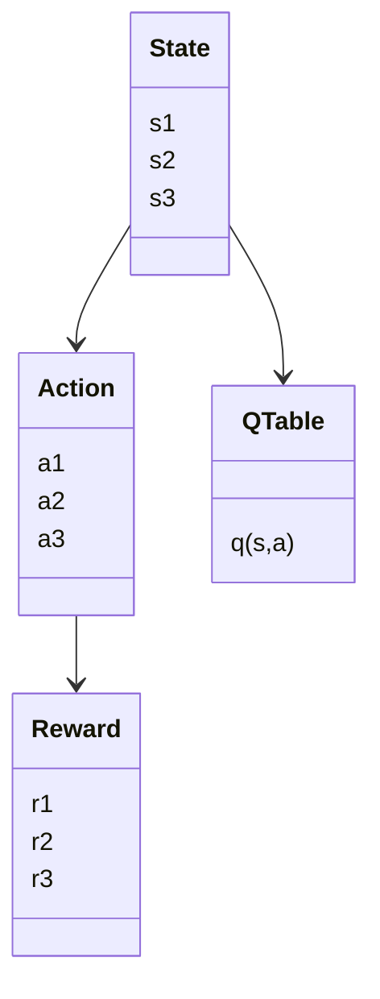
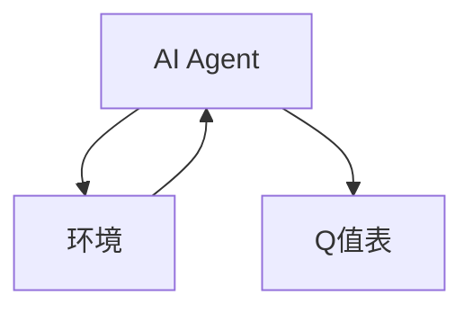
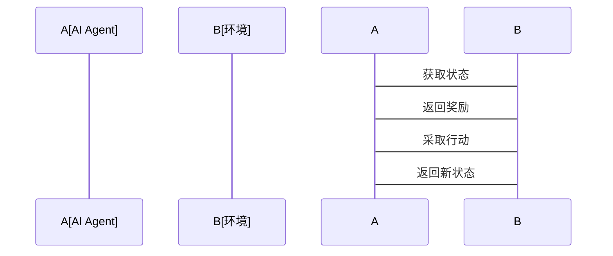

                 


# 构建具有强化学习能力的AI Agent

## 关键词：强化学习, AI Agent, 算法原理, 系统架构, 项目实战

## 摘要：本篇文章将深入探讨如何构建一个具有强化学习能力的AI Agent。从强化学习的基本概念到核心算法的详细讲解，再到系统架构设计和实际项目实现，文章将带领读者一步步掌握构建强化学习AI Agent的全过程。通过本文，读者将能够理解强化学习的核心原理，掌握常见算法的实现方法，并能够在实际项目中应用这些知识。

---

# 第1章: 强化学习与AI Agent概述

## 1.1 强化学习的基本概念

### 1.1.1 什么是强化学习
强化学习（Reinforcement Learning, RL）是一种机器学习范式，其中智能体通过与环境交互来学习策略，以最大化累积的奖励。与监督学习和无监督学习不同，强化学习强调智能体在动态环境中通过试错学习来优化决策。

### 1.1.2 强化学习的核心要素
- **智能体（Agent）**：智能体是强化学习系统的核心，负责感知环境并采取行动。
- **环境（Environment）**：环境是智能体所处的外部世界，智能体会通过与环境交互来获得反馈。
- **状态（State）**：状态表示智能体在某一时刻所处的环境情况。
- **行动（Action）**：行动是智能体在给定状态下选择的行为。
- **奖励（Reward）**：奖励是环境对智能体行动的反馈，用于指导智能体的行为优化。

### 1.1.3 AI Agent的定义与特点
AI Agent是一种能够感知环境、自主决策并采取行动的智能系统。AI Agent的特点包括：
- **自主性**：能够自主决策，无需外部干预。
- **反应性**：能够实时感知环境并做出反应。
- **目标导向**：通过最大化奖励来实现目标。
- **学习能力**：能够通过强化学习不断优化决策策略。

## 1.2 强化学习与AI Agent的关系

### 1.2.1 强化学习在AI Agent中的作用
强化学习为AI Agent提供了决策优化的框架。通过与环境的交互，AI Agent能够学习到最优的决策策略，从而在复杂环境中实现高效、智能的行动。

### 1.2.2 AI Agent的类型与应用场景
- **基于值的AI Agent**：通过学习状态值函数来优化决策。
- **基于策略的AI Agent**：直接优化行动策略。
- **模型-based AI Agent**：基于环境模型进行决策。
- **模型-free AI Agent**：不依赖环境模型，直接通过试错学习。

### 1.2.3 强化学习与监督学习的区别
- **监督学习**：基于标记的训练数据，学习输入到输出的映射。
- **强化学习**：通过与环境交互，学习最优策略。

## 1.3 强化学习的核心算法

### 1.3.1 Q-learning算法
Q-learning是一种基于值的强化学习算法，通过学习Q值函数来优化决策。Q值表示从当前状态采取某项行动后的预期累积奖励。

### 1.3.2 Deep Q-Networks (DQN)算法
DQN是Q-learning的深度学习版本，通过神经网络近似Q值函数，解决了传统Q-learning在处理高维状态空间时的局限性。

### 1.3.3 Policy Gradient方法
Policy Gradient是一种基于策略的强化学习算法，通过直接优化策略参数来最大化累积奖励。

## 1.4 强化学习与AI Agent的未来发展趋势

### 1.4.1 强化学习的最新研究方向
- **多智能体强化学习**：多个智能体协同决策。
- **元强化学习**：学习如何学习。
- ** imitation learning**：通过观察专家行为进行学习。

### 1.4.2 AI Agent在不同领域的应用前景
- **游戏AI**：在电子游戏中实现智能代理。
- **机器人控制**：用于机器人路径规划和动作控制。
- **金融交易**：优化投资决策。

### 1.4.3 技术挑战与解决方案
- **高维状态空间**：使用深度学习模型近似值函数。
- **稀疏奖励问题**：通过引入好奇心机制或奖励 shaping 提高学习效率。

## 1.5 本章小结
本章介绍了强化学习的基本概念、AI Agent的定义与特点，以及强化学习的核心算法。通过对比强化学习与监督学习，我们了解了强化学习在AI Agent中的重要作用，并展望了未来的发展方向。

---

# 第2章: 强化学习的核心算法原理

## 2.1 Q-learning算法详解

### 2.1.1 Q-learning的基本原理
Q-learning通过维护一个Q值表，记录从每个状态采取每个行动后的预期累积奖励。智能体通过探索与利用策略更新Q值表，最终找到最优策略。

### 2.1.2 Q-learning的数学模型
Q值更新公式：
$$ Q(s, a) = Q(s, a) + \alpha [r + \gamma \max Q(s', a') - Q(s, a)] $$
其中：
- $\alpha$ 是学习率。
- $\gamma$ 是折扣因子。
- $s$ 是当前状态。
- $a$ 是当前动作。
- $s'$ 是下一个状态。
- $r$ 是奖励。

### 2.1.3 Q-learning的优缺点
- **优点**：简单易实现，适用于离散状态和动作空间。
- **缺点**：在高维状态空间中表现不佳，难以处理连续状态和动作。

### 2.1.4 Q-learning的实现步骤
1. 初始化Q值表。
2. 与环境交互，获取状态、动作和奖励。
3. 更新Q值表。
4. 重复步骤2和3，直到收敛。

## 2.2 Deep Q-Networks (DQN)算法

### 2.2.1 DQN的创新点
DQN通过神经网络近似Q值函数，解决了传统Q-learning在处理高维状态空间时的局限性。引入经验回放和目标网络等技术，提高了学习效率和稳定性。

### 2.2.2 DQN的网络结构与训练过程
- **经验回放**：将经验存储在回放缓冲区，随机采样进行训练，减少数据相关性。
- **目标网络**：使用两个网络，主网络负责评估当前策略，目标网络用于稳定更新。

### 2.2.3 DQN的实际应用案例
- **游戏控制**：在Atari游戏中实现智能代理。
- **机器人控制**：用于机器人路径规划和动作控制。

## 2.3 Policy Gradient方法

### 2.3.1 Policy Gradient的基本原理
Policy Gradient直接优化策略参数，通过最大化累积奖励来更新策略。

### 2.3.2 Policy Gradient的数学模型
策略梯度更新公式：
$$ \theta = \theta + \alpha \nabla_\theta J(\theta) $$
其中：
- $\theta$ 是策略参数。
- $\alpha$ 是学习率。
- $\nabla_\theta J(\theta)$ 是策略梯度。

### 2.3.3 Policy Gradient的优缺点
- **优点**：适用于连续动作空间，策略更新直接。
- **缺点**：计算复杂度高，收敛速度慢。

### 2.3.4 Policy Gradient的实现步骤
1. 初始化策略参数。
2. 采样动作，与环境交互，获取奖励。
3. 计算策略梯度，更新策略参数。
4. 重复步骤2和3，直到收敛。

## 2.4 强化学习算法的比较与选择

### 2.4.1 不同算法的性能对比
| 算法类型 | 状态空间 | 动作空间 | 是否需要环境模型 | 优点 |
|---------|----------|----------|------------------|------|
| Q-learning | 离散 | 离散 | 不需要 | 简单易实现 |
| DQN | 离散/连续 | 离散/连续 | 不需要 | 处理高维状态 |
| Policy Gradient | 离散/连续 | 离散/连续 | 不需要 | 适用于连续动作 |

### 2.4.2 算法选择的依据
- **状态和动作空间的维度**：Q-learning适用于低维，DQN和Policy Gradient适用于高维。
- **环境是否确定**：确定环境适合值函数方法，随机环境适合策略优化方法。
- **计算资源**：DQN和Policy Gradient需要更多计算资源。

### 2.4.3 算法调优的技巧
- **学习率和折扣因子**：合理设置$\alpha$和$\gamma$。
- **经验回放大小**：选择合适的回放缓冲区大小。
- **网络结构**：根据任务选择合适的神经网络架构。

## 2.5 本章小结
本章详细讲解了Q-learning、DQN和Policy Gradient三种强化学习算法的基本原理、数学模型和优缺点。通过对比分析，读者可以更好地理解不同算法的适用场景和选择依据。

---

# 第3章: 强化学习算法的数学模型与实现

## 3.1 Q-learning的数学模型与实现

### 3.1.1 Q-learning的数学模型
Q值更新公式：
$$ Q(s, a) = Q(s, a) + \alpha [r + \gamma \max Q(s', a') - Q(s, a)] $$

### 3.1.2 Q-learning的实现步骤
1. 初始化Q值表。
2. 与环境交互，获取状态、动作和奖励。
3. 更新Q值表。
4. 重复步骤2和3，直到收敛。

### 3.1.3 Q-learning的Python实现
```python
import numpy as np

class QLearning:
    def __init__(self, state_space, action_space, alpha=0.1, gamma=0.9):
        self.state_space = state_space
        self.action_space = action_space
        self.alpha = alpha
        self.gamma = gamma
        self.q_table = np.zeros((state_space, action_space))
    
    def choose_action(self, state):
        return np.argmax(self.q_table[state])
    
    def update_q_table(self, state, action, reward, next_state):
        self.q_table[state, action] = self.q_table[state, action] + self.alpha * (reward + self.gamma * np.max(self.q_table[next_state]) - self.q_table[state, action])
```

## 3.2 DQN算法的数学模型与实现

### 3.2.1 DQN的数学模型
目标网络更新公式：
$$ Q_{\text{target}}(s', a') = \beta Q_{\text{target}}(s', a') + (1 - \beta) Q_{\text{main}}(s', a') $$ $$ 1+\1=2$$

### 3.2.2 DQN的实现步骤
1. 初始化主网络和目标网络。
2. 与环境交互，获取经验。
3. 将经验存储在回放缓冲区。
4. 随机采样经验，训练网络。
5. 更新目标网络。
6. 重复步骤2到5，直到收敛。

### 3.2.3 DQN的Python实现
```python
import random
import numpy as np
from collections import deque

class DQN:
    def __init__(self, state_space, action_space, hidden_dim=32, alpha=0.01, gamma=0.99, replay_size=1000):
        self.state_space = state_space
        self.action_space = action_space
        self.hidden_dim = hidden_dim
        self.alpha = alpha
        self.gamma = gamma
        self.replay_size = replay_size
        self.main_network = self.build_network()
        self.target_network = self.build_network()
        self.replay_buffer = deque(maxlen=replay_size)
    
    def build_network(self):
        import tensorflow as tf
        model = tf.keras.Sequential([
            tf.keras.layers.Dense(self.hidden_dim, activation='relu', input_shape=(self.state_space,)),
            tf.keras.layers.Dense(self.action_space, activation='linear')
        ])
        model.compile(optimizer=tf.keras.optimizers.Adam(learning_rate=self.alpha), loss='mean_squared_error')
        return model
    
    def choose_action(self, state):
        state = np.array([state])
        q_values = self.main_network.predict(state)[0]
        return np.argmax(q_values)
    
    def remember(self, state, action, reward, next_state, done):
        self.replay_buffer.append((state, action, reward, next_state, done))
    
    def replay(self):
        if len(self.replay_buffer) < self.replay_size:
            return
        batch = random.sample(self.replay_buffer, self.replay_size)
        states = np.array([b[0] for b in batch])
        actions = np.array([b[1] for b in batch])
        rewards = np.array([b[2] for b in batch])
        next_states = np.array([b[3] for b in batch])
        dones = np.array([b[4] for b in batch])
        
        q_target = self.target_network.predict(next_states)
        q_target[...] = q_target * (1 - self.gamma) + rewards.reshape(-1, 1)
        
        self.main_network.fit(states, q_target, epochs=1, verbose=0)
        
        weights = self.main_network.get_weights()
        target_weights = self.target_network.get_weights()
        for i in range(len(weights)):
            target_weights[i] = target_weights[i] * 0.1 + weights[i] * 0.9
        self.target_network.set_weights(target_weights)
```

## 3.3 Policy Gradient的数学模型与实现

### 3.3.1 Policy Gradient的数学模型
策略梯度更新公式：
$$ \theta = \theta + \alpha \nabla_\theta J(\theta) $$

### 3.3.2 Policy Gradient的实现步骤
1. 初始化策略参数。
2. 采样动作，与环境交互，获取奖励。
3. 计算策略梯度，更新策略参数。
4. 重复步骤2和3，直到收敛。

### 3.3.3 Policy Gradient的Python实现
```python
import numpy as np
import tensorflow as tf

class PolicyGradient:
    def __init__(self, state_space, action_space, hidden_dim=32, alpha=0.01):
        self.state_space = state_space
        self.action_space = action_space
        self.hidden_dim = hidden_dim
        self.alpha = alpha
        self.theta = np.random.randn(self.hidden_dim, 1)
    
    def choose_action(self, state):
        state = np.array([state])
        h = np.dot(state, self.theta)
        h = np.tanh(h)
        action_prob = h * (self.action_space - 1) + 1
        return np.argmax(action_prob)
    
    def update_theta(self, rewards, states):
        gradients = []
        for state, reward in zip(states, rewards):
            h = np.dot(state, self.theta)
            h = np.tanh(h)
            action_prob = h * (self.action_space - 1) + 1
            advantage = reward - np.mean(action_prob)
            gradient = state * advantage * (1 - np.tanh(h)**2)
            gradients.append(gradient)
        average_gradient = np.mean(gradients, axis=0)
        self.theta += self.alpha * average_gradient
```

## 3.4 本章小结
本章详细讲解了Q-learning、DQN和Policy Gradient三种算法的数学模型，并通过Python代码实现了它们的核心功能。通过这些实现，读者可以更好地理解算法的内部机制，并能够在实际项目中应用这些知识。

---

# 第4章: 系统分析与架构设计方案

## 4.1 问题场景介绍
我们希望通过构建一个强化学习AI Agent，解决一个复杂的优化问题。例如，设计一个智能代理，能够在动态变化的环境中，通过与环境交互，学习最优的决策策略。

## 4.2 项目介绍

### 4.2.1 项目目标
实现一个基于强化学习的AI Agent，能够在给定的环境中，通过与环境交互，学习最优的决策策略。

### 4.2.2 项目范围
- **环境定义**：定义智能体所处的环境。
- **状态定义**：定义环境中的状态空间。
- **动作定义**：定义智能体可以采取的动作。
- **奖励定义**：定义智能体的奖励机制。

### 4.2.3 项目约束
- **计算资源**：限制计算资源，选择合适的算法。
- **环境复杂度**：根据环境复杂度选择合适的强化学习算法。

## 4.3 系统功能设计

### 4.3.1 领域模型


### 4.3.2 系统架构


### 4.3.3 系统接口设计
- **输入接口**：接收环境状态。
- **输出接口**：输出智能体动作。
- **奖励接口**：接收环境反馈的奖励。

### 4.3.4 系统交互


## 4.4 本章小结
本章通过系统分析与架构设计，明确了构建强化学习AI Agent的整体框架。通过领域模型、系统架构和交互流程的设计，为后续的实现奠定了基础。

---

# 第5章: 项目实战

## 5.1 环境安装

### 5.1.1 安装Python
确保安装了Python 3.6或更高版本。

### 5.1.2 安装依赖
安装必要的Python库，例如：
```bash
pip install numpy tensorflow
```

## 5.2 系统核心实现源代码

### 5.2.1 Q-learning实现
```python
import numpy as np

class QLearning:
    def __init__(self, state_space, action_space, alpha=0.1, gamma=0.9):
        self.state_space = state_space
        self.action_space = action_space
        self.alpha = alpha
        self.gamma = gamma
        self.q_table = np.zeros((state_space, action_space))
    
    def choose_action(self, state):
        return np.argmax(self.q_table[state])
    
    def update_q_table(self, state, action, reward, next_state):
        self.q_table[state, action] = self.q_table[state, action] + self.alpha * (reward + self.gamma * np.max(self.q_table[next_state]) - self.q_table[state, action])
```

### 5.2.2 DQN实现
```python
import random
import numpy as np
from collections import deque

class DQN:
    def __init__(self, state_space, action_space, hidden_dim=32, alpha=0.01, gamma=0.99, replay_size=1000):
        self.state_space = state_space
        self.action_space = action_space
        self.hidden_dim = hidden_dim
        self.alpha = alpha
        self.gamma = gamma
        self.replay_size = replay_size
        self.main_network = self.build_network()
        self.target_network = self.build_network()
        self.replay_buffer = deque(maxlen=replay_size)
    
    def build_network(self):
        import tensorflow as tf
        model = tf.keras.Sequential([
            tf.keras.layers.Dense(self.hidden_dim, activation='relu', input_shape=(self.state_space,)),
            tf.keras.layers.Dense(self.action_space, activation='linear')
        ])
        model.compile(optimizer=tf.keras.optimizers.Adam(learning_rate=self.alpha), loss='mean_squared_error')
        return model
    
    def choose_action(self, state):
        state = np.array([state])
        q_values = self.main_network.predict(state)[0]
        return np.argmax(q_values)
    
    def remember(self, state, action, reward, next_state, done):
        self.replay_buffer.append((state, action, reward, next_state, done))
    
    def replay(self):
        if len(self.replay_buffer) < self.replay_size:
            return
        batch = random.sample(self.replay_buffer, self.replay_size)
        states = np.array([b[0] for b in batch])
        actions = np.array([b[1] for b in batch])
        rewards = np.array([b[2] for b in batch])
        next_states = np.array([b[3] for b in batch])
        dones = np.array([b[4] for b in batch])
        
        q_target = self.target_network.predict(next_states)
        q_target[...] = q_target * (1 - self.gamma) + rewards.reshape(-1, 1)
        
        self.main_network.fit(states, q_target, epochs=1, verbose=0)
        
        weights = self.main_network.get_weights()
        target_weights = self.target_network.get_weights()
        for i in range(len(weights)):
            target_weights[i] = target_weights[i] * 0.1 + weights[i] * 0.9
        self.target_network.set_weights(target_weights)
```

### 5.2.3 Policy Gradient实现
```python
import numpy as np
import tensorflow as tf

class PolicyGradient:
    def __init__(self, state_space, action_space, hidden_dim=32, alpha=0.01):
        self.state_space = state_space
        self.action_space = action_space
        self.hidden_dim = hidden_dim
        self.alpha = alpha
        self.theta = np.random.randn(self.hidden_dim, 1)
    
    def choose_action(self, state):
        state = np.array([state])
        h = np.dot(state, self.theta)
        h = np.tanh(h)
        action_prob = h * (self.action_space - 1) + 1
        return np.argmax(action_prob)
    
    def update_theta(self, rewards, states):
        gradients = []
        for state, reward in zip(states, rewards):
            h = np.dot(state, self.theta)
            h = np.tanh(h)
            action_prob = h * (self.action_space - 1) + 1
            advantage = reward - np.mean(action_prob)
            gradient = state * advantage * (1 - np.tanh(h)**2)
            gradients.append(gradient)
        average_gradient = np.mean(gradients, axis=0)
        self.theta += self.alpha * average_gradient
```

## 5.3 代码实现与解读

### 5.3.1 Q-learning实现
```python
# 初始化Q-learning
q_learning = QLearning(state_space=4, action_space=2, alpha=0.1, gamma=0.9)

# 训练过程
for _ in range(1000):
    state = env.get_state()
    action = q_learning.choose_action(state)
    next_state, reward, done = env.step(action)
    q_learning.update_q_table(state, action, reward, next_state)
```

### 5.3.2 DQN实现
```python
# 初始化DQN
dqn = DQN(state_space=4, action_space=2, hidden_dim=32, alpha=0.01, gamma=0.99, replay_size=1000)

# 训练过程
for _ in range(1000):
    state = env.get_state()
    action = dqn.choose_action(state)
    next_state, reward, done = env.step(action)
    dqn.remember(state, action, reward, next_state, done)
    dqn.replay()
```

### 5.3.3 Policy Gradient实现
```python
# 初始化Policy Gradient
policy_gradient = PolicyGradient(state_space=4, action_space=2, hidden_dim=32, alpha=0.01)

# 训练过程
for _ in range(1000):
    state = env.get_state()
    action = policy_gradient.choose_action(state)
    next_state, reward, done = env.step(action)
    policy_gradient.update_theta(reward, [state])
```

## 5.4 案例分析与详细讲解

### 5.4.1 Q-learning案例
假设我们有一个简单的环境，状态空间为4，动作空间为2。我们可以通过训练Q-learning算法，使智能体在环境中找到最优策略。

### 5.4.2 DQN案例
DQN算法适用于处理高维状态空间，例如在Atari游戏中，通过神经网络近似Q值函数，实现智能体的决策优化。

### 5.4.3 Policy Gradient案例
Policy Gradient适用于连续动作空间，例如在机器人控制中，通过优化策略参数，实现机器人路径规划和动作控制。

## 5.5 项目小结
本章通过实际案例分析，详细讲解了如何在实际项目中应用强化学习算法。通过代码实现与解读，读者可以更好地理解算法的实现细节，并能够在实际项目中灵活应用这些知识。

---

# 第6章: 总结与展望

## 6.1 强化学习与AI Agent的核心要点

### 6.1.1 强化学习的核心算法
- Q-learning：基于值的强化学习算法。
- DQN：基于深度学习的Q-learning算法。
- Policy Gradient：基于策略的强化学习算法。

### 6.1.2 AI Agent的系统架构
- 状态感知
- 行动选择
- 奖励机制
- 环境交互

## 6.2 强化学习算法的最佳实践

### 6.2.1 算法选择
- 根据状态和动作空间的维度选择合适的算法。
- 根据环境是否确定选择值函数方法或策略优化方法。

### 6.2.2 算法调优
- 合理设置学习率和折扣因子。
- 选择合适的网络结构。
- 使用经验回放和目标网络提高学习效率。

## 6.3 未来的发展方向

### 6.3.1 多智能体强化学习
多个智能体协同决策，实现更复杂的任务。

### 6.3.2 元强化学习
学习如何学习，提高算法的自适应能力。

### 6.3.3 强化学习与人机协作
结合人类反馈，实现更符合人类需求的智能代理。

## 6.4 总结
通过本文的讲解，读者可以系统地掌握强化学习AI Agent的核心原理和实现方法。强化学习作为一种强大的机器学习范式，正在推动AI Agent技术的发展，未来将有更广泛的应用场景。

---

# 作者：AI天才研究院/AI Genius Institute & 禅与计算机程序设计艺术 /Zen And The Art of Computer Programming

