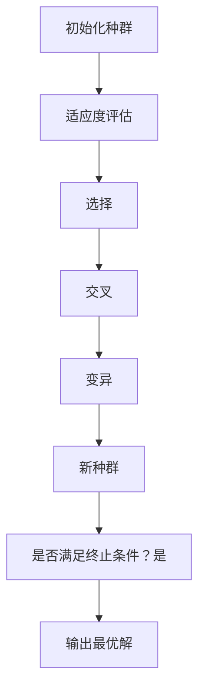
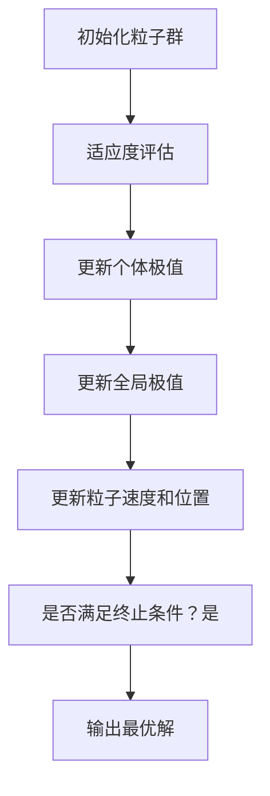
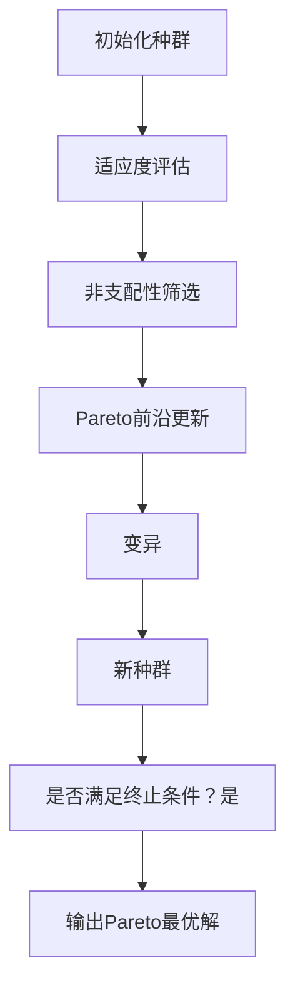
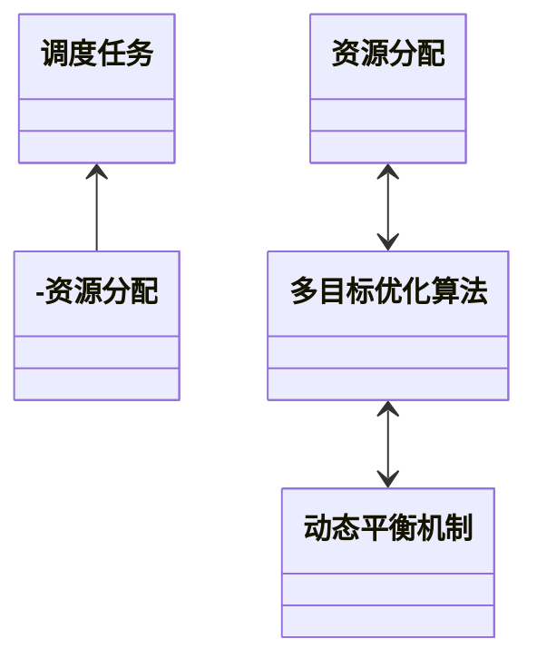
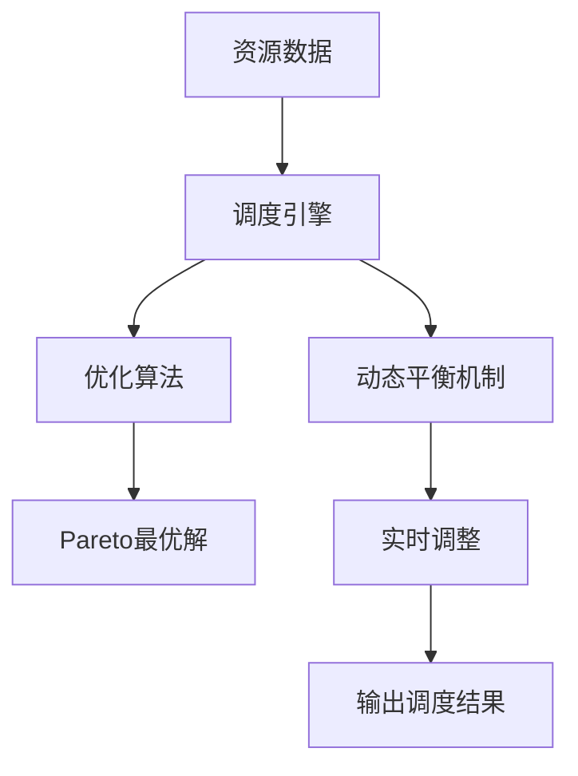
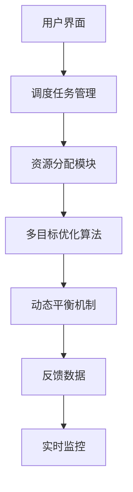
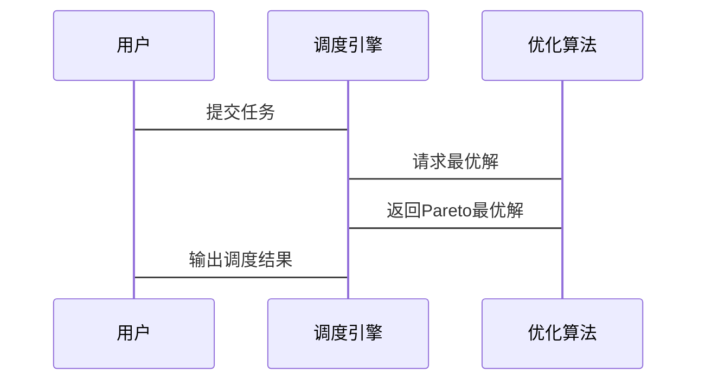

                 


# 构建智能企业资源调度系统：多目标优化与动态平衡

> 关键词：智能调度系统、多目标优化、动态平衡、资源分配、优化算法、企业系统设计

> 摘要：本文详细探讨了构建智能企业资源调度系统的核心方法，重点分析了多目标优化和动态平衡的实现策略。文章从背景介绍、核心概念、算法原理、系统架构到项目实战，层层深入，结合实际案例和代码实现，为读者提供了一套完整的解决方案。

---

## 第一部分: 智能企业资源调度系统概述

### 第1章: 背景介绍

#### 1.1 问题背景
##### 1.1.1 企业资源调度的核心问题
企业资源调度系统的核心问题是如何高效地分配和利用企业中的有限资源（如人、设备、资金等），以实现多个目标（如成本最小化、效率最大化、风险最小化）之间的平衡。

##### 1.1.2 当前资源调度的主要挑战
- 资源分配的动态性：市场需求波动、资源可用性变化等导致调度问题复杂化。
- 多目标冲突：不同目标之间可能存在冲突，例如成本最低可能意味着效率下降。
- 数据量大：现代企业资源调度涉及大量数据，传统方法难以处理。

##### 1.1.3 智能调度系统的优势与必要性
智能调度系统通过引入人工智能和优化算法，能够实时处理动态变化，实现多目标优化，显著提升企业的运营效率和竞争力。

#### 1.2 问题描述
##### 1.2.1 资源调度的基本概念
资源调度是指在特定时间内，合理分配企业资源以满足任务需求的过程。

##### 1.2.2 多目标优化的定义
多目标优化是指在多个相互冲突的目标下，找到一组最优解，使得这些解在所有目标上尽可能达到最佳平衡。

##### 1.2.3 动态平衡的内涵与外延
动态平衡是指在系统运行过程中，根据实时变化调整资源分配，以保持多个目标之间的动态平衡。

#### 1.3 问题解决
##### 1.3.1 智能调度系统的解决方案
- 引入人工智能算法（如遗传算法、粒子群优化）进行资源分配。
- 建立动态反馈机制，实时调整调度策略。

##### 1.3.2 多目标优化的关键技术
- 建立数学模型，明确目标和约束条件。
- 使用优化算法求解多目标问题，生成Pareto最优解集。

##### 1.3.3 动态平衡的实现方法
- 建立实时监控系统，获取动态数据。
- 使用预测模型，预判未来变化，提前调整调度策略。

#### 1.4 系统的边界与外延
##### 1.4.1 系统边界定义
系统仅处理内部资源分配问题，不涉及外部市场环境的直接干预。

##### 1.4.2 外延与应用场景
资源调度系统广泛应用于制造、物流、能源等领域。

##### 1.4.3 系统与外部环境的交互
系统通过接口获取外部数据（如市场需求、设备状态）并输出调度结果。

#### 1.5 核心要素组成
##### 1.5.1 资源要素
包括人力资源、设备、资金等。

##### 1.5.2 目标要素
包括成本最小化、效率最大化、风险最小化等。

##### 1.5.3 约束条件
包括资源可用性、时间限制、预算限制等。

### 第2章: 核心概念与联系

#### 2.1 多目标优化原理
##### 2.1.1 多目标优化的数学模型
建立数学模型，明确目标函数和约束条件。

##### 2.1.2 Pareto最优解的概念
Pareto最优解是指在多目标优化问题中，无法在不损害一个目标的情况下改善另一个目标的解。

##### 2.1.3 多目标优化算法的分类
常用的算法包括遗传算法、粒子群优化、多目标蚁群算法等。

#### 2.2 动态平衡机制
##### 2.2.1 动态平衡的定义
动态平衡是指系统在运行过程中，根据实时变化调整资源分配，以保持多个目标之间的动态平衡。

##### 2.2.2 动态平衡的实现方法
通过实时数据采集和预测模型，动态调整调度策略。

##### 2.2.3 动态平衡与多目标优化的关系
动态平衡依赖于多目标优化算法，而多目标优化算法则通过动态平衡实现系统的稳定运行。

#### 2.3 核心概念对比分析
##### 2.3.1 单目标优化与多目标优化的对比
| 对比维度 | 单目标优化 | 多目标优化 |
|----------|------------|------------|
| 目标数量 | 1个        | 多个        |
| 解空间   | 单点最优解 | 多点Pareto最优解 |

##### 2.3.2 静态优化与动态优化的对比
| 对比维度 | 静态优化       | 动态优化       |
|----------|---------------|---------------|
| 数据变化 | 静止           | 动态变化         |
| 解适用性 | 适用于固定场景 | 适用于变化场景   |

##### 2.3.3 传统调度与智能调度的对比
| 对比维度 | 传统调度      | 智能调度      |
|----------|---------------|---------------|
| 方法      | 基于规则       | 基于算法和模型  |
| 处理能力 | 低             | 高             |
| 精度      | 一般           | 高             |

#### 2.4 ER实体关系图
```mermaid
erd
    资源实体 --> 调度任务
    调度任务 --> 目标函数
    目标函数 --> 约束条件
```

### 第3章: 算法原理讲解

#### 3.1 多目标优化算法
##### 3.1.1 遗传算法（GA）


代码实现：
```python
import random

def fitness(individual):
    # 目标函数
    return sum(individual)

def mutate(individual):
    # 变异操作
    pos = random.randint(0, len(individual)-1)
    individual[pos] = 1 - individual[pos]
    return individual

def crossover(parent1, parent2):
    # 单点交叉
    point = random.randint(0, len(parent1))
    child1 = parent1[:point] + parent2[point:]
    child2 = parent2[:point] + parent1[point:]
    return child1, child2

# 初始化种群
population = [[random.randint(0,1) for _ in range(10)] for _ in range(10)]

# 迭代优化
for _ in range(100):
    # 适应度评估
    fitness_list = [fitness(individual) for individual in population]
    # 选择
    selected = [population[i] for i in range(len(fitness_list)) if fitness_list[i] == max(fitness_list)]
    # 交叉变异
    new_population = []
    while len(new_population) < len(population):
        parent1 = random.choice(selected)
        parent2 = random.choice(selected)
        child1, child2 = crossover(parent1, parent2)
        child1 = mutate(child1)
        child2 = mutate(child2)
        new_population.append(child1)
        new_population.append(child2)
    population = new_population

# 输出最优解
print(fitness(population[0]))
```

##### 3.1.2 粒子群优化（PSO）


代码实现：
```python
import random

class Particle:
    def __init__(self, dimensions):
        self.dimensions = dimensions
        self.velocity = [0]*dimensions
        self.position = [random.random() for _ in range(dimensions)]
        self.pbest = self.position.copy()
        self.best = self.position.copy()

def fitness(individual):
    # 目标函数
    return sum(individual)

def update_pbest(particle, current_position):
    if fitness(current_position) > fitness(particle.pbest):
        particle.pbest = current_position

def update_velocity(particle, gbest, w=0.8, c1=1, c2=2):
    for i in range(len(particle.velocity)):
        particle.velocity[i] = w * particle.velocity[i] + c1 * random.random() * (particle.pbest[i] - particle.position[i]) + c2 * random.random() * (gbest[i] - particle.position[i])

def update_position(particle):
    for i in range(len(particle.position)):
        particle.position[i] += particle.velocity[i]

# 初始化粒子群
particles = [Particle(10) for _ in range(10)]

# 全局最优解
gbest = [random.random() for _ in range(10)]

# 迭代优化
for _ in range(100):
    # 适应度评估
    fitness_list = [fitness(particle.position) for particle in particles]
    # 更新个体极值
    for particle in particles:
        if fitness(particle.position) == max(fitness_list):
            gbest = particle.position.copy()
            break
    # 更新粒子速度和位置
    for particle in particles:
        update_velocity(particle, gbest)
        update_position(particle)

# 输出最优解
print(fitness(gbest))
```

##### 3.1.3 多目标优化算法


代码实现：
```python
def dominance(particle1, particle2):
    # 判断粒子1是否支配粒子2
    better = 0
    same = 0
    for i in range(len(particle1)):
        if particle1[i] < particle2[i]:
            better += 1
        elif particle1[i] == particle2[i]:
            same += 1
    if better > 0 and same == len(particle1):
        return True
    else:
        return False

particles = [Particle(10) for _ in range(10)]

# 迭代优化
for _ in range(100):
    # 适应度评估
    fitness_list = [fitness(particle.position) for particle in particles]
    # 非支配性筛选
    pareto_front = []
    for p in particles:
        is_dominated = False
        for q in particles:
            if p != q and dominance(q.position, p.position):
                is_dominated = True
                break
        if not is_dominated:
            pareto_front.append(p)
    # 更新种群
    new_population = []
    for p in pareto_front:
        new_particle = Particle(10)
        new_particle.position = p.position.copy()
        new_population.append(new_particle)
    particles = new_population

# 输出Pareto最优解
for p in pareto_front:
    print(fitness(p.position))
```

#### 3.2 数学模型与公式
##### 3.2.1 多目标优化的数学模型
$$ \text{minimize } f_1(x), f_2(x), \ldots, f_n(x) $$
$$ \text{subject to } g_i(x) \leq 0, i = 1, 2, \ldots, m $$

##### 3.2.2 Pareto最优解的定义
$$ \text{解 } x \text{ 是Pareto最优的，当且仅当不存在另一个解 } y \text{ 使得 } f_i(y) \leq f_i(x) \text{ 对所有 } i \text{ 且至少存在一个 } i \text{ 使得 } f_i(y) < f_i(x) $$

##### 3.2.3 动态平衡的数学表达
$$ x(t+1) = x(t) + \Delta x(t) $$
其中，$$ \Delta x(t) \) 是根据实时数据调整的增量。

---

## 第二部分: 系统分析与架构设计方案

### 第4章: 系统分析与架构设计

#### 4.1 问题场景介绍
企业资源调度系统需要解决多目标优化和动态平衡问题，确保资源的高效利用。

#### 4.2 系统功能设计
##### 4.2.1 领域模型


##### 4.2.2 系统架构


#### 4.3 系统架构设计
##### 4.3.1 系统架构图


#### 4.4 系统接口设计
##### 4.4.1 输入接口
- 资源数据输入
- 任务需求输入

##### 4.4.2 输出接口
- 调度结果输出
- 优化报告输出

#### 4.5 系统交互设计


---

## 第三部分: 项目实战

### 第5章: 项目实战

#### 5.1 环境安装
- 安装Python
- 安装相关库（如numpy、pymoo）

#### 5.2 系统核心实现
##### 5.2.1 调度算法实现
```python
import numpy as np
from pymoo import algorithms, problems, visualize

problem = problems.MultiObjectiveProblem(
    n_vars=10,
    n_objs=2,
    n_constraints=0,
    type_vars=dict(type="int", bounds=(0, 1))
)

algorithm = algorithms.NSGA2(pop_size=100)
algorithm.run(problem, 100)

visualize.pareto(problem, algorithm)
```

##### 5.2.2 动态平衡实现
```python
import random

def dynamic_balance(system_state):
    # 根据实时数据调整资源分配
    adjustment = [random.uniform(0, 1) for _ in range(len(system_state))]
    return [system_state[i] + adjustment[i] for i in range(len(system_state))]
```

#### 5.3 案例分析
##### 5.3.1 案例描述
假设某制造企业需要在有限时间内完成多个订单，目标是最小化成本和最大化交货时间。

##### 5.3.2 解决方案
使用多目标优化算法找到成本和交货时间的Pareto最优解。

##### 5.3.3 实施步骤
1. 数据采集：收集订单需求、资源可用性等数据。
2. 建立模型：定义目标函数和约束条件。
3. 算法求解：运行多目标优化算法。
4. 实时调整：根据实时数据动态平衡资源分配。

#### 5.4 项目小结
通过项目实战，验证了多目标优化和动态平衡算法的有效性，能够显著提高企业的资源利用效率。

---

## 第四部分: 总结与展望

### 第6章: 总结与展望

#### 6.1 最佳实践 tips
- 明确目标和约束条件。
- 选择合适的优化算法。
- 建立实时监控和反馈机制。

#### 6.2 小结
本文详细探讨了构建智能企业资源调度系统的多目标优化与动态平衡方法，结合理论分析和项目实战，为读者提供了一套完整的解决方案。

#### 6.3 注意事项
- 确保数据的实时性和准确性。
- 定期维护和优化系统。
- 遵循企业的具体需求进行调整。

#### 6.4 拓展阅读
- 《多目标优化算法及其应用》
- 《动态系统平衡控制方法》
- 《智能调度系统的设计与实现》

---

## 作者信息

作者：AI天才研究院/AI Genius Institute & 禅与计算机程序设计艺术/Zen And The Art of Computer Programming

