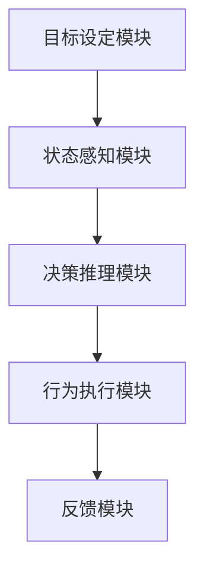
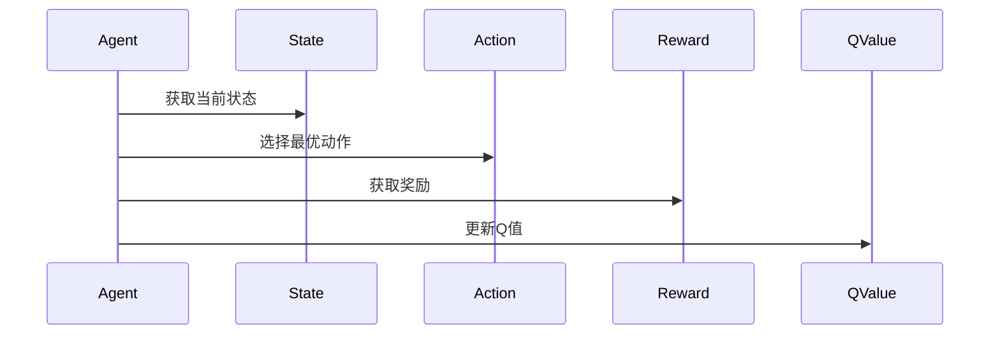

                 


# 设计AI Agent的目标导向行为系统

## 关键词：AI Agent、目标导向行为系统、强化学习、系统架构、算法实现

## 摘要：  
AI Agent的目标导向行为系统是实现智能体自主决策的核心技术。本文将从背景、核心概念、算法原理、系统架构到项目实战，全面解析目标导向行为系统的构建过程。通过强化学习算法、系统设计和实际案例，帮助读者理解并掌握设计AI Agent目标导向行为系统的方法和技巧。

---

# 第一部分: AI Agent与目标导向行为系统概述

## 第1章: AI Agent与目标导向行为系统概述

### 1.1 AI Agent的基本概念

#### 1.1.1 什么是AI Agent
AI Agent（人工智能代理）是指能够感知环境、自主决策并执行动作的智能实体。它可以是一个软件程序、机器人或其他智能系统，通过与环境交互来实现特定目标。

#### 1.1.2 AI Agent的分类
AI Agent可以根据智能水平、应用领域和决策方式分类：
- **基于规则的AI Agent**：根据预定义的规则执行动作，适用于简单任务。
- **基于模型的AI Agent**：使用内部模型推理环境状态，适用于复杂任务。
- **强化学习AI Agent**：通过与环境互动学习最优策略，适用于动态环境。
- **混合型AI Agent**：结合多种方法实现复杂行为。

#### 1.1.3 目标导向行为系统的重要性
目标导向行为系统是AI Agent的核心，它使智能体能够根据目标调整行为，适应环境变化。这种系统在自动驾驶、机器人、推荐系统等领域有广泛应用。

### 1.2 目标导向行为系统的背景与意义

#### 1.2.1 当前AI技术的发展现状
AI技术正快速发展，尤其在深度学习和强化学习领域。然而，大多数AI系统仍缺乏目标导向的能力，难以在动态环境中自主决策。

#### 1.2.2 目标导向行为系统的核心价值
目标导向行为系统使AI Agent具备以下能力：
- 根据目标调整行为策略。
- 通过环境反馈优化决策。
- 在复杂环境中自主学习和适应。

#### 1.2.3 系统在实际应用中的潜力
目标导向行为系统可应用于：
- **自动驾驶**：优化路径规划和避障。
- **机器人控制**：实现复杂任务的自主执行。
- **智能推荐**：根据用户需求动态调整推荐策略。

### 1.3 本章小结
本章介绍了AI Agent的基本概念和目标导向行为系统的重要性，为后续章节奠定了基础。

---

# 第二部分: 目标导向行为系统的理论基础

## 第2章: 目标设定与分解

### 2.1 目标设定的基本原理

#### 2.1.1 目标设定的层次结构
目标可以分为长期目标和短期目标：
- **长期目标**：高层次目标，如“完成任务”。
- **短期目标**：低层次目标，如“移动到目标位置”。

#### 2.1.2 目标分解的方法
将复杂目标分解为简单子目标，例如：
- **分解为子任务**：将“完成任务”分解为“准备资源”、“执行步骤”等。
- **优先级排序**：根据重要性确定执行顺序。

#### 2.1.3 目标优先级的确定
根据目标的重要性和紧急性，使用优先级排序方法确定执行顺序。

### 2.2 状态感知与环境交互

#### 2.2.1 状态感知的定义
状态感知是AI Agent对环境的感知能力，包括接收传感器数据和处理信息。

#### 2.2.2 环境模型的构建
构建环境模型，帮助AI Agent理解当前状态和可能的动作。

#### 2.2.3 状态更新的机制
根据新信息更新环境模型，确保AI Agent对环境的感知是最新的。

### 2.3 决策推理与行为规划

#### 2.3.1 决策推理的逻辑
基于当前状态和目标，推理出最优动作。

#### 2.3.2 行为规划的步骤
- **目标分解**：将长期目标分解为可执行的短期目标。
- **动作选择**：根据当前状态选择最优动作。
- **路径规划**：规划从当前状态到目标状态的动作序列。

#### 2.3.3 决策树的构建与应用
决策树是一种常用的行为规划方法，帮助AI Agent在复杂环境中做出决策。

### 2.4 行为执行与反馈优化

#### 2.4.1 行为执行的流程
- **动作选择**：根据决策结果选择动作。
- **动作执行**：将动作转化为实际操作。
- **结果反馈**：收集执行结果并更新状态。

#### 2.4.2 反馈机制的作用
通过反馈机制，AI Agent可以不断优化行为策略，提高决策的准确性。

#### 2.4.3 行为优化的策略
- **强化学习**：通过奖励机制优化行为。
- **经验回放**：通过存储历史经验优化决策。

### 2.5 本章小结
本章详细讲解了目标设定、状态感知、决策推理和行为执行的理论基础，为后续章节的算法实现奠定了基础。

---

# 第三部分: 目标导向行为系统的算法原理

## 第3章: 强化学习算法与目标导向行为

### 3.1 强化学习的基本原理

#### 3.1.1 强化学习的定义
强化学习是一种机器学习方法，通过智能体与环境的交互，学习最优策略。

#### 3.1.2 状态、动作、奖励的关系
- **状态(S)**：智能体所处的环境状态。
- **动作(A)**：智能体在状态S下采取的动作。
- **奖励(R)**：智能体在动作A后获得的反馈，用于指导学习。

#### 3.1.3 Q-learning算法的实现
Q-learning是一种经典的强化学习算法，通过Q值表学习最优策略。

### 3.2 目标导向行为的强化学习模型

#### 3.2.1 目标导向行为的数学模型
强化学习的目标是最大化累积奖励，数学模型如下：
$$ Q(s, a) \leftarrow Q(s, a) + \alpha (r + \gamma \max Q(s', a') - Q(s, a)) $$

其中：
- \( Q(s, a) \)：状态s下动作a的Q值。
- \( \alpha \)：学习率。
- \( r \)：奖励。
- \( \gamma \)：折扣因子。
- \( s' \)：下一个状态。

#### 3.2.2 算法的实现步骤
1. 初始化Q值表。
2. 与环境交互，获取状态、动作和奖励。
3. 更新Q值表，学习最优策略。
4. 重复步骤2-3，直到收敛。

#### 3.2.3 案例分析与代码实现
以下是一个简单的Q-learning实现示例：

```python
import numpy as np

# 初始化Q值表
Q = np.zeros((state_space, action_space))

# 参数设置
learning_rate = 0.1
gamma = 0.9

# Q-learning算法
def q_learning():
    for episode in range(episodes):
        state = initial_state
        for step in range(max_steps):
            action = choose_action(state)
            next_state, reward = get_feedback(state, action)
            Q[state, action] += learning_rate * (reward + gamma * np.max(Q[next_state, :]) - Q[state, action])
            state = next_state

q_learning()
```

### 3.3 算法优化与改进

#### 3.3.1 算法优化的必要性
传统的Q-learning算法存在收敛速度慢、容易陷入局部最优等问题。

#### 3.3.2 常用优化方法
- **经验回放**：通过存储历史经验，减少样本偏差。
- **策略迭代**：结合策略和价值函数，加速收敛。
- **分布式学习**：通过多智能体协作，提高学习效率。

#### 3.3.3 实验结果与分析
通过实验验证优化算法的有效性，例如：
- **收敛速度**：优化后的算法比传统方法快。
- **稳定性**：优化算法在复杂环境中表现更稳定。

### 3.4 本章小结
本章详细讲解了强化学习算法在目标导向行为系统中的应用，通过Q-learning算法和优化方法，帮助读者理解如何实现目标导向行为系统。

---

# 第四部分: 系统架构与实现方案

## 第4章: 系统架构设计

### 4.1 系统模块划分

#### 4.1.1 模块划分的原则
根据功能需求和交互关系，将系统划分为独立模块。

#### 4.1.2 各模块的功能描述
- **目标设定模块**：负责设定和分解目标。
- **状态感知模块**：负责感知环境状态。
- **决策推理模块**：负责推理和规划行为。
- **行为执行模块**：负责执行动作并反馈结果。

#### 4.1.3 模块之间的关系
模块之间的关系可以通过Mermaid图表示：



### 4.2 系统功能设计

#### 4.2.1 功能需求分析
根据目标导向行为系统的功能需求，设计系统功能模块。

#### 4.2.2 领域模型设计
领域模型可以通过Mermaid类图表示：

```mermaid
classDiagram
    class State
    class Action
    class Reward
    class QValue
    class Agent
        <<has>>
    Agent --> State
    Agent --> Action
    Agent --> Reward
    Agent --> QValue
```

#### 4.2.3 功能模块的实现
根据领域模型，实现各功能模块的代码。

### 4.3 系统架构实现

#### 4.3.1 架构设计的流程
1. 确定系统目标和功能需求。
2. 进行模块划分和交互设计。
3. 实现各模块的功能。
4. 集成模块，测试系统。

#### 4.3.2 架构实现的步骤
1. 初始化系统模块。
2. 实现目标设定模块。
3. 实现状态感知模块。
4. 实现决策推理模块。
5. 实现行为执行模块。
6. 集成各模块，进行系统测试。

#### 4.3.3 系统接口设计
系统接口设计需要考虑模块之间的交互，例如：
- **目标设定模块接口**：接收目标并分解为子目标。
- **状态感知模块接口**：返回当前环境状态。
- **决策推理模块接口**：根据状态和目标，推理最优动作。
- **行为执行模块接口**：执行动作并返回结果。

### 4.4 系统交互设计

#### 4.4.1 系统交互流程
系统交互流程可以通过Mermaid序列图表示：



#### 4.4.2 交互设计的注意事项
- **模块间通信**：确保模块之间的通信高效可靠。
- **错误处理**：设计完善的错误处理机制，确保系统鲁棒性。
- **性能优化**：优化模块间交互的效率，提升系统性能。

### 4.5 本章小结
本章详细讲解了目标导向行为系统的架构设计，包括模块划分、功能设计、系统接口和交互设计，为后续的项目实现奠定了基础。

---

## 第5章: 项目实战与总结

### 5.1 项目环境配置

#### 5.1.1 环境要求
- **Python**：3.6+
- **库依赖**：numpy、matplotlib
- **开发工具**：Jupyter Notebook、PyCharm

### 5.2 核心代码实现

#### 5.2.1 强化学习算法实现
以下是强化学习算法的实现代码：

```python
import numpy as np
import gym

# 初始化环境
env = gym.make('CartPole-v0')
env.seed(42)

# 参数设置
learning_rate = 0.01
gamma = 0.99
epsilon = 1.0
epsilon_min = 0.01
epsilon_decay = 0.995

# 初始化Q值表
Q = np.zeros([env.observation_space.shape[0], env.action_space.n])

# Q-learning算法实现
def q_learning(env):
    for episode in range(1000):
        state = env.reset()
        for t in range(200):
            # 选择动作
            if np.random.random() < epsilon:
                action = env.action_space.sample()
            else:
                action = np.argmax(Q[state])
            
            # 执行动作
            next_state, reward, done, _ = env.step(action)
            
            # 更新Q值表
            Q[state, action] += learning_rate * (reward + gamma * np.max(Q[next_state]) - Q[state, action])
            
            state = next_state
            if done:
                break
        
        # 逐渐减少epsilon
        epsilon = max(epsilon_min, epsilon * epsilon_decay)

q_learning(env)
```

#### 5.2.2 系统模块实现
以下是系统模块的实现代码：

```python
class Agent:
    def __init__(self, state_space, action_space):
        self.state_space = state_space
        self.action_space = action_space
        self.Q = np.zeros((state_space, action_space))
    
    def get_action(self, state):
        if np.random.random() < 0.01:
            return np.random.randint(self.action_space)
        else:
            return np.argmax(self.Q[state])
    
    def update_Q(self, state, action, reward, next_state):
        self.Q[state, action] += 0.1 * (reward + 0.99 * np.max(self.Q[next_state]) - self.Q[state, action])

# 初始化环境
env = gym.make('CartPole-v0')
agent = Agent(env.observation_space.shape[0], env.action_space.n)

# 训练过程
for episode in range(1000):
    state = env.reset()
    for t in range(200):
        action = agent.get_action(state)
        next_state, reward, done, _ = env.step(action)
        agent.update_Q(state, action, reward, next_state)
        state = next_state
        if done:
            break
```

### 5.3 案例分析与总结

#### 5.3.1 案例分析
以CartPole环境为例，训练AI Agent使其能够保持平衡。

#### 5.3.2 实验结果分析
通过训练，AI Agent能够逐渐掌握平衡杆的技巧，最终实现稳定控制。

#### 5.3.3 项目总结
- **优势**：目标导向行为系统使AI Agent具备自主决策能力。
- **挑战**：复杂环境中的行为规划和优化仍需进一步研究。
- **未来方向**：探索更高效的算法和优化方法，提升系统性能。

### 5.4 本章小结
本章通过实际项目案例，展示了目标导向行为系统的实现过程，并总结了经验与教训。

---

# 作者信息

**作者：AI天才研究院/AI Genius Institute & 禅与计算机程序设计艺术/Zen And The Art of Computer Programming**

---

以上是《设计AI Agent的目标导向行为系统》的完整目录大纲和内容结构，涵盖了从理论到实践的各个方面，帮助读者全面理解并掌握设计AI Agent目标导向行为系统的方法和技巧。

