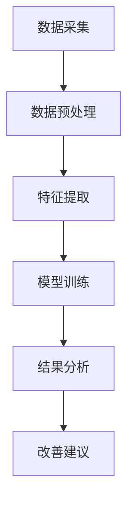
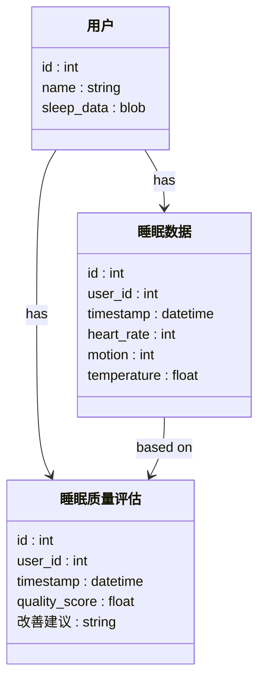
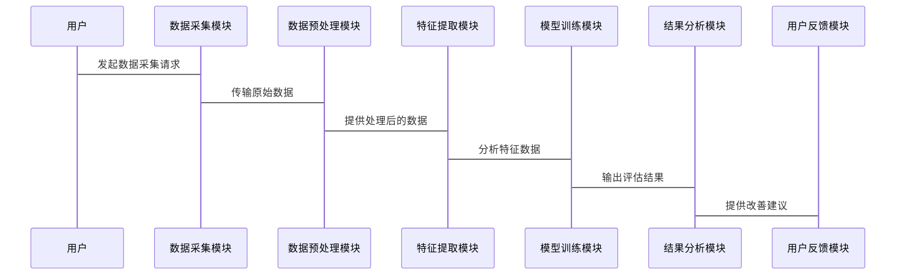

                 


# AI Agent在智能床垫中的睡眠质量评估

## 关键词：智能床垫，AI Agent，睡眠质量评估，数据采集，机器学习，睡眠健康

## 摘要：本文详细探讨了AI Agent在智能床垫中的应用，特别是在睡眠质量评估方面。通过分析智能床垫的数据采集、AI Agent的算法原理、系统架构设计以及实际项目案例，本文展示了如何利用AI技术提升睡眠健康监测的准确性和用户体验。

---

# 第一部分: AI Agent在智能床垫中的睡眠质量评估背景介绍

## 第1章: 背景与问题背景

### 1.1 问题背景

#### 1.1.1 睡眠健康的重要性
睡眠是人体健康的核心要素之一，直接影响人的精神状态、身体健康和生活质量。然而，现代生活节奏的加快和电子设备的普及，导致许多人面临睡眠质量下降的问题。睡眠障碍不仅影响个人健康，还可能引发更严重的健康问题，如心血管疾病和抑郁症。

#### 1.1.2 智能床垫的发展现状
智能床垫作为一种智能家居设备，通过集成多种传感器，能够实时监测用户的睡眠数据，如心率、呼吸频率、体动次数等。这些数据为睡眠质量的评估提供了丰富的信息。然而，如何有效地处理和分析这些数据，以提供个性化的睡眠改善建议，成为智能床垫技术发展的关键。

#### 1.1.3 AI Agent在睡眠评估中的作用
AI Agent（智能代理）是一种能够感知环境、自主决策并执行任务的智能系统。在智能床垫中，AI Agent可以通过机器学习算法分析用户的睡眠数据，识别睡眠周期、检测睡眠障碍，并提供个性化的睡眠改善建议。AI Agent的引入，使得智能床垫能够从被动的数据采集工具，转变为主动的健康助手。

### 1.2 问题描述

#### 1.2.1 睡眠质量评估的挑战
睡眠质量评估涉及多个复杂因素，如睡眠周期、深度睡眠时间、呼吸暂停次数等。传统的方法通常依赖人工记录和分析，这种方法不仅耗时，而且难以捕捉到实时数据。此外，不同用户的睡眠模式和需求也存在差异，这使得睡眠质量评估更加复杂。

#### 1.2.2 智能床垫数据的复杂性
智能床垫通过多种传感器（如加速度传感器、心率传感器、温度传感器等）采集用户的睡眠数据。这些数据具有高维度、高噪声的特点，直接分析和处理这些数据需要强大的计算能力和专业的算法支持。

#### 1.2.3 AI Agent在数据处理中的优势
AI Agent具有强大的数据处理能力和自主学习能力，能够实时分析智能床垫采集的睡眠数据，并根据用户的个体差异提供个性化的睡眠改善建议。AI Agent的核心优势在于其能够通过不断学习和优化，提高睡眠质量评估的准确性和实用性。

### 1.3 问题解决

#### 1.3.1 AI Agent的核心解决方案
AI Agent通过机器学习算法，对智能床垫采集的睡眠数据进行分析和处理，识别用户的睡眠模式和潜在的睡眠问题。AI Agent不仅能够提供实时的睡眠改善建议，还能够根据用户的反馈不断优化其算法模型，提高评估的准确性。

#### 1.3.2 数据采集与处理流程
智能床垫的数据采集流程包括传感器数据的采集、数据预处理和特征提取。AI Agent通过对这些数据的分析，识别出与睡眠质量相关的特征，并结合机器学习算法进行分类和预测。

#### 1.3.3 睡眠质量评估的实现路径
睡眠质量评估的实现路径包括数据采集、数据预处理、特征提取、模型训练和结果分析。AI Agent通过这些步骤，能够准确地评估用户的睡眠质量，并提供个性化的改善建议。

### 1.4 边界与外延

#### 1.4.1 AI Agent的功能边界
AI Agent的功能边界包括数据采集、数据处理、模型训练和结果分析。AI Agent的核心功能是通过对睡眠数据的分析，提供睡眠质量评估和改善建议，而不涉及其他领域（如身体健康监测）。

#### 1.4.2 智能床垫的适用场景
智能床垫适用于家庭和个人用户，主要用于监测用户的睡眠质量和提供改善建议。智能床垫还可以与其他智能家居设备联动，提供更加智能化的睡眠环境。

#### 1.4.3 睡眠质量评估的局限性
睡眠质量评估的局限性主要体现在数据采集的准确性、模型的泛化能力和用户隐私保护方面。此外，睡眠质量评估还需要结合用户的个体差异，这增加了模型优化的难度。

### 1.5 概念结构与核心要素

#### 1.5.1 AI Agent的组成要素
AI Agent的组成要素包括感知模块、决策模块和执行模块。感知模块负责采集数据，决策模块负责分析和处理数据，执行模块负责输出结果和建议。

#### 1.5.2 智能床垫的数据采集模块
智能床垫的数据采集模块包括多种传感器，如加速度传感器、心率传感器、温度传感器等。这些传感器能够实时采集用户的睡眠数据，并将其传输到AI Agent进行处理。

#### 1.5.3 睡眠质量评估的指标体系
睡眠质量评估的指标体系包括睡眠周期、深度睡眠时间、呼吸暂停次数、体动次数等。这些指标能够全面反映用户的睡眠质量，为AI Agent的评估提供依据。

---

## 第2章: 核心概念与联系

### 2.1 AI Agent的核心原理

#### 2.1.1 AI Agent的基本概念
AI Agent是一种能够感知环境、自主决策并执行任务的智能系统。在智能床垫中，AI Agent通过机器学习算法，分析用户的睡眠数据，提供个性化的睡眠改善建议。

#### 2.1.2 AI Agent的决策机制
AI Agent的决策机制基于机器学习算法，通过分析用户的睡眠数据，识别睡眠模式和潜在问题，并根据预设的规则提供改善建议。

#### 2.1.3 AI Agent的学习与优化
AI Agent通过不断学习和优化，提高睡眠质量评估的准确性和实用性。学习过程包括数据预处理、特征提取、模型训练和结果分析。

### 2.2 智能床垫的数据采集

#### 2.2.1 数据采集方式
智能床垫通过多种传感器采集用户的睡眠数据，包括加速度、心率、温度等。这些数据能够反映用户的睡眠状态和健康状况。

#### 2.2.2 数据类型与特征
睡眠数据的类型包括时间序列数据和分类数据。时间序列数据反映了用户的睡眠周期和深度睡眠时间，分类数据反映了用户的睡眠阶段和呼吸模式。

#### 2.2.3 数据预处理方法
数据预处理包括数据清洗、特征提取和数据标准化。通过数据预处理，可以提高AI Agent的分析效率和准确性。

### 2.3 核心概念对比

#### 2.3.1 AI Agent与传统算法的对比
AI Agent与传统算法的主要区别在于其自主学习和优化能力。AI Agent能够通过不断学习，提高睡眠质量评估的准确性，而传统算法则需要人工调整参数。

#### 2.3.2 智能床垫数据与其他健康数据的对比
智能床垫数据主要关注用户的睡眠状态和健康状况，而其他健康数据（如心率、血压等）则关注用户的整体健康状况。两者的结合可以提供更加全面的健康评估。

#### 2.3.3 睡眠质量评估指标的对比
睡眠质量评估指标包括睡眠周期、深度睡眠时间、呼吸暂停次数等。这些指标能够反映用户的睡眠健康状况，为AI Agent的评估提供依据。

### 2.4 ER实体关系图

```mermaid
erDiagram
    user {
        id : int
        name : string
        sleep_data : blob
    }
    sleep_data {
        id : int
        user_id : int
        timestamp : datetime
        heart_rate : int
        motion : int
        temperature : float
    }
    sleep_quality {
        id : int
        user_id : int
        timestamp : datetime
        quality_score : float
       改善建议 : string
    }
    user --> sleep_data : has
    user --> sleep_quality : has
    sleep_data --> sleep_quality : based on
```

---

## 第3章: 算法原理讲解

### 3.1 AI Agent的算法流程

#### 3.1.1 数据采集与预处理
AI Agent首先通过智能床垫采集用户的睡眠数据，并对其进行预处理，包括数据清洗和特征提取。

#### 3.1.2 特征提取与模型训练
通过特征提取，AI Agent能够识别出与睡眠质量相关的特征，并利用这些特征进行模型训练。

#### 3.1.3 模型优化与结果分析
AI Agent通过不断优化模型参数，提高睡眠质量评估的准确性，并根据评估结果提供改善建议。

### 3.2 算法流程图



### 3.3 算法实现

#### 3.3.1 数据预处理代码

```python
import pandas as pd
import numpy as np

# 读取数据
data = pd.read_csv('sleep_data.csv')

# 删除缺失值
data.dropna(inplace=True)

# 标准化数据
from sklearn.preprocessing import StandardScaler
scaler = StandardScaler()
scaled_data = scaler.fit_transform(data)
```

#### 3.3.2 特征提取代码

```python
from sklearn.decomposition import PCA

# PCA降维
pca = PCA(n_components=3)
principal_components = pca.fit_transform(scaled_data)
```

#### 3.3.3 模型训练代码

```python
from sklearn.ensemble import RandomForestClassifier
from sklearn.metrics import accuracy_score

# 训练模型
model = RandomForestClassifier()
model.fit(principal_components, labels)

# 模型预测
预测结果 = model.predict(principal_components)
```

#### 3.3.4 结果分析代码

```python
# 计算准确率
accuracy = accuracy_score(labels, 预测结果)
print("准确率:", accuracy)
```

### 3.4 算法的数学模型

#### 3.4.1 机器学习模型
随机森林算法是一种基于决策树的集成学习算法，具有较强的抗过拟合能力和分类能力。在本场景中，随机森林算法被用于睡眠质量的分类和预测。

#### 3.4.2 分类模型的数学表达
随机森林算法通过构建多个决策树，并对结果进行投票，最终得到分类结果。其数学表达如下：

$$
y = \text{多数投票}(\text{决策树}_1(x), \text{决策树}_2(x), \ldots, \text{决策树}_n(x))
$$

---

## 第4章: 系统分析与架构设计

### 4.1 项目介绍

#### 4.1.1 项目背景
本项目旨在通过AI Agent技术，提升智能床垫的睡眠质量评估能力，为用户提供个性化的睡眠改善建议。

#### 4.1.2 项目目标
项目的最终目标是通过智能床垫和AI Agent的结合，实现精准的睡眠质量评估，并为用户提供个性化的睡眠改善建议。

### 4.2 系统功能设计

#### 4.2.1 领域模型


#### 4.2.2 系统架构


#### 4.2.3 系统接口设计
系统接口设计包括数据采集接口、数据处理接口、模型训练接口和结果分析接口。每个接口的功能和通信方式需要明确设计，以确保系统的高效运行。

### 4.3 系统交互

#### 4.3.1 交互序列图


---

## 第5章: 项目实战

### 5.1 环境安装

#### 5.1.1 安装Python
Python 3.8或更高版本。

#### 5.1.2 安装TensorFlow和Keras
使用pip安装：
```bash
pip install tensorflow keras
```

#### 5.1.3 安装其他依赖
安装数据处理和可视化库：
```bash
pip install pandas numpy matplotlib
```

### 5.2 系统核心实现

#### 5.2.1 数据采集与预处理
```python
import pandas as pd
import numpy as np

# 读取数据
data = pd.read_csv('sleep_data.csv')

# 删除缺失值
data.dropna(inplace=True)

# 标准化数据
from sklearn.preprocessing import StandardScaler
scaler = StandardScaler()
scaled_data = scaler.fit_transform(data)
```

#### 5.2.2 特征提取与模型训练
```python
from sklearn.decomposition import PCA

# PCA降维
pca = PCA(n_components=3)
principal_components = pca.fit_transform(scaled_data)

# 训练模型
from sklearn.ensemble import RandomForestClassifier
model = RandomForestClassifier()
model.fit(principal_components, labels)
```

#### 5.2.3 结果分析与改善建议
```python
# 模型预测
预测结果 = model.predict(principal_components)

# 计算准确率
accuracy = accuracy_score(labels, 预测结果)
print("准确率:", accuracy)

# 提供改善建议
if accuracy < 0.8:
    print("建议调整睡眠环境或咨询医生")
else:
    print("睡眠质量良好，继续保持")
```

### 5.3 项目总结

#### 5.3.1 项目成果
通过本项目的实施，AI Agent能够准确评估用户的睡眠质量，并提供个性化的改善建议。

#### 5.3.2 项目意义
AI Agent在智能床垫中的应用，不仅提升了睡眠质量评估的准确性，还为用户提供了更加智能化的睡眠健康监测服务。

---

## 第6章: 最佳实践

### 6.1 小结

通过本文的详细讲解，我们可以看到AI Agent在智能床垫中的应用具有广阔的前景。AI Agent不仅能够提升睡眠质量评估的准确性，还能够为用户提供个性化的睡眠改善建议。

### 6.2 注意事项

在实际应用中，需要注意以下几点：
- 数据隐私保护
- 模型的泛化能力
- 用户反馈的及时性

### 6.3 拓展阅读

- 《Deep Learning》 —— Ian Goodfellow
- 《机器学习实战》 —— 周志华
- 《智能系统与人工智能》 —— 李航

---

# 作者：AI天才研究院/AI Genius Institute & 禅与计算机程序设计艺术 /Zen And The Art of Computer Programming

