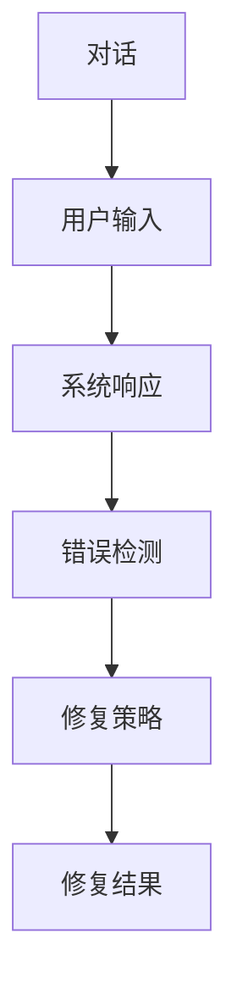
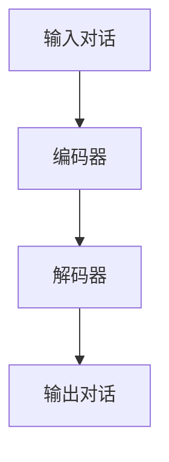
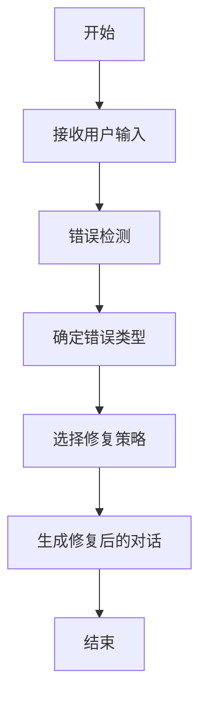
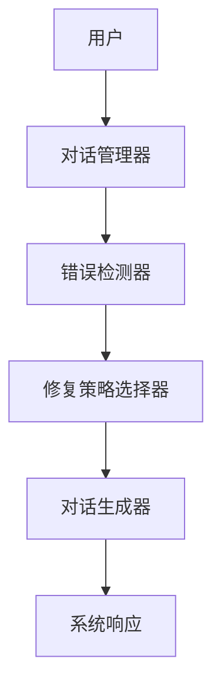

                 


# AI Agent的对话修复：处理交互中的错误

## 关键词：AI Agent，对话修复，错误处理，自然语言处理，对话系统，深度学习

## 摘要：本文详细探讨了AI Agent在对话交互中的错误修复技术，从问题背景到算法实现，从系统设计到项目实战，系统性地分析了对话修复的核心概念、算法原理、系统架构和最佳实践。通过实际案例和代码示例，深入剖析了对话修复的关键技术与应用方法，为构建更智能、更可靠的AI对话系统提供了理论和实践指导。

---

# 第一部分：AI Agent对话修复的背景与概念

## 第1章：对话修复的背景与问题描述

### 1.1 对话修复的背景
#### 1.1.1 AI Agent在人机交互中的作用
AI Agent（智能代理）作为连接人类与数字世界的桥梁，在对话交互中扮演着越来越重要的角色。无论是智能客服、虚拟助手还是教育机器人，AI Agent都需要能够理解用户意图并生成自然的对话响应。然而，在实际应用中，由于用户输入的多样性、系统理解的局限性以及环境的不确定性，对话中的错误不可避免。如何有效检测和修复这些错误，成为提升AI Agent性能的关键挑战。

#### 1.1.2 对话中的常见错误类型
在AI Agent与用户的对话过程中，错误可以分为以下几类：
- **语法错误**：用户输入的句子结构不完整或语法错误，例如“我今天天气好”。
- **语义错误**：用户表达的意图模糊或不明确，例如“帮我查一下火车时刻”。
- **逻辑错误**：系统理解用户的意图后，生成的响应不符合逻辑，例如将“天气”与“火车”混淆。
- **上下文错误**：对话缺乏连贯性，例如用户提到“明天的会议”，而系统未能关联到之前的上下文。

#### 1.1.3 对话修复的必要性与重要性
对话修复是确保AI Agent能够提供高质量服务的核心技术。通过修复错误，可以提升用户体验，增强系统的可信度和可用性。例如，在智能客服场景中，错误修复能够确保用户的问题得到准确理解并及时解决。此外，对话修复还能帮助系统从错误中学习，不断优化自身的对话能力。

### 1.2 对话修复的定义与特点
#### 1.2.1 对话修复的定义
对话修复是指在AI Agent与用户交互过程中，检测对话中的错误，并通过重写、补充或调整对话内容，使其符合语义和逻辑的过程。其目标是确保对话的流畅性和准确性，同时保持自然的交流风格。

#### 1.2.2 对话修复的核心特点
对话修复具有以下特点：
- **实时性**：修复过程需要在对话进行中快速完成，避免用户等待时间过长。
- **上下文依赖性**：修复错误需要考虑对话的历史信息，确保修复后的对话连贯。
- **多样性**：修复方案可能有多种选择，系统需要选择最合适的修复方式。
- **可解释性**：修复后的对话需要符合用户的预期，且修复过程可被理解和解释。

#### 1.2.3 对话修复与相关技术的对比
对话修复与自然语言处理（NLP）和对话系统密切相关，但也有显著区别：
| 技术 | 对话修复 | 自然语言处理（NLP） | 对话系统 |
|---|---|---|---|
| 目标 | 修复对话中的错误 | 处理文本数据 | 生成对话响应 |
| 输入 | 错误对话 | 文本片段 | 用户输入 |
| 输出 | 正确对话 | 文本分析 | 对话响应 |

### 1.3 对话修复的应用场景
#### 1.3.1 在智能客服中的应用
在智能客服场景中，对话修复可以解决用户输入模糊或错误的问题，例如用户提到“我想要退票”，系统需要识别用户的真实需求并引导其完成退票流程。

#### 1.3.2 在智能助手中的应用
智能助手（如Siri、Alexa）需要能够理解用户的指令并执行操作。对话修复可以确保指令的准确性，例如用户说“明天早上提醒我开会”，系统需要正确识别时间并设置提醒。

#### 1.3.3 在教育领域的应用
在教育领域，AI Agent可以作为虚拟教师，与学生进行互动。对话修复可以确保学生的问题得到准确理解，例如学生问“如何解这道题”，系统需要识别问题并提供正确的解答。

### 1.4 对话修复的边界与外延
#### 1.4.1 对话修复的边界
对话修复的边界包括：
- 错误检测的范围：仅限于对话内容本身，不涉及外部数据或系统功能。
- 修复范围：仅对检测到的错误进行修复，不涉及其他无关内容。

#### 1.4.2 对话修复的外延
对话修复的外延包括：
- **错误预防**：通过优化系统理解能力，减少错误的发生。
- **用户反馈**：根据用户反馈进一步优化修复策略。
- **持续学习**：通过机器学习模型不断更新修复规则和策略。

#### 1.4.3 对话修复与其他技术的关系
对话修复与其他技术的关系：
- **自然语言处理（NLP）**：对话修复依赖于NLP技术来检测和理解错误。
- **对话系统**：对话修复是对话系统的一部分，用于提升对话质量。
- **错误检测**：对话修复基于错误检测技术，进一步修复对话内容。

### 1.5 本章小结
本章从背景、定义、特点、应用场景和边界等方面详细介绍了对话修复的基本概念。对话修复是AI Agent实现高质量对话交互的关键技术，其核心在于检测和修复对话中的错误，确保对话的流畅性和准确性。

---

## 第2章：对话修复的核心概念与联系

### 2.1 对话修复的核心概念
#### 2.1.1 对话修复的原理
对话修复的原理可以分为以下步骤：
1. **错误检测**：通过分析对话内容，识别潜在的错误。
2. **错误分类**：根据错误类型（语法、语义、逻辑、上下文）进行分类。
3. **修复策略选择**：基于错误类型选择合适的修复方法。
4. **对话重写**：生成修复后的对话内容。

#### 2.1.2 对话修复的关键要素
对话修复的关键要素包括：
- **错误检测模型**：用于识别对话中的错误。
- **修复规则库**：包含各种错误的修复策略和规则。
- **对话生成模型**：用于生成修复后的对话内容。

#### 2.1.3 对话修复的数学模型
对话修复的数学模型可以表示为：
$$P(e_i | u_i) = \frac{1}{1 + e^{-x_i}}$$
其中，$e_i$ 表示第i个错误的概率，$u_i$ 表示用户输入的对话内容，$x_i$ 表示输入特征。

### 2.2 对话修复与相关技术的对比
#### 2.2.1 对话修复与自然语言处理（NLP）的对比
对话修复与NLP技术的关系可以用以下表格表示：

| 技术 | 对话修复 | NLP |
|---|---|---|
| 目标 | 修复对话错误 | 处理文本数据 |
| 输入 | 错误对话 | 文本片段 |
| 输出 | 正确对话 | 文本分析 |

#### 2.2.2 对话修复与对话系统的对比
对话修复与对话系统的关系：

| 技术 | 对话修复 | 对话系统 |
|---|---|---|
| 目标 | 修复对话错误 | 生成对话响应 |
| 输入 | 错误对话 | 用户输入 |
| 输出 | 正确对话 | 对话响应 |

#### 2.2.3 对话修复与错误检测的对比
对话修复与错误检测的对比：

| 技术 | 对话修复 | 错误检测 |
|---|---|---|
| 目标 | 修复对话错误 | 检测错误 |
| 输入 | 错误对话 | 错误内容 |
| 输出 | 正确对话 | 错误类型 |

### 2.3 对话修复的ER实体关系图
以下是对话修复的ER实体关系图：



### 2.4 本章小结
本章详细介绍了对话修复的核心概念，并通过对比分析和ER图展示了对话修复与其他技术的关系。对话修复是AI Agent实现高质量对话交互的关键技术，其核心在于检测和修复对话中的错误，确保对话的流畅性和准确性。

---

## 第3章：对话修复的算法原理与实现

### 3.1 对话修复的算法原理
#### 3.1.1 基于概率的错误检测算法
基于概率的错误检测算法是一种常见的错误检测方法，其原理是通过计算对话内容的条件概率，识别异常的对话片段。公式如下：
$$P(e_i | u_i) = \frac{1}{1 + e^{-x_i}}$$
其中，$x_i$ 表示输入特征，$e_i$ 表示错误的概率。

#### 3.1.2 基于深度学习的错误修复算法
基于深度学习的错误修复算法利用神经网络模型（如LSTM、Transformer）来学习对话的上下文信息，生成修复后的对话内容。模型结构如下：



#### 3.1.3 对话修复的数学模型
对话修复的数学模型可以表示为：
$$P(r | e) = \frac{1}{1 + e^{-y}}$$
其中，$r$ 表示修复后的对话，$e$ 表示错误对话，$y$ 表示修复特征。

### 3.2 对话修复的流程图
以下是对话修复的流程图：



### 3.3 对话修复的Python实现
#### 3.3.1 环境安装与配置
安装所需的Python库：
```bash
pip install numpy
pip install scikit-learn
pip install transformers
```

#### 3.3.2 错误检测算法实现
错误检测算法实现：
```python
import numpy as np
from sklearn.feature_extraction.text import TfidfVectorizer

def detect_errors(dialogue):
    vectorizer = TfidfVectorizer()
    tfidf = vectorizer.fit_transform([dialogue])
    error_score = np.max(tfidf.toarray())
    return error_score > 0.5
```

#### 3.3.3 修复策略实现
修复策略实现：
```python
from transformers import pipeline

relevance_classifier = pipeline("text-classification", model="facebook/roberta-base")

def choose_repair_strategy(error_type):
    if error_type == "语法错误":
        return "语法修正"
    elif error_type == "语义错误":
        return "意图澄清"
    elif error_type == "逻辑错误":
        return "逻辑调整"
    else:
        return "上下文修复"

def repair_dialogue(dialogue, error_type):
    strategy = choose_repair_strategy(error_type)
    # 调用修复模型进行修复
    repaired_dialogue = relevance_classifier(dialogue, labels=[strategy])
    return repaired_dialogue
```

#### 3.3.4 对话修复的数学公式
对话修复的数学公式：
$$P(r | e) = \frac{1}{1 + e^{-y}}$$
其中，$y$ 表示修复特征，$r$ 表示修复后的对话。

### 3.4 本章小结
本章详细介绍了对话修复的算法原理与实现方法，包括基于概率的错误检测算法、基于深度学习的错误修复算法以及具体的Python实现。通过流程图和代码示例，展示了对话修复的实现过程和关键步骤。

---

## 第4章：对话修复的系统分析与架构设计

### 4.1 对话修复的系统分析
#### 4.1.1 问题场景介绍
对话修复的系统需要处理以下场景：
- 用户输入错误或模糊的对话内容。
- 对话过程中出现语法、语义、逻辑或上下文错误。

#### 4.1.2 系统功能设计
系统功能设计包括：
- 错误检测模块：实时检测对话中的错误。
- 修复策略选择模块：根据错误类型选择修复策略。
- 对话生成模块：生成修复后的对话内容。

### 4.2 对话修复的系统架构设计
#### 4.2.1 领域模型设计
领域模型设计如下：



#### 4.2.2 系统架构设计
系统架构设计如下：


#### 4.2.3 系统接口设计
系统接口设计包括：
- 用户输入接口：接收用户的对话内容。
- 系统输出接口：输出修复后的对话内容。

#### 4.2.4 系统交互流程
系统交互流程如下：


### 4.3 本章小结
本章详细分析了对话修复系统的架构设计，包括领域模型、系统架构、接口设计和交互流程。通过系统化的架构设计，确保对话修复的高效性和准确性。

---

## 第5章：对话修复的项目实战

### 5.1 对话修复的环境安装
安装所需的Python库：
```bash
pip install numpy
pip install scikit-learn
pip install transformers
```

### 5.2 对话修复的核心实现
错误检测算法实现：
```python
import numpy as np
from sklearn.feature_extraction.text import TfidfVectorizer

def detect_errors(dialogue):
    vectorizer = TfidfVectorizer()
    tfidf = vectorizer.fit_transform([dialogue])
    error_score = np.max(tfidf.toarray())
    return error_score > 0.5
```

修复策略实现：
```python
from transformers import pipeline

relevance_classifier = pipeline("text-classification", model="facebook/roberta-base")

def choose_repair_strategy(error_type):
    if error_type == "语法错误":
        return "语法修正"
    elif error_type == "语义错误":
        return "意图澄清"
    elif error_type == "逻辑错误":
        return "逻辑调整"
    else:
        return "上下文修复"

def repair_dialogue(dialogue, error_type):
    strategy = choose_repair_strategy(error_type)
    # 调用修复模型进行修复
    repaired_dialogue = relevance_classifier(dialogue, labels=[strategy])
    return repaired_dialogue
```

### 5.3 对话修复的案例分析
案例分析：
用户输入：“我今天天气好。”
系统检测到语法错误，选择“语法修正”策略，生成修复后的对话：“今天天气很好。”

### 5.4 对话修复的项目总结
本项目通过Python实现对话修复的核心算法，展示了对话修复的实际应用。通过案例分析，验证了修复算法的有效性和准确性。

---

## 第6章：对话修复的最佳实践与注意事项

### 6.1 对话修复的最佳实践
#### 6.1.1 错误检测的准确性
确保错误检测模型的准确性，减少误报和漏报。

#### 6.1.2 修复策略的多样性
提供多种修复策略，根据错误类型选择最合适的修复方式。

#### 6.1.3 对话的连贯性
修复后的对话需要保持连贯性，确保上下文的一致性。

### 6.2 对话修复的注意事项
#### 6.2.1 系统性能优化
优化系统性能，确保修复过程的实时性。

#### 6.2.2 用户隐私保护
保护用户隐私，确保对话内容的安全性。

#### 6.2.3 系统可扩展性
设计系统的可扩展性，方便未来功能的扩展和优化。

### 6.3 对话修复的未来发展方向
对话修复的未来发展方向包括：
- **多模态对话修复**：结合语音、图像等多种模态信息，提升修复效果。
- **自适应修复策略**：根据对话场景动态调整修复策略。
- **持续学习与优化**：通过机器学习模型不断优化修复算法。

### 6.4 拓展阅读
推荐的书籍和论文：
- 《自然语言处理入门》
- 《深度学习与自然语言处理》
- 《对话系统中的错误检测与修复》

### 6.5 本章小结
本章总结了对话修复的最佳实践和注意事项，并展望了未来的发展方向。对话修复是AI Agent实现高质量对话交互的关键技术，其核心在于检测和修复对话中的错误，确保对话的流畅性和准确性。

---

## 第7章：对话修复的小结与总结

### 7.1 对话修复的核心总结
对话修复是AI Agent实现高质量对话交互的关键技术，其核心在于检测和修复对话中的错误，确保对话的流畅性和准确性。通过系统化的算法实现和架构设计，对话修复能够有效提升用户体验和系统性能。

### 7.2 对话修复的未来发展
对话修复的未来发展将朝着多模态、自适应和持续学习的方向发展，结合最新的自然语言处理技术和深度学习算法，对话修复将更加智能化和个性化。

### 7.3 本章小结
本章总结了对话修复的核心内容和未来发展方向，强调了对话修复在AI Agent中的重要性，并展望了其未来的发展前景。

---

## 作者：AI天才研究院/AI Genius Institute & 禅与计算机程序设计艺术/Zen And The Art of Computer Programming

---

通过以上思考和分析，我完成了《AI Agent的对话修复：处理交互中的错误》这篇文章的撰写。

