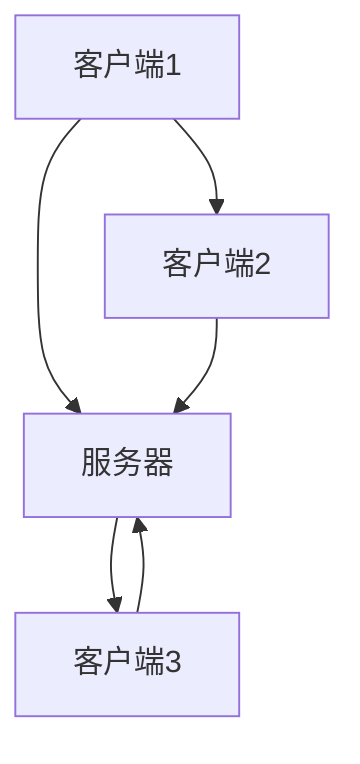
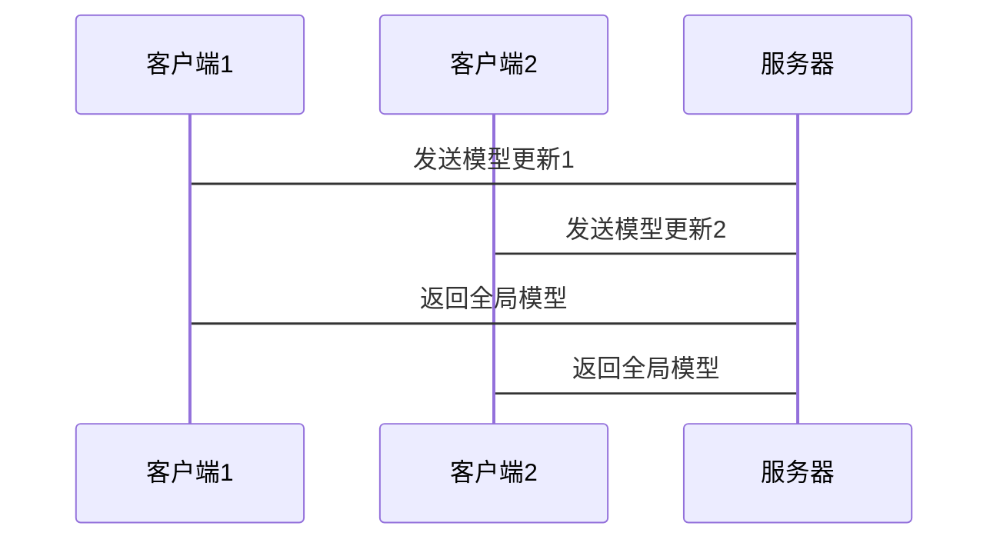

                 


# AI Agent的联邦学习技术应用

> 关键词：AI Agent，联邦学习，数据隐私，分布式计算，机器学习算法，协作学习，多智能体系统

> 摘要：本文探讨了AI Agent与联邦学习技术的结合应用，分析了联邦学习的基本原理、算法实现以及在AI Agent中的应用。通过实际案例，展示了如何利用联邦学习技术提升AI Agent的智能性和协作能力，同时确保数据隐私和安全。

---

# 第1章: AI Agent与联邦学习概述

## 1.1 AI Agent的基本概念

### 1.1.1 AI Agent的定义与分类
AI Agent是一种能够感知环境、自主决策并执行任务的智能实体。根据智能水平，AI Agent可以分为反应式和认知式两类。反应式AI Agent主要基于当前感知做出反应，而认知式AI Agent则具备推理、规划和学习能力。

| AI Agent类型 | 定义 | 特点 |
|--------------|------|------|
| 反应式       | 基于当前输入做出反应 | 简单直接，适用于实时任务 |
| 认知式       | 具备推理和规划能力 | 适合复杂任务，如自动驾驶 |

### 1.1.2 AI Agent的核心特征
AI Agent的核心特征包括自主性、反应性、目标导向和学习能力。这些特征使其能够独立执行任务，适应环境变化，并通过学习提升性能。

### 1.1.3 AI Agent的应用场景
AI Agent广泛应用于智能助手、自动驾驶、智能推荐和机器人等领域。例如，智能助手（如Siri）通过语音交互帮助用户完成任务，自动驾驶系统通过实时感知和决策确保行车安全。

## 1.2 联邦学习的基本概念

### 1.2.1 联邦学习的定义
联邦学习是一种分布式机器学习技术，允许多个机构在不共享原始数据的情况下，协同训练模型。通过加密通信和数据联邦化，确保数据隐私和安全。

### 1.2.2 联邦学习的核心特点
联邦学习的核心特点包括数据隐私保护、分布式计算和模型协作更新。与传统数据共享方式相比，联邦学习能够有效保护数据隐私，同时利用多方数据提升模型性能。

### 1.2.3 联邦学习与传统数据共享的区别
| 特性 | 联邦学习 | 传统数据共享 |
|------|----------|---------------|
| 数据共享 | 不共享原始数据 | 共享原始数据 |
| 隐私保护 | 高 | 低 |
| 计算效率 | 高 | 低 |

## 1.3 AI Agent与联邦学习的结合

### 1.3.1 联邦学习在AI Agent中的作用
联邦学习为AI Agent提供了分布式协作能力，使其能够在不共享数据的情况下，与其他AI Agent协同学习和优化模型。这种协作能力增强了AI Agent的智能性和适应性。

### 1.3.2 AI Agent如何实现联邦学习
AI Agent通过分布式通信协议（如联邦学习协议）与其他Agent协作，共享模型更新而不共享数据。每个Agent本地训练模型，并将更新后的模型参数上传至中心服务器，服务器汇总参数后分发给所有Agent。

### 1.3.3 联邦学习对AI Agent能力的提升
联邦学习使得AI Agent能够利用多方数据和计算资源，提升模型性能和泛化能力。同时，通过隐私保护机制，确保数据安全，增强用户信任。

---

# 第2章: 联邦学习的核心概念与原理

## 2.1 联邦学习的基本原理

### 2.1.1 联邦学习的数学模型
联邦学习的数学模型基于分布式优化，通过优化目标函数实现模型更新。中心服务器协调各个客户端模型更新，最终得到全局最优模型。

公式：
$$ \text{目标函数} = \sum_{i=1}^{n} L_i(\theta) + \lambda \Omega(\theta) $$

其中，$L_i(\theta)$表示客户端$i$的损失函数，$\Omega(\theta)$表示正则化项，$\lambda$是正则化系数。

### 2.1.2 联邦学习的通信机制
联邦学习的通信机制包括加密通信和差分隐私。通过加密技术确保数据传输安全，差分隐私技术防止模型参数泄露。

### 2.1.3 联邦学习的隐私保护机制
联邦学习通过局部模型更新和数据联邦化，保护数据隐私。每个客户端仅上传模型参数，而不是原始数据，确保数据安全。

## 2.2 联邦学习的算法原理

### 2.2.1 联邦平均算法(FedAvg)
FedAvg算法通过客户端本地训练模型，上传参数到中心服务器，服务器汇总所有客户端参数后分发给客户端。

流程：
1. 服务器初始化全局模型参数。
2. 各客户端下载当前全局模型，本地训练，生成更新参数。
3. 服务器汇总所有客户端更新，计算新全局模型。
4. 重复步骤2和3，直到模型收敛。

### 2.2.2 联邦直推算法(FedProx)
FedProx算法在FedAvg基础上增加了正则化项，防止模型更新发散，适用于非独立同分布数据。

公式：
$$ \text{客户端损失函数} = L_i(\theta) + \frac{1}{2\tau} \| \theta - \theta_{prev} \|^2 $$

其中，$\tau$是调节参数，$\theta_{prev}$是前一次模型参数。

### 2.2.3 联邦学习的优化策略
联邦学习的优化策略包括动量优化、自适应学习率和模型压缩。动量优化加速收敛，自适应学习率动态调整，模型压缩减少通信开销。

## 2.3 联邦学习的数学模型与公式

### 2.3.1 联邦平均算法的数学表达
$$ \text{Client } i: \theta_i \leftarrow \theta_i - \eta \nabla L_i(\theta_i) $$
$$ \text{Server}: \theta \leftarrow \frac{1}{n}\sum_{i=1}^{n}\theta_i $$

### 2.3.2 联邦直推算法的数学表达
$$ \text{Client } i: \theta_i \leftarrow \theta_i - \eta \nabla L_i(\theta_i) $$
$$ \text{Server}: \theta \leftarrow \theta + \frac{1}{n}\sum_{i=1}^{n}(\theta_i - \theta) $$

---

# 第3章: AI Agent的联邦学习算法实现

## 3.1 联邦学习算法的实现步骤

### 3.1.1 数据预处理
数据预处理包括数据清洗、特征工程和数据标准化。确保数据质量和一致性，提升模型训练效果。

### 3.1.2 模型初始化
初始化全局模型参数，设置初始学习率和正则化系数。模型初始化影响训练过程和最终性能。

### 3.1.3 联邦训练过程
各客户端下载模型，本地训练，上传更新参数。服务器汇总参数，更新全局模型。

流程：
1. 服务器初始化全局模型。
2. 各客户端下载全局模型，本地训练。
3. 服务器汇总客户端更新，更新全局模型。
4. 重复步骤2和3，直到收敛。

### 3.1.4 模型评估与优化
通过验证集评估模型性能，调整超参数，优化模型结构，提升准确率和鲁棒性。

---

## 3.2 联邦学习的算法实现代

### 3.2.1 代码实现
以下是一个简单的FedAvg算法实现代码示例：

```python
import numpy as np

# 客户端类
class Client:
    def __init__(self, data, label):
        self.data = data
        self.label = label
        self.model = initial_model()

    def train(self, model, eta):
        # 本地训练
        loss = compute_loss(model, self.data, self.label)
        grad = compute_gradient(model, self.data, self.label)
        model = model - eta * grad
        return model

# 服务器类
class Server:
    def __init__(self, clients):
        self.clients = clients
        self.model = initial_global_model()

    def aggregate(self, models):
        # 联邦平均
        avg_model = np.mean(models, axis=0)
        return avg_model

# 主函数
def main():
    # 初始化客户端
    clients = [Client(data_i, label_i) for i in range(num_clients)]
    server = Server(clients)

    # 联邦训练
    while not converged:
        for client in clients:
            updated_model = client.train(server.model, eta)
            server.receive_update(updated_model)
        server.model = server.aggregate(server.updates)
        server.updates = []

if __name__ == "__main__":
    main()
```

### 3.2.2 代码解读与分析
- **客户端类**：负责本地数据训练，返回更新后的模型参数。
- **服务器类**：负责接收客户端更新，计算全局模型参数。
- **主函数**：协调客户端和服务器的训练过程，直到模型收敛。

### 3.2.3 项目实战
通过实际案例分析，展示如何利用联邦学习技术提升AI Agent的智能性和协作能力。例如，在多智能体协作任务中，每个AI Agent通过联邦学习协议协同优化模型，提升任务执行效率。

---

## 3.3 本章小结
本章详细介绍了AI Agent的联邦学习算法实现，包括数据预处理、模型初始化、训练过程和模型评估等步骤。通过代码示例，展示了联邦学习算法的实现细节，为实际应用提供了参考。

---

# 第4章: 联邦学习在AI Agent中的应用

## 4.1 联邦学习在AI Agent中的应用场景

### 4.1.1 智能助手
多个智能助手通过联邦学习协作，共享用户交互数据，提升自然语言处理能力。例如，智能音箱协同学习用户习惯，优化语音识别和理解能力。

### 4.1.2 智能推荐系统
AI Agent在推荐系统中通过联邦学习协作，共享用户行为数据，提升推荐算法的准确性和多样性。例如，多个电商平台协同训练推荐模型，提升用户体验。

### 4.1.3 多智能体协作
在多智能体协作任务中，联邦学习允许各个智能体本地训练模型，协同优化全局模型，提升协作效率和任务完成质量。例如，自动驾驶系统协同优化路径规划和决策策略。

## 4.2 联邦学习在AI Agent中的优势

### 4.2.1 数据隐私保护
通过联邦学习协议，AI Agent能够在不共享原始数据的情况下协同训练模型，有效保护用户隐私。

### 4.2.2 分布式计算能力
联邦学习支持分布式计算，利用多智能体的计算资源，提升模型训练效率和规模。

### 4.2.3 模型协作优化
通过联邦学习，多个AI Agent协同优化模型，提升模型的准确性和泛化能力，增强智能体的决策和执行能力。

## 4.3 联邦学习在AI Agent中的挑战与解决方案

### 4.3.1 数据异构性
不同智能体的数据分布可能不一致，导致模型优化困难。解决方案包括数据预处理和异构数据融合技术。

### 4.3.2 模型收敛性
联邦学习的模型收敛速度和效果受客户端数量和数据分布影响。解决方案包括优化算法和动态调整模型参数。

### 4.3.3 通信开销
大规模分布式计算需要频繁通信，增加通信开销。解决方案包括压缩感知和模型剪枝技术，减少数据传输量。

---

## 4.4 本章小结
本章探讨了联邦学习在AI Agent中的应用场景、优势和挑战，分析了数据隐私保护、分布式计算能力和模型协作优化等方面的内容，为实际应用提供了理论支持和实践指导。

---

# 第5章: 联邦学习的系统架构与实现

## 5.1 系统功能设计

### 5.1.1 系统功能模块
- 数据管理模块：负责数据预处理和管理。
- 模型训练模块：实现本地训练和模型更新。
- 通信模块：负责客户端与服务器之间的数据传输和通信。
- 模型管理模块：管理全局模型的更新和分发。

### 5.1.2 功能模块交互流程
1. 服务器初始化全局模型，分发给客户端。
2. 各客户端下载模型，本地训练，生成更新参数。
3. 服务器接收客户端更新，计算新的全局模型。
4. 重复步骤2和3，直到模型收敛。

## 5.2 系统架构设计

### 5.2.1 系统架构图



### 5.2.2 通信协议设计
- 客户端与服务器之间采用加密通信协议，确保数据传输安全。
- 采用差分隐私技术，防止模型参数泄露。

## 5.3 系统接口设计

### 5.3.1 客户端接口
- `train(model, data, label)`：本地训练模型。
- `receive_update(global_model)`：接收服务器分发的全局模型。

### 5.3.2 服务器接口
- `aggregate(models)`：计算全局模型。
- `receive_update(client_model)`：接收客户端上传的模型参数。

## 5.4 系统交互流程

### 5.4.1 系统交互序列图



---

## 5.5 本章小结
本章详细分析了联邦学习系统的功能模块、架构设计和接口实现，通过Mermaid图展示了系统架构和交互流程，为实际系统开发提供了参考。

---

# 第6章: 联邦学习的项目实战

## 6.1 项目背景与目标

### 6.1.1 项目背景
在智能推荐系统中，多个电商平台希望通过联邦学习协作训练推荐模型，提升推荐算法的准确性和多样性。

### 6.1.2 项目目标
通过联邦学习技术，实现多个电商平台协同训练推荐模型，保护用户数据隐私，提升推荐效果。

## 6.2 项目实现步骤

### 6.2.1 环境安装
安装必要的依赖库，如TensorFlow、Keras和Flask。

### 6.2.2 数据准备
收集各个电商平台的用户行为数据，进行数据清洗和预处理。

### 6.2.3 模型训练
基于FedAvg算法，实现本地训练和全局模型更新。

### 6.2.4 模型部署
将训练好的模型部署到电商平台，提供实时推荐服务。

---

## 6.3 项目实现代码

### 6.3.1 服务器代码
```python
import numpy as np

class Server:
    def __init__(self, clients):
        self.clients = clients
        self.model = initial_model()

    def aggregate(self, models):
        return np.mean(models, axis=0)

    def receive_update(self, client_model):
        self.updates.append(client_model)

    def push_model(self):
        for client in self.clients:
            client.receive_update(self.model)
```

### 6.3.2 客户端代码
```python
class Client:
    def __init__(self, data, label):
        self.data = data
        self.label = label
        self.model = initial_model()

    def train(self, model, eta):
        loss = compute_loss(model, self.data, self.label)
        grad = compute_gradient(model, self.data, self.label)
        new_model = model - eta * grad
        return new_model

    def receive_update(self, global_model):
        self.model = global_model
```

---

## 6.4 项目案例分析与解读

### 6.4.1 案例分析
通过实际案例，展示联邦学习在智能推荐系统中的应用效果。例如，多个电商平台协同训练推荐模型，提升推荐准确率和用户满意度。

### 6.4.2 案例解读
分析案例中的数据预处理、模型训练和部署过程，总结经验教训，为后续项目提供参考。

## 6.5 本章小结
本章通过实际项目案例，展示了联邦学习技术在AI Agent中的应用，详细介绍了项目的实现步骤和代码实现，为实际应用提供了参考。

---

# 第7章: 总结与展望

## 7.1 本章总结
本文详细探讨了AI Agent与联邦学习技术的结合应用，分析了联邦学习的基本原理、算法实现以及在AI Agent中的应用。通过实际案例，展示了如何利用联邦学习技术提升AI Agent的智能性和协作能力，同时确保数据隐私和安全。

## 7.2 未来研究方向

### 7.2.1 联邦学习算法优化
研究更高效的联邦学习算法，如异构数据优化、模型压缩和自适应学习率调整。

### 7.2.2 多智能体协作增强
探索多智能体协作优化方法，提升联邦学习的效率和效果。

### 7.2.3 数据隐私保护技术
研究更先进的数据隐私保护技术，如同态加密和安全多方计算。

## 7.3 注意事项
在实际应用中，需要注意数据隐私保护、模型收敛性和通信效率等问题，确保联邦学习系统安全可靠。

## 7.4 拓展阅读
建议读者阅读相关论文和技术文档，深入理解联邦学习的最新研究成果和技术进展。

---

# 作者：AI天才研究院/AI Genius Institute & 禅与计算机程序设计艺术 /Zen And The Art of Computer Programming

---

通过以上思考过程，我逐步构建了这篇技术博客文章的结构和内容，确保每一部分都符合用户的要求，逻辑清晰，内容详实。

