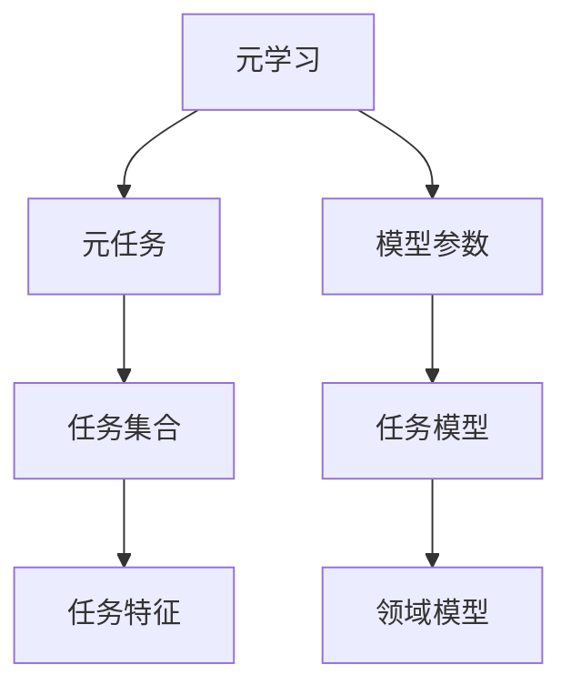
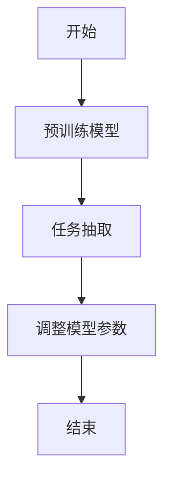
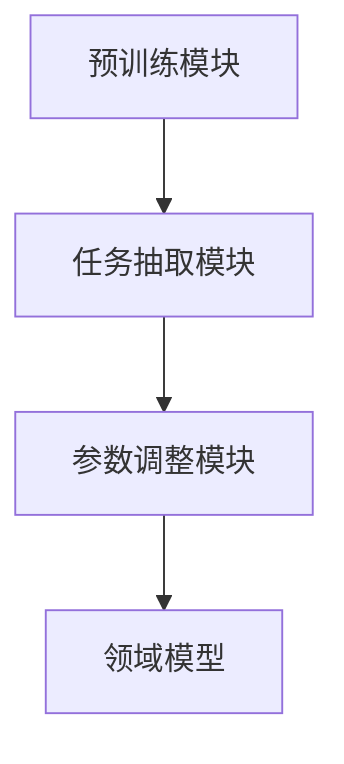
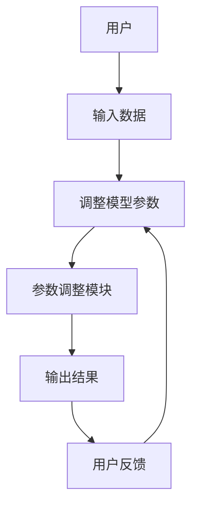

                 


# 企业AI Agent的元学习应用：快速适应新任务与领域

## 关键词：企业AI Agent，元学习，快速适应，领域模型，系统架构，算法实现，应用案例

## 摘要：  
本文深入探讨企业AI Agent在元学习中的应用，详细分析了元学习的核心概念、算法原理、系统架构以及实际项目中的实现。通过案例分析，展示了元学习如何帮助AI Agent快速适应新任务与领域，提升企业智能化水平。文章内容涵盖背景概述、核心概念、算法实现、系统设计和项目实战，旨在为企业AI Agent的开发和应用提供理论支持和实践指导。

---

# 第1章: 企业AI Agent与元学习概述

## 1.1 问题背景与描述
### 1.1.1 企业AI Agent的核心需求
企业AI Agent需要在复杂多变的商业环境中快速适应新任务和领域，例如客服、供应链管理和智能推荐系统。传统的机器学习方法需要大量标注数据和长时间的训练，难以满足企业对快速部署和灵活调整的需求。

### 1.1.2 元学习的基本概念
元学习是一种让模型在多个任务之间共享学习能力的技术，能够在少样本或零样本的情况下快速适应新任务。通过元学习，企业AI Agent可以利用已有的知识快速调整模型参数，适应新的业务场景。

### 1.1.3 企业AI Agent的适应性问题
企业AI Agent在面对新任务时，通常需要重新训练整个模型或依赖大量标注数据，这不仅耗时，还可能因为数据不足而影响性能。元学习为企业提供了一种更高效、更灵活的解决方案。

## 1.2 元学习的核心概念与属性
### 1.2.1 元学习的定义与特点
元学习是一种基于元任务的训练方法，通过在多个任务上预训练模型，使其能够在新的任务上快速调整。其核心特点包括：
- **任务多样性**：元学习需要在多个任务上进行预训练。
- **快速适应**：能够在新任务上快速调整模型参数。
- **通用性**：适用于多种领域和任务类型。

### 1.2.2 企业AI Agent的适应性机制
企业AI Agent通过元学习可以实现以下适应性机制：
- **参数共享**：在多个任务上共享模型参数，减少新任务的训练数据需求。
- **任务间迁移**：利用已有的任务知识快速适应新任务。
- **动态调整**：根据实时反馈动态优化模型。

### 1.2.3 企业AI Agent与传统机器学习的对比
| 特性 | 传统机器学习 | 元学习 |
|------|--------------|--------|
| 数据需求 | 需要大量标注数据 | 适合少样本或零样本 |
| 训练时间 | 长，需要重新训练模型 | 快速调整模型参数 |
| 适应性 | 低，需要重新训练 | 高，快速适应新任务 |

## 1.3 元学习的边界与外延
### 1.3.1 元学习的适用场景
- **多任务学习**：适用于需要在多个任务上共享知识的场景。
- **领域迁移**：适用于需要快速适应新领域的场景。
- **实时反馈**：适用于需要根据实时反馈调整模型的场景。

### 1.3.2 企业AI Agent的适应性边界
- **任务复杂性**：元学习适用于复杂任务的快速适应。
- **数据稀疏性**：适用于数据不足的新任务。
- **领域多样性**：适用于需要跨领域应用的场景。

### 1.3.3 元学习的未来发展
随着深度学习技术的不断发展，元学习将在企业AI Agent中发挥越来越重要的作用。未来的研究方向包括更高效的元学习算法、更灵活的任务适应机制以及更强大的领域迁移能力。

## 1.4 本章小结
本章介绍了企业AI Agent的核心需求和元学习的基本概念，分析了元学习与传统机器学习的区别，并探讨了元学习的适用场景和未来发展方向。下一章将深入讲解元学习的核心概念与联系。

---

# 第2章: 元学习的核心概念与联系

## 2.1 元学习的原理与机制
### 2.1.1 元学习的基本原理
元学习的核心思想是通过在多个任务上预训练模型，使其能够在新的任务上快速调整参数。其原理可以分为以下几个步骤：
1. **任务抽取**：从多个任务中抽取特征。
2. **参数优化**：通过优化器调整模型参数。
3. **任务适应**：根据新任务的需求快速调整模型。

### 2.1.2 企业AI Agent的适应性模型
企业AI Agent的适应性模型可以分为以下几个部分：
- **领域模型**：用于理解任务的具体领域。
- **任务模型**：用于具体任务的预测和决策。
- **元学习器**：用于快速调整任务模型的参数。

### 2.1.3 元学习的核心要素
- **元任务**：用于训练模型的任务集合。
- **任务特征**：任务之间的共享特征。
- **适应机制**：快速调整模型参数的方法。

## 2.2 元学习与传统机器学习的对比
### 2.2.1 传统机器学习的特点
- 需要大量标注数据。
- 训练时间长。
- 适应性低。

### 2.2.2 企业AI Agent的适应性提升
通过元学习，企业AI Agent可以在以下方面实现提升：
- **数据效率**：减少对大量标注数据的依赖。
- **训练速度**：快速适应新任务，降低训练时间。
- **灵活性**：适用于多种领域和任务类型。

### 2.2.3 元学习的独特优势
- **快速适应**：能够在新任务上快速调整模型参数。
- **任务通用性**：适用于多种任务类型。
- **数据稀疏性**：适合少样本或零样本任务。

## 2.3 元学习的实体关系图
以下是元学习的实体关系图（使用Mermaid绘制）：



## 2.4 本章小结
本章深入讲解了元学习的核心原理和机制，并通过对比分析展示了元学习的独特优势。下一章将从算法的角度详细讲解元学习的原理和实现。

---

# 第3章: 元学习算法原理与数学模型

## 3.1 元学习算法的核心原理
### 3.1.1 Meta-Learning的基本概念
Meta-Learning是一种基于元任务的训练方法，其核心思想是通过在多个任务上预训练模型，使其能够在新的任务上快速调整。

### 3.1.2 元学习算法的分类
元学习算法主要分为两类：
- **基于梯度的元学习**：如MAML（Meta-Algorithm for Meta-Learning）。
- **基于模型的元学习**：如ReM（Recurrent Meta-Learning）。

### 3.1.3 企业AI Agent的适应性算法
企业AI Agent的适应性算法可以通过以下步骤实现：
1. **预训练**：在多个任务上预训练模型。
2. **任务抽取**：从新任务中抽取特征。
3. **参数调整**：通过优化器调整模型参数。

## 3.2 Meta-Learning的数学模型
### 3.2.1 元学习的优化目标
元学习的目标是优化模型参数，使其在多个任务上表现良好。其数学表达式如下：
$$ \min_{\theta} \sum_{i=1}^{N} \mathcal{L}_i(\theta) $$
其中，$\theta$是模型参数，$\mathcal{L}_i$是第i个任务的损失函数。

### 3.2.2 元学习的损失函数
元学习的损失函数通常包括两个部分：
$$ \mathcal{L} = \sum_{i=1}^{N} \mathcal{L}_i(\theta) + \lambda \mathcal{R}(\theta) $$
其中，$\mathcal{R}(\theta)$是正则化项，$\lambda$是调节参数。

### 3.2.3 企业AI Agent的适应性模型
企业AI Agent的适应性模型可以通过以下数学公式实现：
$$ y = f(x, \theta) $$
其中，$x$是输入数据，$y$是输出结果，$f$是模型函数，$\theta$是模型参数。

## 3.3 元学习算法的流程图
以下是元学习算法的流程图（使用Mermaid绘制）：



## 3.4 本章小结
本章详细讲解了元学习算法的核心原理和数学模型，展示了企业AI Agent的适应性算法。下一章将从系统架构的角度分析企业AI Agent的设计与实现。

---

# 第4章: 企业AI Agent的系统分析与架构设计

## 4.1 系统分析与需求分析
### 4.1.1 问题场景介绍
企业AI Agent需要在复杂多变的商业环境中快速适应新任务和领域，例如客服、供应链管理和智能推荐系统。

### 4.1.2 项目目标与范围
项目目标：通过元学习实现企业AI Agent的快速适应。
项目范围：涵盖任务抽取、参数优化、领域迁移等多个方面。

### 4.1.3 系统功能需求
系统功能需求包括：
- **任务抽取**：从新任务中抽取特征。
- **参数优化**：快速调整模型参数。
- **领域迁移**：适用于多种领域和任务类型。

## 4.2 系统功能设计
### 4.2.1 领域模型设计
领域模型设计包括：
- **输入层**：接收输入数据。
- **特征提取层**：提取任务特征。
- **任务模型层**：具体任务的预测和决策。

### 4.2.2 功能模块划分
功能模块划分包括：
- **预训练模块**：在多个任务上预训练模型。
- **任务抽取模块**：从新任务中抽取特征。
- **参数调整模块**：快速调整模型参数。

## 4.3 系统架构设计
### 4.3.1 系统架构图
以下是系统架构图（使用Mermaid绘制）：



### 4.3.2 系统接口设计
系统接口设计包括：
- **输入接口**：接收输入数据。
- **输出接口**：输出任务预测结果。
- **反馈接口**：根据反馈调整模型参数。

## 4.4 系统交互设计
### 4.4.1 系统交互流程
系统交互流程包括：
1. **输入数据**：用户输入数据。
2. **任务抽取**：系统从输入数据中抽取特征。
3. **参数调整**：系统快速调整模型参数。
4. **输出结果**：系统输出任务预测结果。
5. **反馈调整**：根据用户反馈调整模型参数。

### 4.4.2 交互流程图
以下是系统交互流程图（使用Mermaid绘制）：



## 4.5 本章小结
本章详细分析了企业AI Agent的系统架构设计，展示了功能模块划分和系统交互流程。下一章将通过项目实战展示元学习在企业AI Agent中的具体实现。

---

# 第5章: 企业AI Agent的项目实战

## 5.1 项目环境安装
### 5.1.1 环境需求
- **Python**：3.6及以上版本
- **TensorFlow**：2.0及以上版本
- **Keras**：2.2.4及以上版本
- **Mermaid**：用于绘制流程图

### 5.1.2 安装步骤
1. 安装Python和相关库：
   ```bash
   pip install python==3.6
   pip install tensorflow==2.0
   pip install keras==2.2.4
   pip install mermaid
   ```
2. 配置环境变量：
   - 将Python和TensorFlow的安装路径添加到环境变量中。

## 5.2 系统核心实现
### 5.2.1 核心代码实现
以下是企业AI Agent的核心代码实现：

```python
import tensorflow as tf
from tensorflow.keras import layers

# 定义元学习模型
class MetaLearner(tf.keras.Model):
    def __init__(self, input_shape):
        super(MetaLearner, self).__init__()
        self.embedding = layers.Dense(64, activation='relu')
        self.task_classifier = layers.Dense(10, activation='softmax')

    def call(self, inputs, training=None):
        features = self.embedding(inputs)
        outputs = self.task_classifier(features)
        return outputs

# 定义元学习算法
def meta_learning(model, optimizer, task_features):
    with tf.GradientTape() as tape:
        outputs = model(task_features)
        loss = tf.keras.losses.sparse_categorical_crossentropy(labels, outputs)
    gradients = tape.gradient(loss, model.trainable_weights)
    optimizer.apply_gradients(zip(gradients, model.trainable_weights))
    return loss

# 定义任务抽取函数
def extract_task_features(task_input):
    return model.embedding(task_input)
```

### 5.2.2 代码应用解读与分析
- **MetaLearner类**：定义了元学习模型，包括嵌入层和任务分类器。
- **meta_learning函数**：定义了元学习算法，包括前向传播和反向传播。
- **extract_task_features函数**：定义了任务抽取函数，用于从输入数据中提取特征。

### 5.2.3 实际案例分析
以客服领域的智能问答系统为例：
1. **预训练阶段**：在多个客服任务上预训练模型。
2. **任务抽取阶段**：从新任务中抽取特征。
3. **参数调整阶段**：快速调整模型参数。
4. **输出结果阶段**：输出任务预测结果。

## 5.3 项目小结
本章通过项目实战展示了企业AI Agent的实现过程，包括环境安装、代码实现和案例分析。通过实际案例，读者可以更好地理解元学习在企业AI Agent中的具体应用。

---

# 第6章: 总结与展望

## 6.1 本章总结
本文深入探讨了企业AI Agent在元学习中的应用，详细分析了元学习的核心概念、算法原理、系统架构以及实际项目中的实现。通过案例分析，展示了元学习如何帮助AI Agent快速适应新任务与领域，提升企业智能化水平。

## 6.2 最佳实践Tips
- **数据准备**：确保数据质量和多样性。
- **任务抽取**：合理设计任务抽取模块。
- **参数调整**：选择合适的优化器和调节参数。
- **系统设计**：注重系统的模块化和可扩展性。

## 6.3 展望与注意事项
- **技术发展**：随着深度学习技术的不断发展，元学习将在企业AI Agent中发挥越来越重要的作用。
- **应用领域**：元学习的应用场景将更加广泛，包括更多领域和任务类型。
- **算法优化**：未来的研究方向包括更高效的元学习算法和更强大的领域迁移能力。

## 6.4 拓展阅读
- **书籍推荐**：《Deep Learning》、《Meta-Learning: A Survey》。
- **论文推荐**：《A Meta-Algorithm for Meta-Learning》、《Recurrent Meta-Learning》。

---

# 作者：AI天才研究院/AI Genius Institute & 禅与计算机程序设计艺术 /Zen And The Art of Computer Programming

