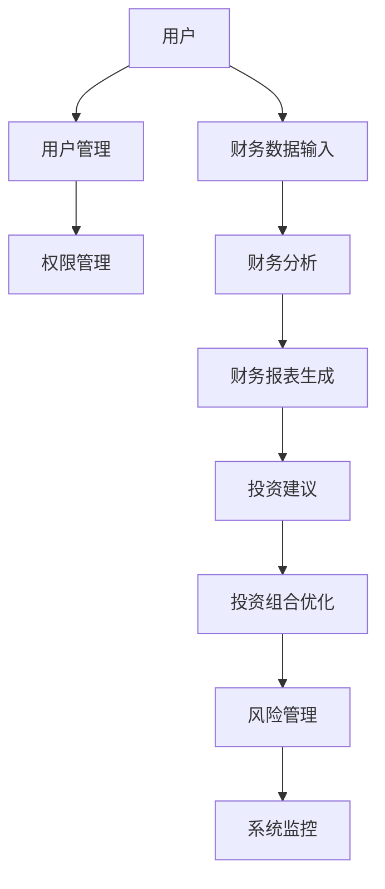
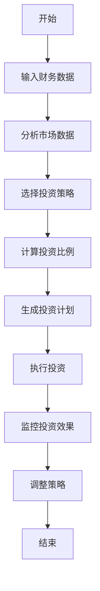

                 


# 如何将特价股票策略融入家庭财务规划

---

## 关键词：
特价股票、家庭财务规划、投资策略、风险管理、资产配置、价值投资、量化分析

---

## 摘要：
本文详细探讨了如何将特价股票策略融入家庭财务规划的过程。通过分析特价股票的定义、类型及其在财务规划中的应用，结合资产配置、风险管理、量化分析等方法，为读者提供了一套系统化的解决方案。文章还通过实际案例分析和系统设计，展示了如何利用技术手段优化投资决策，帮助读者在复杂的金融市场中实现稳健的投资回报。

---

## 第1章: 特价股票策略的基础知识

### 1.1 特价股票的定义与特点

#### 1.1.1 什么是特价股票
特价股票是指那些价格低于其内在价值的股票，通常由于市场波动、公司短期问题或市场情绪影响，导致其价格被低估。这些股票往往具有较大的反弹潜力，是投资者寻找超额收益的重要目标。

#### 1.1.2 特价股票的主要类型
| 类型 | 定义 | 特点 | 适用场景 |
|------|------|------|----------|
| 价值型股票 | 公司价值被市场低估的股票 | 价格低于账面价值，股息率高 | 适合长期投资 |
| 成长型股票 | 公司未来增长潜力大的股票 | 市盈率较高，股价波动大 | 适合风险承受能力强的投资者 |
| 超跌反弹股票 | 由于市场抛售导致价格大幅下跌的股票 | 短期内价格回升可能性大 | 适合短期交易者 |

#### 1.1.3 特价股票的优势与风险
- **优势**：价格低，投资门槛低，潜在回报高。
- **风险**：市场波动大，公司基本面恶化，流动性风险。

### 1.2 家庭财务规划的基本概念

#### 1.2.1 家庭财务规划的定义
家庭财务规划是指通过科学的分析和规划，合理分配家庭的收入、支出和资产，以实现财务目标的过程。

#### 1.2.2 家庭财务规划的核心要素
| 要素 | 描述 |
|------|------|
| 收入与支出 | 收入来源和支出项目 |
| 资产与负债 | 家庭的资产和负债情况 |
| 财务目标 | 短期和长期的财务目标 |

#### 1.2.3 特价股票在家庭财务规划中的地位
特价股票作为家庭资产配置的一部分，可以提供较高的潜在回报，但需要结合家庭的财务状况和风险承受能力进行合理配置。

### 1.3 特价股票策略与家庭财务规划的关联

#### 1.3.1 特价股票策略对家庭财务的影响
通过投资特价股票，家庭可以在资产增值的同时，优化资产配置，分散风险。

#### 1.3.2 如何将特价股票策略融入家庭财务规划
- 确定财务目标
- 评估风险承受能力
- 制定资产配置方案
- 执行投资计划

#### 1.3.3 特价股票策略的风险管理
- 设置止损点
- 定期监控投资组合
- 根据市场变化调整策略

### 1.4 本章小结
本章介绍了特价股票的基本知识及其在家庭财务规划中的应用，为后续章节的深入分析奠定了基础。

---

## 第2章: 家庭财务规划的基础

### 2.1 家庭财务规划的基本步骤

#### 2.1.1 确定财务目标
| 类型 | 描述 |
|------|------|
| 短期目标 | 1-3年内的目标，如应急资金储备 |
| 中期目标 | 3-5年内的目标，如购买房产 |
| 长期目标 | 5年以上的目标，如退休规划 |

#### 2.1.2 收入与支出分析
- 收入来源：工资、投资收益等
- 支出项目：日常生活支出、债务还款等

#### 2.1.3 资产与负债评估
| 资产 | 描述 |
|------|------|
| 流动资产 | 现金、银行存款等 |
| 长期资产 | 房产、股票等 |
| 负债 | 描述 |
|------|------|
| 短期负债 | 信用卡欠款、短期借款等 |
| 长期负债 | 房屋贷款、长期债券等 |

### 2.2 家庭财务规划的工具与方法

#### 2.2.1 财务报表的制作与分析
- 制作资产负债表、利润表和现金流量表
- 分析财务比率，如流动性比率、偿债能力比率等

#### 2.2.2 资产配置的基本原则
- 分散投资：避免过度集中
- 风险匹配：根据风险承受能力选择资产
- 定期调整：根据市场变化和个人财务状况进行调整

#### 2.2.3 风险承受能力的评估
- 风险承受能力取决于家庭的收入稳定性、资产规模和心理承受能力

### 2.3 家庭财务规划的误区与注意事项

#### 2.3.1 常见的财务规划误区
- 过度追求高收益，忽视风险
- 忽视应急资金储备
- 未能定期调整财务计划

#### 2.3.2 如何避免规划中的常见错误
- 设定合理的财务目标
- 保持财务计划的灵活性
- 定期审查和调整财务计划

#### 2.3.3 定期调整财务规划的重要性
- 市场环境变化
- 家庭财务状况变化
- 目标优先级变化

### 2.4 本章小结
本章详细介绍了家庭财务规划的基本步骤和工具，强调了合理资产配置和风险管理的重要性。

---

## 第3章: 将特价股票策略融入家庭财务规划的步骤

### 3.1 确定财务目标与投资需求

#### 3.1.1 家庭财务目标的分类
| 类型 | 描述 |
|------|------|
| 短期目标 | 如旅行、购买电子产品等 |
| 中期目标 | 如购买汽车、子女教育基金等 |
| 长期目标 | 如退休计划、遗产规划等 |

#### 3.1.2 投资需求的分析与评估
- 投资金额：家庭可用于投资的资金规模
- 投资期限：根据目标确定投资期限
- 风险承受能力：评估家庭对风险的承受能力

#### 3.1.3 特价股票在投资组合中的比例
- 一般建议将特价股票配置在资产组合的10%-30%之间，具体比例取决于家庭的财务状况和风险偏好。

### 3.2 选择适合的特价股票策略

#### 3.2.1 根据家庭财务状况选择策略
| 财务状况 | 推荐策略 |
|------|------|
| 高风险承受能力 | 成长型股票 |
| 低风险承受能力 | 价值型股票 |

#### 3.2.2 不同特价股票策略的优缺点对比
| 策略 | 优点 | 缺点 |
|------|------|------|
| 价值型股票 | 稳定的股息收益 | 市场波动可能导致价格波动 |
| 成长型股票 | 高增长潜力 | 高波动性，风险高 |
| 超跌反弹股票 | 短期高回报 | 需要精准的时机判断 |

#### 3.2.3 确定投资期限与风险承受能力
- 投资期限：长期投资适合价值型和成长型股票，短期投资适合超跌反弹股票
- 风险承受能力：高风险承受能力适合成长型股票，低风险承受能力适合价值型股票

### 3.3 制定详细的资产配置方案

#### 3.3.1 资产配置的基本原则
- 分散投资：避免将所有资金投入同一类型股票
- 风险匹配：根据风险承受能力选择股票类型
- 定期调整：根据市场变化和个人财务状况进行调整

#### 3.3.2 特价股票与其他资产的搭配
| 资产类型 | 配置比例 | 优点 |
|------|------|------|
| 特价股票 | 10%-30% | 高潜在回报 |
| 债券 | 30%-40% | 稳定收益 |
| 现金 | 10%-20% | 应急资金 |
| 其他资产 | 5%-10% | 多样化投资 |

#### 3.3.3 定期调整资产配置的必要性
- 市场环境变化
- 家庭财务状况变化
- 投资目标优先级变化

### 3.4 制定执行计划与监控机制

#### 3.4.1 投资计划的制定与执行
- 确定投资金额和比例
- 选择合适的股票和时机
- 开展投资操作

#### 3.4.2 定期监控与评估投资效果
- 每月或每季度审查投资组合
- 评估投资收益与预期目标的差距
- 根据市场变化调整投资策略

#### 3.4.3 根据市场变化调整策略
- 当市场出现较大波动时，及时调整资产配置
- 当个股出现重大风险时，及时止损
- 当达到预定目标时，逐步退出投资

### 3.5 本章小结
本章详细介绍了如何将特价股票策略融入家庭财务规划的过程，包括目标设定、策略选择、资产配置和执行计划。

---

## 第4章: 特价股票策略的进阶应用

### 4.1 价值投资与成长投资的结合

#### 4.1.1 价值投资的核心理念
- 购买低于内在价值的股票
- 长期持有优质公司股票
- 通过股息再投资增加收益

#### 4.1.2 成长投资的核心理念
- 投资具有高增长潜力的公司
- 耐心持有，等待股价上涨
- 关注公司的业绩增长和行业地位

#### 4.1.3 两者的结合策略
- 在资产组合中同时配置价值型和成长型股票
- 根据市场环境调整两者比例
- 通过分散投资降低整体风险

### 4.2 利用ETF和指数基金进行投资

#### 4.2.1 ETF和指数基金的优势
- 分散投资风险
- 降低交易成本
- 方便管理和调整

#### 4.2.2 如何选择合适的ETF和指数基金
- 选择跟踪指数的ETF或基金
- 关注基金的费用率和历史表现
- 考虑基金的规模和流动性

#### 4.2.3 定期定额投资策略
- 定期投入固定金额
- 分散投资成本
- 利用市场波动实现长期收益

### 4.3 通过量化分析优化投资决策

#### 4.3.1 量化分析的基本概念
- 利用数学模型和算法进行投资决策
- 基于历史数据和市场规律寻找投资机会

#### 4.3.2 常用的量化指标
| 指标 | 描述 |
|------|------|
| 市盈率（P/E） | 价格与收益的比率 |
| 市净率（P/B） | 价格与净资产的比率 |
| 股息率 | 每股股息与股价的比率 |

#### 4.3.3 量化模型的应用
- 策略回测：通过历史数据验证策略的有效性
- 风险管理：利用量化指标控制投资风险
- 自动化交易：通过算法实现自动化投资

### 4.4 本章小结
本章介绍了价值投资与成长投资的结合、ETF和指数基金的使用以及量化分析在投资中的应用，为读者提供了更深层次的投资策略。

---

## 第5章: 风险管理与投资组合优化

### 5.1 投资组合的风险管理

#### 5.1.1 风险的定义与分类
- 系统性风险：市场整体波动带来的风险
- 非系统性风险：特定资产或行业带来的风险

#### 5.1.2 风险管理的核心原则
- 分散投资：通过多样化降低风险
- 设置止损点：控制单笔投资的损失
- 定期调整：根据市场变化优化投资组合

#### 5.1.3 风险管理的工具与方法
- 保险产品：如重大疾病保险、财产保险等
- 对冲基金：通过做空部分资产对冲风险
- 资产保值工具：如黄金、房地产等

### 5.2 投资组合的优化策略

#### 5.2.1 资产配置的优化
- 根据市场环境调整资产比例
- 选择具有互补性的资产类型
- 考虑资产的流动性需求

#### 5.2.2 定期再平衡投资组合
- 每季度或半年进行一次投资组合审查
- 根据市场变化和个人财务状况调整资产比例
- 保持投资策略与财务目标的一致性

#### 5.2.3 利用技术手段优化投资组合
- 通过量化分析工具优化资产配置
- 利用算法交易实现自动化管理
- 利用大数据分析预测市场趋势

### 5.3 本章小结
本章重点讨论了投资组合的风险管理与优化策略，强调了分散投资、定期调整和利用技术手段的重要性。

---

## 第6章: 实际案例分析与经验分享

### 6.1 案例分析：一个家庭的投资组合优化

#### 6.1.1 家庭背景
- 家庭年收入：50万元
- 家庭资产：100万元（包括房产、存款和股票）
- 财务目标：增加家庭财富，实现资产增值

#### 6.1.2 投资组合优化方案
| 资产类型 | 配置比例 | 具体投资标的 |
|------|------|------|
| 特价股票 | 20% | 选择低估的价值型股票 |
| 债券 | 30% | 投资国债和企业债 |
| 现金 | 20% | 保留应急资金 |
| 其他资产 | 10% | 投资房地产信托基金 |

#### 6.1.3 投资效果评估
- 通过定期调整投资组合，实现了年均8%的回报率
- 在市场波动期间，通过分散投资有效控制了风险
- 通过长期持有优质股票，实现了资产的稳步增长

### 6.2 经验分享：如何在实践中应用策略

#### 6.2.1 确定财务目标是关键
- 确保投资策略与财务目标一致
- 根据目标调整投资策略

#### 6.2.2 风险管理是核心
- 设置止损点，控制投资损失
- 定期审查和调整投资组合

#### 6.2.3 技术手段是助力
- 利用量化分析工具优化投资决策
- 通过算法交易实现自动化管理
- 利用大数据分析预测市场趋势

### 6.3 本章小结
通过实际案例分析和经验分享，读者可以更好地理解如何将特价股票策略融入家庭财务规划，并在实践中灵活运用。

---

## 第7章: 系统设计与技术实现

### 7.1 家庭财务规划系统的总体架构

#### 7.1.1 系统功能模块
| 模块 | 描述 |
|------|------|
| 用户管理 | 管理用户信息和权限 |
| 财务分析 | 分析财务数据，生成财务报表 |
| 投资建议 | 根据财务状况提供投资建议 |
| 风险管理 | 评估投资风险，制定风险管理策略 |
| 系统监控 | 监控系统运行状态，及时发现和解决问题 |

#### 7.1.2 系统架构图


#### 7.1.3 系统接口设计
- 用户界面：提供财务数据输入、投资建议查询和风险管理功能
- 数据接口：与第三方数据源（如股票行情数据）对接
- 系统管理接口：用于系统维护和监控

### 7.2 投资策略的算法实现

#### 7.2.1 算法流程图


#### 7.2.2 核心算法实现
```python
def calculate_asset_allocation(family_income, family_assets, risk_level):
    # 计算资产配置比例
    stock_allocation = 0.2  # 特价股票配置比例
    bond_allocation = 0.3   # 债券配置比例
    cash_reserve = 0.2      # 现金储备比例
    other_assets = 0.1     # 其他资产比例

    return {
        'stock': stock_allocation * family_assets,
        'bond': bond_allocation * family_assets,
        'cash': cash_reserve * family_assets,
        'other': other_assets * family_assets
    }
```

#### 7.2.3 算法原理的数学模型
$$ 资产配置比例 = \text{max}(0, \text{min}(1, \text{根据风险承受能力计算得出的比例})) $$

### 7.3 系统实现与优化

#### 7.3.1 系统实现的关键点
- 数据采集：实时采集市场数据和家庭财务数据
- 算法实现：基于量化分析的投资策略算法
- 系统监控：实时监控系统运行状态

#### 7.3.2 系统优化建议
- 提高系统的数据处理效率
- 增强系统的容错能力
- 提供更人性化的用户界面

### 7.4 本章小结
本章通过系统设计与技术实现，展示了如何利用技术手段优化家庭财务规划和投资策略。

---

## 第8章: 实战技巧与最佳实践

### 8.1 投资实战技巧

#### 8.1.1 市场分析技巧
- 关注宏观经济指标：GDP、利率、通货膨胀率等
- 分析行业趋势：选择具有增长潜力的行业
- 研究公司基本面：关注公司的财务状况和管理团队

#### 8.1.2 资金管理技巧
- 根据财务状况确定投资金额
- 分期投资：避免一次性投入
- 利用定投工具：分散投资成本

#### 8.1.3 心理管理技巧
- 理性决策：避免情绪化投资
- 坚持长期投资：耐心等待投资回报
- 定期复盘：总结经验教训

### 8.2 最佳实践

#### 8.2.1 风险管理是投资成功的关键
- 设置止损点
- 分散投资风险
- 定期调整投资组合

#### 8.2.2 长期视角是投资成功的基础
- 长期投资能够平滑市场波动
- 长期视角有助于实现财务目标
- 长期投资需要耐心和信心

#### 8.2.3 持续学习是投资成功的动力
- 关注市场动态
- 学习投资知识
- 总结投资经验

### 8.3 本章小结
本章总结了投资实战技巧和最佳实践，强调了风险管理、长期视角和持续学习的重要性。

---

## 第9章: 总结与展望

### 9.1 全文总结
本文详细探讨了如何将特价股票策略融入家庭财务规划的过程，通过理论分析、策略选择、系统设计和实战案例，为读者提供了一套系统化的解决方案。

### 9.2 未来展望
随着人工智能和大数据技术的发展，家庭财务规划和投资策略将更加智能化和个性化。未来的投资策略将更加依赖技术手段，投资者需要不断学习和适应新的技术和市场变化。

### 9.3 致谢
感谢读者的耐心阅读，感谢家人对我的支持和鼓励。

---

## 作者：AI天才研究院/AI Genius Institute & 禅与计算机程序设计艺术 /Zen And The Art of Computer Programming

