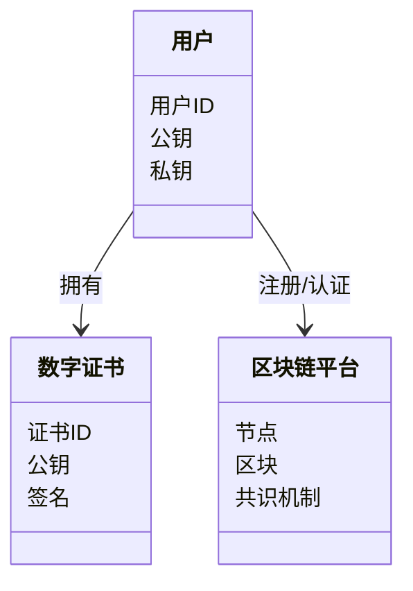
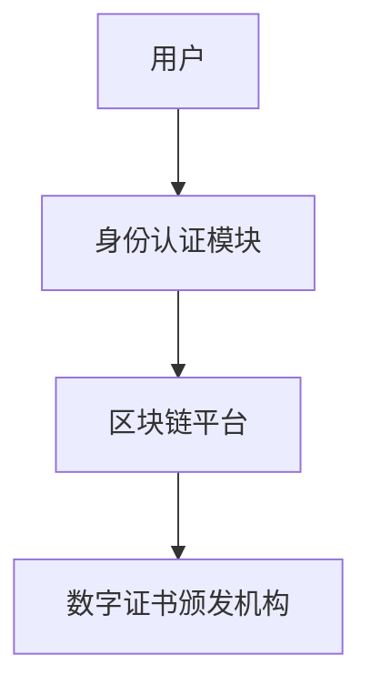
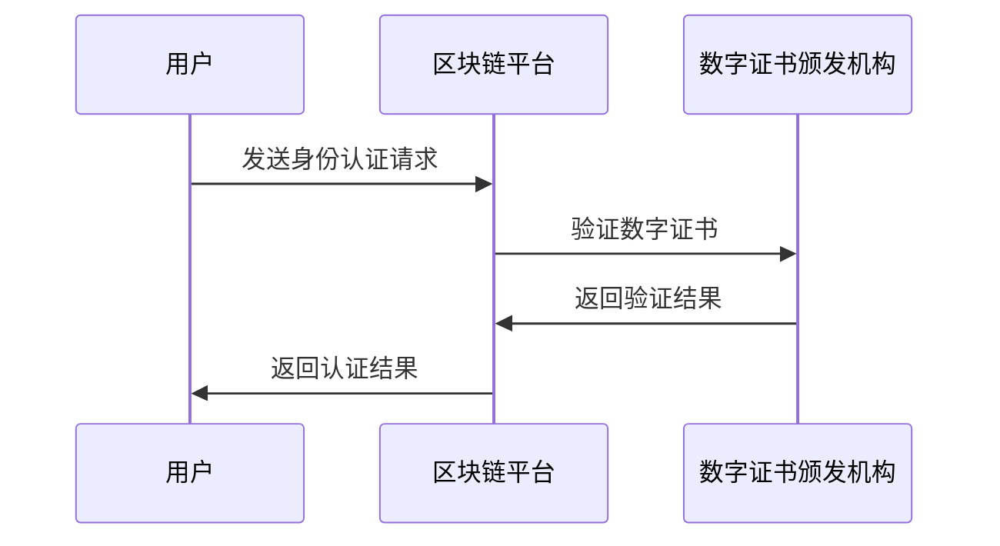

                 


# 如何评估企业的区块链数字身份跨平台认证应用

> 关键词：区块链，数字身份，跨平台认证，企业应用，安全

> 摘要：本文详细探讨了如何评估企业区块链数字身份跨平台认证应用。从区块链技术基础、数字身份的核心概念、跨平台认证的实现机制，到具体的算法原理、系统架构设计和项目实战，全面分析了企业在采用区块链数字身份跨平台认证时需要考虑的关键因素和评估方法。

---

## 第一部分：区块链数字身份跨平台认证应用概述

### 第1章：区块链与数字身份基础

#### 1.1 区块链技术概述

##### 1.1.1 区块链的基本概念
区块链是一种去中心化的分布式账本技术，通过密码学方法保证数据的安全性和不可篡改性。它由区块、链式结构、共识机制、智能合约等核心组件组成。

##### 1.1.2 区块链的核心特点
- 去中心化：无须依赖中心机构，通过节点共识实现数据一致。
- 不可篡改：数据一旦写入区块链，难以被修改。
- 可追溯性：数据记录可追踪来源，便于审计和追踪。
- 安全性：通过加密算法和共识机制保证数据的安全性。

##### 1.1.3 区块链的分类与应用场景
区块链主要分为公链、私链和联盟链。公链（如比特币、以太坊）适用于去中心化程度高的场景；私链适用于企业内部的区块链应用；联盟链适用于多个机构共同参与的场景。

---

#### 1.2 数字身份的概念与特点

##### 1.2.1 数字身份的定义
数字身份是用户在数字空间中身份的数字化表示，通常包括用户标识符、公钥、私钥等信息。

##### 1.2.2 数字身份的核心属性
- **唯一性**：每个用户的数字身份在全球范围内唯一。
- **安全性**：通过加密算法保护用户的隐私和安全。
- **可验证性**：数字身份可以通过公钥验证其真实性。

##### 1.2.3 数字身份与传统身份的区别
传统身份依赖于中心化机构（如政府、企业）进行认证，而数字身份基于区块链技术，去中心化且不可篡改。

---

#### 1.3 跨平台认证的定义与挑战

##### 1.3.1 跨平台认证的基本概念
跨平台认证是指在多个不同的平台或系统之间实现身份认证的过程。例如，用户在一个平台注册后，可以在其他平台使用相同的数字身份进行认证。

##### 1.3.2 跨平台认证的主要挑战
- **兼容性问题**：不同平台的认证机制可能不兼容。
- **安全性问题**：跨平台认证可能面临中间人攻击、数据泄露等安全风险。
- **信任问题**：不同平台之间如何建立信任关系。

##### 1.3.3 跨平台认证的实现方式
- **基于令牌的认证**：通过颁发令牌的方式实现跨平台认证。
- **基于公钥的认证**：使用数字证书进行身份验证。
- **基于第三方认证服务**：通过OAuth、OpenID Connect等标准协议实现。

---

#### 1.4 区块链在数字身份认证中的作用

##### 1.4.1 区块链在身份认证中的优势
- **去中心化**：消除对中心机构的依赖。
- **安全性**：通过区块链技术保证数据的安全性。
- **可扩展性**：支持大规模用户的数字身份管理。

##### 1.4.2 区块链如何实现跨平台认证
通过区块链技术，可以实现数字身份的去中心化存储和跨平台验证。用户可以在不同的平台使用同一个数字身份进行认证，而无需重复注册。

##### 1.4.3 区块链数字身份认证的典型场景
- **金融行业**：跨银行、支付机构的数字身份认证。
- **社交网络**：用户在不同社交平台之间的身份互认。
- **电子商务**：用户在不同电商平台之间的身份互认。

---

#### 1.5 本章小结
本章介绍了区块链技术的基本概念、数字身份的核心属性以及跨平台认证的实现方式。区块链技术为数字身份认证提供了去中心化、安全性和可扩展性的优势，为跨平台认证提供了新的解决方案。

---

## 第二部分：区块链数字身份跨平台认证的核心概念

### 第2章：区块链数字身份跨平台认证的核心概念

#### 2.1 区块链数字身份的组成要素

##### 2.1.1 用户身份标识
用户身份标识是数字身份的核心部分，通常包括用户ID、公钥等信息。

##### 2.1.2 数字证书
数字证书用于验证用户身份的真实性，通常由证书颁发机构颁发。

##### 2.1.3 加密算法
加密算法用于保护用户的隐私和数据安全，如RSA、椭圆曲线加密等。

---

#### 2.2 跨平台认证的核心机制

##### 2.2.1 身份验证流程
身份验证流程包括用户身份标识的验证、数字证书的验证等步骤。

##### 2.2.2 联合身份认证
联合身份认证是指多个平台之间通过共享用户身份信息实现的身份认证。

##### 2.2.3 跨平台身份互操作性
跨平台身份互操作性是指不同平台之间的身份信息能够相互理解并进行认证。

---

#### 2.3 区块链数字身份的属性与特征

##### 2.3.1 唯一性
每个用户的数字身份在全球范围内唯一。

##### 2.3.2 安全性
通过区块链技术和加密算法保证数字身份的安全性。

##### 2.3.3 可扩展性
区块链数字身份支持大规模用户的扩展。

---

#### 2.4 区块链数字身份与传统身份的对比

##### 2.4.1 核心概念对比
| 核心概念 | 区块链数字身份 | 传统身份 |
|----------|----------------|-----------|
| 存储方式 | 去中心化存储    | 中心化存储 |
| 安全性    | 高            | 中等       |
| 可扩展性  | 高            | 低         |

##### 2.4.2 实现方式对比
- 传统身份认证依赖于中心化机构，如政府、企业。
- 区块链数字身份认证依赖于区块链技术和去中心化机制。

##### 2.4.3 安全性对比
- 传统身份认证可能面临中心机构的安全风险。
- 区块链数字身份认证通过去中心化和加密算法提高了安全性。

---

#### 2.5 本章小结
本章详细分析了区块链数字身份的核心概念、组成要素以及与传统身份的对比。区块链数字身份通过去中心化存储、加密算法等技术，提供了更高的安全性、唯一性和可扩展性。

---

## 第三部分：区块链数字身份跨平台认证的算法原理

### 第3章：区块链数字身份跨平台认证的算法原理

#### 3.1 区块链共识机制在身份认证中的应用

##### 3.1.1 共识机制的定义
共识机制是区块链中用于确保所有节点达成一致的算法，如工作量证明（PoW）、权益证明（PoS）等。

##### 3.1.2 常见共识机制对比
| 共识机制 | 工作量证明（PoW） | 权益证明（PoS） |
|----------|-------------------|-----------------|
| 特点     | 基于计算能力       | 基于持有代币数量 |
| 优点     | 安全性高           | 能耗低           |
| 缺点     | 能耗高             | 易受女婿攻击      |

##### 3.1.3 共识机制在身份认证中的实现
通过共识机制，确保数字身份信息在区块链上的真实性和一致性。

---

#### 3.2 加密算法在数字身份中的应用

##### 3.2.1 哈希函数
哈希函数用于将输入数据映射为固定长度的哈希值，如SHA-256。

##### 3.2.2 数字签名
数字签名用于验证数据的真实性和完整性，通过私钥签名和公钥验证实现。

##### 3.2.3 加密算法的数学模型
哈希函数的数学模型：
$$ H(x) = f(x) $$
其中，$x$ 是输入数据，$f$ 是哈希函数。

数字签名的生成与验证：
$$ S = Sign(K_{private}, x) $$
$$ Verify(K_{public}, S, x) $$

---

#### 3.3 身份认证协议的实现流程

##### 3.3.1 身份验证协议的步骤
1. 用户向认证服务器发送身份标识。
2. 认证服务器验证用户身份标识。
3. 用户提供数字证书进行验证。
4. 认证服务器验证数字证书的有效性。

##### 3.3.2 跨平台认证协议的设计
跨平台认证协议需要实现不同平台之间的身份信息互认，通常通过区块链技术实现。

##### 3.3.3 协议的安全性分析
通过区块链技术和加密算法，确保跨平台认证的安全性，防止中间人攻击和数据泄露。

---

#### 3.4 算法实现的数学模型与公式

##### 3.4.1 哈希函数的数学表达式
$$ H(x) = f(x) $$
其中，$x$ 是输入数据，$f$ 是哈希函数。

##### 3.4.2 数字签名的生成与验证
$$ S = Sign(K_{private}, x) $$
$$ Verify(K_{public}, S, x) $$

---

#### 3.5 本章小结
本章详细分析了区块链数字身份跨平台认证中的共识机制、加密算法及其数学模型。通过这些算法，确保数字身份认证的安全性和可靠性。

---

## 第四部分：区块链数字身份跨平台认证的系统架构设计

### 第4章：区块链数字身份跨平台认证的系统架构设计

#### 4.1 系统功能需求分析

##### 4.1.1 用户身份注册
用户通过区块链平台进行身份注册，生成数字身份标识和数字证书。

##### 4.1.2 身份认证请求
用户向目标平台发送身份认证请求，目标平台验证用户的数字身份。

##### 4.1.3 跨平台认证响应
目标平台通过区块链技术验证用户的数字身份，实现跨平台认证。

---

#### 4.2 系统功能设计

##### 4.2.1 领域模型类图


##### 4.2.2 系统架构图


##### 4.2.3 系统交互图


---

#### 4.3 数学模型与公式

##### 4.3.1 用户身份标识的验证
$$ Verify(K_{public}, S, x) $$

##### 4.3.2 数字证书的验证
$$ Verify(K_{public}, S, x) $$

---

#### 4.4 本章小结
本章通过系统功能需求分析、领域模型类图、系统架构图和系统交互图，详细描述了区块链数字身份跨平台认证系统的架构设计。通过这些设计，确保系统的安全性和可扩展性。

---

## 第五部分：区块链数字身份跨平台认证的项目实战与最佳实践

### 第5章：区块链数字身份跨平台认证的项目实战

#### 5.1 项目背景与目标
本项目旨在通过区块链技术实现企业的数字身份跨平台认证，解决传统身份认证中的安全性和兼容性问题。

#### 5.2 环境安装与配置
- 安装区块链平台（如以太坊、Hyperledger Fabric）。
- 安装数字证书颁发机构（如CA）。
- 配置共识机制和加密算法。

#### 5.3 核心代码实现

##### 5.3.1 用户身份注册
```python
def register_user(private_key, public_key):
    # 生成数字证书
    certificate = create_certificate(public_key)
    # 将证书发布到区块链平台
    blockchain.register_certificate(certificate)
```

##### 5.3.2 身份认证请求
```python
def authenticate_user(private_key, public_key, server):
    # 生成签名
    signature = sign(private_key, public_key)
    # 发送认证请求
    response = server.authenticate(signature)
    return response
```

##### 5.3.3 跨平台认证响应
```python
def cross_platform_authenticate(certificate, server):
    # 验证数字证书
    if verify_certificate(certificate):
        return "认证成功"
    else:
        return "认证失败"
```

---

#### 5.4 项目实战案例分析
通过实际案例分析，展示了如何通过区块链技术实现企业的数字身份跨平台认证。

---

#### 5.5 项目小结
本章通过项目实战，详细描述了区块链数字身份跨平台认证的实现过程，包括环境安装、核心代码实现和案例分析。

---

### 第6章：区块链数字身份跨平台认证的最佳实践

#### 6.1 评估关键点
- 安全性：确保数字身份和认证过程的安全性。
- 兼容性：确保不同平台之间的认证兼容性。
- 可扩展性：确保系统能够支持大规模用户的扩展。

#### 6.2 小结
区块链数字身份跨平台认证通过去中心化、安全性高的特点，为企业提供了安全可靠的数字身份管理方案。

#### 6.3 注意事项
- 确保数字证书的颁发和管理安全。
- 定期进行安全审计和漏洞修复。
- 确保不同平台之间的协议兼容性。

#### 6.4 拓展阅读
- 推荐阅读相关技术书籍和论文，深入了解区块链和数字身份的技术细节。

---

## 作者：AI天才研究院 & 禅与计算机程序设计艺术

---

通过以上步骤，我们可以系统地评估企业的区块链数字身份跨平台认证应用。从理论到实践，从系统架构到项目实现，全面分析了区块链数字身份跨平台认证的关键点，为企业提供了一套完整的评估和实现方案。

